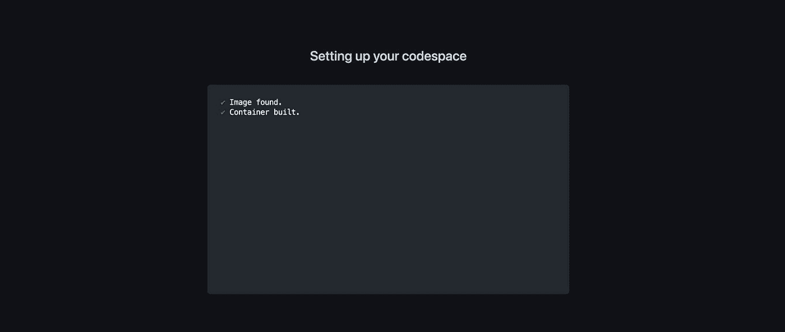

# 如何创建自定义 GitHub 代码空间模板

> 原文：<https://blog.devgenius.io/how-to-create-custom-github-codespaces-template-30aa2399a19c?source=collection_archive---------13----------------------->


如何创建自定义 GitHub 代码空间模板

# GitHub 代码空间和模板✨简介

GitHub Codespaces 是一个基于云的开发环境，允许开发人员直接在他们的 web 浏览器中编写、运行和调试代码。使用 GitHub Codespaces，开发人员可以快速在云中构建开发环境并开始编码，而无需在他们的机器上设置本地开发环境。

GitHub Codespaces 包括对模板的支持，这允许开发人员使用一组预配置的工具和依赖项快速构建开发环境。模板可用于创建为特定项目或编程语言定制的开发环境，并可包括诸如特定语言的包管理器、库和框架之类的东西。

要在 GitHub 代码空间中使用模板，只需在创建新代码空间时选择模板。GitHub 提供了一些默认的模板供你选择，或者你可以创建自己的自定义模板。

在本教程中，您将为 **ReactJs + Chakra UI + TypeScript 创建一个自定义模板。**

# 为什么您可能想要创建自定义模板🤔

以下是您可能想要为 GitHub 代码空间创建自定义模板的几个原因:

1.  **定制**:GitHub 提供的默认模板可能不包含您特定项目所需的所有工具和依赖项。通过创建一个定制模板，您可以确保您的开发环境包括您需要立即开始的一切。
2.  效率:建立一个开发环境可能很耗时，尤其是当你需要安装多个工具和依赖项的时候。通过创建自定义模板，您可以在单个易于使用的模板中预先配置所需的工具和依赖项，从而节省时间。
3.  **协作**:如果你在一个团队中工作，一个定制的模板可能是一个有用的方法，可以确保所有的团队成员都使用相同的开发环境，这使得协作和解决问题变得更加容易。
4.  **可再现性**:如果您正在进行一个需要容易再现的项目，那么定制模板可以是一种很有帮助的方法，可以确保开发环境在不同的机器和位置上是一致的。

总之，为 GitHub 代码空间创建一个定制模板可以帮助您定制您的开发环境，节省时间，与他人协作，并确保可重复性。

# 为 ReactJs + Chakra UI + TypeScript ❤️创建自定义模板

创建一个项目目录`codespaces-react-chakra-ui`。

```
mkdir codespaces-react-chakra-ui
```

在 VsCode 中打开项目目录。

```
code codespaces-react-chakra-ui
```

现在，通过运行下面的命令，用 Chakra UI 和 TypeScript 创建 React 应用程序。

```
npx create-react-app . --template @chakra-ui/typescript yarn create react-app . --template @chakra-ui/typescript
```

> *即* `*.*` *告知* ***创建 react app*** *在当前目录下创建应用文件。*

好了，您已经准备好了基本的设置，现在您必须创建配置文件夹和文件来使`codespaces-react-chakra-ui`目录成为 GitHub Codespaces 模板。

在项目的`.devcontainer`目录下创建一个名为`devcontainer.json`的配置文件

```
mkdir .devcontainer && cd .devcontainer touch devcontainer.json
```

现在将以下内容添加到`devcontainer.json`文件中。

```
{
  "image": "mcr.microsoft.com/devcontainers/universal:2",
  "hostRequirements": {
    "cpus": 4
  },
  "waitFor": "onCreateCommand",
  "updateContentCommand": "yarn install",
  "postCreateCommand": "",
  "postAttachCommand": {
    "server": "yarn start"
  },
  "customizations": {
    "codespaces": {
      "openFiles": ["src/App.tsx"]
    }
  },
  "portsAttributes": {
    "3000": {
      "label": "Application",
      "onAutoForward": "openPreview"
    }
  },
  "forwardPorts": [3000]
}
```

**“image”**字段指定用于开发环境的 Docker 图像，在本例中是**[**mcr.microsoft.com/devcontainers/universal:2**](http://mcr.microsoft.com/devcontainers/universal:2)**。****

******“host requirements”**字段指定了运行开发环境的主机的硬件要求。在这种情况下，它指定主机应该至少有 **4 个 CPU 核心**。****

******“wait for”**字段指定在执行下一个命令之前等待的命令。在这种情况下，它指定了 **"onCreateCommand"** ，这意味着在执行下一个命令之前，要等到容器被创建。****

******“updateContentCommand”**字段指定在容器中运行以更新其内容的命令。在这种情况下，它指定**“yarn install”**，这意味着使用 yarn package manager 安装依赖项。****

******“postCreateCommand”**字段指定在容器被创建后在容器中运行的命令。在这种情况下，它是一个空字符串，这意味着不会运行任何命令。****

******“post attach command”**字段指定一个在容器被附加到主机后在容器中运行的命令。在这种情况下，它指定**“纱线启动”**，这意味着使用纱线包管理器启动开发服务器。****

******“定制”**字段指定开发环境的定制。在这种情况下，它指定 **"codespaces"** 定制应该在打开开发环境时打开 **"src/App.tsx"** 文件。****

******“端口属性”**字段指定容器公开的端口属性。在这种情况下，它规定端口 3000 应该有标签**“应用”**，并且当它被自动转发到主机时应该触发**“open preview”**命令。****

******“转发端口”**字段指定要从容器自动转发到主机的端口阵列。在这种情况下，它指定端口 **3000** 应自动转发。****

****好了，你的 devcontainer 配置已经准备好了，现在你必须在你项目的`.vscode`目录下创建一个配置文件来启动模板，这个目录叫做`launch.json`****

```
**mkdir .vscode && cd .vscode touch launch.json**
```

****将以下内容添加到`launch.json`文件中。****

```
**{
  "version": "0.1.0",
  "configurations": [
    {
      "name": "Run application",
      "type": "node",
      "request": "launch",
      "cwd": "${workspaceFolder}",
      "console": "integratedTerminal",
      "runtimeExecutable": "yarn",
      "runtimeArgs": ["run-script", "start"],
      "skipFiles": ["<node_internals>/**"]
    }
  ]
}**
```

******“版本”**字段指定配置文件的版本。****

******“配置”**字段是一个对象数组，每个对象指定一个用于调试 Node.js 应用程序的配置。在这种情况下，数组中只有一个配置对象。****

******“名称”**字段指定配置的名称。在这种情况下，名称是“运行应用程序”。****

******“类型”**字段指定调试配置的类型。在这种情况下，它是“node ”,这意味着配置是为了调试 Node.js 应用程序。****

******“请求”**字段指定要执行的调试操作的类型。在这种情况下，是**“启动”**，意思是在调试器中启动 Node.js 应用程序。****

******“CWD”**字段指定调试器的当前工作目录。在这种情况下，它使用 **"${workspaceFolder}"** 变量，该变量可能是指 IDE 中工作区的根文件夹。****

******“控制台”**字段指定调试器使用的控制台。本例中为**“集成终端”**，表示在 IDE 中使用集成终端。****

******“运行时可执行文件”**字段指定用于启动 Node.js 应用程序的运行时可执行文件。在这种情况下，它是**“纱线”**，这意味着使用纱线包管理器来启动应用程序。****

******“运行时参数”**字段指定启动 Node.js 应用程序时传递给运行时可执行文件的参数。在这种情况下，它指定了**“运行脚本开始”**，这可能意味着运行项目的 package.json 文件中指定的**“开始”**脚本。****

******“skip files”**字段指定调试器要跳过的文件和目录的列表。在这种情况下，它指定了 **"node_internals/**"** ，这意味着跳过 **"node_internals"** 目录中的所有文件和目录。****

****恭喜🥳，你的定制 GitHub Codespaces 模板已经准备好了，现在你必须在 GitHub 中创建一个库`codespaces-react-chakra-ui`作为**模板库**并将所有的模板文件推送到那里。****

********

```
**git remote add origin https://github.com/<your_username>/codespaces-react-chakra-ui.git 
git branch -M main 
git push -u origin main**
```

****现在，导航到 settings 并使您的存储库成为一个**模板存储库。******

********

****好了，你的模板已经可以用来创建新的代码空间了，让我们在下一节创建一个。****

# ****使用自定义模板创建新的代码空间****

****点击`Use this template`按钮并选择`Open in a codespace`选项。****

********

****之后，它将开始用模板创建代码空间，并读取配置文件来安装所需的依赖项。****

********

****一旦安装了所有的依赖项，它将执行 **yarn start** 命令并启动开发服务器。****

********

****要验证代码空间是从您的定制模板创建的，您可以导航到**代码空间**并检查创建的代码空间，它会显示类似于*是从< template_name >创建的。*****

********

****这是为 ReactJs + Chakra UI + TypeScript 定制的 GitHub 代码空间模板的最终版本。****

# ****结论📝****

****总之，GitHub Codespaces 对于开发人员来说是一个强大而方便的工具，允许您快速而轻松地在云中构建开发环境。有了创建定制模板的能力，您可以定制您的开发环境以包含您需要的工具和依赖项，并通过在单个模板中预配置您的开发环境来节省时间。****

****如果您想了解更多关于 GitHub 代码空间和定制模板的信息，有一些资源可能会对您有所帮助:****

1.  ****[**GitHub 文档**](https://docs.github.com/en/codespaces) 提供了大量关于使用 GitHub 代码空间的信息，包括如何创建和使用定制模板。****
2.  ****[**GitHub Codespaces 社区论坛**](https://github.community/c/codespaces) 是一个很好的地方，您可以在这里提出问题，并获得使用 GitHub Codespaces 时可能遇到的任何问题的帮助。****

****通过使用这些资源并尝试 GitHub 代码空间和定制模板，您可以学习如何创建一个适合您特定需求和工作流的开发环境。****

****这个话题到此为止。感谢您的阅读。****

****如果你觉得这篇文章有用，请考虑喜欢并与他人分享。如有疑问，欢迎评论，我会尽力回应。****

# ****与我联系👋****

*   ****[LinkedIn](https://www.linkedin.com/in/sachin-chaurasiya)****
*   ****[推特](https://twitter.com/sachindotcom)****

*****原发布于*[*https://blog . sachinchurasiya . dev*](https://blog.sachinchaurasiya.dev/how-to-create-custom-github-codespaces-template)*。*****