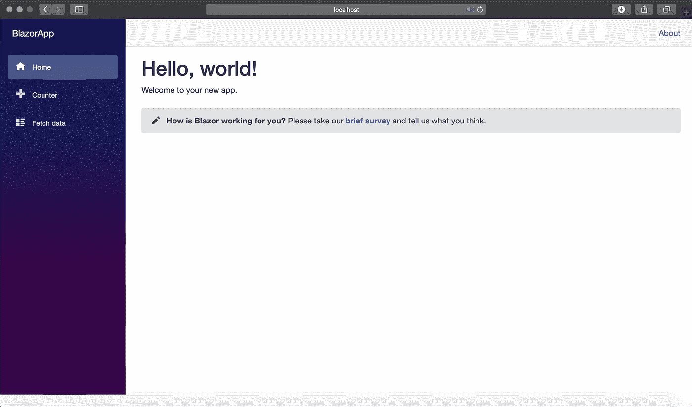
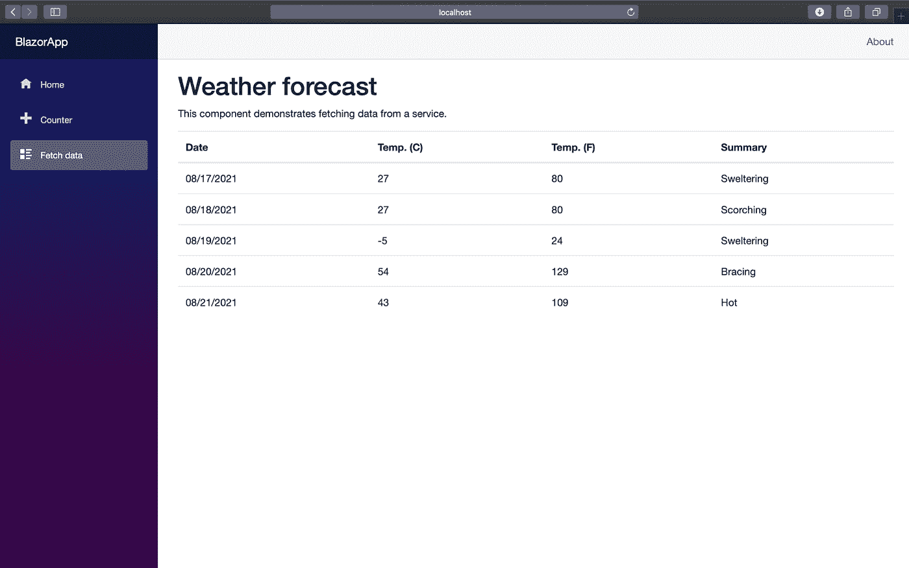
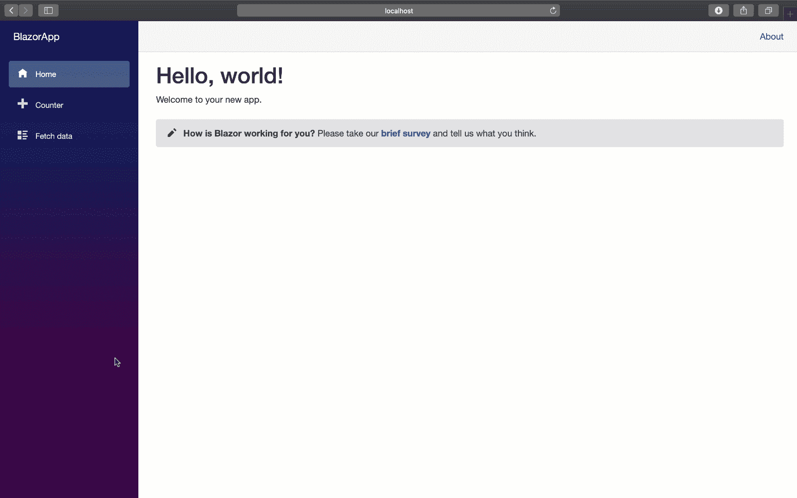

# 如何用 Blazor 创建数据可视化应用程序

> 原文：<https://blog.devgenius.io/how-to-create-data-visualization-app-with-blazor-3bbe5484fec7?source=collection_archive---------0----------------------->


Blazor 近年来成为了一颗冉冉升起的新星，因为它显著降低了 C#程序员进入 web 开发的门槛。这个新框架使得在一个项目中结合使用 C#创建内部和外部逻辑的能力，同时使用各种 JavaScript 库的特性成为可能。

用户预测这个框架的使用会增加，并且有充分的理由这样做。这个框架非常灵活和通用:

*   应用程序可以在所有浏览器上工作，不需要插件；
*   您可以在 C#中重用您的知识，同时保留使用与兼容的任何库的能力。净标准；
*   您可以使用服务器端或客户端方法。

然而，最后一点导致您必须选择在您的 Blazor 项目中使用什么——Blazor 服务器或 Web 程序集。

主要的问题是，当使用服务器时，你会失去速度，你不能离线工作，你需要服务器本身，它运行在 speed 核心。如果您选择 Web Assembly，那么您当然会因为在客户端进行渲染而提高速度，但是您会面临另一个问题—浏览器。你受限于它的能力和速度，它可以下载的容量

无论如何，这项技术已经上市，并且已经出现了大量不同的集成和带有各种组件和工具的联合项目。因此，它在功能上并不逊色于 Angular 或 React 等旧框架。

我的任务是使用 Blazor 快速创建一个数据分析应用程序。为此，我选择了 Flexmonster 数据透视表&图表 JavaScript 库。

所以我将指导你使用 Blazor 和 Flexmonster 创建一个**数据可视化应用的整个过程。**

# 第一步。最低准备

如果您刚刚开始使用。网安装[。NET Softwer Developer Kit](https://dotnet.microsoft.com/download)(SDK)——你可以选择你的操作系统和版本。要检查所有东西是否安装正确，请在终端中运行 ***dotnet*** 。

# 第二步。创建基本的 Blazor 应用程序

要创建您的第一个应用程序，您只需在终端中编写:

```
dotnet new blazorserver -o BlazorApp — no-https
```

现在您在当前位置的一个名为 ***BlazorApp*** 的新目录中有了一个新的 Blazor app 项目。(请注意，我们已经禁用了 HTTPS！)

我们打开[*http://localhost:5000*](http://localhost:5000/)*看看有什么。*如果你做的一切都正确，那么你会看到基本的 Blazor 应用程序:



您可以使用左侧的菜单在不同页面之间导航。它们都在*的*页/* 目录中定义。剃刀*档。你现在看到的是 Index.razor 文件。

我们将把 Flexmonster Pivot 嵌入到最后一个名为**的获取数据**上。如果你现在打开它，你会在表格视图中看到天气预报。我们将删除它并添加我们自己的数据。



# 第三步。在我们的应用程序中安装并添加一个数据透视表

我们需要做的第一件事是安装 Flexmonster。通过在您的终端中运行一个命令来打包 Blazor:

```
dotnet add package Flexmonster.Blazor
```

然后在项目的根目录中找到 _Imports.razor 文件，并将下面一行代码添加到该文件的末尾:

```
@using Flexmonster.Blazor
```

现在是时候在页面上显示枢纽了。在 *Pages/* 目录下的 *_Host.cshtml* 文件中添加 Flexmonster 脚本到其他元数据标签:

```
<head><! — Other metadata tags →<link href=”css/app.css” rel=”stylesheet” /><link href=”PivotBlazor.styles.css” rel=”stylesheet” />**<script src=”_content/Flexmonster.Blazor/blazor-flexmonster.js”></script>**<! — Other metadata tags →</head>
```

在这个打开的 FetchData.razor 文件之后，删除除了这一行之外的所有内容:

```
@page “/fetchdata”
```

然后将标题和 Flexmonster 本身添加到组件中:

```
<h3>Pivot</h3>**<FlexmonsterComponent Report=”@report”****Toolbar=”true”****Width=”100%”****Height=”600">****</FlexmonsterComponent>**
```

本块中提到的参数显示:

*   **报表** —显示哪个报表；
*   **工具栏—** 启用或禁用 Flexmonster 工具栏；
*   **宽度**和**高度** —枢轴的尺寸。

您可以在 [Flexmonster 的文档](https://www.flexmonster.com/api/new-flexmonster/?r=dg)中了解更多初始化参数。

但是正如我们没有说什么是*报告一样*中枢不会显示任何东西。为了使它正确，我们需要定义包含报告的变量:

```
@code {**string report =****“https://cdn.flexmonster.com/reports/report.json";**}
```

最终，您的 FetchData.razor 文件应该如下所示:

```
@page “/fetchdata”<h3>Pivot</h3><FlexmonsterComponent Report=”@report”Toolbar=”true”Width=”100%”Height=”600"></FlexmonsterComponent>@code {string report = “https://cdn.flexmonster.com/reports/report.json";}
```

# 第四步。运行你的 Blazor 应用程序

最后一个操作是使用以下命令运行您的应用程序:

```
dotnet run
```

并打开[*http://localhost:5000*](http://localhost:5000/)。您的最终结果应该是这样的:



# 结论

我想通过这个例子，你已经看到了使用 Blazor 和额外的 JavaScript 库创建一个应用程序是多么简单和快速。只需几个步骤，您就可以编写一个应用程序，节省大量时间，然后您可以将这些时间花在项目的逻辑和改进上。

对我来说，这是我第一次与 Blazor 合作，结果真的很棒！我很乐意在我的其他项目中继续使用这个框架，我真的建议你也尝试一下。

# 附加说明

如果你也对使用这个框架感兴趣，那么我可以满足你——Blazor 有一系列优秀的关于创建各种应用程序的教程,所以你可以自己充分发现这项技术。

顺便说一下，Flexmonster 也有一些东西可以提供给你——在他们的 GitHub 档案中，你可以找到 Blazor 上的一个示例项目。有几个例子，你也可以在工作中用作模板。

我希望这篇教程对你有所帮助，并为你开辟了新的天地。我将很高兴听到你和 Blazor 的经历，并回答你可能有的任何问题！