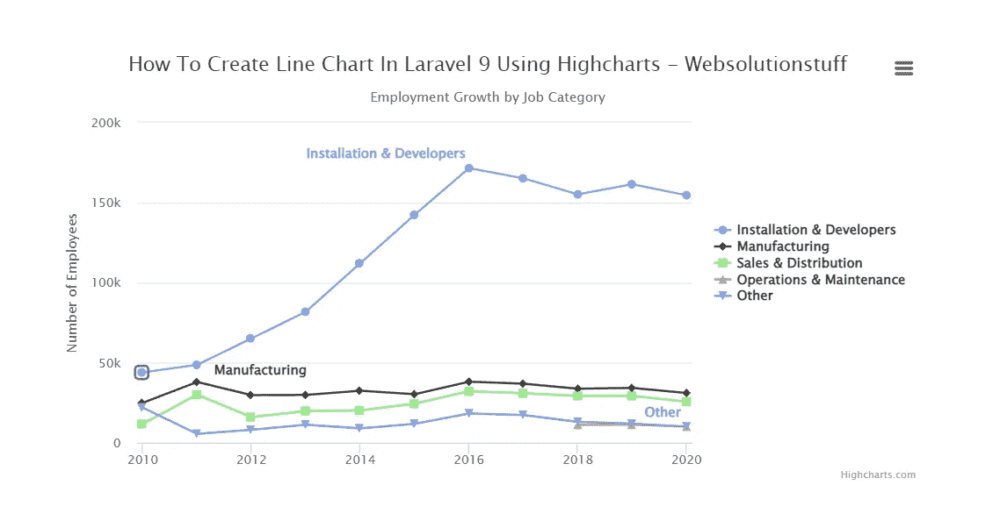

# 如何在 Laravel 9 中使用 Highcharts 创建折线图

> 原文：<https://blog.devgenius.io/how-to-create-line-chart-in-laravel-9-using-highcharts-cb1a5bd15c13?source=collection_archive---------9----------------------->

在本文中，我们将看到如何使用 highcharts 在 laravel 9 中创建折线图。

折线图是资产历史价格行为的图形表示，它用一条连续的线连接一系列数据点。

这是在就业和金融中使用的最基本的图表类型，它通常只描绘一种证券在一段时间内的收盘价。

您可以学习 laravel 9 highcharts 折线图示例。

Highcharts 库提供了创建可靠和安全的数据可视化所需的所有工具。基于 JavaScript 和 TypeScript 构建。

Highcharts 是一个 javascript 库，通过这个库我们可以使用许多图表，如折线图、条形图、饼状图、股票图等。

此外，Highcharts 是一个开源图表库。因此，我们将在 laravel 9 中学习 highcharts 示例。

那么，我们来看看如何使用 highcharts 在 laravel 9 中添加折线图。此外，您可以使用 highcharts 在 laravel 9 中创建动态折线图

```
Step 1: Install Laravel 9 For Line Chart

Step 2: Add Route

Step 3: Create HighChartsController

Step 4: Create Blade File for Display Line Chart

Step 5: Add Highcharts Script
```

**第一步:安装线图的 Laravel 9**

在这一步中，我们将使用以下命令安装 laravel 9。

```
composer create-project laravel/laravel line-chart-hightcharts-laravel-9
```

**读也:** [**Laravel 9 to_route()和 str()辅助函数**](https://websolutionstuff.com/post/laravel-9-to-route-and-str-helper-function)

**第二步:添加路线**

在这一步，我们将在**web.php**文件中添加路线

```
use App\Http\Controllers\HighchartsController;

Route::get('line-chart/highchart', [HighchartsController::class, 'highChart']);
```

**步骤 3:创建 HighChartsController**

现在，我们将创建 HighchartsController。

**app/Http/Controllers/high charts controller**

```
<?php

namespace App\Http\Controllers;
use Illuminate\Http\Request;
class HighchartsController extends Controller
{
    public function highChart()
    {
        // For a dynamic line chart you can pass "Data" from the controller.
        return view('index', compact('line-chart'));
    }
}
```

**第四步:为显示线图创建刀片文件**

在这一步，我们将创建一个 line-chart.blade.php 文件，我们还将添加 CSS 和 jQuery，并添加以下代码到该文件。

**资源/视图/折线图. blade.php**

```
<html>
    <head>
        <style>
            .highcharts-figure,
            .highcharts-data-table table {
            min-width: 360px;
            max-width: 800px;
            margin: 1em auto;
            }

            .highcharts-data-table table {
            font-family: Verdana, sans-serif;
            border-collapse: collapse;
            border: 1px solid #ebebeb;
            margin: 10px auto;
            text-align: center;
            width: 100%;
            max-width: 500px;
            }

            .highcharts-data-table caption {
            padding: 1em 0;
            font-size: 1.2em;
            color: #555;
            }

            .highcharts-data-table th {
            font-weight: 600;
            padding: 0.5em;
            }

            .highcharts-data-table td,
            .highcharts-data-table th,
            .highcharts-data-table caption {
            padding: 0.5em;
            }

            .highcharts-data-table thead tr,
            .highcharts-data-table tr:nth-child(even) {
            background: #f8f8f8;
            }

            .highcharts-data-table tr:hover {
            background: #f1f7ff;
            }
        </style>
    </head>
    <title>How To Add Line Chart Highcharts In Laravel 9 - Websolutionstuff</title>
    <body>
        <figure class="highcharts-figure">
            <div id="container"></div>  
        </figure>
    </body>    
</html>
```

**阅读也:** [**如何在 Laravel 中创建动态折线图 9**](https://websolutionstuff.com/post/how-to-create-dynamic-line-chart-in-laravel-9)

**第五步:添加高图表脚本**

现在，我们将添加 highcharts.js 及其函数来显示折线图。所以，把脚本添加在 **<头的>** 标签或者 HTML 标签的底部。

```
<script src="https://code.highcharts.com/highcharts.js"></script>
<script src="https://code.highcharts.com/modules/series-label.js"></script>
<script src="https://code.highcharts.com/modules/exporting.js"></script>
<script src="https://code.highcharts.com/modules/export-data.js"></script>
<script src="https://code.highcharts.com/modules/accessibility.js"></script>
<script>
    Highcharts.chart('container', {

        title: {
        text: 'How To Create Line Chart In Laravel 9 Using Highcharts - Websolutionstuff'
        },

        subtitle: {
        text: 'Employment Growth by Job Category'
        },

        yAxis: {
        title: {
            text: 'Number of Employees'
        }
        },

        xAxis: {
        accessibility: {
            rangeDescription: 'Range: 2010 to 2020'
        }
        },

        legend: {
        layout: 'vertical',
        align: 'right',
        verticalAlign: 'middle'
        },

        plotOptions: {
        series: {
            label: {
            connectorAllowed: false
            },
            pointStart: 2010
        }
        },

        series: [{
        name: 'Installation & Developers',
        data: [43934, 48656, 65165, 81827, 112143, 142383,
            171533, 165174, 155157, 161454, 154610]
        }, {
        name: 'Manufacturing',
        data: [24916, 37941, 29742, 29851, 32490, 30282,
            38121, 36885, 33726, 34243, 31050]
        }, {
        name: 'Sales & Distribution',
        data: [11744, 30000, 16005, 19771, 20185, 24377,
            32147, 30912, 29243, 29213, 25663]
        }, {
        name: 'Operations & Maintenance',
        data: [null, null, null, null, null, null, null,
            null, 11164, 11218, 10077]
        }, {
        name: 'Other',
        data: [21908, 5548, 8105, 11248, 8989, 11816, 18274,
            17300, 13053, 11906, 10073]
        }],

        responsive: {
        rules: [{
            condition: {
            maxWidth: 500
            },
            chartOptions: {
            legend: {
                layout: 'horizontal',
                align: 'center',
                verticalAlign: 'bottom'
            }
            }
        }]
        }

    });
</script>
```

**输出:**



**你可能也会喜欢:**

*   **阅读也:** [**谷歌折线图示例在 Laravel 8**](https://websolutionstuff.com/post/google-line-chart-example-in-laravel-8)
*   **阅读还:** [**如何在 Laravel**](https://websolutionstuff.com/post/how-to-create-dynamic-bar-chart-in-laravel) 中创建动态条形图
*   **同时阅读:** [**如何在 Laravel**](https://websolutionstuff.com/post/how-to-create-multi-language-website-in-laravel) 中创建多语言网站
*   **阅读另:** [**Laravel 9 用户角色和权限无包**](https://websolutionstuff.com/post/laravel-9-user-roles-and-permissions-without-package)

如果这篇文章有帮助，请点击拍手👏下面的按钮。