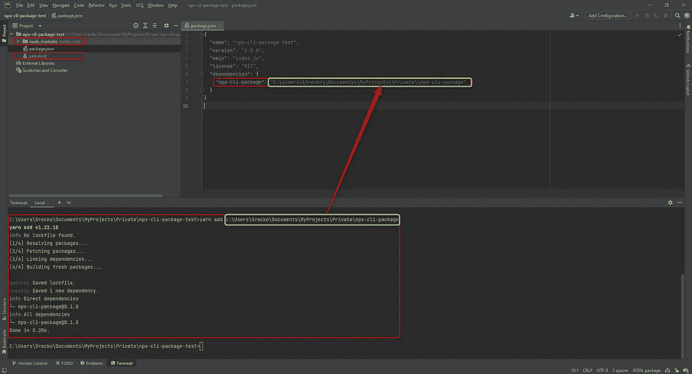

# 如何使用 NodeJS 创建 npx 脚本| CLI

> 原文：<https://blog.devgenius.io/how-to-create-npx-script-cli-with-nodejs-3927f8bb91eb?source=collection_archive---------5----------------------->

通过几个简单的步骤，这篇文章将向你展示如何使用 JavaScript 和 NodeJS 创建一个基本的 script | CLI。


带有 shebang 注释的 nodejs npx 脚本

# 注意

CLI —命令行界面。

我用的是 NodeJS 的 v16.13.1。

# 要求

为了获得最佳的学习体验，请使用 NPM。要在命令提示符下运行脚本，我将使用 npm link 命令。

在 NPM 之前，我试图用纱，但纱和 NPM 链接不一样。为了使体验尽可能顺利，请使用 NPM。

然而，如果这不是一个选项，最后，我会提供一种方法来测试包，即使你使用纱。但是，我觉得有点不方便。

# 一个入口

我将首先创建一个入口点 JavaScript 文件，并在顶部添加一个注释。NPM 要求该注释将该文件标记为可执行文件。你可以在这里阅读更多[https://stack overflow . com/questions/33509816/what-exact-does-usr-bin-env-node-do-at-the-begin-of-node-files](https://stackoverflow.com/questions/33509816/what-exactly-does-usr-bin-env-node-do-at-the-beginning-of-node-files)。

由于 NodeJS 解析算法，文件名是 index。你可以通过这个链接[https://faun . pub/how-do-nodejs-require-modules-dcb 8 a 4 DFD ab 8](https://faun.pub/how-does-nodejs-require-modules-dcb8a4dfdab8)了解更多信息。

到目前为止，我们已经有了一个索引 JavaScript 文件，其顶部带有注释:


顶部带有注释的索引 JavaScript 文件

# 告诉 NPM 脚本| CLI 在哪里，它的名称是什么

在包 JSON 文件中，我将添加 bin 属性，该属性将包含命令的名称和文件的位置。

新的结构包含前面提到的新的包 JSON 文件。


带有 bin 属性的包 JSON 文件

脚本| CLI 可以通过以下方式运行:

```
npx-cli-package
```

# 添加脚本| CLI 逻辑

目前，脚本| CLI 没有任何代码。作为一个好的起点，我将添加一些文本的常规日志。运行脚本| CLI 后，我将向您展示如何提取参数。


打印 npx cli 包的索引 JavaScript 文件

# 设置运行脚本| CLI

为了运行脚本| CLI，我将向包 JSON 添加一个名称，因为它是必填字段。没有名称字段，我们无法运行脚本| CLI。

添加字段后，包 JSON 和结构如下所示:


添加字段后，包 JSON 有了一个额外的属性——name

# 运行脚本| CLI

第一步是运行 npm link 命令，之后脚本将在命令提示符下运行。

运行 npm 链接。您应该会看到类似下图的输出。


npm 链接输出

运行如下命令:

```
npx-cli-package
```

您应该会看到类似的输出，如图所示。


npx-CLI-包输出

# 提取参数

脚本| CLI 已准备就绪。提取参数很简单。我建议您打印出流程变量，因为它有您可能想要使用的属性。这是关于它的文件[https://nodejs.org/api/process.html](https://nodejs.org/api/process.html)。

我将继续从命令行提取参数。我也会把文字印刷删掉，因为我不再需要它了。

将 index JavaScript 代码更改为以下代码，并从命令提示符运行该脚本。你应该能看到图中的论点。


npx-cli-package 将参数打印到 cmd 输出中

但是，有一个问题。我在没有任何参数的情况下运行了这个脚本，但是它打印了两个默认的参数。我会传递更多的。它们将被提取并打印出来。


另外两个参数被打印出来

# 对于纱线用户

我有一个纱线连接的问题，因为它不起作用。我在谷歌上搜索解决方案，但没有找到。但是，我发现如果我从本地目录安装包，我可以运行脚本| CLI。

创建另一个目录，并将其命名为相同的名称，但是在名称后面附加 test。我建议您将它创建为另一个的邻居，因为这对您来说更容易。

对我来说，就像下图。


创建另一个目录来测试脚本| CLI

但是，您可以将测试目录放在任何地方。当我运行纱线添加时，我将使用它的绝对路径。

打开测试目录。


测试目录已打开

运行纱线初始化命令。

```
yarn init -y
```


纱线初始化-y 命令

使用脚本| CLI 的绝对路径运行 Yarn 安装。


纱线添加 <absolute_path_to_the_package>—错误</absolute_path_to_the_package>

如果你跟着我做，你应该会有同样的错误。我必须带着代码回到 script | CLI 包。在包 JSON 文件中，我将添加 version 属性。Yarn 因为不知道版本所以无法安装。


npx-CLI-软件包

运行纱线添加它应该工作了。

***重要提示:*** 使用绝对路径。



加纱 <absolute_path_to_the_package>—成功</absolute_path_to_the_package>

从命令提示符运行脚本| CLI。


从测试目录运行脚本

***重要提示:***

*   脚本| CLI 仍然必须使用 npx 命令运行。
*   另一种方法是添加脚本| CLI 来打包 JSON 脚本。


使用包 JSON 中的脚本运行包

# 包含代码的存储库

你可以在这个库中找到代码:[https://github.com/srele96/npx-cli-package](https://github.com/srele96/npx-cli-package)。

***重要提示:*** 我没有为我使用 Yarn 的目录创建一个存储库。我使用绝对路径安装了 CLI 包。在本地机器上运行 Yarn install 将会失败。那是因为我的绝对路径极不可能存在于你的机器上。