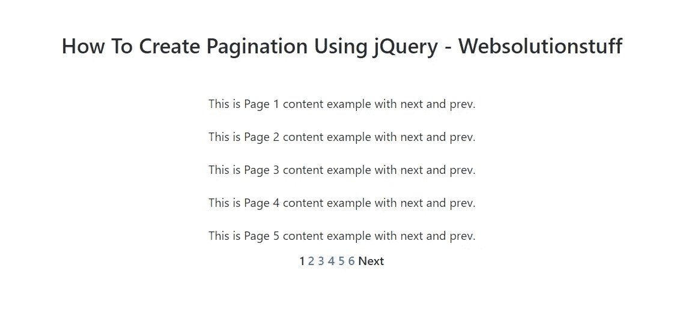
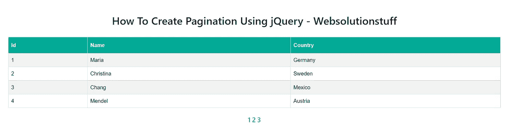
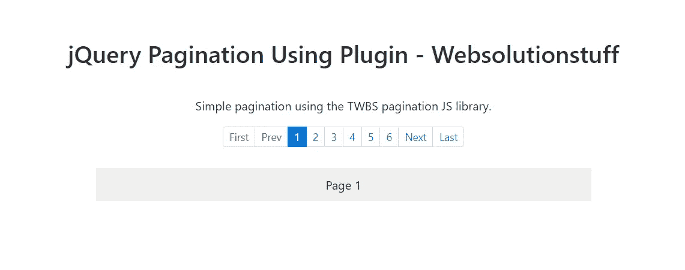

# 如何使用 jQuery 创建分页

> 原文：<https://blog.devgenius.io/how-to-create-pagination-using-jquery-37c87e625331?source=collection_archive---------15----------------------->

在本文中，我们将看到如何使用 jquery 创建分页。我们将使用多种方式创建 jquery 分页。

您可以使用不同的方式创建分页，例如使用简单的 HTML 创建分页，您可以使用 paginate()方法在 laravel 中创建分页。此外，创建分页 laravel livewire，使用引导分页。

我们将创建简单的 jquery 分页。同样，使用没有插件的 jquery 创建分页，使用 next 和 previous 按钮创建 jquery 分页

所以，让我们看看 jquery 中的动态分页和 jquery 中的引导分页

**举例:**

在这个例子中，我们将使用 jquery 创建分页，而不使用插件。此外，您可以自定义分页。

```
<!DOCTYPE html>
<html lang="en">
    <head>
        <title>How To Create Pagination Using jQuery - Websolutionstuff</title>
        <style>
            .current {
            color: green;
            }
#pagin li {
            display: inline-block;
            font-weight: 500;
            }
            .prev {
            cursor: pointer;
            }
            .next {
            cursor: pointer;
            }
            .last {
            cursor:pointer;
            margin-left:10px;
            }
            .first {
            cursor:pointer;
            margin-right:10px;
            }
            .line-content, #pagin, h3 {
            text-align:center;
            }
            .line-content {
            margin-top:20px;
            }
            #pagin {
            margin-top:10px;
            padding-left:0;
            }
            h3 {
            margin:50px 0;  
            }
        </style>
    </head>
    <body>
        <h3>How To Create Pagination Using jQuery - Websolutionstuff</h3>
        <div class="line-content">This is Page 1 content example with next and prev.</div>
        <div class="line-content">This is Page 2 content example with next and prev.</div>
        <div class="line-content">This is Page 3 content example with next and prev.</div>
        <div class="line-content">This is Page 4 content example with next and prev.</div>
        <div class="line-content">This is Page 5 content example with next and prev.</div>
        <div class="line-content">This is Page 6 content example with next and prev.</div>
        <div class="line-content">This is Page 7 content example with next and prev.</div>
        <div class="line-content">This is Page 8 content example with next and prev.</div>
        <div class="line-content">This is Page 9 content example with next and prev.</div>
        <div class="line-content">This is Page 10 content example with next and prev.</div>
        <div class="line-content">This is Page 11 content example with next and prev.</div>
        <div class="line-content">This is Page 12 content example with next and prev.</div>
        <div class="line-content">This is Page 13 content example with next and prev.</div>
        <div class="line-content">This is Page 14 content example with next and prev.</div>
        <div class="line-content">This is Page 15 content example with next and prev.</div>
        <div class="line-content">This is Page 16 content example with next and prev.</div>
        <div class="line-content">This is Page 17 content example with next and prev.</div>
        <div class="line-content">This is Page 18 content example with next and prev.</div>
        <div class="line-content">This is Page 19 content example with next and prev.</div>
        <div class="line-content">This is Page 20 content example with next and prev.</div>
        <div class="line-content">This is Page 21 content example with next and prev.</div>
        <div class="line-content">This is Page 22 content example with next and prev.</div>
        <div class="line-content">This is Page 23 content example with next and prev.</div>
        <div class="line-content">This is Page 24 content example with next and prev.</div>
        <div class="line-content">This is Page 25 content example with next and prev.</div>
        <div class="line-content">This is Page 26 content example with next and prev.</div>
        <div class="line-content">This is Page 27 content example with next and prev.</div>
        <div class="line-content">This is Page 28 content example with next and prev.</div>
        <div class="line-content">This is Page 29 content example with next and prev.</div>
        <div class="line-content">This is Page 30 content example with next and prev.</div>
        <div class="line-content">This is Page 31 content example with next and prev.</div>
        <div class="line-content">This is Page 32 content example with next and prev.</div>
        <div class="line-content">This is Page 33 content example with next and prev.</div>
        <div class="line-content">This is Page 34 content example with next and prev.</div>
        <div class="line-content">This is Page 35 content example with next and prev.</div>
        <div class="line-content">This is Page 36 content example with next and prev.</div>
        <div class="line-content">This is Page 37 content example with next and prev.</div>
        <div class="line-content">This is Page 38 content example with next and prev.</div>
        <div class="line-content">This is Page 39 content example with next and prev.</div>
        <div class="line-content">This is Page 40 content example with next and prev.</div>
        <div class="line-content">This is Page 41 content example with next and prev.</div>
        <div class="line-content">This is Page 42 content example with next and prev.</div>
        <div class="line-content">This is Page 43 content example with next and prev.</div>
        <div class="line-content">This is Page 44 content example with next and prev.</div>
        <div class="line-content">This is Page 45 content example with next and prev.</div>
        <ul id="pagin"></ul>
    </body>
</html>
<script src="https://code.jquery.com/jquery-3.6.1.min.js" integrity="sha256-o88AwQnZB+VDvE9tvIXrMQaPlFFSUTR+nldQm1LuPXQ=" crossorigin="anonymous"></script>
<script>
pageSize = 5;
incremSlide = 5;
startPage = 0;
numberPage = 0;
var pageCount =  $(".line-content").length / pageSize;
var totalSlidepPage = Math.floor(pageCount / incremSlide);

for(var i = 0 ; i<pageCount;i++){
    $("#pagin").append('<li><a href="#">'+(i+1)+'</a></li> ');
    if(i>pageSize){
       $("#pagin li").eq(i).hide();
    }
}
var prev = $("<li/>").addClass("prev").html("Prev").click(function(){
    startPage-=5;
    incremSlide-=5;
    numberPage--;
    slide();
});
prev.hide();
var next = $("<li/>").addClass("next").html("Next").click(function(){
    startPage+=5;
    incremSlide+=5;
    numberPage++;
    slide();
});
$("#pagin").prepend(prev).append(next);
$("#pagin li").first().find("a").addClass("current");
slide = function(sens){
    $("#pagin li").hide();

    for(t=startPage;t<incremSlide;t++){
        $("#pagin li").eq(t+1).show();
    }
    if(startPage == 0){
        next.show();
        prev.hide();
    }else if(numberPage == totalSlidepPage ){
        next.hide();
        prev.show();
    }else{
        next.show();
        prev.show();
    }    
}
showPage = function(page) {
    $(".line-content").hide();
    $(".line-content").each(function(n) {
        if (n >= pageSize * (page - 1) && n < pageSize * page){
            $(this).show();
        }
    });        
}

showPage(1);
$("#pagin li a").eq(0).addClass("current");
$("#pagin li a").click(function() {
    $("#pagin li a").removeClass("current");
    $(this).addClass("current");
    showPage(parseInt($(this).text()));
});
</script>
```

**输出:**



如何使用 jQuery 创建分页

**读也:** [**Laravel 9 Livewire 分页示例**](https://websolutionstuff.com/post/laravel-9-livewire-pagination-example)

**示例:**

在这个例子中，我们将在 jquery 的帮助下创建引导分页。

```
<!DOCTYPE html>
<html lang="en">
    <head>
        <title>How To Create Bootstrap Pagination Using jQuery - Websolutionstuff</title>
        <link rel="stylesheet" href="https://maxcdn.bootstrapcdn.com/bootstrap/4.0.0/css/bootstrap.min.css">
        <style>
            #data tr {
                display: none;
            }.page {
                margin: 30px;
            }
            table, th, td {
                border: 1px solid black;
            }
            #data {
                font-family: Arial, Helvetica, sans-serif;
                border-collapse: collapse;
                width: 100%;
            }
            #data td, #data th {
                border: 1px solid #ddd;
                padding: 8px;
            }
            #data tr:nth-child(even) {
                background-color: #f2f2f2;
            }
            #data tr:hover {
                background-color: #ddd;
            }
            #data th {
                padding-top: 12px;
                padding-bottom: 12px;
                text-align: left;
                background-color: #03aa96;
                color: white;
            }
            #nav a {
                color: #03aa96;
                font-size: 20px;
                margin-top: 22px;
                font-weight: 600;
            }
            a:hover, a:visited, a:link, a:active {
                text-decoration: none;
            }
            #nav {
                margin-top: 20px;
            }
        </style>
    </head>
    <body>                  
        <h2 align="center" class="mt-4">How To Create Bootstrap Pagination Using jQuery - Websolutionstuff</h2>
        <div class="page" align="center">   
            <table id="data">  
                <tr>  
                    <th>Id</th>  
                    <th>Name</th>  
                    <th>Country</th>  
                </tr>  
                <tr>  
                    <td>1</td>  
                    <td>Maria</td>  
                    <td>Germany</td>  
                </tr>  
                <tr>  
                    <td>2</td>  
                    <td>Christina</td>  
                    <td>Sweden</td>  
                </tr>  
                <tr>  
                    <td>3</td>  
                    <td>Chang</td>  
                    <td>Mexico</td>  
                </tr>  
                <tr>  
                    <td>4</td>  
                    <td>Mendel</td>  
                    <td>Austria</td>  
                </tr>  
                <tr>  
                    <td>5</td>  
                    <td>Helen</td>  
                    <td>United Kingdom</td>  
                </tr>  
                <tr>  
                    <td>6</td>  
                    <td>Philip</td>  
                    <td>Germany</td>  
                </tr>  
                <tr>  
                    <td>7</td>  
                    <td>Tannamuri</td>  
                    <td>Canada</td>  
                </tr>  
                <tr>  
                    <td>8</td>  
                    <td>Rovelli</td>  
                    <td>Italy</td>  
                </tr>  
                <tr>  
                    <td>9</td>  
                    <td>Dell</td>
                    <td>United Kingdom</td>
                </tr>  
                <tr>  
                    <td>10</td>  
                    <td>Trump</td>  
                    <td>France</td>  
                </tr>  
            </table>  
        </div>
    </body>
</html>
<script src="https://code.jquery.com/jquery-3.6.1.min.js" integrity="sha256-o88AwQnZB+VDvE9tvIXrMQaPlFFSUTR+nldQm1LuPXQ=" crossorigin="anonymous"></script>
<script>
$(document).ready (function () {  
    $('#data').after ('<div id="nav"></div>');  
    var rowsShown = 5;  
    var rowsTotal = $('#data tbody tr').length;  
    var numPages = rowsTotal/rowsShown;  
    for (i = 0;i < numPages;i++) {  
        var pageNum = i + 1;  
        $('#nav').append ('<a href="#" rel="'+i+'">'+pageNum+'</a> ');  
    }  
    $('#data tbody tr').hide();  
    $('#data tbody tr').slice (0, rowsShown).show();  
    $('#nav a:first').addClass('active');  
    $('#nav a').bind('click', function() {  
    $('#nav a').removeClass('active');  
    $(this).addClass('active');  
        var currPage = $(this).attr('rel');  
        var startItem = currPage * rowsShown;  
        var endItem = startItem + rowsShown;  
        $('#data tbody tr').css('opacity','0.0').hide().slice(startItem, endItem).  
        css('display','table-row').animate({opacity:1}, 300);  
    });  
});
</script> 
```

**输出:**



如何使用 jQuery 创建分页

**阅读也:** [**下一页上一页链接按钮分页在**](https://websolutionstuff.com/post/next-previous-link-button-pagination-in-laravel)

**例子:**

在这个例子中，我们将使用[**twbsPagination**](https://josecebe.github.io/twbs-pagination/)插件创建分页。这个 jQuery 插件简化了引导分页的使用。

```
<!DOCTYPE html>
<html lang="en">
    <head>
        <title>jQuery Pagination Using Plugin - Websolutionstuff</title>
        <link rel="stylesheet" href="https://cdnjs.cloudflare.com/ajax/libs/twitter-bootstrap/4.0.0-alpha.6/css/bootstrap.min.css">
        <style>
            .wrapper{
                margin: 60px auto;
                text-align: center;
            }
            h2{
                margin-bottom: 1.25em;
            }

            #pagination-demo{
                display: inline-block;
                margin-bottom: 1.75em;
            }
            #pagination-demo li{
                display: inline-block;
            }
            .page-content{
                background: #eee;
                display: inline-block;
                padding: 10px;
                width: 100%;
                max-width: 660px;
            }
        </style>
    </head>
    <body>                  
        <div class="wrapper">
            <div class="container">

              <div class="row">
                <div class="col-sm-12">
                  <h2>jQuery Pagination Using Plugin - Websolutionstuff</h2>
                  <p>Simple pagination using the TWBS pagination JS library.</p>
                  <ul id="pagination-demo" class="pagination-sm"></ul>
                </div>
              </div>

              <div id="page-content" class="page-content">Page 1</div>
            </div>
          </div>
    </body>
</html>
<script src="https://code.jquery.com/jquery-3.6.1.min.js"></script>
<script src="https://cdnjs.cloudflare.com/ajax/libs/twitter-bootstrap/4.0.0-alpha.6/js/bootstrap.min.js"></script>
<script src="https://cdnjs.cloudflare.com/ajax/libs/twbs-pagination/1.4.1/jquery.twbsPagination.min.js"></script>
<script>
$(document).ready (function () {  
    $('#pagination-demo').twbsPagination({
        totalPages: 16,
        visiblePages: 6,
        next: 'Next',
        prev: 'Prev',
        onPageClick: function (event, page) {            
            $('#page-content').text('Page ' + page) + ' content here';
        }
    });
});
</script> 
```

**输出:**



如何使用 jQuery 创建分页

你可能也会喜欢:

*   **另请阅读:** [**如何使用 jQuery 动态添加和删除行**](https://websolutionstuff.com/post/how-to-add-and-delete-rows-dynamically-using-jquery)
*   **阅读另:** [**如何在 jQuery**](https://websolutionstuff.com/post/how-to-preview-image-before-upload-in-jquery) 中上传前预览图片
*   **阅读另:** [**使用 Ajax jQuery 在 Laravel 中加载更多数据**](https://websolutionstuff.com/post/load-more-data-in-laravel-using-ajax-jquery)
*   **读也:** [**拖拽 Div 使用 jQuery**](https://websolutionstuff.com/post/drag-and-drop-div-using-jquery)

如果这篇帖子有帮助，请点赞，分享和 comment✌️.