# 如何使用 Apache Echarts 轻松创建强大的可视化效果并做出反应

> 原文：<https://blog.devgenius.io/how-to-create-powerful-visualizations-easily-using-apache-echarts-and-react-6c6ca77f47ae?source=collection_archive---------6----------------------->

数据可视化(照片由[un plash](https://unsplash.com/s/photos/data-visualization?utm_source=unsplash&utm_medium=referral&utm_content=creditCopyText)上的 [Markus Winkler](https://unsplash.com/@markuswinkler?utm_source=unsplash&utm_medium=referral&utm_content=creditCopyText) 拍摄)

## 数据就是石油好好利用它

> 在当今世界，可视化是总结数据的最有效和最高效的方式之一。一个人可以有效地对饼图而不是电子表格进行分析

L et 说您有大量关于软件用户的数据，但是如果您不能从这些原始数据中获得有助于您做出更好的业务决策的见解，更准确地说是“数据驱动的决策”，那么这些数据就没有任何用处。够了，伙计们，让我们从本文的主要目的开始，让你们开始了解 Apache Echarts 中的 React

# 阿帕奇艺术简介

ECharts 是一个功能强大、易于使用和灵活的 JavaScript 可视化库。Apache Echarts 在 [**npm**](https://www.npmjs.com/package/echarts) 上对自己的描述如下:

> Apache ECharts 是一个免费、强大的图表和可视化库，提供了一种将直观、交互式和高度可定制的图表添加到您的商业产品中的简单方法。它是用纯 JavaScript 编写的，基于 [zrender](https://github.com/ecomfe/zrender) ，这是一个全新的轻量级画布库。

上面的描述足以让我们知道 ECharts 正在做什么，对吗🤔？如今，它在 npm 上每周有大约 48 万次下载。 **51.5k 星**在 [Github](https://github.com/apache/echarts) 上，最新版本为 5.3.3，12 天前刚刚发布。

# 反应技术

请记住，Apache ECharts 是一个 JavaScript 库。[echart for react](https://www.npmjs.com/package/echarts-for-react)是 echart 的 React 包装纸。

# 在你的反应项目中开始使用电子艺术

**第 1 步:**用你最喜欢的工具(CRA 或维特)创建一个 react 应用程序，或者从头开始创建一个

**步骤 2:** 运行 ***npm 安装 echart****和 ***npm 安装 echart-for-reaction****

*现在，您已经具备了开始使用电子艺界的所有条件*

*为了创建图表，你应该知道的主要事情是*选项*对象。该对象包含 ECharts 完美呈现图表所需的数据。下面是你可以在*选项*对象中包含的内容。更多选择请看这里【https://echarts.apache.org/en/option.html *

*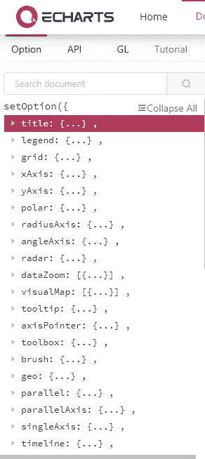*

# *使用电子图表的简单条形图*

*第 1 步:首先我们需要将 **echarts-for-react** 包(作为 ReactEChart)导入到我们的文件中。我已经创建了一个名为 *BarChart.jsx* 的单独文件*

*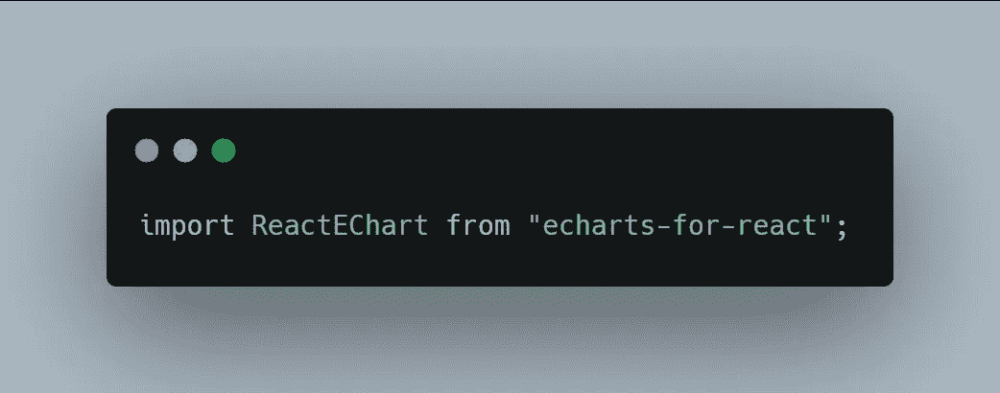*

*导入 echarts-for-react*

*第二步:我们需要创建一个空的***echarts option***对象，然后使用 ReactEChart 组件并将创建的对象传递给***option***prop of***react echart***组件*

*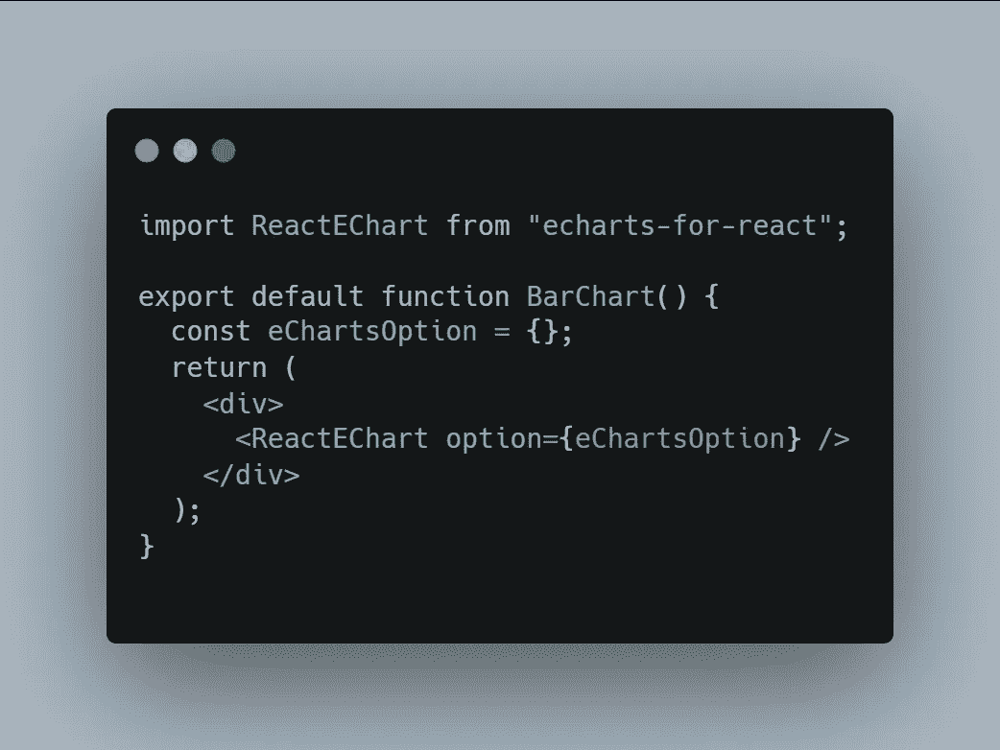*

*第二步:现在，我们将所需的数据添加到***echarts option***对象中。*

*要纳入对象的主要有 ***xAxis*** 、 ***yAxis*** 、 ***系列*** 。*

****xAxis:*** 包含图表上 x 轴的数据。*

****yAxis:*** 这包含图表上 y 轴的数据。*

****系列:*** 这包含了绘制图表的数据。比如价值观*

*这 3 个字段可以是对象或对象数组。当拥有多系列数据时，可以使用对象数组，否则，一个对象就足以完成工作。*

*首先，我们将从 ***系列的*** 字段开始*

*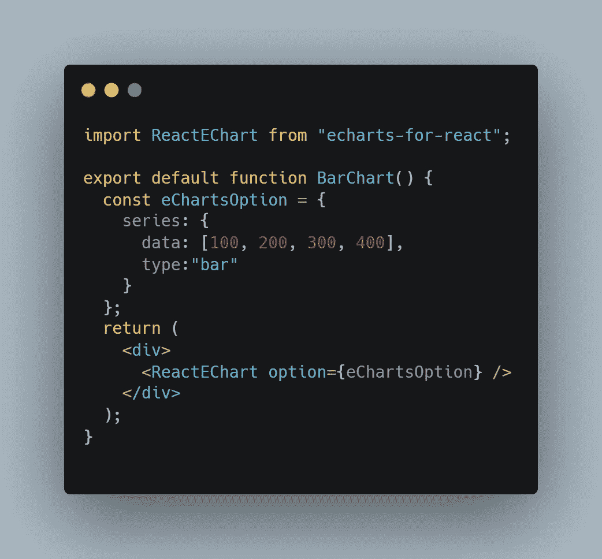*

*系列对象*

*如上所述，我们已经包括了 ***数据*** 和 ***类型*** 字段。 ***数据*** 字段包含将用于绘制图表的值，而 ***类型*** 字段包含指定要绘制的图表类型的字符串。 ***类型*** 字段可以包含条形图、折线图、饼图、散点图、漏斗图等。点击这里查看更多类型[https://echarts.apache.org/en/option.html#series](https://echarts.apache.org/en/option.html#series)。*

*添加上述代码后，您将在控制台中得到一个错误，但不要担心，我们会很快消除它😉*

*你可以在控制台看到***xAxis***/***yAxis***但是没有找到。所以我们只需要添加分配了空对象的字段。*

*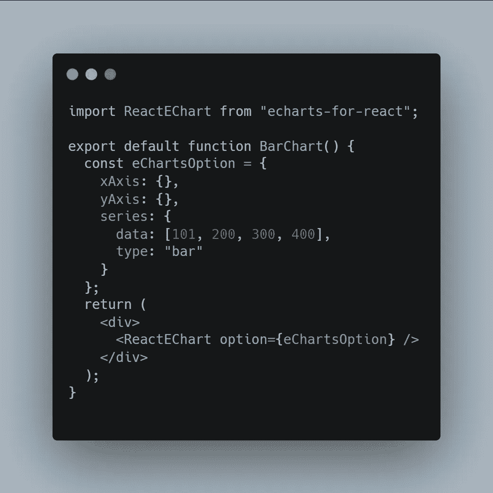*

*添加了 xAxis 和 yAxis*

*瞧，我们用 Echarts 得到了第一张图表*

*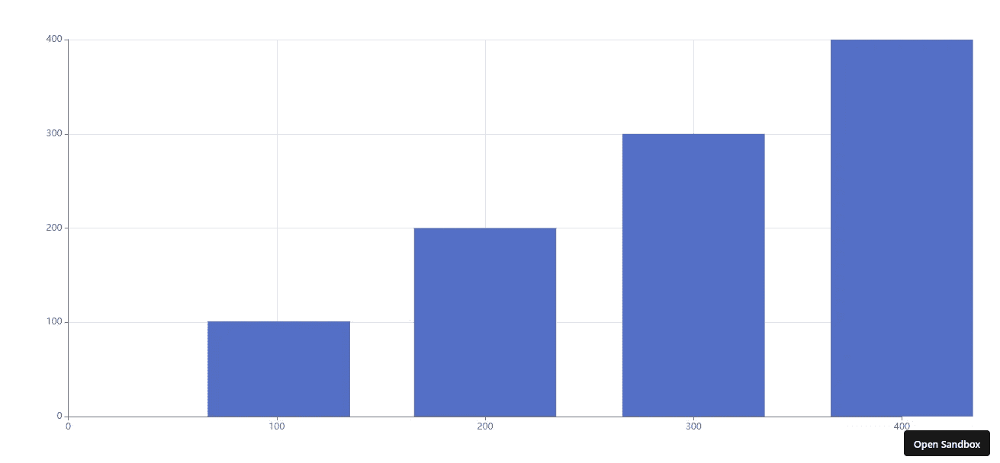*

*使用 Echart 的条形图*

*但是你有没有注意到一些奇怪的事情🤔。第一个条形左边有更多的空间，最后一个条形在容器之外，我们现在将解决这个问题*

*因为我们知道我们的 Y 轴包含数值数据，而我们的 X 轴包含分类数据，所以我们将通过指定我们的***echarts option***对象的 ***xAxis*** 和 ***yAxis*** 字段中的类型字段来告诉 echarts*

*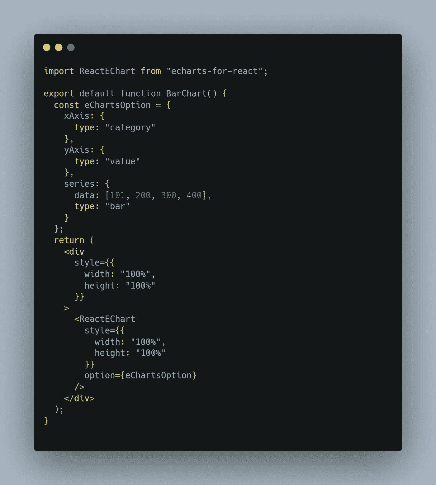*

*Echarts 选项中指定的类别和值*

*现在我们的柱状图看起来很完美，但是它一点也不交互。我们将首先通过指定空的 ***工具提示*** 对象来启用工具提示。我们还可以通过指定 xAxis*对象中的 ***数据*** 字段来为我们的 xAxis 添加名称。**

# **多系列图表**

**我们可以使用一个对象数组而不仅仅是一个 ***系列*** 字段中的数组来创建多系列图表**

**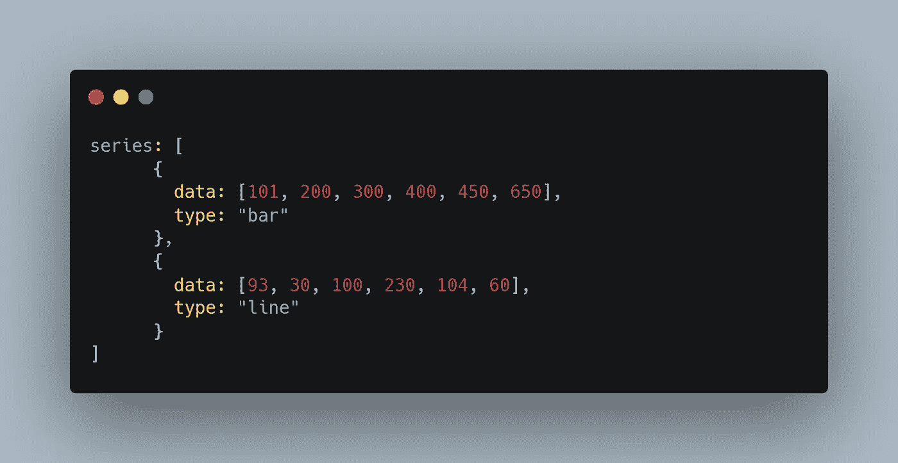**

**多系列图表**

**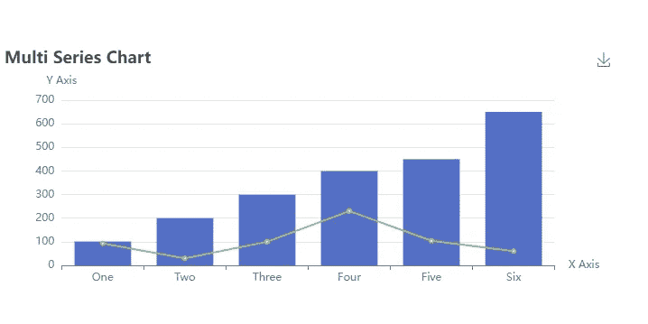**

**多序列图表(条形图和折线图)**

# **堆积条形图**

**我们刚刚创建了一个多系列图表，可以很容易地转换成堆积图。我们所要做的只是在 series 对象的每个对象中添加一个 ***堆栈*** 字段**

**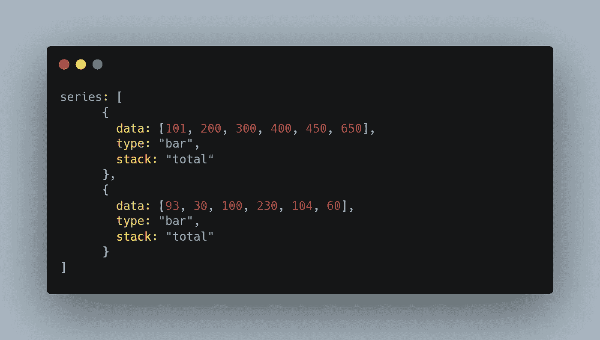**

**堆积条形图**

**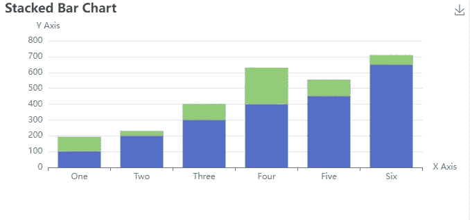**

**堆积条形图**

**你可以在下面附加的沙盒中找到一些其他选项，可以随意使用**

**Echarts 示例代码沙盒**

**如果你喜欢这篇文章，请关注我以获取更多这样的文章。我也想听听建议:)**