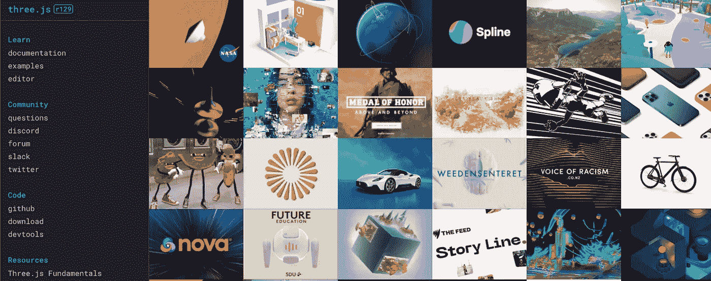

# 如何创建专业级用户界面

> 原文：<https://blog.devgenius.io/how-to-create-professional-grade-websites-5f3bd983ca60?source=collection_archive---------7----------------------->

了解创建令人印象深刻的 web 应用程序的工具和技术

红色衣领

作为一名 UI 开发人员，当你经常在 awwwards 或任何其他类似的网站上看到一些世界级的网站时，你经常会想，用我的技能怎么可能做到这一点。这并不像看起来那么难。

唯一困难的部分是，所使用的工具/技术有时没有足够关注我们的学习资源，因为这些网站可能需要大量的练习才能掌握，并且无法压缩到 15 分钟的网站创建教程中。

如果你看到这个 gif，这不是你的日常管理面板，这看起来真的很有趣也很难，但事实并非如此，这里的技巧是带有三个 j 的图形库，它为你提供了一个非常直观的方法来创建一个带有相机和纹理的场景。

# 主要使用的工具和技术包括但不限于:

1.  三. js
2.  GSAP

每当你看到你认为用 CSS 和 HTML 不可能的东西时，通常你很可能在看一个图形动画库，这两个库对大多数人来说都是必不可少的，你可以使用它们创建不切实际的工作流和出色的交互 UI。

除此之外，这两个库都集成了大多数主要的 UI 框架，您会发现 React 有一个名为 react three fiber 的包装器，但我建议使用原始的 threejs 代码，因为这些库经常被弃用。

## 三. js

Three.js 用于处理 3d 对象，是几乎所有 webgl 项目的一部分，对于已经知道如何使用 JavaScript 的人来说，这个库很直观。

优秀的学习资源:

 [## Three.js 基础

### Three.js 教程和解决方案

threejsfundamentals.org](https://threejsfundamentals.org/) 

我还有一篇关于如何使用 JavaScript 创建城市的文章:)

为了更进一步，我建议学习如何创建 3d 对象，这样你就可以在你的项目中使用它们。

其中最著名的工具是搅拌机。

除此之外，js 还可以在网络上创建复杂的 3d 游戏。

threejs 官网

在 threejs 的官方网站上也有很多例子，为了进行全面的分析，我推荐参加 YouTube 上的 Bruno mars 课程或设计课程。

## GSAP:

GSAP 经常与 three.js 结合来创建复杂的补间动画和动画时间线，这是普通 CSS 所无法实现的，并为您提供了许多细粒度的控制唯一的警告是它不是 MIT 许可的，而是有一定的使用限制和费用，但对于大多数正常的用例来说，它绝对可以免费使用，并且有一个很好的社区。

我已经在 react 和 vanillaJS 上使用了这个库，并且很高兴地告诉大家，这两个库的工作方式或多或少是相同的，我很喜欢使用它。

Gsap 官员

对于几乎所有的场景，这两者结合起来会让你做好准备来建立你的梦想网站，并打破最初的进入壁垒。我建议你下载一个样板文件，并尝试调整和改变价值观，看看事情是如何工作的，并帮助你理解现代动画是如何工作的。

快乐编码和学习…和平:)