# 如何在 Figma 中创建可重用的组件

> 原文：<https://blog.devgenius.io/how-to-create-re-useable-components-in-figma-cae7dd3159c6?source=collection_archive---------4----------------------->

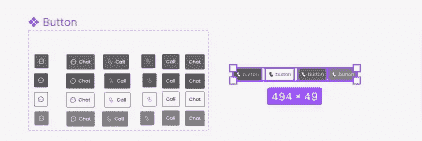

使用 Figma 上的一个新特性——组件属性，用可重用的组件创建一个更简洁的设计系统。创建设计系统时，产品设计师通常会创建一个组件的多个变体，如上图所示。以前，由于无法编辑变体中的属性，会创建特定组件的过多变体。现在，Figma 借用了前端开发的一些实践，向可以轻松编辑的组件添加属性，减少了设计系统中组件变体的数量。

通过几个步骤就可以创建一个可重用的组件，所以让我们来创建一个。我们正在创建一个按钮组件，一个具有图标和文本属性的按钮。但是，在我们开始之前，我假设您了解 Figma 的基础知识。

**第一步:选择图标并将其转换成多个组件**

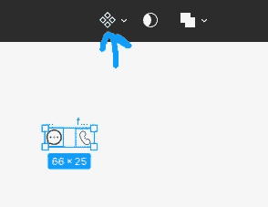

单击工具栏中的组件图标，如上图所示。在下拉列表中，选择创建多个组件。

**第二步:将其中一个图标和文本添加到一个 120 像素乘 60 像素的框架中(框架的大小由你选择)来创建一个按钮。**

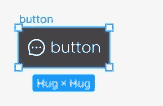

通过将先前创建的图标组件之一与文本一起添加到框架中来创建按钮。然后，按 shift +A 添加自动布局，以增加按钮的响应性。您可以根据自己的喜好进一步设计按钮的样式。我将添加一个按钮的边界半径，使其具有弯曲的边缘，并将框架的颜色改为#444245，其内容改为白色。

**第三步:选中按钮，按 Ctrl+Alt+A 或者点击工具栏中的组件，将按钮转换为组件**

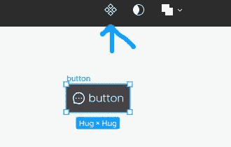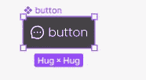

**第 4 步:选择按钮组件中的图标，并单击右侧工具条组件部分中的实例交换图标，创建一个属性**。

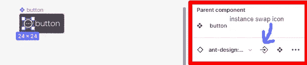

将弹出一个创建组件属性模式。在此弹出窗口中，将组件属性的名称编辑为您选择的名称。出于本文的目的，我将它命名为图标。

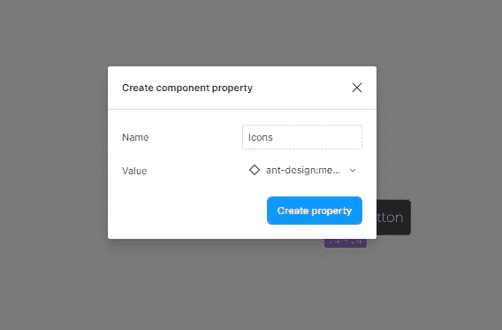

已经选择了默认值，但是您可以在下拉列表中更改它。然后，在弹出的中点击 ***创建属性***。名为 Icons 的属性将出现在右侧边栏的组件部分。

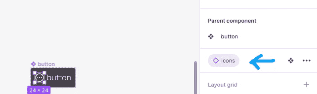

**步骤 5:选择按钮组件中的文本，并点击右侧边栏内容部分中的创建文本属性图标，创建一个文本属性**

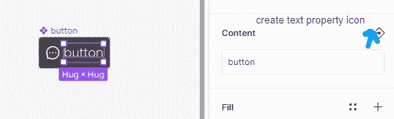

将弹出一个创建组件属性。根据您的喜好编辑名称，并将默认值更改为您选择的值。但是，在本文中，我将保持原样。

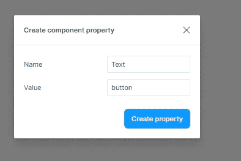

点击 ***创建属性*** 创建文本属性。Text 属性将显示在右侧边栏的内容部分。

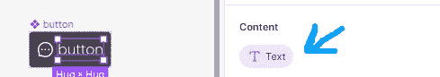

**步骤 6:点击按钮组件中的图标，并点击右侧边栏图层部分的创建布尔属性**

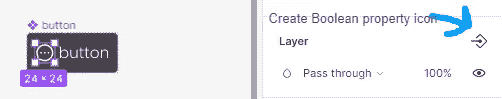

在创建组件属性弹出窗口中点击 C**T3【创建属性】按钮 T5**

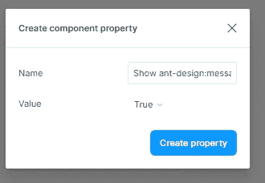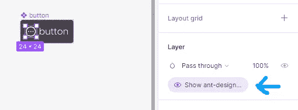

**步骤 7:对按钮组件中的文本重复相同的过程**

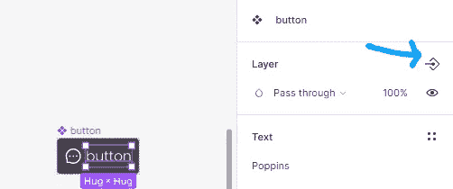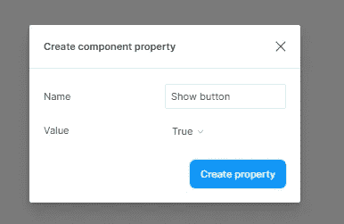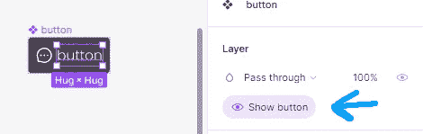

注意:点击右侧边栏图层部分的**创建组件属性**时，在显示的下拉菜单中选择**创建新属性**，如左图所示。

**步骤 8:复制按钮组件，创建按钮组件的实例。**

按 Ctrl+D 复制按钮组件，创建按钮组件的一个实例。选择实例，右边栏的组件部分将显示组件的可编辑属性。

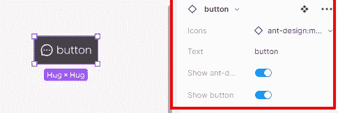

**结论**

不同于如下所示的组件的众多变体

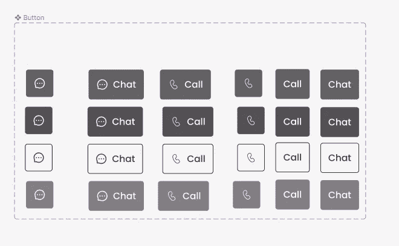

这创建了一个可能变得混乱和不可维护的设计系统，组件属性鼓励管理一个可维护的设计系统。有了组件属性，上述变量减少到只有 4 个。

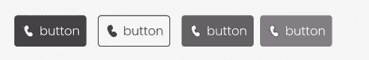

通过使用右侧边栏中的属性选项编辑内容来进行更改。

我希望这足够有帮助。请务必寻求反馈和可能的纠正。

快乐阅读和设计。

感谢阅读。