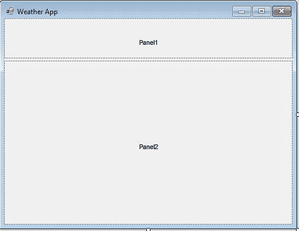

# 如何用 Bunifu 框架在 WinForms 中创建令人惊艳的 UI

> 原文：<https://blog.devgenius.io/how-to-create-stunning-ui-in-winforms-with-bunifu-framework-7375cf04076e?source=collection_archive---------3----------------------->

## 使用 Bunifu 库轻松创建高度可定制的用户界面

由 [Pakata Goh](https://unsplash.com/@pakata?utm_source=medium&utm_medium=referral) 在 [Unsplash](https://unsplash.com?utm_source=medium&utm_medium=referral) 上拍摄的照片

我主要是一个后端开发人员，我不喜欢在前端和界面上花费时间。我也没有很多设计和 UI 方面的技能，所以我通常将这部分工作委托给其他图形设计师或前端开发人员。但是在我的职业生涯中，当我必须使用 WinForms 为我的客户创建一个 Windows 应用程序时，我需要找到一个快速的解决方案。

我发现了为 WinForms 设计的不同框架，让开发人员只需点击几下鼠标就能轻松创建 UI 界面，我测试了所有这些框架。

今天我将谈论 [Bunifu 框架](https://bunifuframework.com/)，我们将一起创建一个基本的天气应用程序来测试这个强大的库的一些控件。

# 入门指南

首先我们在这里 下载 Bunifu 框架 [**试用版或者在这里**](https://bunifuframework.com/free-download/) 购买 UI WinForms 版本[。出于教育目的，学生和教师可以从具有巨大折扣价的学生计划中受益。](https://bunifuframework.com/pricing)

然后创建一个新的 WinForms 项目，我将其命名为“WeatherApp”。

打开 NuGet 包管理器，安装 **Bunifu。UI.WinForms** 包。

现在，在您的工具箱中，创建一个新的选项卡，我将其命名为“Bunifu UI”。

选择“选择项目”，然后选择“浏览”。

转到您的项目目录并选择所有的 **Bunifu。你在那里找到的 WinForms** *dll* 。

现在，您应该可以在新选项卡下看到所有可用的控件。

在本教程中，我们将只使用几个控件，但是我们可以在[官方文档](https://docs2.bunifuframework.com/docs/ui/controls)中找到关于所有控件的许多细节。

# UI 实现

拖放一个 *SplitContainer* 控件，将过滤器部分与主应用程序部分分开。然后将属性 *IsSplitterFixed* 设置为 true，这样用户就不能改变两个面板的大小。

给每个面板添加一个 *BunifuShadowPanel* 并将属性 *Dock* 设置为 Fill。我还把第二个面板的*阴影样式*改成了 Dropped，让它看起来更有型。

在顶部面板中，添加一个包含*文本框*和*按钮*的*分组框*。

然后添加一个 *BunifuTextBox* 并随意更改*占位符*属性。

最后，添加 *BunifuButton* ，将 *Text* 属性改为“Find ”,并将 *IdleBorderRadius* 改为 25，使边框变圆。

现在添加一些当前的天气信息。例如，我将选定的位置、风速、湿度百分比、压力和当前温度放在一个 *BunifuLabel* 上。我还使用了一个 *BunifuPictureBox* 来显示当前天气状况的简单图标。

最后，在接下来的 5 天里做同样的事情。当然，这将只是一个简短的预报，所以我只显示预测的日期，图标和温度。我在这里使用了以前使用的相同的 Bunifu 控件。

然后，我们需要将按钮链接到代码事件，进行两次 API 调用，并将返回的数据设置到应用程序接口。下面你可以找到一个简单的例子:

# API 实现

因为我们想创建一个天气应用程序，所以我们首先需要一个公共 API 来提供这种数据。

我过去已经使用过[天气预报](https://www.metaweather.com/api/)，我推荐它，因为它是免费的，甚至不需要登录/令牌授权。这使得这项服务非常适合像这样的小项目。

要制作我们的应用程序，我们只需要两个 API 调用:

*   [特定位置的 woeid](https://www.metaweather.com/api/#locationsearch)
*   [该地点的天气数据](https://www.metaweather.com/api/#location)

现在我们必须为 API 响应对象创建两个新的类。您可以手动创建这两个类，或者使用在线工具，如 [QuickType](https://app.quicktype.io/) 。在第二种情况下，该工具还将创建一些方法来简化序列化和反序列化。

下面您可以找到两个 API 响应的两个类:

创建一个新的“API”文件夹和一个名为 Weather 的新类，它将包含我们对 MetaWeather 服务的两个调用和另一个获取图像的方法。

# 进一步的改进

现在我们有了一个显示当前天气和未来 5 天预报的应用程序。如果我们还想看到最低和最高温度的图表呢？

打开 NuGet 包管理器，安装 **Bunifu。Dataviz.WinForms** 包。这是一个包含[基本](https://docs2.bunifuframework.com/docs/dataviz/basic-charts)和[高级](https://docs2.bunifuframework.com/docs/dataviz/advanced-charts)类型的库，它将帮助我们轻松地创建图形。

让我们创建一个拆分容器，以便将左侧菜单从主部分中分离出来，并在菜单上添加两个 *BunifuTileButton* 。

在现有面板下添加一个名为“ *graphPanel* 的新面板，只需将*bunifudatavizaadvanced*控件拖放到其中即可。

返回到 *MainForm.cs* 文件，用以下内容更新代码:

# 试验

我们准备启动应用程序，看看会发生什么。

# 最后的思考和未来的改进

正如你所看到的，现在的用户界面非常简单。我故意这样做是为了不使这个教程太长，但是多亏了 Bunifu 框架，你可以很快改进它！更多的例子，你可以在这里看到一些演示项目[。](https://bunifuframework.com/demos/)

这个库的优势就在于此。它允许每个人在几分钟内创建界面，没有任何麻烦，只需在应用程序设计文件上拖放控件，您就可以开始了。

请在评论区告诉我你对此的看法！

# 完整代码

你可以在 [GitHub](https://github.com/domeniconicoli/WeatherApp) 上找到完整代码。

## 这是我在 WinForms 上的第一个故事，如果你想要更多，请在评论区和私下告诉我！

## 感谢您的阅读。