# 如何从 Google Sheet 使用 Google Apps 脚本创建 Tweet 自动化

> 原文：<https://blog.devgenius.io/how-to-create-tweet-automation-with-google-apps-script-from-google-sheet-a25b2f09ab1b?source=collection_archive---------3----------------------->


Souvik Banerjee 在 [Unsplash](https://unsplash.com?utm_source=medium&utm_medium=referral) 上拍摄的照片

你在 twitter 上关注了一些很酷的创造者或开发者，他们有很多追随者。你希望跟随他们的道路，也成为一个创造者。你必须做的最重要的事情之一是不断为你的追随者和未来的追随者制作内容，让他们认为你的账户值得关注。

然后，你会发现一天到晚都发微博并不容易，可能有一天你会因为太忙或者懒得开账户。所以你会想，你关注的人是如何整天不停地发帖的？。

答案是自动化

他们中的大多数人通过转发旧的推文或准备模板来自动化他们的推文，推文将根据他们设置的时间自动创建。有很多 Twitter 自动化软件。我个人最初使用 [Zapier](https://zapier.com/) 来自动化我的每日推特，直到我的免费账户被停止。但是我相信您可以找到提供相同服务的其他工具

但是，嘿，你是程序员，你可以写代码做到这一点，对不对？

嗯，这正是我所做的，在这篇文章中，我将分享我如何使用 Google Apps 脚本和 Google Sheet 编写 tweet automation。我创建了模板 tweet 和 thread，脚本将根据我放在 Google Sheet 中的模板自动创建 tweet 或 thread

我们将一步一步地介绍如何做这件事。只要遵循这个教程，你就可以节省 100 多个小时的研究时间

# 创建 Twitter 开发者账户

第一步是创建 twitter 开发者账户。为了做到这一点，你需要去 https://developer.twitter.com 的 Twitter 开发者门户网站注册并访问 Twitter API。


填写所有信息注册后，您可以进入门户[仪表板](https://developer.twitter.com/en/portal/dashboard)开始创建新项目

# 创建新的 Twitter 项目

Twitter 根据项目和应用程序管理 API 访问。一般来说，项目允许你根据你打算如何使用 Twitter API 来组织你的工作，这样你就可以有效地管理你对 API 的访问并监控你的使用。根据您的访问级别，每个项目可以包含一个或多个应用程序

在本教程中，我们将创建一个名为 Automation 的新项目，步骤如下

1.  单击创建项目

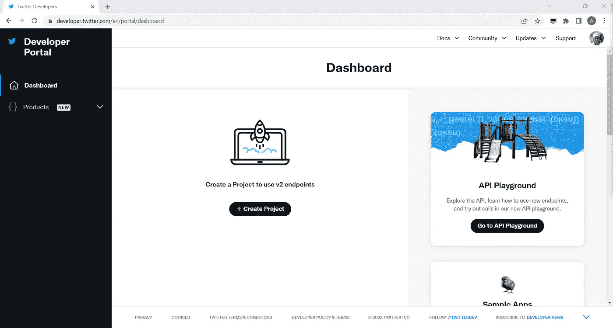

2.命名你的项目，任何名字都可以。单击下一步

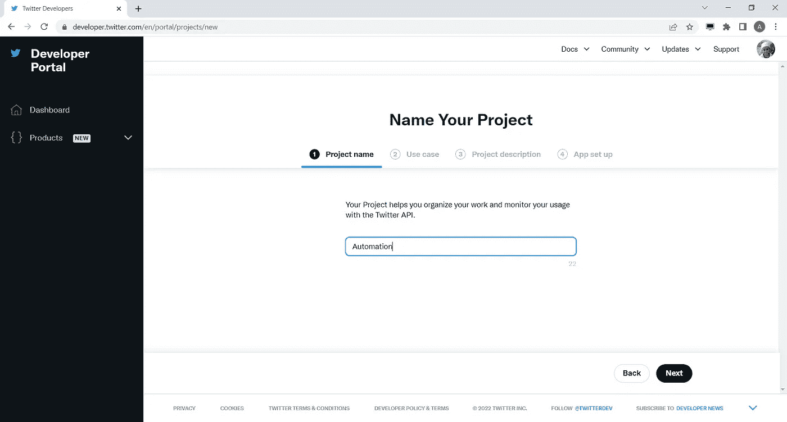

3.选择用例，任何用例都可以。单击下一步

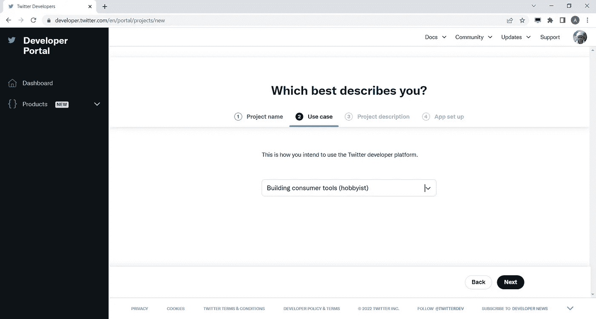

4.描述项目。单击下一步

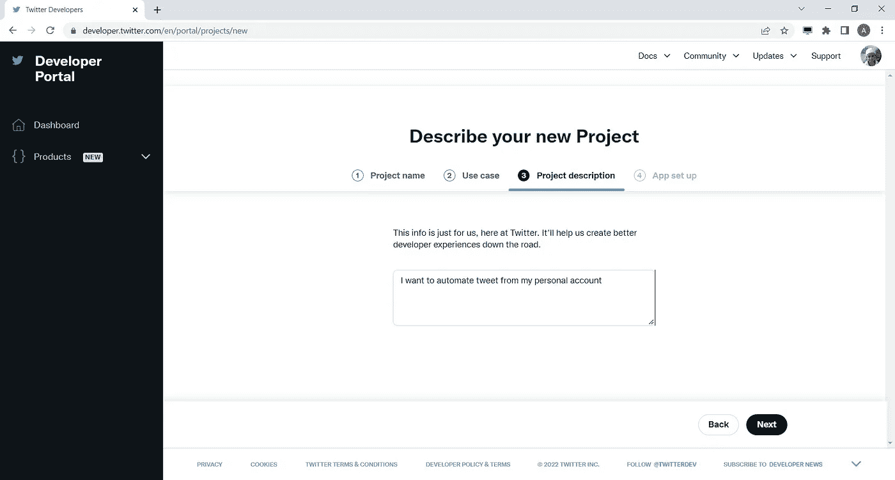

5.设置应用程序名称。单击下一步

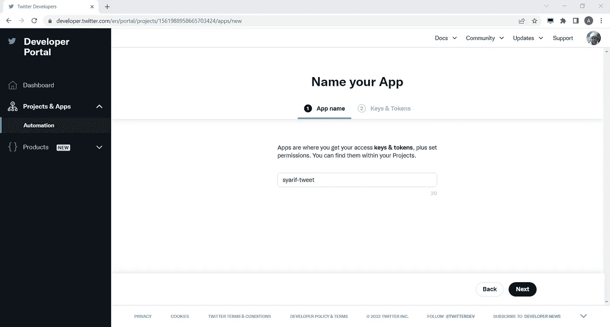

6.在密钥和令牌中，将 API 密钥和令牌复制到您的本地计算机。请注意，我们不会在此页面中使用密钥和令牌，因为它们是用于 OAuth1 的，我们稍后将为 OAuth2 生成新的密钥和令牌。

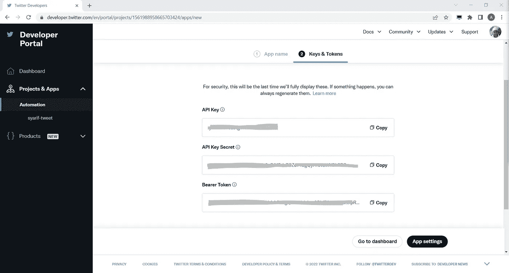

完成所有这些信息后，如果您单击应用程序设置，您将看到此页面

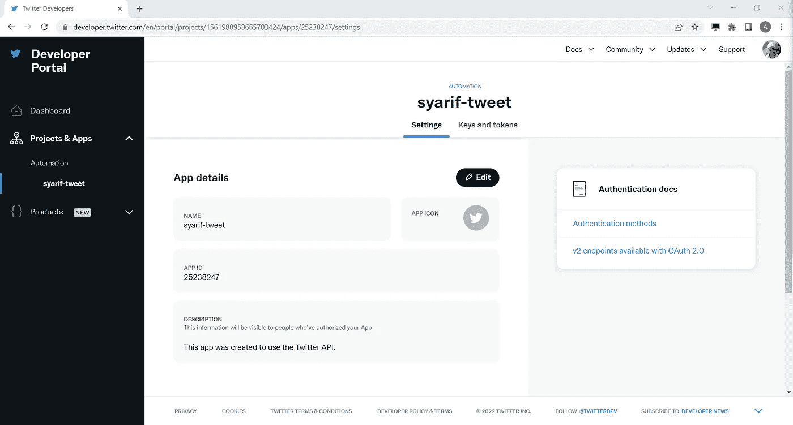

我们将在这里停止，但我们将在页面的后面再次回来。

# 创建一个 Google 表单

创建任何谷歌表。我们将在每一行中组织推文，对于每一行，我们可以有多个推文，稍后可以创建为 twitter 线程。参见下面的例子

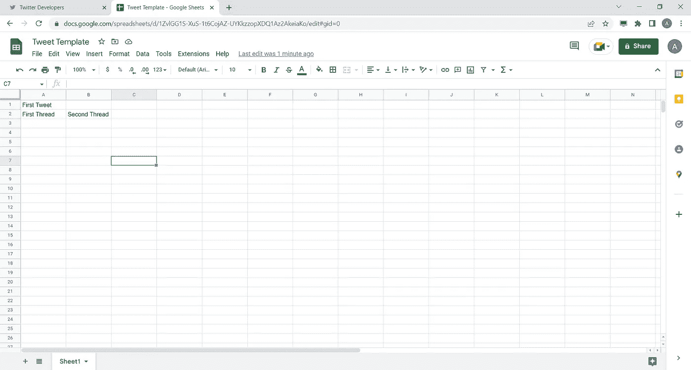

如您所见，在第一行中，我们只有一个 tweet 模板，即单元格 A1 中的“First Tweet”。该脚本稍后将从该模板中发出一条 tweet。第二行包含单元格 A2 和 B2 中的两条 tweets。这两个 tweet 模板将被创建为 Twitter 线程，用户可以点击“更多”按钮查看更多回复。这将有助于提高你的参与度。

这个想法是，脚本将在特定的时间内循环遍历每一行，并发送该行中的所有模板。例如，您希望每 8 小时创建一条推文，那么第一个小时它将推文第一行，接下来的 8 小时它将推文第二行。如果当前行不包含 tweet，那么脚本将简单地重置计数器并返回到第一行

有了这个，一旦脚本运行，你所要做的就是在谷歌表单中添加更多的模板，脚本会处理剩下的事情

# 创建 Google 企业应用套件脚本

在 google 工作表中，通过点击菜单**扩展→应用脚本**创建应用脚本。一个新的页面将显示如下

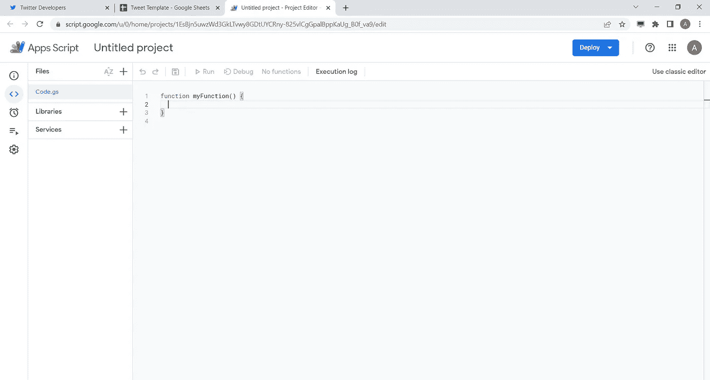

您可以用任何名称来命名项目。我暂时将我的命名为 **Twitter 自动化**。这是我们编写代码的地方。

每个 Google Apps 脚本都包含 id 作为脚本或项目的标识。下一步我们将需要我们的应用程序脚本的 ID，所以让我们现在就获取它。

在“应用程序脚本”页面中，转到项目设置(左侧的齿轮图标)。下面的一页将显示出来，你可以看到你的脚本像我一样的 ID。

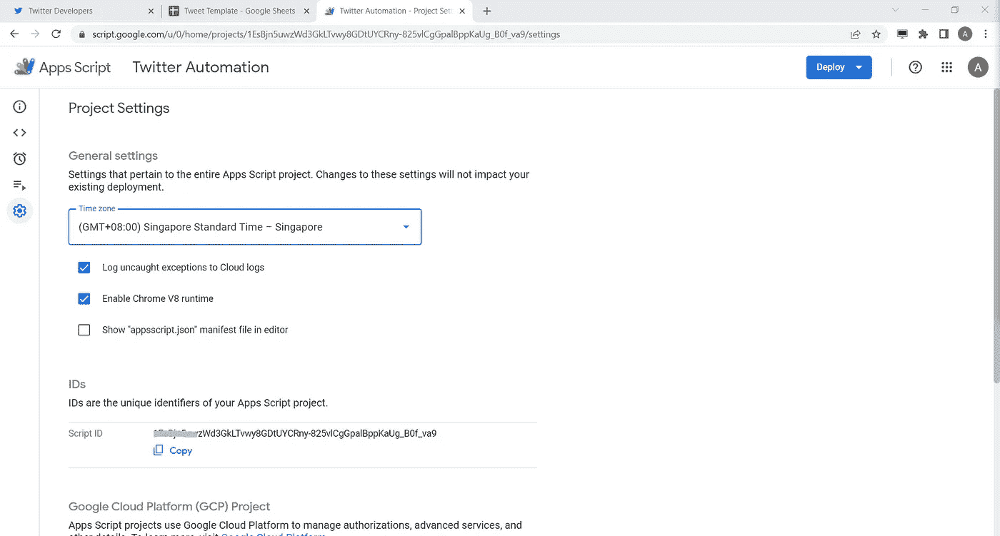

# 设置 Twitter OAuth2 流

我们几乎已经准备好编写代码了。但在此之前，我们需要在我们的 twitter 应用程序中设置 OAuth2。返回 Twitter 开发者门户，进入你的应用设置

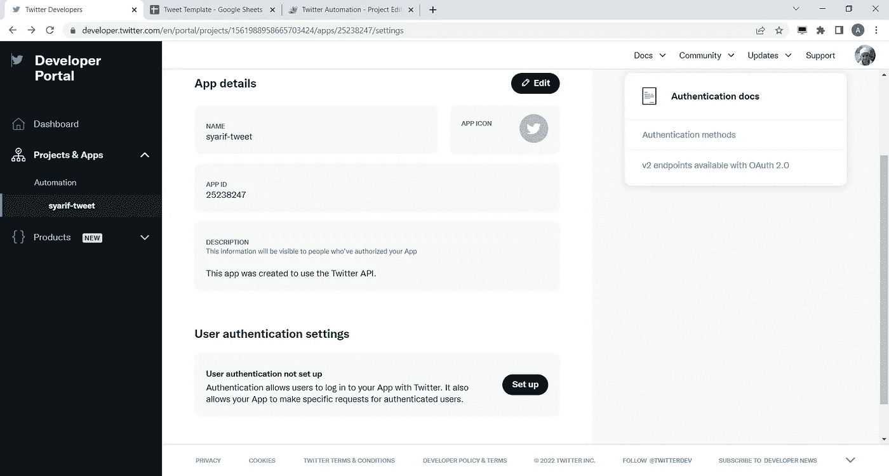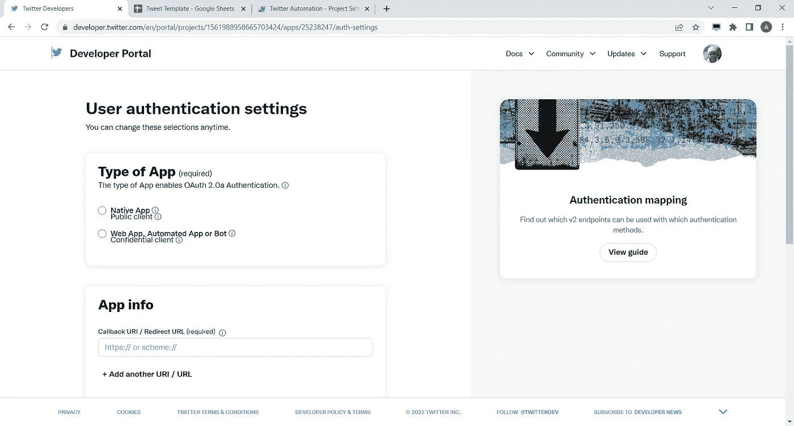

如果您向下滚动一点，您将看到用户身份验证设置部分。点击**设置**按钮，会出现一个页面，你需要在这里输入一些信息


我们需要在该页面中输入三个重要信息，

(1)第一种是**类型的 App** ，只需选择**原生 App** 或 **Web App、自动化 App 或 Bot** 。我们可以选择第二个，因为它更适合我们的脚本。

(2)第二个是**回调 URI** ，它是 twitter 帐户(将是我们自己的个人帐户)在权限授予过程后将被重定向的 URI。这是您在上一节中使用的 Google 企业应用套件脚本 ID。我们将要进入的 URI 在下面

[https://SCRIPT . Google . com/macros/d/YOUR _ SCRIPT _ ID/user callback](https://script.google.com/macros/s/YOUR_SCRIPT_ID/usercallback)。

您可以用脚本的 ID 替换 YOUR_SCRIPT_ID

(3)第三个是**网址**，只是 App 的任意一个网站。可以给你个人网址。

一旦您提交了这三个信息，您可以按下一步按钮，下面页面将显示给您，包含两个信息，客户端 ID 和客户端密码。这两个秘密信息是你的脚本所需要的，你可以安全地把它保存在你的应用程序脚本中。现在，只需将它们都复制到您的本地计算机中。

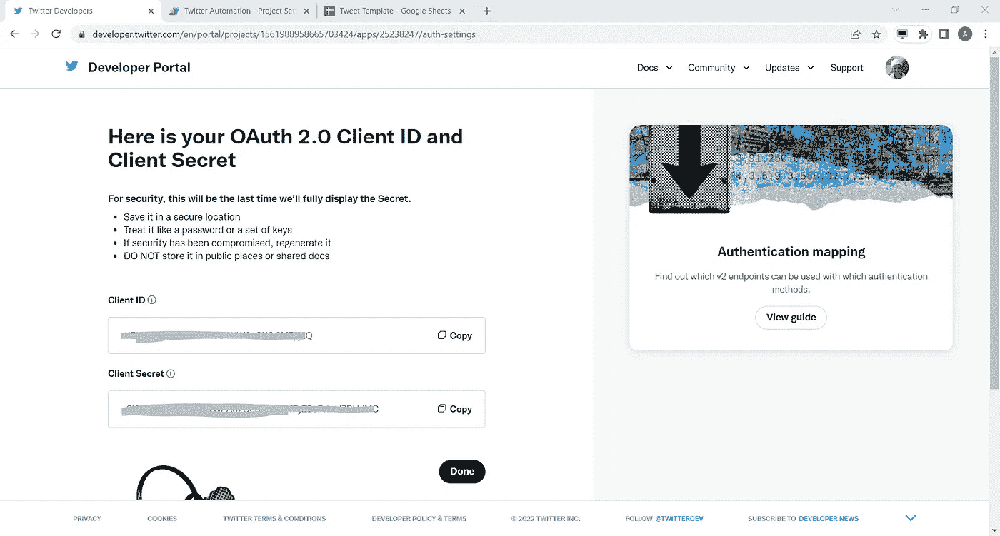

# 在应用程序脚本中安装 OAuth2 库

现在我们已经准备好编写代码，但在此之前，我们将在我们的应用程序脚本中安装一个 [OAuth2](https://github.com/googleworkspace/apps-script-oauth2) 库。第一次在应用程序脚本中安装库有点棘手。但是您需要获得库的脚本 ID。之后，在应用程序脚本编辑器中按下**库**按钮，粘贴库的 ID，按下**查找**并点击**添加**。对于 OAuth2 库，脚本 ID 是`1B7FSrk5Zi6L1rSxxTDgDEUsPzlukDsi4KGuTMorsTQHhGBzBkMun4iDF`

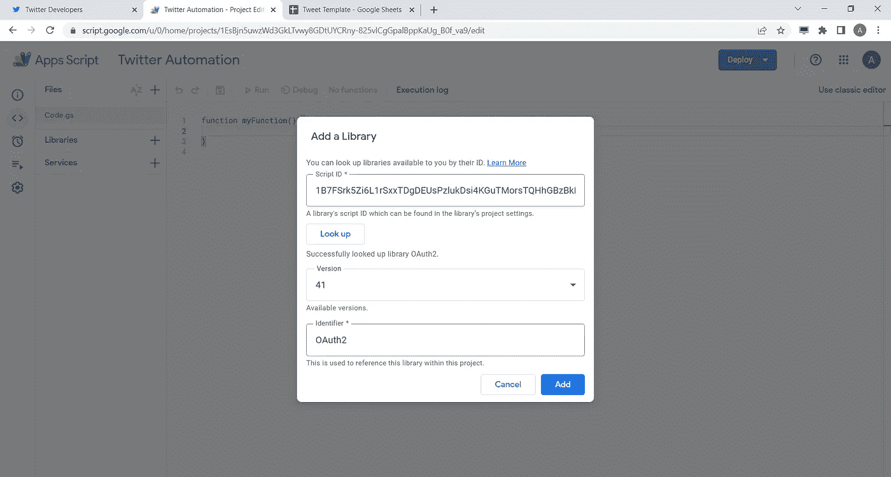

如果库添加成功，您将在库部分看到 OAuth2

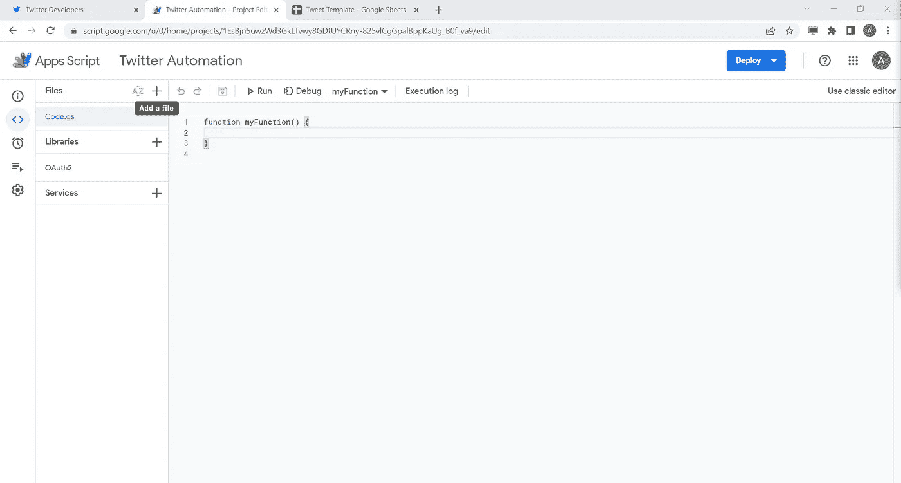

# 开始写代码

我们需要创建三个主要函数

1.  函数从工作表中获取 tweet 模板
2.  函数来创建 OAuth2 服务
3.  函数将推文发送到 Twitter 帐户

还需要添加其他必要的函数，我们将在下面的小节中详细介绍它们，以帮助您理解代码的每个部分

## 从 Google Sheet 获取 Tweet 模板

下面是从 google sheet 获取 tweet 模板的代码

```
/**
 * Fetch the tweet from the google sheet
 * [@param](http://twitter.com/param) row row of the sheet, start from 1
 * [@param](http://twitter.com/param) col column of the sheet, start from 1
 * [@return](http://twitter.com/return) text of the tweet
 */
function fetchTweet(row,col){
  const sheets = SpreadsheetApp.getActiveSpreadsheet().getSheets();
  const tweetSheet = sheets.find((sheet)=>sheet.getName() == 'Sheet1');
  return tweetSheet.getRange(row,col).getValue().toString();
}
```

## OAuth2 服务

下一部分是创建 OAuth 服务的代码。

```
/**
 * Create the OAuth2 Twitter Service
 * [@return](http://twitter.com/return) OAuth2 service
 */
function getService(){
  var userProps = PropertiesService.getUserProperties();
  pkceChallengeVerifier();
  return OAuth2.createService('twitter')
        .setAuthorizationBaseUrl('[https://twitter.com/i/oauth2/authorize'](https://twitter.com/i/oauth2/authorize'))
        .setTokenUrl('[https://api.twitter.com/2/oauth2/token?code_verifier='](https://api.twitter.com/2/oauth2/token?code_verifier=') + userProps.getProperty("code_verifier"))// Set the client ID and secret.
        .setClientId(CLIENT_ID)
        .setClientSecret(CLIENT_SECRET)
        .setCallbackFunction('authCallback')// Set the property store where authorized tokens should be persisted.
        .setPropertyStore(userProps)
        // Set the scopes to request (space-separated for Twitter services).
        .setScope('users.read tweet.read offline.access tweet.write')

        // Add parameters in the authorization url
        .setParam('response_type', 'code')
        .setParam('code_challenge_method', 'S256')
        .setParam('code_challenge', userProps.getProperty("code_challenge")).setTokenHeaders({
          'Authorization': 'Basic ' + Utilities.base64Encode(CLIENT_ID + ':' + CLIENT_SECRET),
          'Content-Type': 'application/x-www-form-urlencoded'
        })
}
```

`getService()`函数需要两个函数，它们是`pkceChallengerVerifier()`来为脚本访问 twitter 账户的许可生成挑战和验证，以及`authCallback()`作为当一个账户授权访问我们的脚本时从 twitter 的回调。`getService()`还需要两个常量`CLIENT_ID`和`CLIENT_SECRET`，这是我们从上一节的 Twitter 应用设置中获得的两个信息。

另一个重要部分是 OAuth2 的范围。[为了用 twitter 账户](https://developer.twitter.com/en/docs/twitter-api/tweets/manage-tweets/api-reference/post-tweets)发送 tweet，我们需要用`user.read tweet.read tweet.write`设置 OAuth2 的作用域。如果你注意到，我还添加了`offline.access`，这个范围是必需的，这样我们只需要做一次访问授权过程。

这里有`pkceChallengerVerifier()`的内容

```
/**
 * Generate PKCE Challenge Verifier for Permission for OAuth2 Twitter Service
 */
function pkceChallengeVerifier(){
  var userProps = PropertiesService.getUserProperties();
  if(!userProps.getProperty('code_verifier')){
    var verifier = "";
    var possible = "ABCDEFGHIJKLMNOPQRSTUVWXYZabcdefghijklmnopqrstuvwxyz0123456789-._~";
    for(var i =0;i<128 ;i++){
      verifier += possible.charAt(Math.floor(Math.random() * possible.length));
    }var sha256hash = Utilities.computeDigest(Utilities.DigestAlgorithm.SHA_256, verifier);var challenge = Utilities.base64Encode(sha256hash)
      .replace(/\+/g, '-')
      .replace(/\//g, '_')
      .replace(/=+$/, '')userProps.setProperty("code_verifier", verifier)
    userProps.setProperty("code_challenge", challenge)
  }
}
```

以下是`authCallback()`的内容

```
/**
 * Handles the OAuth callback.
 */
function authCallback(request) {
  var service = getService();
  var authorized = service.handleCallback(request);
  if (authorized) {
    return HtmlService.createHtmlOutput('Success!');
  } else {
    return HtmlService.createHtmlOutput('Denied');
  }
}
```

如果您想更改服务范围，附加功能`reset()`也很重要。在请求新的作用域之前，您需要重置服务

```
/**
 * Reset the OAuth2 Twitter Service
 */
function reset() {
  getService().reset();
PropertiesService.getUserProperties().deleteProperty("code_challenge");
PropertiesService.getUserProperties().deleteProperty("code_verifier");
}
```

## 将 tweet 模板发送到 twitter API

这里是`sendTweet`的功能

```
/**
 * Send the Tweet
 * [@Param](http://twitter.com/Param) tweet Text to tweet
 * [@Param](http://twitter.com/Param) replyTo id of the tweet to reply
 * [@return](http://twitter.com/return) the ID of the current Tweet
 */
function sendTweet(tweet,replyTo){
  var payload = {
    text:tweet
  }if(replyTo){
    payload['reply'] = {
      in_reply_to_tweet_id:replyTo
    }
  }
  var service = getService();
   if (service.hasAccess()) {
    var url = `[https://api.twitter.com/2/tweets`](https://api.twitter.com/2/tweets`);
    var response = UrlFetchApp.fetch(url, {
      method:'POST',
      'contentType': 'application/json',
      headers: {
        Authorization: 'Bearer ' + service.getAccessToken()
      },
      muteHttpExceptions: true,
      payload: JSON.stringify(payload)
    });
    var result = JSON.parse(response.getContentText());
    return result.data.id;
  } else {
    var authorizationUrl = service.getAuthorizationUrl();
    Logger.log('Open the following URL and re-run the script: %s',
      authorizationUrl);
  }
}
```

该函数将向 [Twitter API 库](https://developer.twitter.com/en/docs/twitter-api/tweets/manage-tweets/api-reference/post-tweets)发送 HTTP POST 请求，以便将 tweet 发布到 Twitter 帐户。它将首先检查服务是否有访问权，如果没有访问权，它将打印授权 URL。

## 主要功能

准备好所有主要功能后，我们可以创建管理自动化逻辑的主要功能。这个想法是有一个全局计数器，每次脚本发布 tweet 时都会遍历 row，并在下一轮增加计数器。下面是主要功能

```
/**
 * Entry point to send the tweet
 */
function dailyTweet(){
  //get the counter, which is to be row
  var counter = PropertiesService.getUserProperties().getProperty('counter')
  if(!counter) {
    counter = 1
  }
  else{
    //parse to Integer because it's stored as string
    counter = parseInt(counter)
  }var row = counter;
  var col = 1;//get the first tweet
  var tweet = fetchTweet(row,col);
  var replyTo = undefined
  //loop while tweet is available, it could be thread
  while(tweet != ""){
    replyTo = sendTweet(tweet,replyTo);
    Logger.log(`tweet '${tweet} has been send with ID ${replyTo}'`);
    tweet = fetchTweet(row,++col);
  }if(!replyTo && tweet == ""){
    //meaning no tweet, reset the counter
    counter = 0;
    Logger.log("No tweet, counter is reset");
  }
  //increament the counter and save it
  counter ++;
  PropertiesService.getUserProperties().setProperty('counter',counter);

}
```

## 完整的代码

```
const CLIENT_ID = ''
const CLIENT_SECRET = ''/**
 * Create the OAuth2 Twitter Service
 * [@return](http://twitter.com/return) OAuth2 service
 */
function getService(){
  var userProps = PropertiesService.getUserProperties();
  pkceChallengeVerifier();
  return OAuth2.createService('twitter')
        .setAuthorizationBaseUrl('[https://twitter.com/i/oauth2/authorize'](https://twitter.com/i/oauth2/authorize'))
        .setTokenUrl('[https://api.twitter.com/2/oauth2/token?code_verifier='](https://api.twitter.com/2/oauth2/token?code_verifier=') + userProps.getProperty("code_verifier"))// Set the client ID and secret.
        .setClientId(CLIENT_ID)
        .setClientSecret(CLIENT_SECRET)
        .setCallbackFunction('authCallback')// Set the property store where authorized tokens should be persisted.
        .setPropertyStore(userProps)
        // Set the scopes to request (space-separated for Twitter services).
        .setScope('users.read tweet.read offline.access tweet.write')

        // Add parameters in the authorization url
        .setParam('response_type', 'code')
        .setParam('code_challenge_method', 'S256')
        .setParam('code_challenge', userProps.getProperty("code_challenge")).setTokenHeaders({
          'Authorization': 'Basic ' + Utilities.base64Encode(CLIENT_ID + ':' + CLIENT_SECRET),
          'Content-Type': 'application/x-www-form-urlencoded'
        })
}
/**
 * Reset the OAuth2 Twitter Service
 */
function reset() {
  getService().reset();
  PropertiesService.getUserProperties().deleteProperty("code_challenge");
  PropertiesService.getUserProperties().deleteProperty("code_verifier");
}/**
 * Generate PKCE Challenge Verifier for Permission for OAuth2 Twitter Service
 */
function pkceChallengeVerifier(){
  var userProps = PropertiesService.getUserProperties();
  if(!userProps.getProperty('code_verifier')){
    var verifier = "";
    var possible = "ABCDEFGHIJKLMNOPQRSTUVWXYZabcdefghijklmnopqrstuvwxyz0123456789-._~";
    for(var i =0;i<128 ;i++){
      verifier += possible.charAt(Math.floor(Math.random() * possible.length));
    }var sha256hash = Utilities.computeDigest(Utilities.DigestAlgorithm.SHA_256, verifier);var challenge = Utilities.base64Encode(sha256hash)
      .replace(/\+/g, '-')
      .replace(/\//g, '_')
      .replace(/=+$/, '')userProps.setProperty("code_verifier", verifier)
    userProps.setProperty("code_challenge", challenge)
  }
}
/**
 * Handles the OAuth callback.
 */
function authCallback(request) {
  var service = getService();
  var authorized = service.handleCallback(request);
  if (authorized) {
    return HtmlService.createHtmlOutput('Success!');
  } else {
    return HtmlService.createHtmlOutput('Denied');
  }
}/**
 * Send the Tweet
 * [@Param](http://twitter.com/Param) tweet Text to tweet
 * [@Param](http://twitter.com/Param) replyTo id of the tweet to reply
 * [@return](http://twitter.com/return) the ID of the current Tweet
 */
function sendTweet(tweet,replyTo){
  var payload = {
    text:tweet
  }if(replyTo){
    payload['reply'] = {
      in_reply_to_tweet_id:replyTo
    }
  }var service = getService();
   if (service.hasAccess()) {
    // [https://developer.twitter.com/en/docs/twitter-api/users/lookup/api-reference/get-users-by-username-username](https://developer.twitter.com/en/docs/twitter-api/users/lookup/api-reference/get-users-by-username-username)
    var url = `[https://api.twitter.com/2/tweets`](https://api.twitter.com/2/tweets`);
    var response = UrlFetchApp.fetch(url, {
      method:'POST',
      'contentType': 'application/json',
      headers: {
        Authorization: 'Bearer ' + service.getAccessToken()
      },
      muteHttpExceptions: true,
      payload: JSON.stringify(payload)
    });
    var result = JSON.parse(response.getContentText());
    return result.data.id;
  } else {
    var authorizationUrl = service.getAuthorizationUrl();
    Logger.log('Open the following URL and re-run the script: %s',
      authorizationUrl);
  }
}/**
 * Entry point to send the tweet
 */
function dailyTweet(){
  //get the counter, which is to be row
  var counter = PropertiesService.getUserProperties().getProperty('counter')
  if(!counter) {
    counter = 1
  }
  else{
    //parse to Integer because it's stored as string
    counter = parseInt(counter)
  }var row = counter;
  var col = 1;//get the first tweet
  var tweet = fetchTweet(row,col);
  var replyTo = undefined
  //loop while tweet is available, it could be thread
  while(tweet != ""){
    replyTo = sendTweet(tweet,replyTo);
    Logger.log(`tweet '${tweet} has been send with ID ${replyTo}'`);
    tweet = fetchTweet(row,++col);
  }if(!replyTo && tweet == ""){
    //meaning no tweet, reset the counter
    counter = 0;
    Logger.log("No tweet, counter is reset");
  }
  //increament the counter and save it
  counter ++;
  PropertiesService.getUserProperties().setProperty('counter',counter);

}/**
 * Fetch the tweet from the google sheet
 * [@param](http://twitter.com/param) row row of the sheet, start from 1
 * [@param](http://twitter.com/param) col column of the sheet, start from 1
 * [@return](http://twitter.com/return) text of the tweet
 */
function fetchTweet(row,col){
  const sheets = SpreadsheetApp.getActiveSpreadsheet().getSheets();
  const tweetSheet = sheets.find((sheet)=>sheet.getName() == 'tweet');
  return tweetSheet.getRange(row,col).getValue().toString();
}
```

# 测试脚本

重要的是要确保我们的脚本是真的工作。一旦你写完了所有的代码，你就可以保存这个项目了。通过保存项目，在编辑器的工具栏中有一个功能列表，以及**运行**按钮。尝试运行`dailyTweet()`,看看推文是否真的在你的账户中发布

从脚本到您的 google 帐户可能会有几个访问请求来访问 google sheet，您只需授予权限，这样您的脚本就可以完美运行

# 创建触发器

一旦我们验证了`dailyTweet()`正在工作，现在是时候决定什么时候触发这个功能了。我们可以使用 Apps 脚本的触发特性。到左侧点击**触发**菜单

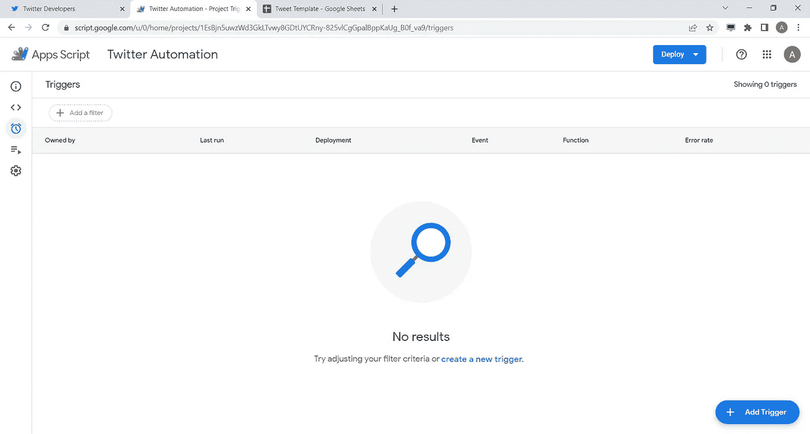

点击左下方的**添加触发器**，会弹出对话框选择如何触发`dailyTweet`功能。你应该在选择事件源中选择时间驱动，剩下的就看你自己决定了。

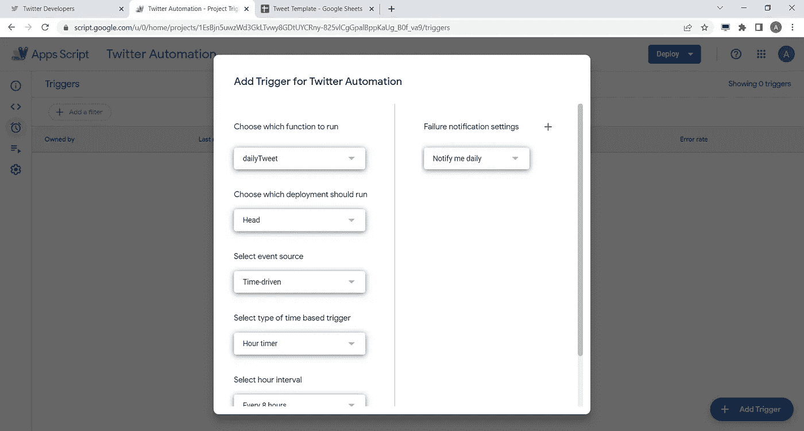

# 结论

制作自动化的推特脚本是提升你的推特账户的一种方式。既然您已经运行了脚本，那么您可以随时向 Google Sheet 添加任何模板，并让脚本完成剩下的工作。

如果你有任何问题，或者你认为这篇文章还有更多需要补充的，请在评论区告诉我

别忘了在 twitter @asyarif 上关注我