# 如何使用 Azure 自定义视觉创建您的第一个人工智能模型

> 原文：<https://blog.devgenius.io/how-to-create-your-first-ai-model-using-azure-custom-vision-b052aa52a935?source=collection_archive---------12----------------------->

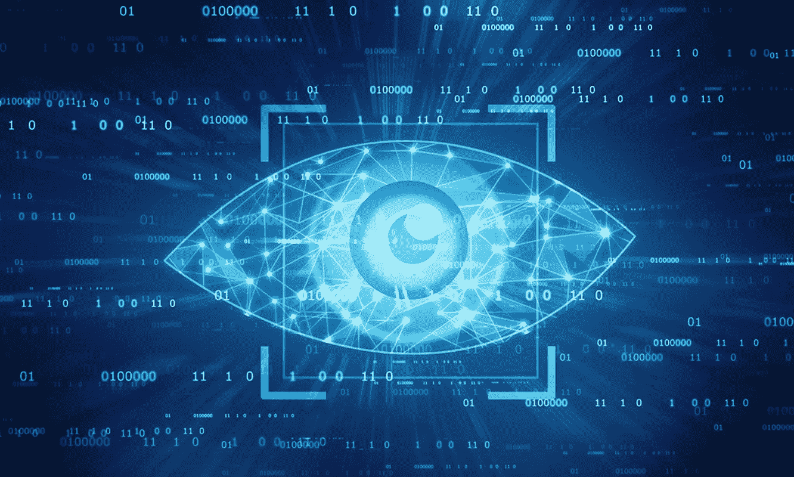

定制视觉

Azure 自定义视觉服务使您能够为图像分析构建自定义模型。

Azure 自定义视觉服务支持高级自定义图像分类器，帮助您构建和集成图像标识符模型。标识符根据图像的视觉特征给图像添加标签。与 [**Azure 计算机视觉**](https://www.google.com/url?sa=t&source=web&rct=j&url=https://azure.microsoft.com/en-us/services/cognitive-services/computer-vision/%3Fcdn%3Ddisable&ved=2ahUKEwi-7Ojmh6_1AhWbQvEDHZLwA0cQFnoECC8QAQ&usg=AOvVaw1-1WzPlCbQOwgmxRfmhmjs) 相比，这项服务可以让你指定自己的独特标签，并利用定制模型来识别它们。在本帖中，我们将使用自定义视觉来构建和部署一个新的人工智能模型。

# 为什么要投资 Azure Custom Vision？

Azure custom vision 使用最先进的机器学习算法来检测图像，并根据图像的视觉特征提供全面的分析。程序开发人员可以提交带有自己标签的图像，供算法分析。该算法对提交的图像进行训练，并学习建立有助于识别特征的准确性。

一旦算法经过训练，程序开发人员就可以测试甚至重新训练该算法，以创建高度精确的图像识别应用程序。如果您试图构建一个图像识别应用程序。，Custom vision 可以帮助您以比市场上任何其他技术驱动的服务更有效的方式实现您的目标。下面我们来看看这项服务提供了什么。

# Azure 自定义视觉用例

Azure Custom Vision 提供:

**1。高级定制**

定制模型非常灵活，使开发人员能够构建独特的场景来测试图像识别应用程序。该平台有一个易于遵循的演练来帮助您开始。

**2。轻松的模型构建和部署**

该服务使您能够拥有完整的创造性控制，同时构建一个具有简单易用界面的图像标识符模型。您可以在边缘或云中运行您的定制愿景。您可以根据您的需求和用例场景，灵活地在您喜欢的任何地方运行您独特的模型。您可以将训练好的定制模型导出到容器和设备中，以降低延迟。

**3。通过内置安全性实现精确的准确性**

Azure 为您的专有数据和训练模型提供企业级安全性和高级隐私保护。高级安全性帮助您训练模型，而不用担心黑客或数据丢失。

# 您的第一个具有 Azure 自定义视觉的人工智能模型

在自定义视觉中训练你的独特模型主要有两种方式，即物体检测和图像分类。

图像分类将整个图像作为一个整体进行分析，并且每帧识别一个对象，而无需在图像周围绘制任何边界框。相比其他的更容易训练。

对象检测可以识别每幅图像中的多个对象，并在图像周围绘制边界框。这需要更多的时间来训练，但提供了更多的灵活性。

要开始使用人工智能模型，请参见下面的步骤。到本教程结束时，你应该能够为任何视觉构建一个具有 Azure 自定义视觉的 AI 模型。本教程展示了如何使用模块 Twin update 和 Edge 将 AI 模块部署到 Vision AI DevKit 摄像机。

**步骤 1:执行以下先决步骤:**

-创建你的免费 [**天蓝账户**](https://azure.microsoft.com/en-ca/free/)

-在 Vision AI 开发套件中，运行默认的 aivisionedevkitgetstartedmodule

-在 [**customvision.ai**](https://www.customvision.ai/) 中创建自定义视觉和预测资源

**第二步:登录你的 Azure 自定义视觉平台(https://www . Custom Vision . ai)**

接下来，创建一个新资源。找到并单击“创建新资源”。

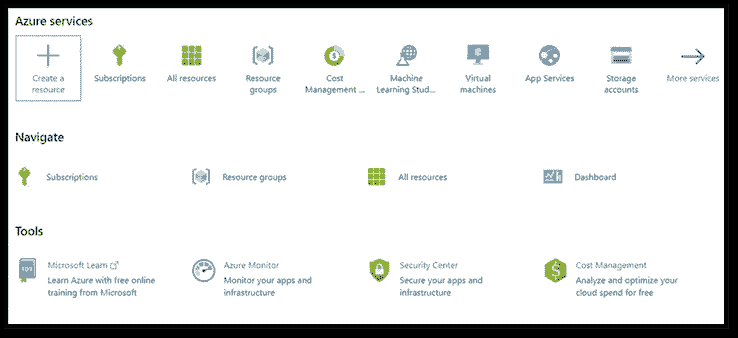

Azure 门户

现在确保以下细节:

-为您的项目命名。

-选择项目类型(检测或分类)

-选择现有的资源组

-选择分类类型(多类)

见下面截图。根据您独特的项目需求填写详细信息。

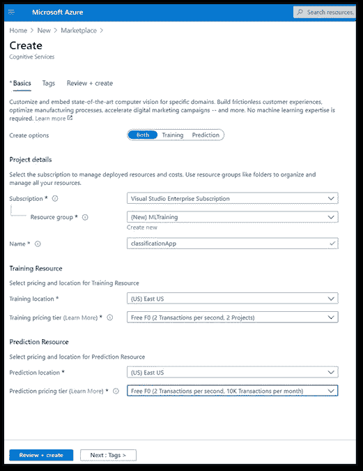

Azure 门户

**第三步:新建项目，上传培训数据**

你可以批量上传图片。在分类模型的情况下，确保每个图像使用一个标签，并在上传期间添加适当的标签。在检测模型的情况下，单独标记图片。可以同时上传到 customvision.ai。

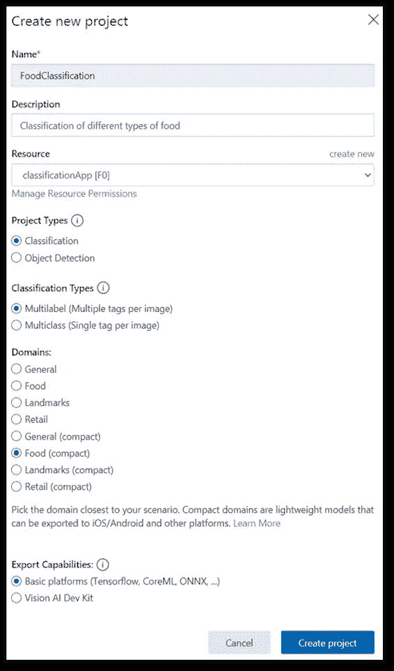

Azure 门户

以下截图显示了如何将图像上传到项目中。

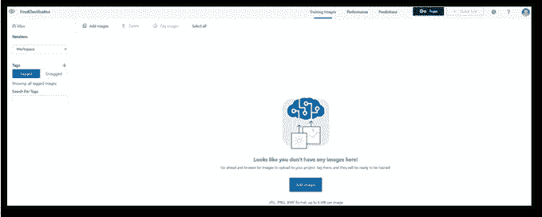

Azure 门户

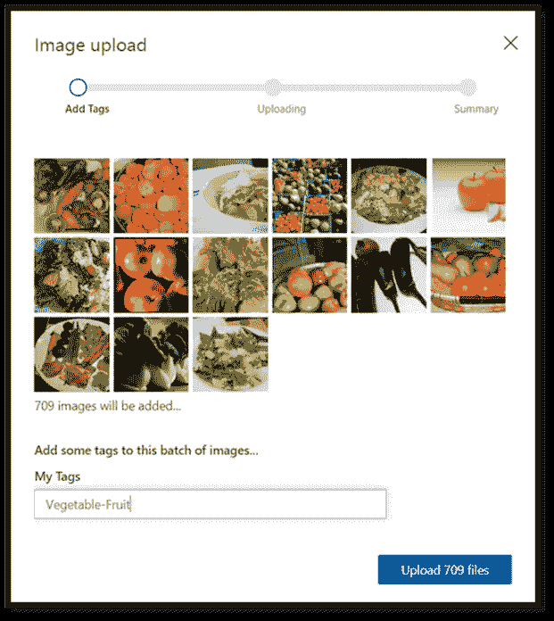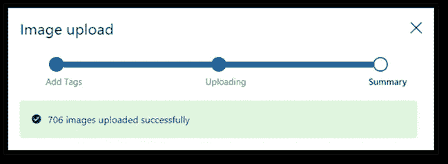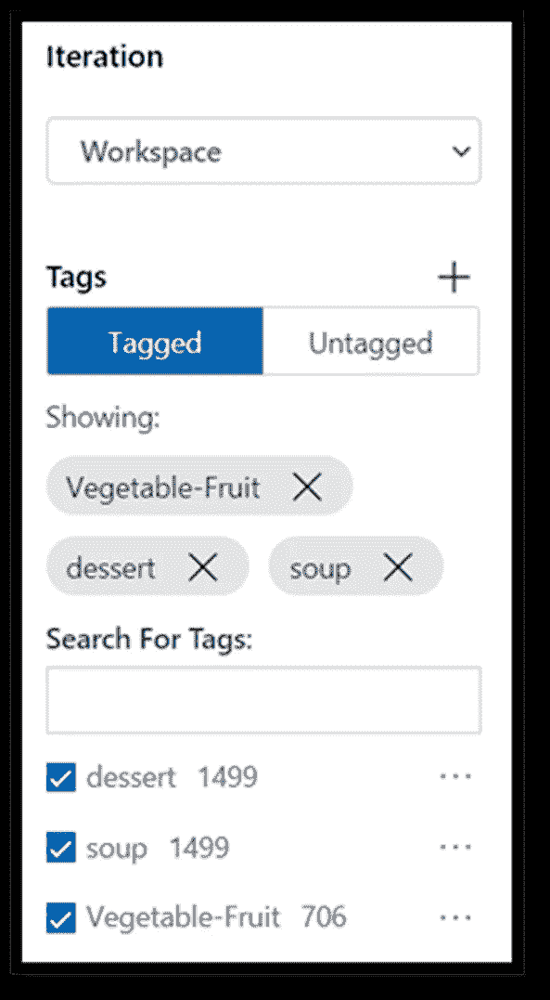

*注意:在这里，您将在分类或对象检测之间进行选择。*

**第四步:训练和测试你的定制模型**

在您的自定义 Vision 项目中找到“培训”并选择培训类型。请看下面的截图。

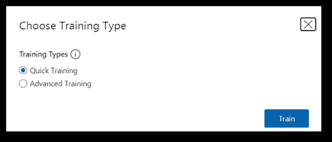

快速培训只需几分钟时间，并带您进入评估窗口，在那里您可以根据精确度、召回率和 AP 评估结果。

精度表示正确识别的分类的百分比。

召回表示实际正确识别的分类的百分比。

AP 表示额外的性能。

见下面截图。

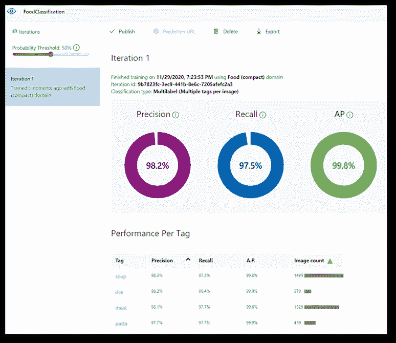

要测试该模型，请单击菜单右上角的“快速培训”，如下图所示。

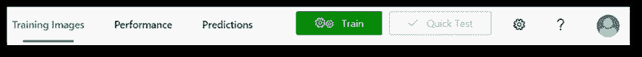

然后选择一个图像进行测试。您可以浏览本地文件或添加 URL。

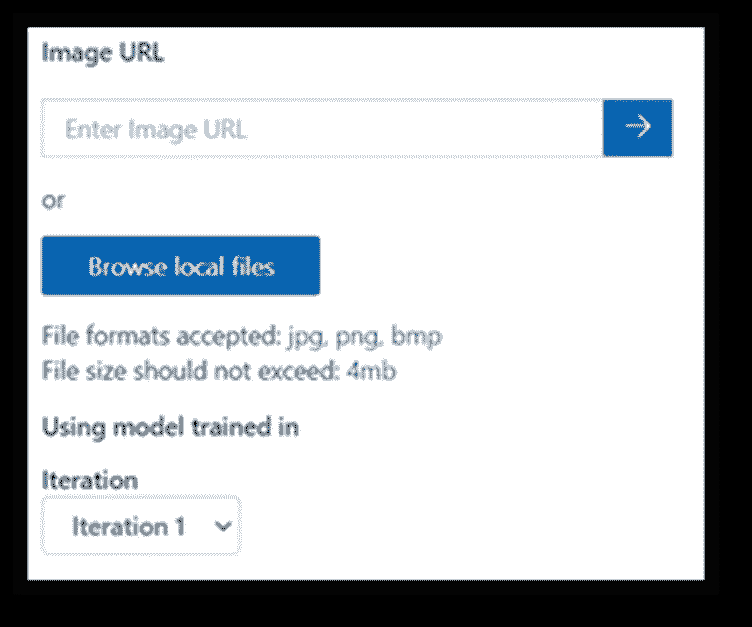

测试结果看起来像这样:

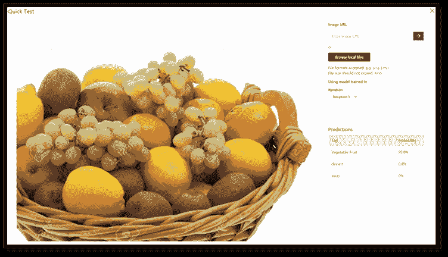

**第五步:下载/导出您的定制模型**

要下载或导出，请转到您的自定义视觉项目，然后单击“训练”>“表演”>“导出”。

在下载项目之前，了解您的部署选项很重要。您可以直接从 customvision.ai 上的自定义 Vision 页面使用自定义模型，也可以将模型存储在您自己的存储中。

要从自定义 Vision 站点直接使用它:

在您的自定义视觉页面上，右键单击并选择“复制链接”。该链接将指向您的定制模型的 zip 文件。链接过期，所以不要依赖这种方法进行长期存储。这种部署方法在快速迭代期间非常有用。

要将模型存储在您自己的存储器上:

下载模型，但不要解压缩文件。您可以将 zip 文件存储在 OneDrive 上。在这里，我们将向您展示如何创建一个新的存储帐户来保存该文件。

-登录 Azure 门户网站

-找到“存储”并选择“存储帐户”

-使用现有的 Azure 帐户和资源组创建新的存储帐户。请确保给它一个唯一的名称。

-选择“美国西部 2”地区(或您选择的任何地区)

-点击“查看+创建”

-等待该过程完成，然后输入您的新存储帐户。

-在客户中，转到“概述”,然后转到“Blobs”

-单击“添加新容器”并将其选择为公共访问级别。

-单击新容器，然后单击“上传”并上传您从自定义 Vision 页面下载的文件。为下一步复制 URL。

接下来，您需要配置 VisionSample 模块以使用您的自定义模型。对于以下步骤:

-登录 Azure 门户网站

-点击“IOT 边缘标签”，然后点击“视觉套件”

-单击“AIVisionDevKitGetStartedModule ”,然后单击“模块标识 Twin”

*   将您之前保存的 URL 添加到“ModelZipUrl”并点击“保存”。

**结论**

现在，您应该能够在您的设备上测试您的新型号了。请注意，本指南仅讨论基本步骤。你需要给你的图像分配适当的标签来帮助算法。例如，如果您试图测试面罩，请确保在标签中添加“面罩”。您可能需要执行多次迭代来训练算法，在某些情况下，需要重新训练才能获得准确的结果。