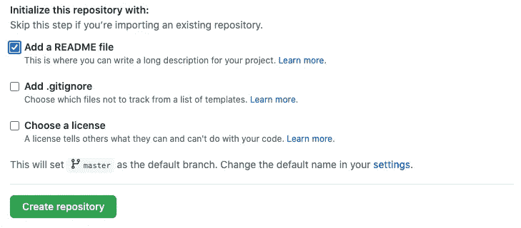
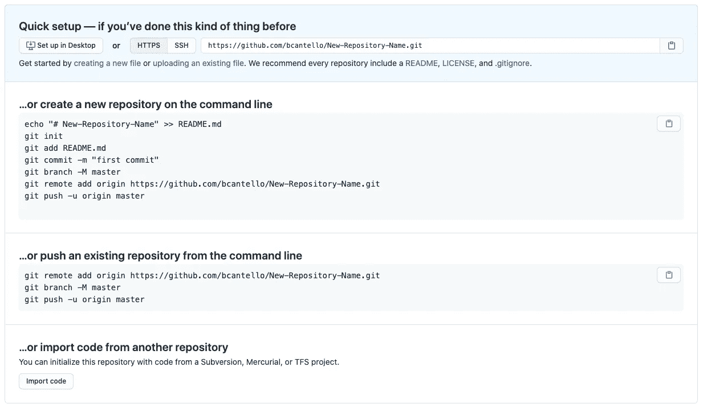
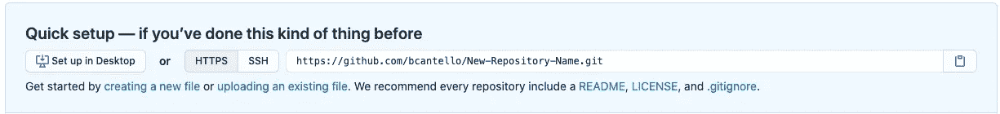

# 如何创建您的第一个 Git 仓库

> 原文：<https://blog.devgenius.io/how-to-create-your-first-git-repository-96b3b1527b20?source=collection_archive---------5----------------------->

当您是编程新手时，Git 可能会令人望而生畏。您可能还不习惯命令行，您不知道命令，您可能害怕输入错误的命令并对您的项目造成不可挽回的损害(别担心，这很难做到；)，它到底是如何工作的呢？它怎么会奇迹般地知道我想保留什么代码？最近，我的一个朋友向我提出了所有这些问题和担忧，所以请相信我，你并不孤单！希望我可以在带您建立第一个回购的过程中帮助您解开 Git 的神秘面纱。

> 注意:我将介绍如何在 GitHub 上创建远程存储库。如果您使用 BitBucket 或其他版本控制系统，git 命令将是相同的。然而，有几个部分是直接通过 GitHub 站点完成的，如果你没有使用 GitHub，这些可能会有所不同。

首先:你想创建什么样的回购？你的 GitHub 账户里要不要别人的回购副本？

这就像点击页面顶部的“分叉”按钮一样简单。

你需要创建一个全新的回购协议来开始编码吗？只需从您的存储库页面中单击“新建”按钮。确保使用自述文件初始化 repo。

如果您尚未开始编码，请选中此框

一旦完成，你应该会被转到你的 GitHub 页面。顶部有一个“Code”按钮，允许你复制一个链接，这样你就可以把你的库克隆到你的本地机器上。链接的形式应该是:`[https://github.com/YourUserName/YourRepoName.git](https://github.com/YourUserName/YourRepoName.git)`

复制链接，打开您的终端，使用命令行`cd`进入您希望这个项目的根目录所在的文件夹。在那里，输入以下带有复制的 url 的 git 命令:

`$ git clone [https://github.com/YourUserName/YourRepoName.git](https://github.com/YourUserName/YourRepoName.git)`

不仅会为您创建根目录，还会将其初始化为本地 git 存储库，并将当前远程分支中的所有文件复制到这个本地目录中。就这么简单！那么，如果您已经开始编码，现在您想为您当前的项目创建一个 repo，该怎么办呢？嗯，在这种情况下，有一些更多的步骤，但我保证它不是那么糟糕。你能做到的！

和前面的例子一样，首先要做的是在 GitHub 上创建一个新的 repo。然而在这种情况下，

> 不要用自述文件或文件来初始化项目。

这可能会导致一些困难和早期的合并冲突，当您试图推上已经在您的计算机上的代码时，因为远程 repo 现在有您本地没有的文件！

由于您没有用任何文件初始化 repo，GitHub 会将您引导到一个页面，该页面有三个不同的前进选项。稍等一会儿。我们稍后会回到这个页面，所以不要点击任何东西或关闭窗口。

不要关闭这一页！我们稍后将回到这个问题。

现在，在您的终端中，`cd` 进入您想要添加到 GitHub 的项目的根目录。一旦进入根目录(项目开始时的顶层文件夹)，您需要将该目录初始化为本地 git 存储库。这可以通过键入以下命令来完成:

`$ git init`

现在，您需要将想要推送到 git hub 的文件添加到您的本地暂存中。在这样做之前，确保没有包含敏感信息的文件，如密码、ssh 密钥、api 密钥等。如果有，您需要创建一个`.gitignore`文件，并将这些文件添加到您的`.gitignore`中，然后再向 staging 添加任何东西。你的`.gitignore`文件中的任何东西都会被 git 忽略。这意味着它不会被添加到 staging 并被推送到 GitHub。它将仅保留在您的计算机上。您可以通过键入以下命令创建一个`.gitignore`文件:

`$ touch .gitignore`

要获得创建更全面的`.gitignore`文件的帮助，请访问这个网站:[https://www.toptal.com/developers/gitignore](https://www.toptal.com/developers/gitignore)。它基于 IDE 或编程语言生成`.gitignore`文件。您仍然需要手动添加您唯一的密码或 api 文件，但这是一个很好的起点。

现在，您已经准备好将文件添加到暂存中。这可以通过键入以下命令来完成:

`$ git add .`

`add`后的圆点是必须的。这个点实际上意味着“每个子目录”。这意味着作为根目录子目录的每个文件夹(不在您的`.gitignore`中)都将被添加到暂存中。把 staging 想象成你想上传到 GitHub 的文件正在累积。

现在，您的文件已经暂存，您需要将它们捆绑到一个提交中，并添加一条简短的描述性消息，让您和其他人知道这个特定提交包含的代码库更改。这是我打字完成的:

`$ git commit -m “Enter your message here”`

现在您需要将本地回购链接到 GitHub 上存储的远程回购。还记得我说过我们会回头看的那一页吗？现在是时候了。顶部的选项应该是“快速设置——如果你以前做过这种事情”,并且会有一个链接供你复制。

你想用这个吗

该链接应该与克隆链接具有相同的形式，但如果您忘记了，它看起来像:

`[https://github.com/YourUserName/YourRepoName.git](https://github.com/YourUserName/YourRepoName.git)`

复制链接，然后回到您的终端。从命令行键入:

`$ git remote add origin [https://github.com/YourUserName/YourRepoName.git](https://github.com/YourUserName/YourRepoName.git)`

这将把您的本地存储库指向远程存储库。如果您希望确认回购已正确链接，您可以键入:

`$ git remote -v`

这将显示您的本地存储库当前指向的所有远程存储库。现在终于到了将所有本地更改推送到新链接的远程回购的时候了。这可以通过键入以下命令来完成:

`$ git push -u origin master`

你完了！每当您想要将更多代码推送到 GitHub 时，您只需将您的更改添加到 staging，打开一个 commit，并将该 commit 推送到您的远程 repo。您可以将这些步骤组合起来，如下所示:

`$ git commit -am "Your message"
$ git push`

`-am`标志将添加步骤与提交/消息步骤结合起来。也没有必要具体说明你想推到哪里，因为回购已经挂钩。

最后一点:永远不要在主分支中直接编码。你的主分支应该是干净的、功能性的代码，如果你正在处理的代码需要被丢弃，你可以回到它。为了在编码一个新的特性或组件时维护一个主的工作版本，你应该总是创建一个新的分支。这可以通过键入以下命令来完成:

`$ git checkout -b someBranchName`

这应该从主分支机构完成。通过这样做，您制作了一个 master 的新副本来开始编码。一旦您的特性完成，您可以通过在 GitHub 上打开一个 pull 请求，将工作中的更改合并回 master 中。合并完成后，您可以通过键入以下命令来删除特征分支:

`$ git branch -d someBranchName`

现在您已经准备好创建一个新的分支，并继续下一个特性！希望这个小教程对你有所帮助。祝你好运，编码快乐！