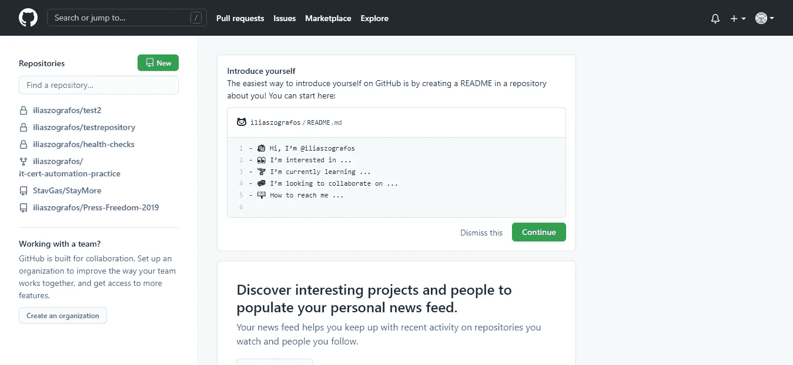
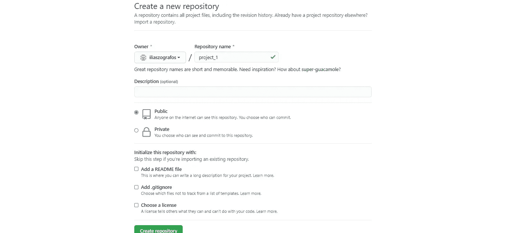
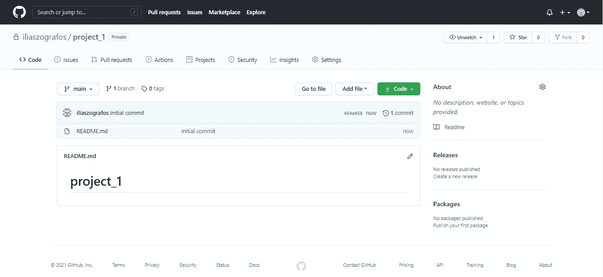
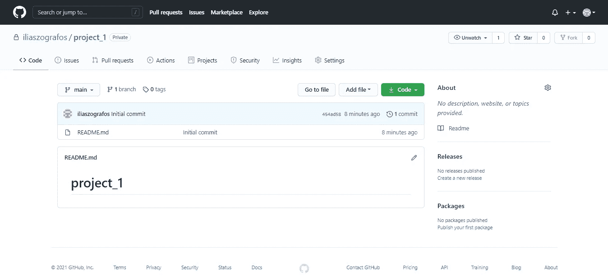

# 如何在 GitHub 上创建第一个资源库

> 原文：<https://blog.devgenius.io/how-to-create-your-first-repository-on-github-565a51856b84?source=collection_archive---------3----------------------->

## 一步一步的教程，适合每一个编码新手。

照片由[克里斯蒂娜·莫里洛](https://www.pexels.com/el-gr/@divinetechygirl?utm_content=attributionCopyText&utm_medium=referral&utm_source=pexels)在[的像素](https://www.pexels.com/el-gr/photo/1181288/?utm_content=attributionCopyText&utm_medium=referral&utm_source=pexels)上拍摄

**简介**

所以，你做了人生中的这个决定。你想学习如何编码！对了，这条路没有回头路，你就一直骑下去吧。

但问题是，你不知道如何说服你的朋友，让他们相信你很酷，也不知道如何说服你的老板，让他这个月为你在 Python、R 或任何其他编程语言上遇到的困难支付额外的报酬。

*   问题很简单:我可以在哪里把我的编码上传到网上，这样每个人都可以看到我的作品？
*   答案更短:GitHub！

# 什么是 GitHub？

GitHub 是一个网站，开发者——不仅仅是——可以将他们的项目存储到存储库中，或者扩展他们的在线存在，并与其他热爱编码的人建立联系。

除了编码文件，在 [GitHub](https://www.youtube.com/watch?v=w3jLJU7DT5E) 上，你还可以上传其他类型的内容，比如照片或文本文档，更好地解释你项目的工作流程。

# 什么是存储库？

一个[存储库](https://www.howtogeek.com/180167/htg-explains-what-is-github-and-what-do-geeks-use-it-for/)(或者回购，你可能会看到它)是 GitHub 上的一个在线空间，你可以在这里存储你过去或现在正在做的项目所需的所有文件。

一个好的做法是将每个项目存储在不同的存储库中，以便很好地组织它们，并且可以在将来方便地访问它们。此外，每个项目都有其唯一的 URL。

大多数时候[你拥有你的库](https://docs.github.com/en/github/creating-cloning-and-archiving-repositories/about-repositories)，但是与你的同事、大学同学等分享这种所有权也是很常见的。

# GitHub 的基本特性

GitHub 的功能非常广泛，但是作为一个初学者，你实际上应该关心以下几点:

*   **分叉**:在“GitHub 语言”上分叉是指你基于平台上已经存在的另一个项目创建一个新项目。这是一个非常有用的特性，因为如果你发现了一个有趣的项目，并且你想为它做贡献，那么你可以通过“分叉”原始存储库。在你改变你想要的一切后，你必须上传新的更新版本。
*   **拉请求**:让我们假设你已经做了上面提到的所有事情——你已经完成了回购并做了修改。但是开发者怎么能认可你在上面的工作呢？这很简单，您只需创建一个拉取请求。通过这样做，最初的开发者将评估你的贡献，如果他们同意，他们将最终接受它。
*   **联网**:这可能是 GitHub 上最被低估的功能之一，但对我来说，这是核心。除此之外，GitHub 是一个社交平台，你必须这样对待它。这是什么意思？在这个编码社区中可能会有你未来的同事，所以请注意你的个人资料和你上传的项目。事实上，GitHub 就像申请编程工作的人的第二份简历，因为在这些情况下，强大的投资组合比多年的经验更重要。
*   这个网站的另一个有用的特点是你可以看到所有的修改——确切的时间，谁做了什么，以及这些文件存储在哪里。这个特性为您节省了大量的时间，尤其是当您与来自世界各地的许多其他人协作，并且您想知道谁改变了什么时。

# 如何在 GitHub 上创建一个资源库？

如果你是 GitHub 上的一个完全的新手，你还没有创建你的账户，你可以在这里[做](https://github.com/join)。

现在最有趣的部分来了；如何在平台上创建第一个存储库。

登录后，您将看到如下内容:

作者截图。

在屏幕的左侧，有一些我过去创建的存储库。通过点击 **New** ，您可以创建您的第一个存储库。哒哒！

当然，你可以随意命名，但对于本教程，我将命名为“ **project_1** ”。

作者截图。

写描述不是必须的，但是如果你在一个项目上花了很多时间，并且这个项目有点复杂，那么写描述是一个很好的策略。这实际上会帮助其他人理解你为创造它付出了多少努力。

之后，你可以选择你的作品是否公开。实际上，你所有的项目都应该是公开的，因为这是使用 GitHub 的目的，但是如果其中一个项目没有完成，那么就保持它的私密性。

另一个好的实践是用一个 **README 文件**初始化您的存储库。所以，如果你点击**创建库**，工作就完成了！为自己感到骄傲！

作者截图。

现在，如果你点击 **GitHub** 的主页，你会看到这个新的资源库和一些其他功能，只需选择一个特定的回购即可。在“ **Code** 部分，您可以实际看到存储库包含了哪些文件。

作为初学者，你应该知道该菜单的三个最重要的类别，即"**问题**"、"**拉动请求**"和"**见解**"。设置总是有用的，但是你可能不会从你在平台上的第一步就使用它们。

例如，通过选择“问题”,您可以看到错误或任何功能请求，而通过选择“拉式请求”,您可以与其他程序员合作——有抱负的或专业的——并在互联网上创造下一个大事件！

作者截图。

# 结论

在学习了 GitHub 的基础知识以及如何创建你的第一个资源库之后，我认为是时候开始试验和探索这个平台了。

起初这可能看起来有点可怕，尤其是如果你现在进入编码社区，但是你很快就会习惯它。我保证！

我不是专业的程序员，我的背景也完全不同，所以我绝对能理解你的担忧。

快乐编码和“GitHubing”(我是个造词者！).

不知道接下来要读什么？👇

 [## 如何建立你的第一个网页

### 失败后我真正学到的是…

levelup.gitconnected.com](https://levelup.gitconnected.com/how-not-to-fail-building-your-first-webpage-653417c590bf) 

**感谢阅读！❤️**

*   如果你喜欢这个故事，请关注我的 [Medium](https://medium.com/@iliaszografos1998) 了解更多！
*   下面我们连线一下 [GitHub](https://github.com/iliaszografos) 。