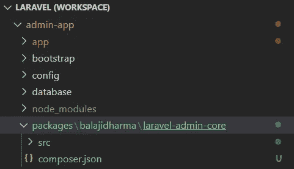
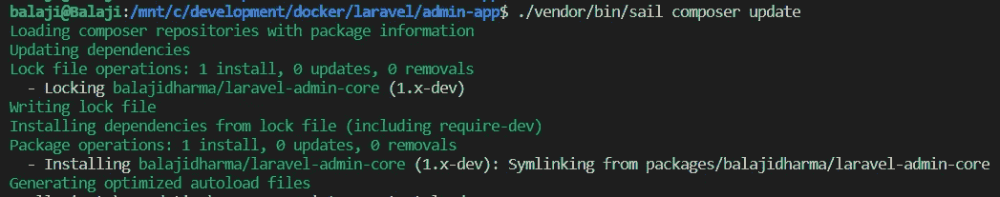
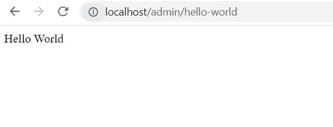
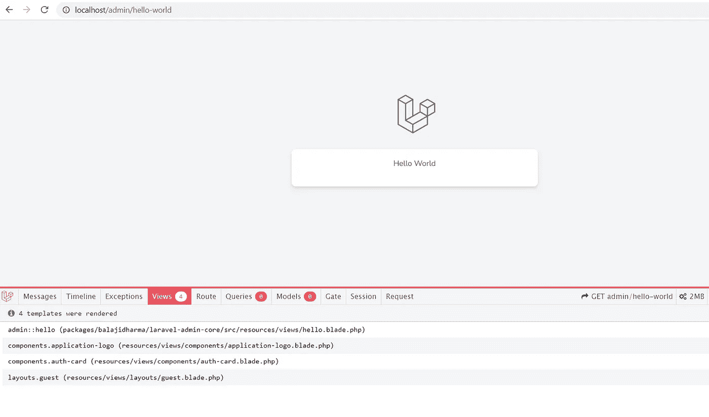

# 如何创建自己的 Laravel 包

> 原文：<https://blog.devgenius.io/how-to-create-your-own-laravel-packages-2b68da22506a?source=collection_archive---------1----------------------->

## Laravel 从头开始创建管理面板——第 19 部分


照片由 [Kira auf der Heide](https://unsplash.com/@kadh?utm_source=medium&utm_medium=referral) 在 [Unsplash](https://unsplash.com?utm_source=medium&utm_medium=referral) 上拍摄

目前，[基本 Laravel 管理面板](https://github.com/balajidharma/basic-laravel-admin-panel)和 [Laravel Vue 管理面板](https://github.com/balajidharma/laravel-vue-admin-panel)被直接添加到 Laravel 项目中。最初，我把这个管理面板作为一个初学者工具包。但是在这种方法中，很难用最新的变化来添加和升级管理面板。为了解决这个问题，我们应该把我们的管理面板转换成 Laravel 包。

在这篇博客中，我们将创建自己的 Laravel 包，其中包含路线、控制器和视图。

## 什么是 Laravel 包

Laravel 包是向 Laravel 添加功能的主要方式。在 Laravel 本身，核心功能被转移到一个叫做[框架](https://github.com/laravel/framework)的独立包中。

另外， [Spatie Laravel 权限](https://github.com/spatie/laravel-permission/)是 Laravel 包的最好例子。

> Laravel 包可能有专门用于增强 Laravel 应用程序的路由、控制器、视图和配置。

## 创建自己的 Laravel 包

PHP Composer 用于更新依赖项和发布包。一个 [Composer](https://getcomposer.org/) 是 PHP 中的一个依赖管理工具。

在创建 composer.json 文件之前，在 Laravel 项目中创建以下文件夹

```
├── packages
│   └── balajidharma (github-username)
│       └── laravel-admin-core (package-name)
│           ├── src
```



文件夹是根据我们的包名创建的。包的名字有两部分，第一部分是供应商名，通常是 GitHub 用户名，第二部分是包名。

**举例:** `spatie/laravel-permission`，`laravel/framework`

所以我的包名是`balajidharma/laravel-admin-core`

## 创建包的编写器文件

用下面的代码创建我们的 composer 文件。此外，您可以使用`composer init`命令创建一个作曲者。

`packages/balajidharma/laravel-admin-core/composer.json`

```
{
    "name": "balajidharma/laravel-admin-core",
    "description": "Laravel admin core",
    "license": "MIT",
    "keywords": ["admin","laravel","admin-panel","admin-core", "laravel-admin-panel"],
    "authors": [
        {
            "name": "Balaji Dharmaraja",
            "homepage": "https://github.com/balajidharma"
        }
    ],
    "require": {
        "spatie/laravel-permission": "^5.5"
    },
    "autoload": {
        "psr-4": {
            "BalajiDharma\\LaravelAdminCore\\": "src"
        }
    },
    "extra": {
        "laravel": {
            "providers": [
                "BalajiDharma\\LaravelAdminCore\\AdminCoreServiceProvider"
            ]
        }
    }
}
```

`composer.json`文件的模式详情可以在 [**这里找到**](https://getcomposer.org/doc/04-schema.md)

我们在包的`composer.json`文件的`extra`部分定义了我们的`AdminCoreServiceProvider`。

## 创建包服务提供商

包[服务提供者](https://laravel.com/docs/9.x/providers)是我们的包和 Laravel 之间的连接点。该提供程序用于加载我们的路由、配置、视图等。,

对于演示，我们将在服务提供商中加载我们的路线。

`laravel-admin-core/src/AdminCoreServiceProvider.php`

```
<?php

namespace BalajiDharma\LaravelAdminCore;

use Illuminate\Support\ServiceProvider;

class AdminCoreServiceProvider extends ServiceProvider
{
    public function boot()
    {
        $this->loadRoutesFrom(__DIR__.'/admin-routes.php');
    }

}
```

## 创建包裹路线

在 src 文件夹中创建 admin-routes.php 文件，并添加下面的 hello-world 页面路由

`laravel-admin-core/src/admin-routes.php`

```
<?php

use Illuminate\Support\Facades\Route;

Route::group([
    'namespace' => 'BalajiDharma\LaravelAdminCore\Controllers',
    'prefix' => 'admin',
], function () {
    Route::get('hello-world', 'UserController@helloWorld');
}); 
```

## 创建包控制器

在 src/Controllers 文件夹中创建 UserController

`laravel-admin-core/src/Controllers/UserController.php`

```
<?php

namespace BalajiDharma\LaravelAdminCore\Controllers;

use App\Http\Controllers\Controller;

class UserController extends Controller
{
    public function helloWorld()
    {
        echo "Hello World";
    }
}
```

## 如何测试变化？

我们用 hello-world 页面创建了自己的 Laravel 包。通常，在安装后，只有我们能够验证软件包。

只有在创建 GitHub 库并在 [packagist](https://packagist.org/) 中发布包之后，我们才能安装我们的包。

在发布这个包之前，我们可以通过在 Laravel composer.json 中添加 Composer symlink 来测试这个包

## 创建到本地包的编写器符号链接

我们可以通过在 repositories 选项上添加 path 类型来符号链接 composer.json 中的本地包。

将以下代码添加到我们的 Laravel composer.json 中

```
diff --git a/composer.json b/composer.json
index 6927ff8..6f87f7c 100644
--- a/composer.json
+++ b/composer.json
@@ -4,12 +4,22 @@
     "description": "The Baic Laravel Admin Panel - Laravel Admin Boilerplate",
     "keywords": ["framework", "laravel", "boilerplate", "admin panel"],
     "license": "MIT",
+    "repositories": [
+        {
+            "type": "path",
+            "url": "packages/balajidharma/laravel-admin-core",
+            "options": {
+                "symlink": true
+            }
+        }
+    ],
     "require": {
         "php": "^8.0.2",
         "guzzlehttp/guzzle": "^7.2",
         "laravel/framework": "^9.19",
         "laravel/sanctum": "^2.14.1",
         "laravel/tinker": "^2.7",
+        "balajidharma/laravel-admin-core": "@dev",
         "spatie/laravel-permission": "^5.5"
     },
     "require-dev": {
```

之后，运行`composer update`来设置符号链接



现在在浏览器中打开 hello-world 网址[http://localhost/admin/hello-world](http://localhost/admin/hello-world)



## 创建包视图

我们验证了我们的包工作正常。现在我们要创建视图来打包。

> 要向 Laravel 注册你的包的[视图](https://laravel.com/docs/9.x/views)，你需要告诉 Laravel 视图的位置。您可以使用服务提供商的`loadViewsFrom`方法来完成此操作。

因此，在我们的服务提供商上添加`loadViewsFrom`

```
<?php

namespace BalajiDharma\LaravelAdminCore;

use Illuminate\Support\ServiceProvider;

class AdminCoreServiceProvider extends ServiceProvider
{
    public function boot()
    {
        $this->loadRoutesFrom(__DIR__.'/admin-routes.php');

        $this->loadViewsFrom(__DIR__.'/resources/views', 'admin');
    }

}
```

之后，在包 src 文件夹中创建 resources/views 文件夹。然后创建一个 hello.blade.php 文件

`laravel-admin-core/src/resources/views/hello.blade.php`

```
<x-guest-layout>
    <x-auth-card>
        <x-slot name="logo">
            <a href="/">
                <x-application-logo class="w-20 h-20 fill-current text-gray-500" />
            </a>
        </x-slot>

        <div class="mb-4 text-sm text-gray-600 text-center">
            Hello World
        </div>

    </x-auth-card>
</x-guest-layout>
```

hello-world 页面现在加载了一个新视图。



我们已经成功地创建了一个新的包含路由的 Laravel 包。因此，下一步我们将发布该包，并使该包可公开访问。

Laravel 管理面板可在[https://github.com/balajidharma/basic-laravel-admin-panel](https://github.com/balajidharma/basic-laravel-admin-panel)获得。安装管理面板并分享您的反馈。

感谢您的阅读。

敬请关注更多内容！

*跟我来*[](https://balajidharma.medium.com/)*。*

*上一部分—第 18 部分:[用 Laravel Dusk 进行浏览器测试](/browser-testing-with-laravel-dusk-aeef2e8b30f8)*

*下一部分—第 20 部分:[如何在 Packagist 上发布自己的 Laravel 包](/how-to-publish-your-own-laravel-package-on-packagist-ac9a084502ab)*