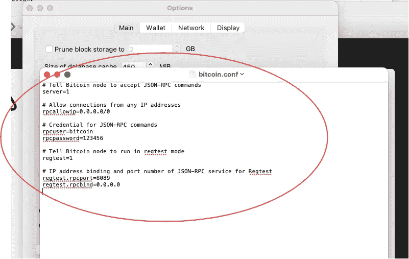
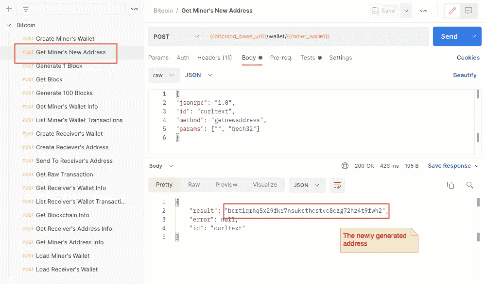
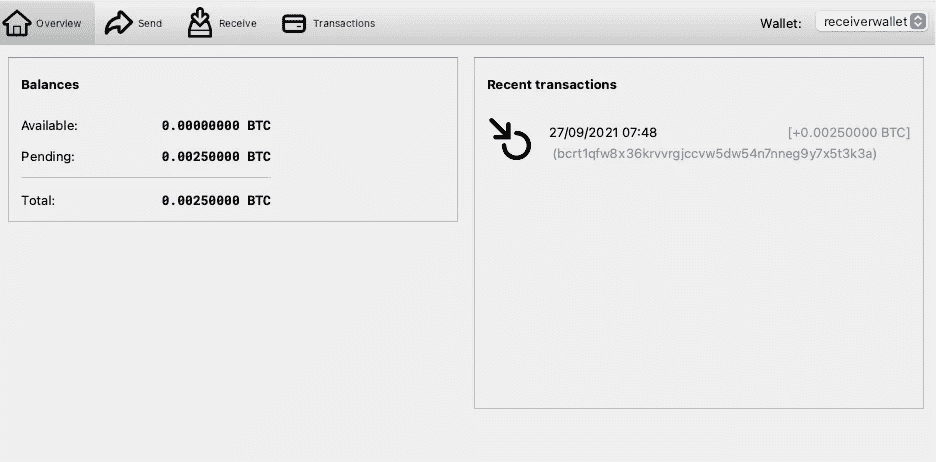
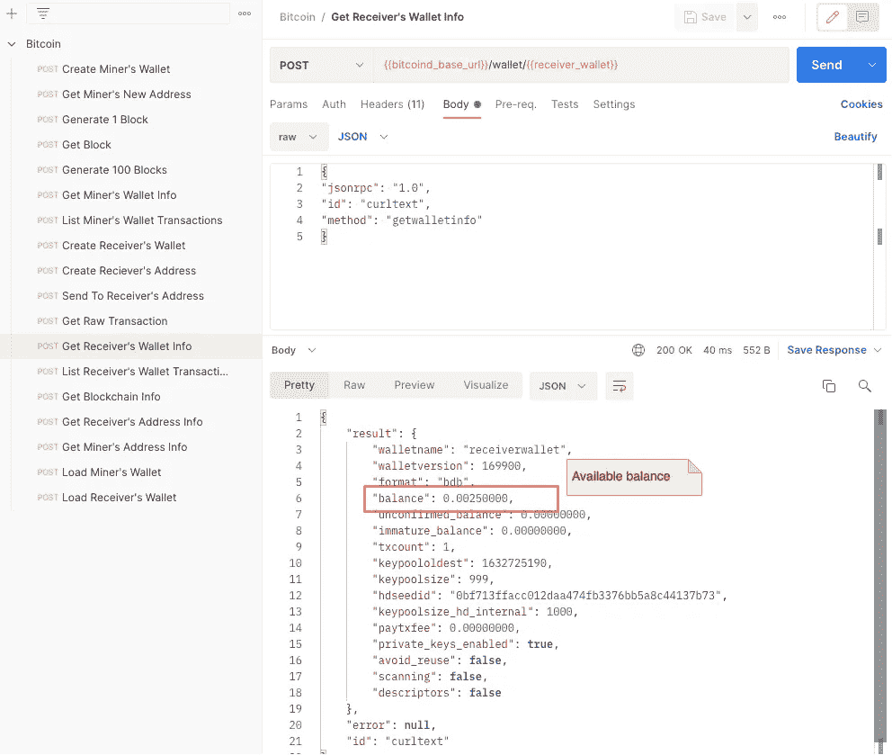

# 如何为加密货币 App 开发创建自己的私有区块链？

> 原文：<https://blog.devgenius.io/how-to-create-your-private-blockchain-for-cryptocurrency-app-development-eeacd042b107?source=collection_archive---------0----------------------->

## 加密货币的快速概述，包括钱包创建、区块挖掘和资金转移的演练


在 [Unsplash](https://unsplash.com?utm_source=medium&utm_medium=referral) 上[杰瓦尼 Weerasinghe](https://unsplash.com/@jievani?utm_source=medium&utm_medium=referral) 的照片

区块链是突破性的技术。基于这种技术，人们可以匿名转移加密货币，并且转移可以在分散的网络中完成，而无需通过银行或其他中央方。虽然对大多数人来说，比特币的投机是一个有趣的话题，但区块链的应用开发是许多软件开发人员追捧的技能。

RPC 命令是比特币应用程序开发和测试的基本工具。利用 RPC 命令，您可以模拟比特币区块挖掘和硬币转移，还可以检索您本地环境中交易的技术信息。在本文中，我将向您展示如何为加密货币应用程序开发设置本地区块链，并演示如何使用 RPC 命令来模拟资金转移和块挖掘。

# 比特币一瞥

首先，让我们快速了解一下区块链。区块链基本上是一个记录所有交易的账本。对等网络中的比特币节点之间的数据是同步的。这是一个公共区块链，任何人都可以免费访问。

看看区块链的一个[随机交易](https://blockchair.com/bitcoin/transaction/8d11266330d2aa025dd4dfdfddc70c68d9722f8294d3c17dd0d19779561c8deb)，这个交易记录了从一个发送者到 4 个接收者的硬币转移。与通过银行提交的交易不同，比特币交易中的发送者和接收者通过哈希字符串中的地址来识别，因此所有交易都是匿名进行的。


从 Blockchair.com 捕获的随机交易

每个块包含许多事务。例如，在高度为 702，256 的[块](https://blockchair.com/bitcoin/block/702256)中有 244 个事务。


从 Blockchair.com 捕获的随机块

为了给区块链增加一个新的区块，需要进行计算，以生成工作证明，确认新区块中所有交易的有效性。由于每个块都链接到前一个块，并且基于前一个块的有效性，如果要反转前一个块中的事务，就需要巨大的计算能力。随着更多数据块的加入，所需的计算能力将呈指数级增长。添加到事务中的块数称为确认。超过 6 份确认书(即超过 6 份确认书)的交易被视为不可逆。


块链概述

## 硬币转账是如何运作的？

让我们来看看区块链比特币交易的细节，下图展示了一个简单的比特币交易，它从底部开始，有初始的比特币余额——詹姆斯:BTC 50，加文:BTC 0。以下是比特币转移的活动顺序:

1.  **詹姆斯将 BTC 20 发送到加文的地址**——事务被放入比特币节点的内存池中。在那个时候，交易对每个人都是可见的，所以加文知道他已经收到了 BTC 20，但还没有确认。区块链的交易需要根据当前交易基础上增加的区块数量进行确认。
2.  **新开采区块**——交易包含在新开采的区块中。随着该块被添加到链中，确认的数量现在是 1，但加文的比特币仍未确认，因为所需的确认数量是 3。
3.  **第二新采区**——确认个数为 2
4.  **第三个新块开采**——确认次数为 3 次，收到的币被确认。加文可以安全地使用收到的硬币。


比特币交易概述

## 矿业如何赚取比特币？

区块链依靠某人自愿进行“采矿”，即验证交易并为区块链增加新的区块。由于在分散的网络中没有集中的权力，这种设计通过奖励新产生的硬币和交易费用来激励任何成功开采区块的人。

下面是 2021 年 9 月 26 日挖掘的样本区块，显示了交易自由和新生成硬币的数量。总的奖励是 BTC 6 英镑。18860 . 888888888816


Blockchair.com 截图

# 本地环境设置

您需要在电脑上安装以下软件:

*   比特币核心([https://bitcoin.org/en/download](https://bitcoin.org/en/download))
*   邮递员([https://www.postman.com/downloads](https://www.postman.com/downloads))

除以上软件外， [**邮差请求收集**](https://github.com/gavinklfong/bitcoin-dev-kits/tree/main/postman) 为您提供方便。它是用于钱包创建、硬币转移、区块挖掘等的 RPC 命令的集合。下载[环境文件](https://raw.githubusercontent.com/gavinklfong/bitcoin-dev-kits/main/postman/Local.postman_environment.json)和[请求收集文件](https://raw.githubusercontent.com/gavinklfong/bitcoin-dev-kits/main/postman/Bitcoin.postman_collection.json)，然后导入到你的邮差中。

如果你不熟悉 Postman，这篇文章是一个很好的参考:

[](/how-to-speed-up-your-api-tests-using-the-advanced-features-of-postman-350c453b376) [## 如何使用 Postman 的高级特性加速 API 测试

### 令人惊叹的可重用 API 请求模板、动态请求数据和 API 请求工作流自动化

blog.devgenius.io](/how-to-speed-up-your-api-tests-using-the-advanced-features-of-postman-350c453b376) 

一旦你安装了比特币核心，运行应用程序将显示一个图形用户界面，并启动一个比特币节点。默认情况下，它连接到生产网络，并开始从网络中的其他对等节点同步，以下载整个区块链。


比特币应用首次启动时的屏幕显示

要将您的比特币节点切换到测试模式，您需要启用回归测试模式或 regtest 模式。在 regtest 模式下，你可以创建你的本地私人区块链，并自由模拟各种场景，如采矿和硬币转移。

转到首选项并点击“打开配置文件”按钮


比特币应用偏好设置—配置文件

然后，您将看到一个编辑器窗口中打开的 **bitcoin.conf** 文件。默认情况下，配置文件为空。填写以下配置设置并保存。

```
# Tell Bitcoin node to accept JSON-RPC commands
server=1# Allow connections from any IP addresses
rpcallowip=0.0.0.0/0# Credential for JSON-RPC commands
rpcuser=bitcoin
rpcpassword=123456# Tell Bitcoin node to run in regtest mode
regtest=1# IP address binding and port number of JSON-RPC service for Regtest
regtest.rpcport=8089
regtest.rpcbind=0.0.0.0
```

配置设置主要是在比特币节点上启用 JSON-RPC 命令，启用 regtest 模式。



使用输入参数`**-fallbackfee**`重启应用程序。该参数指示比特币节点使用默认交易费用，以防由于某种原因无法计算费用。

**适用于 Mac 操作系统**

```
/Applications/Bitcoin-Qt.app/Contents/MacOS/Bitcoin-Qt -fallbackfee=0.00002
```

**对于 Windows**

```
<Installation path>/bin/Bitcoin-Qt.exe -fallbackfee=0.0002
```

一旦启动并运行，应用程序将在 regtest 模式下运行。由于区块链中什么也没有，区块链同步的进度是 100%。


在 Regtest 模式下运行的比特币应用

# 通过区块挖掘生成硬币

在硬币转移之前，我们需要创建硬币并存入钱包。唯一的办法就是通过挖掘一些区块来赚取硬币。我将向您展示如何使用 RPC 命令创建 wallet 和挖掘块。

## 创建钱包

让我们首先为硬币矿工创建一个钱包。虽然比特币 GUI 允许我们轻松创建新的钱包，但我们将重点关注 RPC 命令，并使用比特币 GUI 来可视化结果。要创建新的钱包，在 Postman 中启动这个 HTTP 请求 **Create Miner's Wallet** 。比特币 RPC URL 和 RPC 命令的凭据在 Postman 请求模板中被定义为环境变量，因此请确保选择“本地”环境。

将 wallet 名称作为输入参数的 RPC 命令`**createwallet**`。新钱包的钱包名为“minerwallet”。该变量在 Postman 集合中配置。如果钱包创建成功，那么您将收到一个 JSON 格式的带有钱包名称的响应


邮递员——创建矿工钱包

创建钱包时，钱包余额会显示在比特币 GUI 中。新创建的钱包的余额为零。


矿工的钱包

## 生成新地址

接下来，为矿工新创建的钱包生成一个地址。这个地址是领取区块开采的奖励。

发起邮递员请求**获取矿工的新地址**。RPC 命令`**getnewaddress**`为钱包生成一个新地址。该地址将被用作下一个 RPC 挖掘命令的输入参数。无需复制&粘贴生成的地址，Postman 请求模板会自动将地址保存到变量中，供下一次请求使用。



邮递员—获取矿工的地址

# 生成新的块

终于到了开采区块的时候了。启动 Postman 请求**生成 1 个块到地址**。RPC 命令`**generatetoaddress**` 有两个输入参数——要生成的块数和接收采矿奖励的地址。输出是新生成的块的块散列。


邮递员-生成块

根据邮递员的要求检查矿工钱包中的物品**获取矿工钱包信息。**响应显示 BTC 50 处于未成熟余额，但余额仍为零。在 regtest 中，前 150 个方块产生 BTC 50 的奖励，但是该奖励直到达到 100 个确认才可以使用。


邮差——区块一代后矿工的钱包

GUI 中的钱包信息:


区块生成后矿工的钱包

## 再开采 100 个街区

为了使余额可用，让我们利用邮递员请求**再挖掘 100 个块，生成 100 个块**。RPC 命令与挖掘 1 个块的命令相同，但这次的第一个参数是 100。


邮递员-生成 100 个街区

再次运行邮差请求以获取矿工的钱包信息，您将看到您的余额中的 BTC 50 已经可以消费了。另一方面，第 100 代积木在未成熟的平衡中贡献了 BTC 5000。


邮递员-在第 101 代封锁后获取矿工的钱包信息

比特币 UI 中的钱包余额:


101 块一代后的矿工钱包

# 硬币转移

为了刺激硬币转移，我们需要创造另一个钱包。硬币转移大致包括以下步骤:

1.  从接收者的钱包中生成地址
2.  矿工将硬币发送到接收者的地址
3.  挖掘区块以确认交易

## 创建收款人的钱包和地址

运行邮递员请求**创建接收者的钱包**来创建一个新的钱包。钱包名称为“receiverwallet”。一旦新的钱包准备好了，通过运行邮递员请求**创建接收者的地址来生成一个新的接收硬币的地址。**


## 向接收者发送硬币

发送 BTC 0.0025 到接收者的地址。邮递员请求**发送到接收者地址**中的 RPC 命令`**sendtoaddress**`接受接收者地址和要转移的硬币值的输入参数。该命令返回事务哈希。

此时，交易已经成功提交到比特币节点，并存储在 mempool 中。它准备好被挑选用于下一代块。


邮递员——将硬币送到地址

## 现在接收者的钱包余额是多少？

邮递员请求**获取接收者的钱包信息**的输出表明 BTC 0.0025 被接收，但是它在未确认的余额中。原因是该事务尚未包含在任何块中。

在交易被确认并生成至少一个区块后，可以花费所接收的硬币。在现实世界中，建议进行 6 次确认(即在交易后生成 6 个区块)，以确保硬币的安全。


邮递员——发送硬币后获取接收者的钱包信息

GUI 中显示的信息:



有待定硬币的接收者钱包

## 获取交易信息

如果你想检查事务的原始数据，那么运行 Postman 请求**获取原始事务** (RPC 命令`**getrawtransaction**`)。该命令接受事务哈希作为事务标识符。

邮差请求会自动保存您之前发送硬币请求的交易哈希，因此您无需手动输入交易哈希。


邮递员-获取原始交易

## 通过生成新的块来确认事务处理

好吧，让矿工去做吧。在现实世界中，采矿者根据交易费选择区块开采的交易。交易费用越高，该交易被选择用于下一个区块开采的可能性越大。因此，交易越快得到确认。

相反，如果交易费用较低，交易可能会停滞很长时间，因为它没有为采矿者提供足够的激励来选择区块开采的交易。

测试环境中的块生成很简单。运行 Postman 请求**生成 1 个块，**RPC 命令`**generatetoaddress**`然后在新生成的块中包含所有未决事务。

再次检查收款人的钱包信息，收到的硬币已经确认，现在可消费的余额是 BTC 0.0025。



邮差——获取装有确认硬币的收件人钱包


装有已确认硬币的收款人钱包

另一方面，硬币从矿工的钱包中扣除。由于又开采了一个区块，矿工的平衡有一个额外的 BTC 50 奖励。扣除 BTC 0.0025 和交易费后，余额为 BTC 99.99749718。


邮递员——在硬币转移后获得矿工的钱包


硬币转移后的矿工钱包

# 最后的想法

私有区块链是加密货币应用开发的必备开发工具。它提供了一个简单的方法来模拟各种场景，如区块开采，硬币转移，硬币双花，按费用替换等。对于开发人员来说，理解系统行为以便构建业务功能和故障排除是至关重要的。

私有区块链上的操作依赖于 RPC 命令。比特币节点支持通过 HTTP 请求的命令，因此，提供了一套有用的邮差请求模板，帮助您加快命令执行和探索区块链功能。希望你觉得有用。