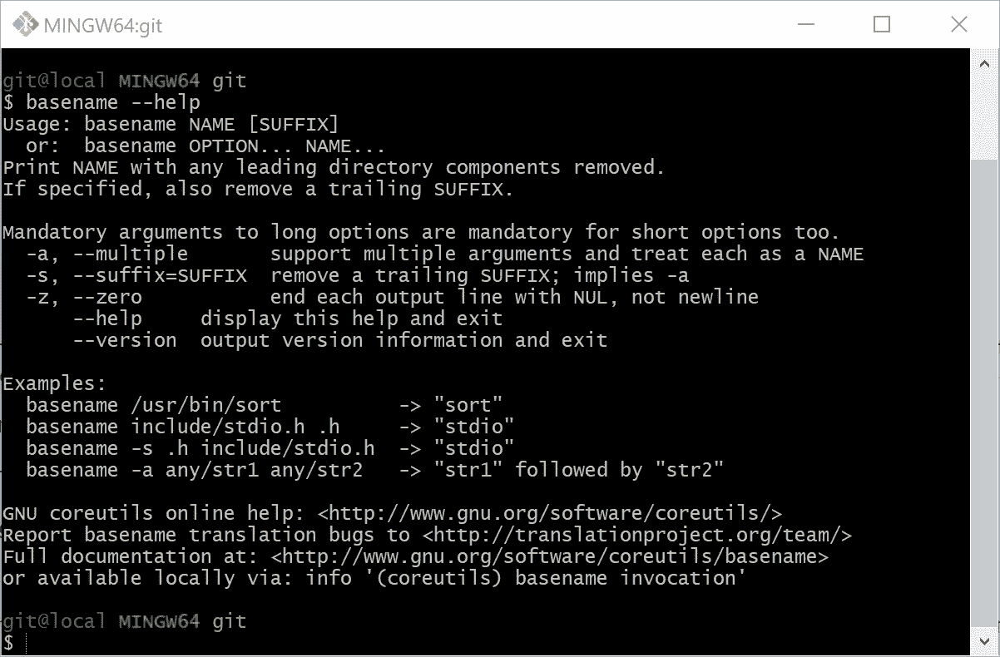

# 如何定制 Git Bash Shell 提示符

> 原文：<https://blog.devgenius.io/how-to-customize-the-git-bash-shell-prompt-336f6aefcf3f?source=collection_archive---------0----------------------->

## 所以您想在 Git Bash 提示符中隐藏您的用户名@主机名？以下是方法。


Git for Windows 提供了许多原生和轻量级工具，以及一个 Bash 仿真，为用户带来了 shell 体验。默认的 Bash 终端如下所示。


终端窗口标题包含当前目录的完整路径，提示符显示当前用户名、主机名以及当前工作目录的路径。如果当前工作目录是一个 Git 存储库，那么提示符还会显示 Git 分支名称。我们应该意识到终端提供的信息非常丰富。

然而，有时我们不想显示当前目录的完整路径或我们的用户名和主机名。比如我不想在博文里的截图里暴露我的用户名和我的机器名。所以我配置 Git Bash 终端窗口显示一个静态字符串“`git@local`”作为用户名和主机名，只显示当前工作目录的`basename`。这样，我可以隐藏一些个人信息。我的终端窗口如下图所示:



根据 Alan P. Barber ( [链接](https://alanbarber.com/post/how-to-customize-the-git-for-windows-bash-shell-prompt/))的一篇文章，定制 Bash 提示符实际上非常容易。

首先，我们需要确定 Git for Windows 的安装路径，并通过在 Git Bash 终端中执行以下命令找到配置文件定义文件夹。

```
cd /etc/profile.d/
explorer .
```

上面的命令将在文件浏览器中打开一个文件夹，如下面的屏幕截图所示。


我们正在`profile.d`文件夹中寻找`git-prompt.sh`文件。`git-prompt.sh`文件包含 Git Bash 终端标题和 Bash 提示符字符串的配置。我们可以改变提示的颜色，并根据需要修改提示的内容。默认的`git-prompt.sh`文件有以下内容。

`git-prompt.sh`文件有详细的注释，对我们的定制有很大的帮助。我们可以修改这个文件来定制我们的 Git Bash 终端，或者我们可以保持这个文件不变，并将我们的配置保存到我们的主目录中(参见第 8 到 11 行)。我更喜欢后一种方式，因为我可以保持原始的`git-prompt.sh`文件完好无损。因此，我创建了一个文件夹`~/.config/git`，在这个文件夹中我创建了一个文件`~/.config/git/git-prompt.sh`，它优先于默认的`git-prompt.sh`文件。下面的代码片段显示了我的配置文件的内容。

对于这个文件，我的终端提示符如下所示。


我们主要需要自定义`PS1`字符串(主要提示)。`PS1`字符串使用一组 Bash 提示反斜杠转义的特殊字符来显示动态内容。例如，`\u`代表当前用户的用户名，`\w`(小写)是当前工作目录的路径，`\W`(大写)是当前工作目录的基名，以此类推。下表显示了可用于配置提示符的所有转义字符。

Bash 提示转义字符

`PS1`字符串的构造也使用了一些 [ANSI 颜色转义码](https://en.wikipedia.org/wiki/ANSI_escape_code)。颜色转义码以`\[`开始，以`\]`结束。颜色格式为`\033[32m`，其中`\033`代表 ASCII 转义字符，代码`32`代表前景色绿色。我们可以在提示字符串中使用以下颜色代码。

好吧。我想这就是我们为 Windows Bash 提示符定制 Git 的全部内容。感谢阅读。