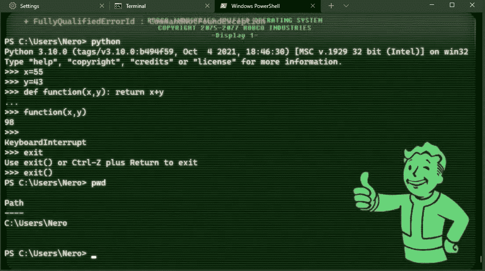
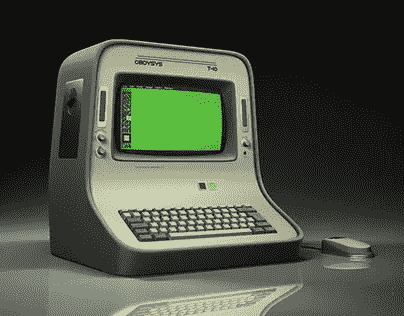
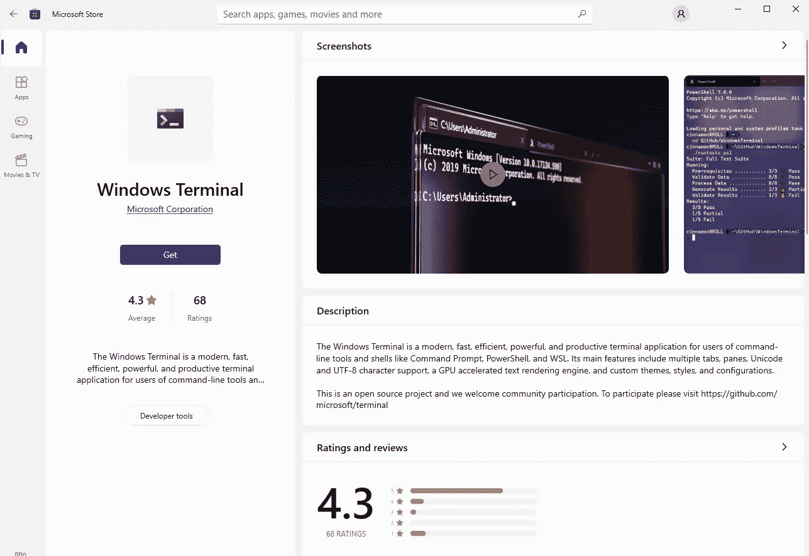
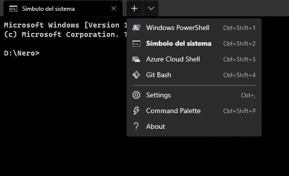
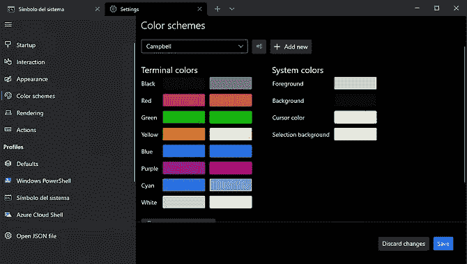
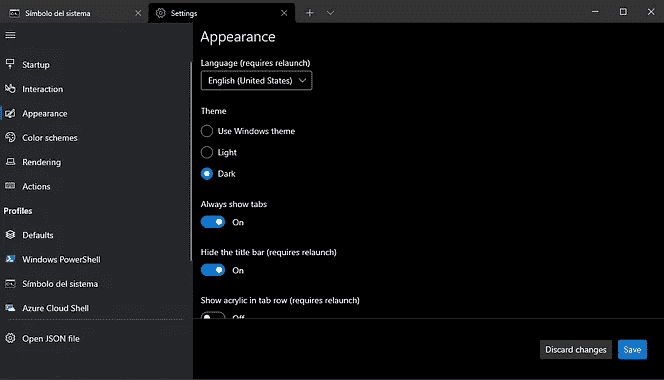
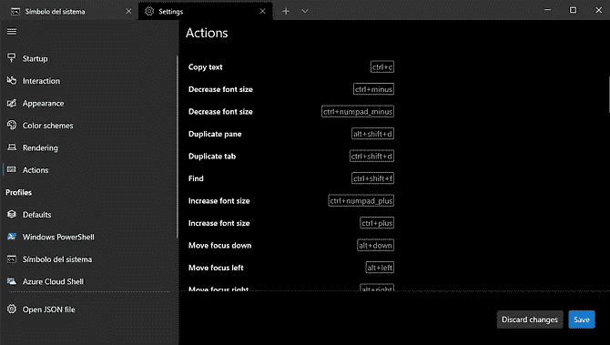
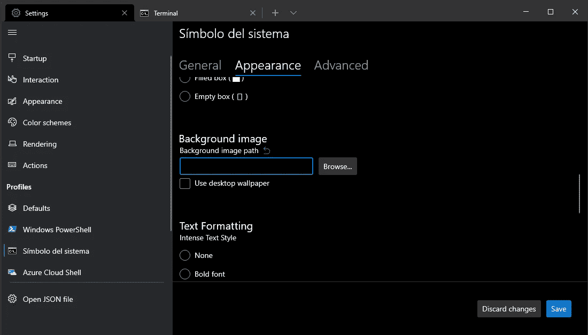
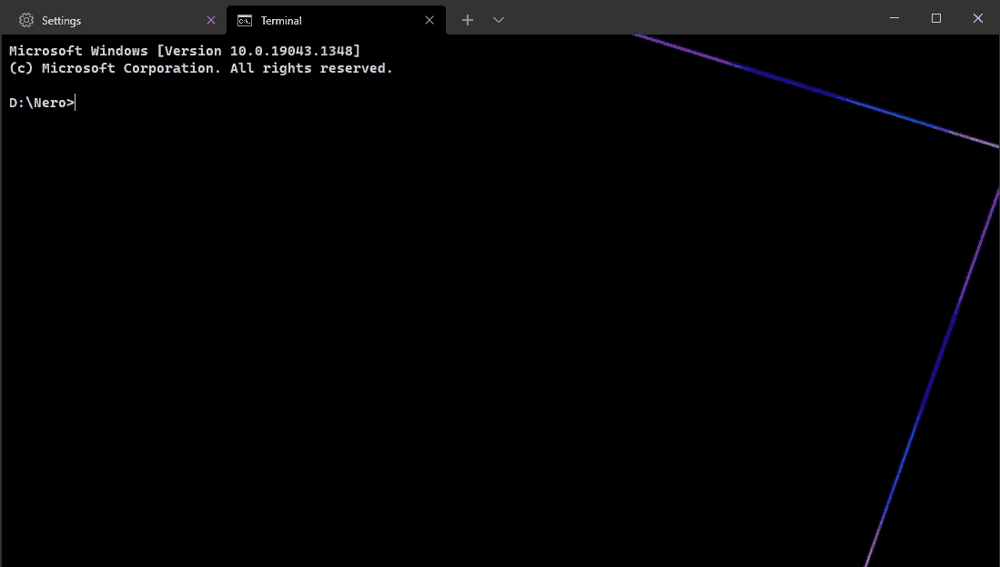
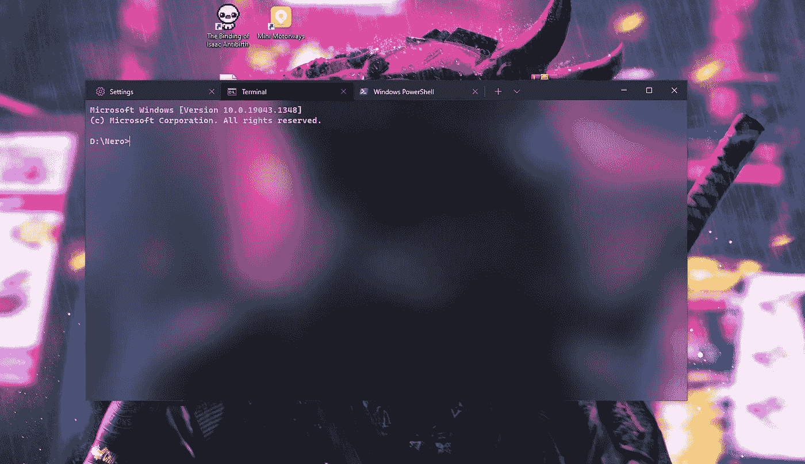

# 如何在 Windows 10 中自定义您的终端

> 原文：<https://blog.devgenius.io/how-to-customize-your-terminal-in-windows-10-896fd2432f25?source=collection_archive---------6----------------------->

辐射式终端。看起来很酷，不是吗？

你不知道你能做到，对吧？这就是你在这里的原因。没关系，我也是几个月前才知道的。让我告诉你，这个功能太棒了！

来自辐射的复古终端。

有一天，在完成了一个贪婪的搜索算法并测试出来后，我心想“好家伙，Windows 终端真的*很*无聊”。我知道 Linux 用户可以修改和定制他们的终端，但我认为我们 Windows 用户不能。

在网上快速搜索了一下，我的期望被抛到了九霄云外。使用新的 Windows 终端应用程序，你确实可以改变背景、字体、透明度和终端文本的大小！别担心，我会告诉你怎么做。

## 下载 Windows 终端

按下电脑上的 Windows 键，或者导航到主页搜索栏，然后输入“Microsoft Store”。在那里，你应该搜索“Windows 终端”并下载它！

Windows 终端出现在 Microsoft 商店中

## 设置终端

安装后，终端看起来就像旧的一样——除了一个非常重要的特性:多标签！

是的，我们现在可以在同一个地方运行终端的不同标签(实际上是不同的实例)。是不是很牛逼？另外，我们可以开发不同类型的终端，正如您在这里看到的:

三种默认类型的终端加上 Git Bash，这是我后来安装的。

接下来是设置，在我刚才展示的下拉菜单中单击“settings ”,我们进入“configuration”选项卡。我们可以从“外观”和“配色方案”中设置基本外观，我们甚至可以自定义预定义的热键，如移动焦点或复制文本。

基本配置界面的一些快照

现在是最酷的部分，设置背景。随之而来的是我的一个小秘密:你可以使用。gif 图片！

让我们为默认终端设置背景。我们从不同的配置文件中选择它，然后进入外观菜单。在这里，我们可以选择具体的字体，它的重量，光标的风格…甚至有一个“复古模式”！

向下滚动，我们发现一个名为“背景图像”的打开的文本框。在那里，我们可以粘贴到我们的图像路径或浏览我们的文件管理系统并找到它。

在这里，我们可以自定义我们的背景图像。

我建议你用 Canva 或 Photoshop 来创建自己的作品，但互联网上仍有一些不错的选择。尽量保持简洁或者不分散注意力，否则你在终端上工作会感到不舒服。就我个人而言，我选择了这种简单的外观:

其实是一个. gif，但是我觉得这里不能粘贴 gif。

## 其他示例

在最初的一个小时左右，在我闲荡和测试的过程中，我想到了这个:

辐射式终端。

我还设法激活了透明度，最终得到了一个惊人的结果:

应用丙烯酸选项后的端子。

下载 Windows 终端还等什么？

*更多内容尽在*[*blog . dev genius . io*](http://blog.devgenius.io)*。*