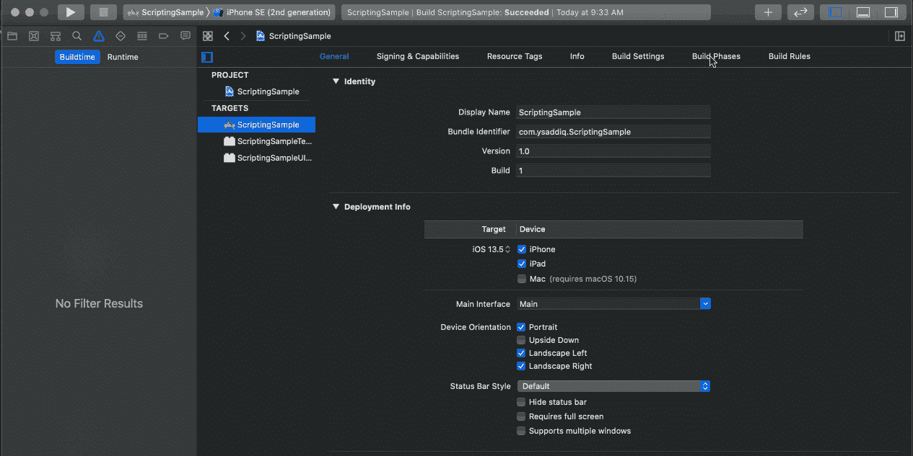
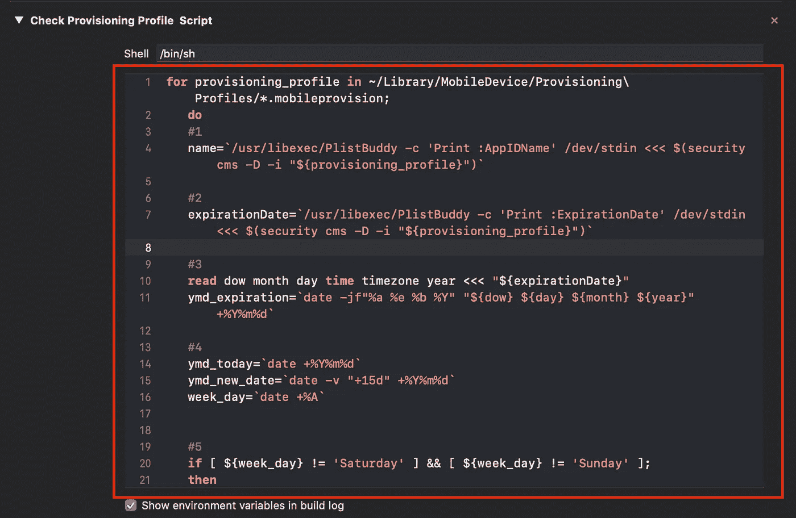
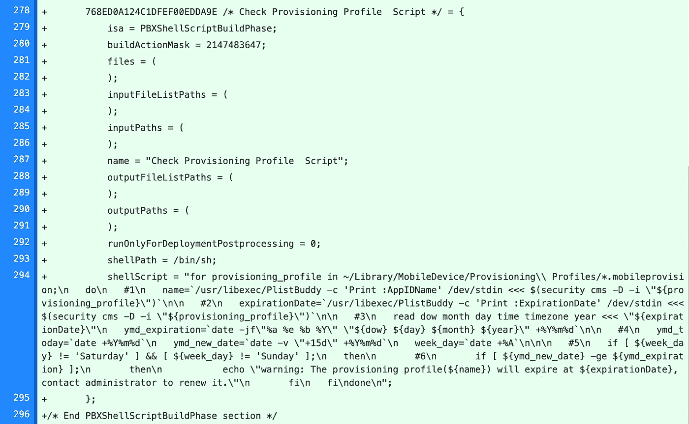
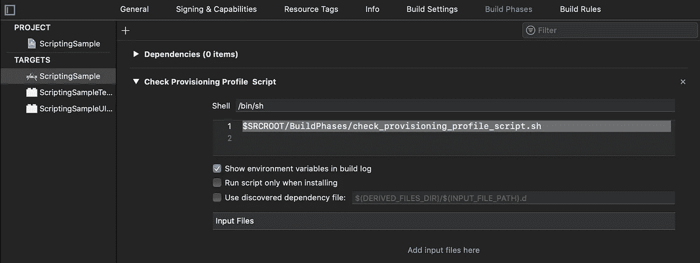
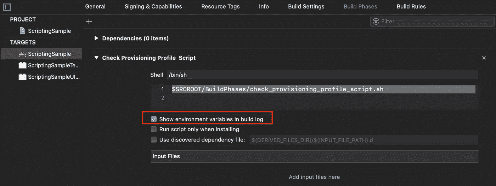

# 如何定制您的 Xcode 构建过程

> 原文：<https://blog.devgenius.io/how-to-customize-your-xcode-build-process-461749eacea4?source=collection_archive---------2----------------------->

贾里德·阿兰戈在 [Unsplash](https://unsplash.com/?utm_source=unsplash&utm_medium=referral&utm_content=creditCopyText) 上的照片

当您点击 **⌘B** 来构建您的项目时，Xcode 会启动一个复杂的过程，从组成您的程序的一组文本文件、资源和配置文件开始，到生成一个可执行的应用程序结束。

Xcode 提供了使用**构建阶段**部分中的**运行脚本阶段**来运行用户定义的代码作为构建过程的一部分的可能性。构建阶段的可贵之处在于，您可以添加自己的阶段。

您可以添加一个**运行脚本阶段**，它指示 Xcode 在构建的给定点运行命令行脚本，如 Shell、Ruby 或 Python 脚本。

在本教程中，您将向项目中添加 shell 脚本，以:

*   确保所需的工具可用。
*   使用版本、分支和提交哈希为您的应用程序图标添加水印。
*   将某些资源复制到特定的目标目录中。
*   如果预置描述文件即将过期，则发出警告。

# 确保所需工具可用

运行脚本构建阶段的一个常见用途是将第三方工具集成到构建过程中。但是当开发人员的机器中没有这样的工具时会发生什么呢？

让构建失败并通知您的新团队成员他们的设置未完成是一个好主意。

如果没有安装 **Swiftlint** ，您的第一个脚本将显示一个警告或错误。

您可以通过以下方式访问**构建阶段**:

1.  在主导航器窗格中选择您的应用程序。
2.  选择主应用程序目标。
3.  然后，从顶部的选项卡列表中选择**构建阶段**。

创建一个**新的运行脚本阶段**及其下面的脚本。

如果您喜欢警告而不是错误，请使用下面的脚本:

# 修改您的应用程序图标

定制构建阶段的另一个有用的用途是用版本号、分支名称和提交散列向应用程序图标添加水印。

为此，添加一个**新的运行脚本阶段**，在其中使用以下命令检索版本号、分支名称和提交散列:

之后，您可以使用 **ImageMagick** 编辑应用图标。如需完整示例，请查看本文:[http://Mero wing . info/2013/03/overlapping-application-version-on-top-of-your-icon](http://merowing.info/2013/03/overlaying-application-version-on-top-of-your-icon)

接下来，您将使用构建阶段将资源复制到特定的目标目录中。

# 管理您的应用资源

想象一下，修复一个应用程序中的一个错误，该应用程序有一个很大的视频，每次启动该应用程序都会显示这个视频。😒很烦吧？！。

使用运行脚本，您可以根据当前活跃的配置控制 Xcode 将哪些文件拷贝到捆绑包，而无需创建新的目标。

为此，在您的根应用程序文件夹中创建 **RunScriptResources** 目录，并添加调试(短)和生产(长)splash 视频，然后将下面的脚本添加到一个**新** **运行脚本** **阶段**。

上面的脚本根据构建类型将特定的视频文件从您的 **RunScriptResources** 目录复制到 app files 目录。

最后，在下一节中，您将使用**运行脚本阶段**在您的配置文件即将到期时抛出警告。

# 预置描述文件过期警告

如果由于持续集成环境或任何其他原因，您没有使用 Xcode 的**自动管理签名**功能和手动管理应用程序签名。

**运行脚本阶段**定制 Xcode 构建过程并在预置描述文件过期前抛出警告或错误变得非常方便。

重要的是要记住保持这些配置文件总是最新的，这样构建过程就不会在不适当的时候失败。

例如，当您准备发布一个新的版本，但是由于预配概要文件过期而导致构建失败时。同时，您不能在远程构建机器上更新这个配置文件，因为管理员正在休假😩(这是我的亲身经历)。在这一点上，你开始重新思考你的签名过程🤔。

使用**自动管理签名**功能总是更好，但是如果那不是一个选项，**运行脚本阶段**是你的救星。

创建一个新的**运行脚本** **阶段**并添加以下脚本:

下面是上述代码中每个带编号的注释所发生的情况:

1.  从预配描述文件 plist 中提取名称和到期日期。
2.  将到期日期转换为 YYYYMMDD 格式。
3.  生成当前日期和当前日期+15 天。
4.  生成当前日期名称并检查是否不是周末(你不想在管理员空闲的时候打扰他们，对吗🤨？！).
5.  如果今天+15 天大于或等于描述文件到期日，Xcode 将显示警告。

或者您可以告诉 Xcode 显示错误并停止构建过程。

真棒🥳，没有更多的建设将失败，由于配置文件。

接下来，您将学习一些创建和维护脚本的技巧😎。

# 运行脚本阶段提示

与所有软件一样，运行脚本阶段通常不会在第一次尝试时就出现(*至少对我来说不是*)。这里有四个建议:

## 命名您的脚本

Xcode 会将每个新的运行脚本阶段命名为*运行脚本*，但是当您有多个阶段时，这可能会很混乱。双击运行脚本标题以显示一个文本字段，您可以使用它来重命名您的阶段。

## **提取脚本**

在这样大小的文本区域中编写和编辑脚本并不理想。

更糟糕的是 Git 跟踪项目文件中脚本的方式。当你或你的队友做出改变时，很难回顾它们。

要改进您的构建脚本，请将它们提取到外部文件中。

在项目的根目录下创建一个 **BuildPhases** 目录，然后创建`check_provisioning_profile_script.sh`文件。从您之前创建的 Xcode 构建阶段编辑器中复制它的内容。

然后，通过在终端中使用下面的命令[改变它的权限](https://bash.cyberciti.biz/guide/Setting_up_permissions_on_a_script)，使您的脚本可执行:

最后，您可以用执行脚本的命令替换 Xcode 构建阶段编辑器中的脚本内容:

`$SRCROOT/BuildPhases/check_provisioning_profile_script.sh`

太好了，现在你和你的队友将编辑脚本本身，而不是`project.pbxproj.`阅读或审查脚本变得更加容易👍🏽。

## 报告错误

您可以使用`echo "error: message"`和`echo "warning: message"`来记录额外信息。这将帮助您调试脚本中的问题。

## 显示环境变量

确保**在构建日志中显示环境变量**复选框处于激活状态。如果构建失败，这将使 Xcode 打印所有环境变量的值，并且您将能够验证您对这些变量所做的假设是否正确。

# 从这里去哪里？

**运行脚本阶段**是非常有用的 Xcode 工具。它帮助您自动化许多任务，提高代码库的质量，并使您的团队生活更轻松。

学习如何编写 Bash 脚本。Ryan 的教程网站是一个学习它的好地方，它是一系列小而容易管理的步骤。

我希望你喜欢这个教程。如果你有任何问题或意见，请写在这里🤗。