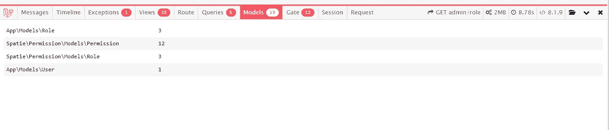

# 如何使用 Laravel Debugbar 调试 Laravel App

> 原文：<https://blog.devgenius.io/how-to-debug-laravel-app-using-laravel-debugbar-ec51a8587786?source=collection_archive---------1----------------------->

## Laravel 从头开始创建管理面板——第 16 部分

[Laravel Debugbar](https://github.com/barryvdh/laravel-debugbar) 是用于开发的最有用的 Laravel 包之一。这个 Laravel Debugbar 集成了 [PHP 调试栏](http://phpdebugbar.com/)

## 只为发展

仅将此 Debugbar 用于开发环境(用于本地开发)。不要启用生产，因为这会降低应用程序在加载时收集数据的速度。

# 装置

使用下面的命令用 composer 添加这个包。此外，建议只要求开发包。

```
composer require barryvdh/laravel-debugbar --dev
```

现在检查您的应用程序，调试栏将显示在页面底部。因为 Laravel 使用[包发现](https://laravel.com/docs/9.x/packages#package-discovery)，所以不需要您手动添加 ServiceProvider。

`APP_DEBUG`是`true`将启用调试栏。更新`APP_DEBUG`被`false`禁用。


# 供选择的

在了解 Debugbar 之前，我们将检查替代方案。最好的替代物之一是 Laravel 的官方 [Laravel 望远镜](https://laravel.com/docs/9.x/telescope)。

主要的区别是 Laravel 望远镜将数据保存在数据库表中。但是 Laravel Debugbar 将数据保存在缓存文件中。

# Laravel **Debugbar** 的特点

让我们用一个简短的描述来看看 Laravel Debugbar 的所有特性。

## 信息

此消息部分将显示所有日志消息。在你的控制器上登录。Debugbar 消息部分将显示您的所有日志。

```
\Log::error('Error log');
\Log::debug('Debug log');
\Log::notice('Notice log');
\Log::warning('Warning log');
```


您现在可以使用 Facade(添加时)添加消息，使用 PSR-3 级别(调试、信息、通知、警告、错误、关键、警报、紧急):

```
Debugbar::info('Info!');
Debugbar::error('Error!');
Debugbar::warning('Watch out…');
Debugbar::addMessage('Another message', 'mylabel');
```

确保在您的控制器中包含外观。否则调用\Debugbar::

```
use Barryvdh\Debugbar\Facades\Debugbar;
```

## 时间表

最好的功能之一是时间线。它将帮助您测量应用程序和特定操作的执行时间。

以下方法用于将测量添加到您的应用程序中。

```
Debugbar::startMeasure('render','Time for rendering');
Debugbar::stopMeasure('render');
Debugbar::addMeasure('now', LARAVEL_START, microtime(true));
Debugbar::measure('My long operation', function() {
    // Do something…
});
```


## 例外

该异常选项卡将显示异常。添加您的例外，如下所示

```
try {
    throw new \Exception('foobar');
} catch (\Exception $e) {
    Debugbar::addThrowable($e);
}
```


## 视图

该视图选项卡将显示所有渲染的刀片模板以及所有参数。


## 途径

这里你可以看到请求方法、使用的中间件、控制器、文件和名称空间。所有当前路线信息都可以在选项卡中找到。


## 问题

查询将显示此页面加载中所有已执行的查询。这是分析您的查询的有用选项卡，因为它将显示查询语句和持续时间。

还有，这是我最喜欢的一个。


## 模型

该选项卡将显示所有型号以及页面上使用的次数



## 大门

这将显示文件中调用的所有关卡检查。


## 会议

该选项卡将显示所有会话数据


## 请求

该选项卡将显示请求和响应的详细信息


此外，调试栏中还提供了更多的功能。比如显示 Laravel 版本，配置，缓存，邮件，事件。

## 如何启用和禁用功能

使用下面的命令将包配置复制到您的本地配置

```
php artisan vendor:publish --provider="Barryvdh\Debugbar\ServiceProvider"
```

发布配置后，更新`collectors`数组以禁用和启用数组值。

在配置[中查看更多可用选项 https://github . com/barryvdh/laravel-debug bar/blob/master/config/debug bar . PHP](https://github.com/barryvdh/laravel-debugbar/blob/master/config/debugbar.php)

https://github.com/balajidharma/basic-laravel-admin-panel 的[上有 Laravel 管理面板。安装管理面板并分享您的反馈。](https://github.com/balajidharma/basic-laravel-admin-panel)

感谢您的阅读。

敬请关注更多内容！

*跟我来*[***balajidharma.medium.com***](https://balajidharma.medium.com/)。

上一部分—第 15 部分:[启用邮件验证并自定义邮件模板](/laravel-enable-user-registration-email-verification-and-customize-email-templates-b994299ab27d)

下一部分—第 17 部分:[用 Laravel Dusk 进行浏览器测试](/browser-testing-with-laravel-dusk-aeef2e8b30f8)