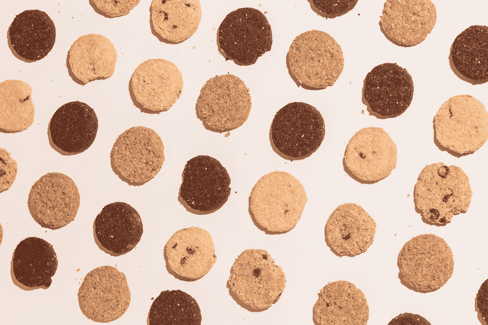

# 如何用 JavaScript 删除客户端 Cookie？

> 原文：<https://blog.devgenius.io/how-to-delete-a-client-side-cookie-with-javascript-66c8999096f1?source=collection_archive---------0----------------------->



[在](https://unsplash.com/@thecreative_exchange?utm_source=medium&utm_medium=referral) [Unsplash](https://unsplash.com?utm_source=medium&utm_medium=referral) 上创意交流的照片

有时，我们可能会在客户端存储 cookies，以跟踪用户设备上的事情。

而且有时候，我们想从用户的浏览器中删除 cookies。

在本文中，我们将研究如何用 JavaScript 删除客户端 cookie。

# 创建我们自己的函数

浏览器没有自带任何 API 来让我们轻松删除 cookies。

因此，我们必须创建自己的函数来删除用户浏览器中的 cookies。

为此，我们写道:

```
const getCookie = (name) => {
  return document.cookie.split(';').some(c => {
    return c.trim().startsWith(name + '=');
  });
}const deleteCookie = (name, path, domain) => {
  if (getCookie(name)) {
    document.cookie = name + "=" +
      ((path) ? ";path=" + path : "") +
      ((domain) ? ";domain=" + domain : "") +
      ";expires=Thu, 01 Jan 1970 00:00:01 GMT";
  }
}document.cookie = 'foo=bar'
deleteCookie('foo')
```

我们创建了`getCookie`函数来检查具有给定`name`值的 cookie。

我们通过用分号分隔`document.cookie`字符串来实现。

然后我们用`name`和等号调用分割字符串上的`startsWith`来检查是否有带有给定键的 cookie。

接下来，我们定义`deleteCookie`函数来检查带有给定键的 cookie 是否与`getCookie`一起存在。

如果是，那么我们通过追加以下内容将一个`expires`日期和时间添加到字符串的末尾:

```
";expires=Thu, 01 Jan 1970 00:00:01 GMT"
```

敬它。

删除 cookie 的方法是将其到期日期设置为当前日期和时间之前的日期和时间。

因此，当我们在倒数第二行设置 cookie 并在其后用相同的键调用`deleteCookie`时，我们不会看到 cookie 被设置，因为它在其后立即被添加和删除。

# 结论

我们可以从用户的浏览器中删除一个客户端 cookie，方法是用给定的密钥将 cookie 的到期日期设置为当前日期和时间之前的某个日期和时间。