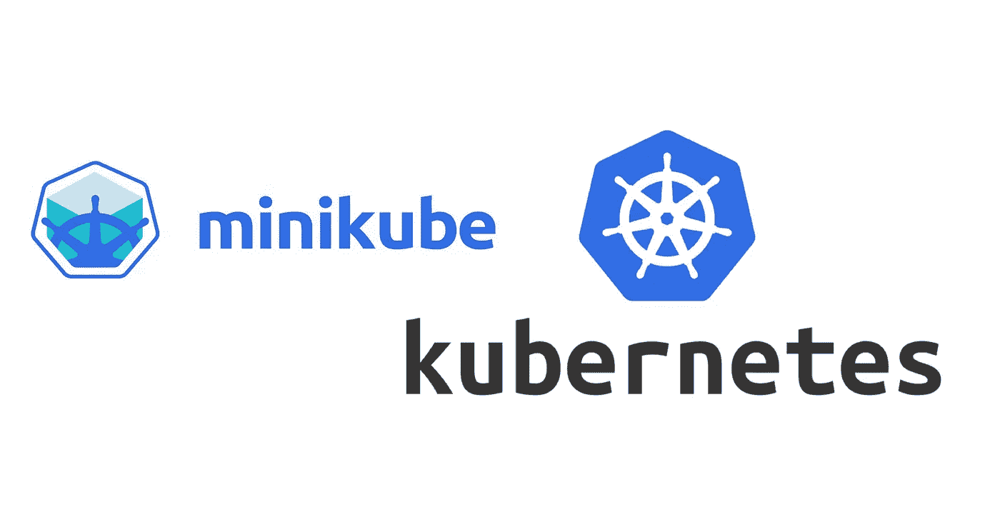
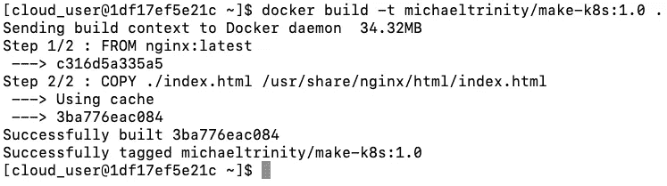
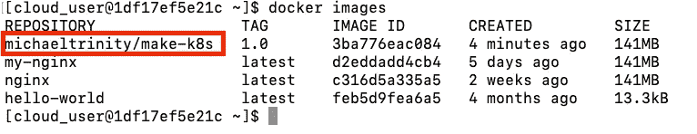
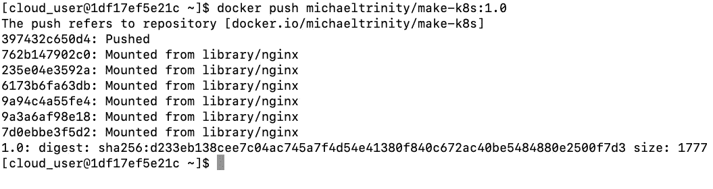
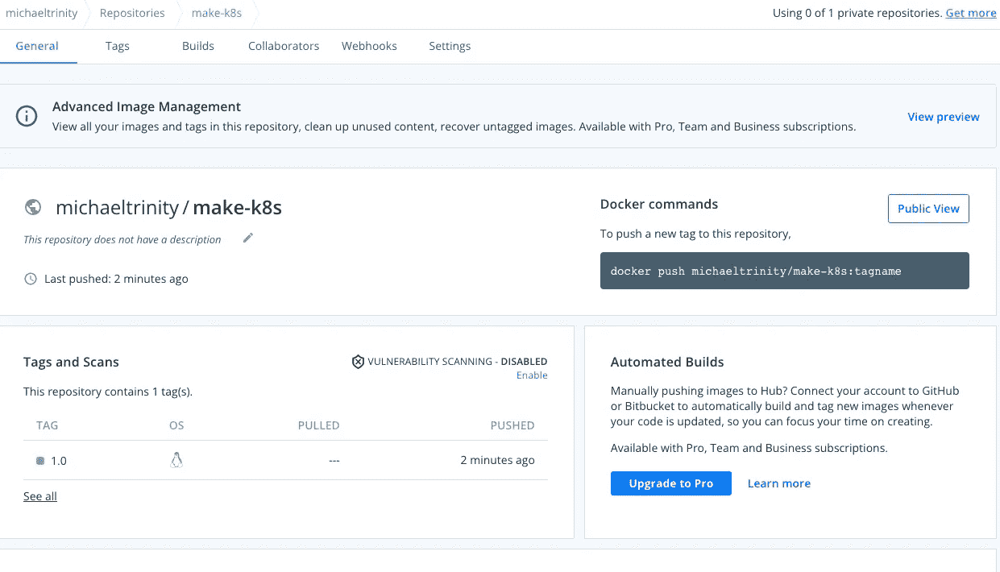
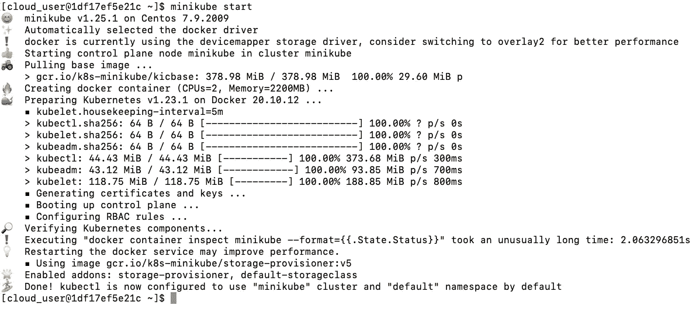
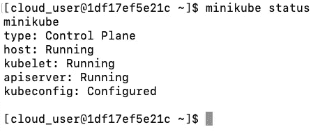
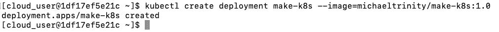
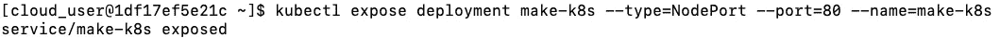
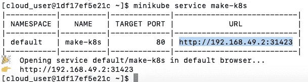

# 如何通过单节点 Kubernetes 集群部署 Dockerfile

> 原文：<https://blog.devgenius.io/how-to-deploy-a-dockerfile-through-a-single-node-kubernetes-cluster-7a87d01a927c?source=collection_archive---------15----------------------->



什么是 Kubernetes？
**Kubernetes** 或**“K8s”是由 [Google](https://medium.com/u/be36e94a7e47?source=post_page-----7a87d01a927c--------------------------------) 开发的开源容器编排工具。Kubernetes 帮助您管理、调度、部署大量的容器化应用程序。**

**记住 [**Docker**](https://medium.com/dev-genius/how-to-create-an-nginx-docker-image-and-register-it-with-aws-ecr-7b973940c033) ，是用来容器化你的软件的平台。容器是正在运行的 Docker 映像。**

**MiniKube 是什么？
**MiniKube** 是一个工具，*允许您在本地计算机上运行单节点 Kubernetes 集群*。**

**Kubctl 是什么？
**Kubctil** 是一个命令行工具，用于向集群的主节点进行身份验证，以便您可以管理它。**

****目标**:创建 Dockerfile 并通过单节点 Kubernetes 集群部署它。**

> *****先决条件:***Docker 已安装
> [Docker Hub](https://hub.docker.com/) 账号
> Minikube
> Kubectl
> Vim**

# **步骤 1:用 Vim 创建 Index.html 和 Dockerfile**

**使用 Vim 创建下面的文件，并将它们保存在当前目录中:**

# **步骤 2:构建 Docker 映像**

**在构建映像之前，确保您已经安装了 [**Docker Hub**](https://hub.docker.com/) 帐户和 Docker。在使用以下命令从终端登录后:**

```
 docker login
```

**现在您已经登录，通过在保存 index.html 和 Docker 文件的目录中运行这个命令来构建 Docker 映像。运行以下命令:**

```
docker build -t **<dockerhub_username>**/**<name_of_file>**:**<tag>** .
```

**请在命令中用 1.0 或任何名称标记上面的图像。**

****

**验证映像是否已创建:**

********

# **步骤 3:将图像推送到 Docker 存储库**

**将映像推送到 Docker Hub 存储库，以便 Kubernetes 集群可以访问它:**

```
docker push **<dockerhub_username>**/**<name_of_file>**:**<tag>**
```

****

**登录您的 DockerHub 帐户，并验证您的图像已被推送:**

****

# **步骤 4:启动 Minikube**

**我们使用 MiniKube 是因为它允许您在本地计算机上运行单节点 Kubernetes 集群。**

1.  **使用以下命令启动 Minikube:**

```
 minikube start
```

****

**检查集群的状态:**

```
 minikube status
```

****

# **最后一步:创建部署**

**接下来，我们需要*创建、公开和验证*部署:**

```
kubectl create deployment **<name_of_file>** --image=**<dockerhub_username>**/**<name_of_file>**:**<tag>**
```

****

**揭露它:**

```
kubectl expose deployment **<name_of_file>** --type=NodePort --port=80  --name=**<name_of_file>**
```

****

**验证部署成功，并且我们可以访问它:**

```
minikube service **<name_of_file>**
```

****

**就是这样！您成功地创建了一个 Docker 映像，将其推送到 Docker Hub，使用 Minikube 访问映像，并将其部署在 Kubernetes 上！**

**资源:**

**[https://computingforgeeks . com/how-to-install-minikube-on-centos-Linux-with-KVM/](https://computingforgeeks.com/how-to-install-minikube-on-centos-linux-with-kvm/)**

 **[## 构建 Docker 映像并将其部署到 Kubernetes 集群

### 将 Docker 映像部署到 Kubernetes 是以一种易于扩展的方式运行应用程序的好方法。开始使用…

www.bluematador.com](https://www.bluematador.com/blog/building-and-deploying-to-kubernetes)**