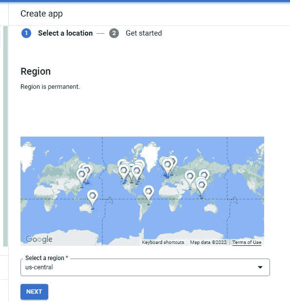

# 如何在谷歌云平台(GCP)的谷歌应用引擎(GAE)上部署一个 Laravel 应用程序

> 原文：<https://blog.devgenius.io/how-to-deploy-a-laravel-application-on-google-app-engine-gae-in-google-cloud-platform-gcp-25ef17286eba?source=collection_archive---------6----------------------->


Laravel 在 Google 云平台上的部署

在本文中，我们将使用 [Google cloud app engine](https://cloud.google.com/appengine) 在云上部署一个 Laravel 应用程序。

构建单一的服务器端渲染网站。App Engine 通过一系列开发工具支持流行的开发语言。

新客户可以获得 300 美元的免费积分，用于购买 App Engine。所有客户每天在标准环境中免费获得 28 个实例，不从您的点数中扣除。

*   通过此快速入门使用 App Engine 部署网站
*   通过零服务器管理和零配置部署解放您的开发人员
*   支持流行的开发语言和一系列开发工具，保持敏捷
*   [**选择合适的 App 引擎环境**](https://cloud.google.com/appengine/docs/the-appengine-environments)

了解如何使用灵活的环境和/或标准环境在 App Engine 中运行您的应用。

*   [**App 引擎标准环境**](https://cloud.google.com/appengine/docs/standard)

了解 App Engine 标准环境如何简化应用程序的构建和部署，即使在高负载和大量数据的情况下也能可靠运行。

*   [**App 引擎灵活环境**](https://cloud.google.com/appengine/docs/flexible)

了解 App Engine 如何让开发人员专注于他们最擅长的事情:编写代码。

*   创建一个谷歌云平台(GCP)账户

如果您没有帐户，您可以创建一个或登录[此处](https://console.cloud.google.com/)

*   准备您的项目

创建帐户后，您应该会看到这个屏幕


*   **接下来，在控制台仪表板上搜索 app engine**


*   点击创建“应用程序”

创建用于部署的应用程序引擎

*   选择应用程序的位置，然后单击下一步



*   选择 PHP 作为资源


*   当您点击“下载 SDK”时，您将被重定向到此[页面](https://cloud.google.com/sdk/?_ga=2.70963600.-1639499822.1644143128)

在这里找到你的操作系统的谷歌云命令行界面安装程序


探索更多关于 [Google Cloud CLI](https://cloud.google.com/cli) 的完整指南

*   下载 SDK 并以管理员身份安装
*   接下来，遵循安装设置说明(非常简单)

最后，会弹出一个窗口，要求您确认是否要启动 gcloud init。

它会提示浏览器登录或选择要使用的帐户，当你关闭窗口时，它会自动在 shell 上继续

设置方法类似于 Heroku 的命令行界面安装。安装会自动设置环境变量

*   成功安装和设置后，出现此窗口


我们将在 Laravel 中托管用于演示[谷歌云特性集成的 Laravel 应用程序，如果你打算按照本教程尝试它是如何工作的，你可以在这里](https://alemsbaja.hashnode.dev/how-to-use-google-cloud-vision-api-safe-search-detection-to-detect-explicit-content-on-image-uploads-in-laravel)找到库[。](https://github.com/RaphAlemoh/google_cloud_vision_features)

*   接下来，在 Laravel 根目录下创建 app.yaml 文件。


因为 Laravel 使用 env 文件加载应用程序，所以我们将在 app.yaml 文件中使用相同的 env 变量和值来加载应用程序引擎上的应用程序。

查看文档[此处](https://cloud.google.com/appengine/docs/flexible/php/reference/app-yaml)了解更多关于 app yaml 文件配置的信息。

**注意:**在。gitignore file 添加此选项以忽略提交到存储库的 app.yaml 文件

```
app.yaml
```

*   让我们更新 app.yaml 文件以反映所需的 env 变量

该部署适用于— Laravel 版本 9 和 PHP 版本 8.1

```
runtime: php81  # version of php
env: standard     # set app engine env to standardruntime_config:
  document_root: .# for detecting static files in the public folder
handlers:
  - url: /(.*\.(gif|png|jpg|css|js))$
    static_files: public/\1
    upload: public/.*\.(gif|png|jpg|css|js)$
  - url: /.*
    secure: always
    redirect_http_response_code: 301
    script: autoenv_variables:
  APP_KEY: base64:_________________
  APP_STORAGE: /tmp
  VIEW_COMPILED_PATH: /tmpDB_CONNECTION: mysql
  DB_HOST: 127.0.0.1
  DB_PORT: 3306
  DB_DATABASE: root
  DB_USERNAME: root
  DB_PASSWORD: ""APP_NAME: "Google cloud vision"
  APP_ENV: production
  APP_DEBUG: true
  APP_URL: ""
  ASSET_URL: ""SESSION_DRIVER: cookieQUEUE_CONNECTION: syncMAIL_MAILER: smtp
  MAIL_HOST: ""
  MAIL_PORT: 465
  MAIL_USERNAME: ""
  MAIL_PASSWORD: ""
  MAIL_ENCRYPTION: ssl
  MAIL_FROM_ADDRESS:
  MAIL_FROM_NAME: "Google cloud vision"PUSHER_APP_ID:
  PUSHER_APP_KEY:
  PUSHER_APP_SECRET:
  PUSHER_APP_CLUSTER: mt1//the tmp folder is used for caching on GCP as opposed to the default storage folder
  APP_SERVICES_CACHE: /tmp/services.php
  APP_PACKAGES_CACHE: /tmp/packages.php
  APP_CONFIG_CACHE: /tmp/config.php
  APP_ROUTES_CACHE: /tmp/routes.php
```

*   查看凭据帐户

```
gcloud auth list
```

凭证账户

*   如果您有多个已鉴定的帐户，您可以使用下面的命令来设置活动帐户:

```
gcloud config set account `ACCOUNT` 
```

*   使用下面的命令删除缓存文件

```
php artisan optimize:clear
```


*   检查您的帐户上是否有多个项目

```
gcloud projects list
```


**注意:您可以使用配置集来设置特定的项目**

```
gcloud config set project project-id
```

如果项目配置成功，它将返回以下输出

**更新属性【核心/项目】。**

*   让我们使用 gcloud deploy 命令来部署应用程序

```
gcloud app deploy
```

或者您可以使用下面的命令来部署特定的项目。

```
gcloud config set project project-id
```

**注意:**如果你遇到这个错误


请去。gcloud 忽略文件并忽略 node_modules 和存储日志文件。

```
# PHP Composer dependencies:
/vendor/
/storage/logs/laravel.log
/node_modules/
```

*   部署进度


你想继续吗？键入 y，然后按 enter 键

```
y
```


*   要从命令行流式传输日志，请运行:

```
gcloud app logs tail -s default
```

*   要在 web 浏览器上查看应用程序，请运行:

```
gcloud app browse
```


*   要进行快速匿名调查，请运行:

```
gcloud survey
```

*   要安装 Google cloud CLI 组件的可用更新，请以管理员身份运行以下命令，最好是在 Google Cloud CLI 上运行:

```
gcloud components update
```

前往应用引擎仪表板，查看应用部署的**实例**、**版本**等


*   在“设置”部分，您可以设置自定义域

App Engine 允许您通过自定义域提供应用程序。如果你使用自定义域，谷歌将提供一个受管理的自动更新 SSL 证书的安全性。


对于文件上传和管理，你可以使用谷歌云存储，这在本文[中有所涉及。](https://alemsbaja.hashnode.dev/how-to-upload-files-to-google-cloud-storage-from-a-laravel-application)

在下一篇文章中，我们将介绍如何在 Google 云平台上为 Laravel 应用程序建立一个数据库。

> ***感谢您阅读本文。***

请与您的网络分享，并随时使用评论区的问题，答案和贡献。

你喜欢这篇文章吗？？请在 Hashnode [alemsbaja](https://alemsbaja.hashnode.dev/) 或 Twitter [@alemsbaja](https://alemsbaja.hashnode.dev/twitter.com/alemsbaja) 上关注我，了解更多文章的最新动态

*原发布于*[*https://alemsbaja . hashnode . dev*](https://alemsbaja.hashnode.dev/how-to-deploy-a-laravel-application-on-google-app-engine-gae-in-google-cloud-platform-gcp)*。*