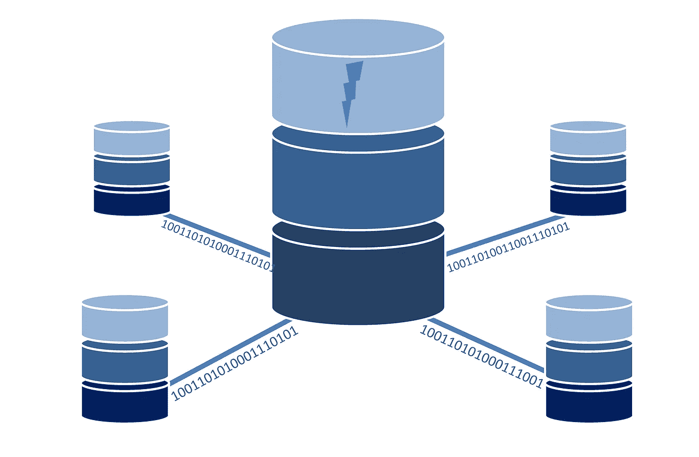

# 如何使用 docker-composite 部署 MongoDB 副本集

> 原文：<https://blog.devgenius.io/how-to-deploy-a-mongodb-replicaset-using-docker-compose-a538100db471?source=collection_archive---------0----------------------->

图米苏，请考虑☕谢谢！🤗来自[皮克斯拜](https://pixabay.com/?utm_source=link-attribution&utm_medium=referral&utm_campaign=image&utm_content=1954920)

# 介绍

在这个小的 MongoDB 概述中，我们将介绍一些与副本集相关的重要 MongoDB 概念。在一些概念展示之后，我们将会看到一些使用 docker-composite 的例子。我们将使用可以在参考部分找到的官方 MongoDB 文档作为主要信息来源。没有更多的到期，让我们开始吧。

这个故事组织如下:

*   **什么是复制品？**
*   **为什么需要一个副本集？**
*   **操作日志**
*   **在 MongoDB 中复制是如何工作的？**
*   **MongoDB 副本集中的仲裁器是什么？**
*   **安全**
*   **部署副本集的策略**
*   **复制 VS 切割**
*   **求真务实**
*   **奖金**
*   **结论**

# 什么是副本集？

mongo 中副本集的概念只是意味着不再运行 mongo 的一个进程，您将拥有多个进程。这样，您可以实现更高的数据可用性和冗余性，这是生产类环境的两个重要质量属性。在本文中，MongoDB 允许一个副本集中有 50 个实例。

# 为什么需要一个副本集？

许多场景可能会说服您在您的环境中实现一个副本集，但以下是其中一些场景(不一定通过这里显示的概念证明来解决):

*   根据配置，确保更高的读写速度(在一定程度上)；
*   将数据库“拷贝”用于不同的目的(读取、写入、备份、报告、灾难恢复—此时需要配置多区域设置)。

如果您现在已经确信它是什么，以及您如何从中受益，那么让我们来谈谈其他有趣的特性！

# Oplog

虽然这个术语在这个主题序列中感觉很奇怪，但是对什么是 Oplog 的介绍起着重要的作用，因为 MongoDB 的复制利用了这个概念，因此对于理解副本集的全貌是必不可少的。

Oplog 代表操作日志，它是副本集中的一个特殊集合，其主要目标是记录不同集合中所做的所有更改。由于您可能会怀疑某些节点会使用它，因此它的大小配置可能会有问题(为了不产生瓶颈)，所以请确保检查并了解如何根据您的用例对它进行微调。

# MongoDB 中的复制是如何工作的？

如前所述，副本集有许多节点，它们共同管理一个数据集。这些节点可以用不同的策略保持镜像数据，并且在镜像方式上有不同的偏好(复制、读取节点、备份节点等的偏好)。设置副本集时，默认情况下，其中一个节点成为主节点，而其他节点成为辅助节点。这是我们的例子所考虑的问题之一。在我们的场景中，最有益的行为是确保一个定义的节点总是成为主节点。主节点的主要作用是确保所有写入都由其处理。现在让我们想象你关闭主节点，会发生什么？在这种情况下，会进行一次“选举”,以便辅助节点成为新的主节点。选举可以由一系列原因触发，但很多时候归结为同一个原因，心跳(就像 ping 端点)。当这种情况没有发生时(心跳间隔的配置是可配置的)，主节点不断告诉其他节点它们是“活的”，第一个意识到这一点的次节点请求选举。

辅助角色的作用是异步复制主节点中的数据。现在我们可能想知道，复制是如何工作的？复制是通过发送操作日志条目来进行的。操作日志保存数据库中的所有更改，这意味着辅助节点不是仅接收主节点接收的相同“命令”,而是从主节点接收操作日志(它们是为此专门设计的),以便它们复制其数据集的类似状态。

# MongoDB 副本集中的仲裁器是什么？

既然我们知道什么是“选举”，那么简单的是，仲裁者只是一个只负责参与选举的角色。它对数据冗余质量属性没有帮助。那么，我们为什么要有一个仲裁者呢？一个可能的答案是，你没有足够的票数或者票数是偶数。如果您不能增加辅助实例的数量(想象一下成本或资源方面)，您可以添加一个仲裁器来达到目的。

# 安全性

您可以将副本集配置为使用授权，在这种情况下，不同实例交换的所有通信都将被加密。在某些情况下，您可能还需要配置副本集成员之间的安全性。

# 部署副本集的策略

对于生产环境，MongoDB 文档推荐的方法是 3 成员副本集。虽然 MongoDB 建议您根据当前策略运行为系统准备的不同场景，但这也是明智的。如果您希望部署在不同的区域，这将影响您的 MongoDB 策略，您可能希望不是 3 个成员，也许有第四个成员将在不同的区域备份数据。另一方面，如果您有高容错要求，也可以考虑最少拥有 5 或 6 个成员。

底线是你需要彻底考虑这个问题。值得注意的一点是，更改配置看起来非常简单，因此，考虑到您有时间进行试验，您应该可以通过使这成为一个迭代过程(在开发过程中)来完成。

# 复制与分片

这个主题将提供足够的信息来涵盖一个完全不同的故事，但有时理解这个在相同上下文中一起使用的概念是很重要的。如本文所述，复制是通过配置新节点并为每个节点提供定义的角色来实现的。假设这一点，让我们考虑下面的场景，如果您在主节点上达到性能极限(写入和读取)会发生什么，可以做些什么来提高它？你应该考虑的一个选项是分片，通过分片，你将“分割你的节点”,你将使每个“分片”负责一些操作。因此，您将拥有一个“大块”数据集，而不是每个节点一个完整的数据集。在许多情况下，这更有利于提高性能。

# 变得实际

我们将使用这一节来介绍运行一个简单示例所需的不同文件，请务必遵循说明，并特别注意不同文件应该放在哪里，以便 docker-compose 正确地挂载它们。

要实现简单的 3 PSS 节点架构(主要-次要-次要),您可以使用 docker-compose，如下所示:

基本上，通过这种配置，我们将确保 **mongo1** 始终是我们的主节点，对于所有相互通信的节点，我们使用一个名为“**mongo-network”**的网络。我们特别将所有脚本加载到它的目录中。

正如在整个故事中提到的，为了让您始终获得相同的主实例，您需要选择具有更高优先级的实例，这可以通过使用具有相同名称" **priority** "的字段来实现，为了应用这些更改，我们将使用一个将安装在 **mongo1** 容器中的脚本(所有这些脚本都应该放在一个名为" **scripts** "的新文件夹中):

查看脚本后，您会注意到声明了一些延迟，这是为了给容器启动提供时间，最重要的是，为了让选举发生，以便我们的 mongo1 准备好作为主节点开始接收连接。

接下来，为了让 mongo 准备好接受您的插入并创建新用户和数据库，我们使用了一个小 javascript 文件，该文件可以扩展以满足您的需求(也可以添加到" **scripts** "文件夹中):

最后，为了触发这个例子，我们可以使用一个小的 bash 脚本将所有东西粘在一起:

这个脚本不仅仅是运行 docker-compose 文件，它还从清理 docker 环境开始，到执行我们之前装载到 **mongo1** 中的脚本结束。

**注意:**根据评论中的一些讨论，请注意执行**第 6 行**和**第 7 行**将清理您的 docker 环境，我个人使用了这个脚本，来帮助我迭代我所做的不同实验，如果它不适合您的用例，请随意删除/评论它们。

# 奖金

让我们想象一下，您不是拥有一个 3 节点体系结构，而只是希望有一个节点作为副本集工作，这可以通过一个简单的 docker-compose 来实现，如下所示:

# 结论

在这个故事中，简要介绍了 MongoDB 的一些重要概念，以及一些关于如何选择架构和需要考虑哪些因素的想法。在最后一部分，两个实例展示了什么是副本集以及如何配置它们。要获得更多信息，请务必查看 MongoDB 官方文档！

感谢您花宝贵的时间阅读这个故事，我希望它在某些方面对您有所帮助。如果您有任何反馈，请务必使用下面的评论。如果你喜欢这个故事，鼓掌，如果你想继续关注我的故事，也可以随意关注。

# **参考文献**

 [## 欢迎阅读 MongoDB 文档

### 找到使用数据库、可视化数据和在上构建应用程序所需的指南、示例和参考资料

www.mongodb.com](https://www.mongodb.com/docs/) 

[https://zgadzaj . com/development/docker/docker-compose/turning-standalone-MongoDB-server-into-a-replica-set-with-docker-compose](https://zgadzaj.com/development/docker/docker-compose/turning-standalone-mongodb-server-into-a-replica-set-with-docker-compose)