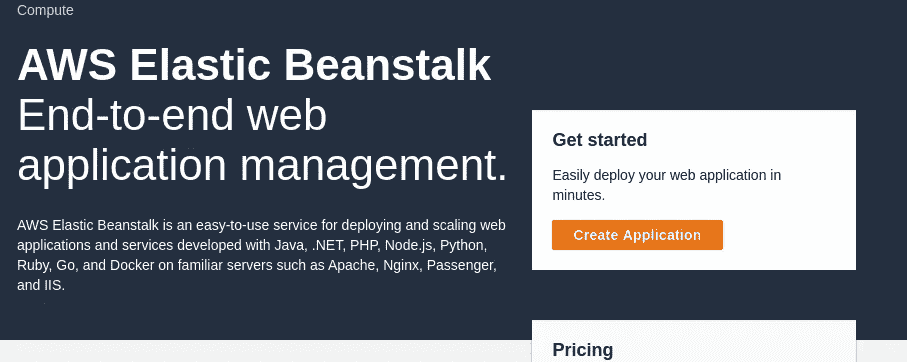
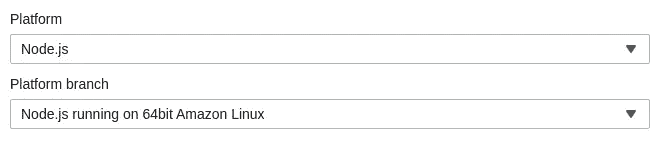
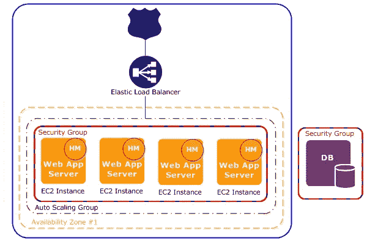
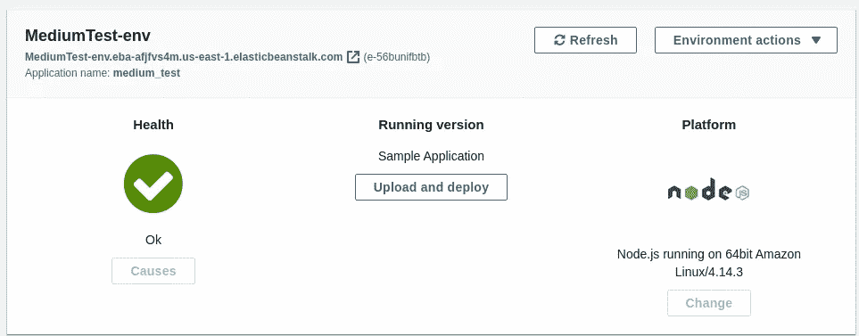
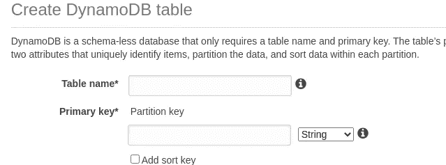
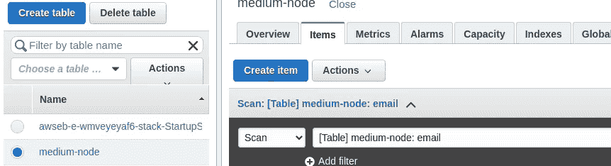
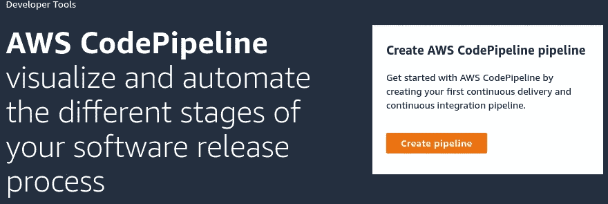
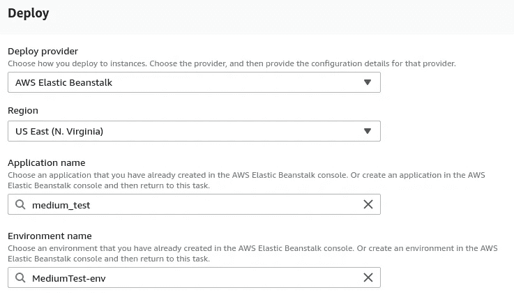
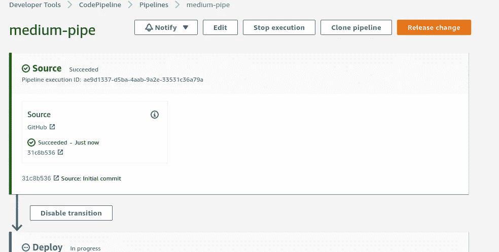
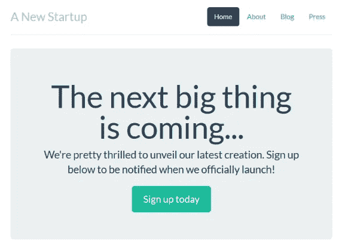

# 如何使用代码管道和弹性 Beanstalk 在 AWS 上部署 NodeJs 应用程序

> 原文：<https://blog.devgenius.io/how-to-deploy-a-nodejs-app-on-aws-with-elastic-beanstalk-6773391d16b9?source=collection_archive---------0----------------------->


孩子们显然很乐意在弹性豆茎上部署站点

这并不是什么新鲜事，但 AWS(亚马逊网络服务)网站上的说明就像没有颜色的拼图一样清晰。你能做它，但是它将需要一段时间。

微服务是软件块，可以做你想让它们做的任何事情，云计算让世界上所有类型的服务都可用。

所以在这里我翻译了使用代码管道(Github)用 Elastic Beanstalk 部署 NodeJS app(亚马逊提供的模板)的步骤。

首先，您需要安装一些东西:

*   **节点:** `sudo apt-get install nodejs`
*   **npm:** `sudo apt-get install npm`
*   **git:**

## 步骤 1:创建一个弹性 Beanstalk web 应用程序

在管理控制台中，您会发现弹性 Beanstalk 选项。点击它，你会得到这个屏幕:



现在点击橙色按钮，系统会提示您输入一些信息。

在应用程序名称下，你可以设置任何你喜欢的名称，将应用程序标签留空，然后在“平台”菜单中选择 NodeJs。

另外，在选择 Node 之后的 platform 部分，选择‘Node . js running on Amazon Linux’。您需要选择这个 Amazon Linux 选项，因为 AWS 提供的模板(我知道)不支持结尾带有' 2 '的选项。



选择这些选项

然后选择“示例应用程序”并单击“创建应用程序”。就是这样！

这一步会创建一堆东西，并自动完成这个过程，所以只需要几分钟。为了进一步说明:



来自 [AWS](https://docs.aws.amazon.com/elasticbeanstalk/latest/dg/concepts-webserver.html) 的 img

完成所有操作后，您会看到:



弹性 Beanstalk web 应用程序已部署

如果您单击应用程序名称下的 url，您将看到为您生成的示例页面，但让我们用一个更酷的页面来替换它。

## 第二步:权限

在 AWS 中，权限是在 IAM(身份和访问管理)部分处理的。

因为我们已经创建了我们的 Elastic Beanstalk 应用程序，并且希望使用 DynamoDB 数据库，所以我们必须为 EC2 实例提供一些权限，以便能够访问 Dynamo(就像 AWS 完全是关于同意一样)。

转到管理控制台，寻找“IAM”，它应该在“安全”部分。现在在左侧垂直菜单中选择“角色”。

如果向下滚动，您将看到所有可用角色名称的列表，单击“aws-elasticbeanstalk-ec2-role”并单击“Attach policies”。

现在您将看到一个搜索栏，您必须在其中查找这两个策略:

*   **AmazonDynamoDBFullAccess**
*   **amazonsfunllaccess**

搜索它们，通过单击左边的框选择它们，然后单击底部的“附加策略”。你可以一次做两件事，也可以一件一件做，两种方式都可以。

完成此操作后，您将回到 ec2 实例的“roles”部分，如果您向下滚动，将会看到新添加的内容。

## 步骤 3:创建 DynamoDB 表

创建一个发电机表也只需点击几下鼠标。

回到主控制台，寻找数据库部分，在这里你会看到一堆选项，但是这次让我们使用 Dynamo。

选择 Dynamo 后，您应该会看到创建表格的选项，单击它，您会看到以下页面:



DynamoDB 表创建

只需输入任何表名，并在主键下键入“电子邮件”。没别的；只需向下滚动并选择“创建”。这是您接下来应该看到的:一个列表，右边是您当前的表和内容。



DynamoDB 仪表板

## 步骤 4: Git 存储库

转到你的 Github 账户，建立一个存储库，然后克隆到你的电脑上。

您可以将任何您想要的名称放在存储库中，并用一个自述文件对其进行初始化。

请记住，您可以使用以下命令在本地克隆您的存储库:

`git clone HereGoesTheUrlForTheRepository`

一旦你在你的电脑上克隆了你的库，你需要从[这个](https://github.com/awslabs/eb-node-express-sample/releases/download/v1.1/eb-node-express-sample-v1.1.zip)库中下载并解压文件。这是示例 Node.js 应用程序，它与我们之前创建的 DynamoDB 一起工作。

您需要修改一个名为`options.config`的文件，它位于一个名为`.ebextensions/`的隐藏文件夹中。

以下是您需要做的修改，它们只是 2:

```
option_settings:
 aws:elasticbeanstalk:customoption:
 NewSignupEmail: [**T**](mailto:sergiopietri@gmail.com)**YPE YOUR EMAIL HERE**
 aws:elasticbeanstalk:application:environment:
 THEME: “flatly”
 AWS_REGION: ‘`{“Ref” : “AWS::Region”}`’
 STARTUP_SIGNUP_TABLE: **TYPE THE DB NAME YOU CREATED HERE**
 NEW_SIGNUP_TOPIC: ‘`{“Ref” : “NewSignupTopic”}`’
 aws:elasticbeanstalk:container:nodejs:
 ProxyServer: nginx
 aws:elasticbeanstalk:container:nodejs:staticfiles:
 /static: /static
 aws:autoscaling:asg:
 Cooldown: “120”
 aws:autoscaling:trigger:
 Unit: “Percent”
 Period: “1”
 BreachDuration: “2”
 UpperThreshold: “75”
 LowerThreshold: “30”
 MeasureName: “CPUUtilization”
```

这样做之后，删除位于同一文件夹中的一个名为`create-dynamodb-table.config`的文件。

现在将您的文件和更改推送到 GitHub 存储库中。

注意:您也可以简单地将示例应用程序的内容拖放到 GitHub 站点的存储库中。

## 步骤 5:设置代码管道

在这个过程的最后一部分，我们将设置部署管道，以便于对应用程序进行更改。我们将使用我们在步骤 4 中创建的存储库来使连续部署变得更加容易！

再次转到管理控制台，在“开发工具”部分下查找“CodePipeline”。



代码管道页面入门

现在选择“创建管道”选项。

在这里，您将被要求输入一个管道名，您可以按照自己的意愿设置一个管道名。然后单击下一步。

在源代码阶段，从下拉菜单中选择“Github ”,然后点击“连接到 Github”登录您的帐户。

现在点击输入框“Repository ”,找到您之前创建的那个，然后在下面的输入框“Branch”中选择主分支(很可能是唯一显示的)。

跳过构建阶段。

最后，在部署阶段选择 Elastic Beanstalk 作为部署提供者，然后您所在的地区和更多选项将会出现。

在“应用程序和环境名称”下，单击您将看到您创建的框，选择它们并单击“下一步”。



完成这些步骤后，您将看到您正在创建的管道的摘要，并在最后选择“创建管道”。按下它，几分钟后您就会看到这个屏幕:



部署屏幕

这里您可以看到源代码(github 存储库)检查成功，然后它将部署它在存储库中找到的内容。

部署阶段需要几分钟时间，然后它也会显示绿色。在部署失败的情况下，它会显示一个红色的叉号和一条消息，以便您可以调试它。

现在，每次你做一个改变并上传到你的库，改变会自动发生，而你不需要做任何其他事情。

恭喜你！现在，您可以访问弹性豆茎部分的 URL 并查看结果。



亚马逊的节点。Js 模板网站

我希望你喜欢这篇文章！如果你有任何反馈，请告诉我。我试图尽可能简化这个过程。

在推特上联系我:[塞尔吉奥·皮耶特里](https://twitter.com/SergioPietri)

来源:

 [## 将带有 DynamoDB 的 Node.js 应用程序部署到 Elastic Beanstalk

### 部署一个样例 Node.js 应用程序，该应用程序使用 DynamoDB 和 Amazon SNS 以及 Node.js 中的 AWS SDK for JavaScript 和…

docs.aws.amazon.com](https://docs.aws.amazon.com/elasticbeanstalk/latest/dg/nodejs-dynamodb-tutorial.html#nodejs-dynamodb-tutorial-deploy)  [## Web 服务器环境

### 下图显示了一个 web 服务器环境层的示例弹性 Beanstalk 架构，并显示了如何…

docs.aws.amazon.com](https://docs.aws.amazon.com/elasticbeanstalk/latest/dg/concepts-webserver.html)