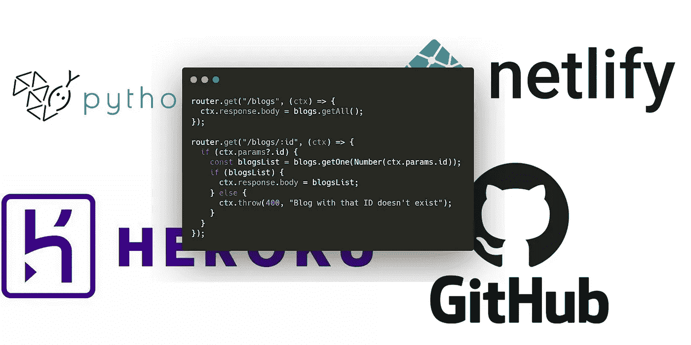
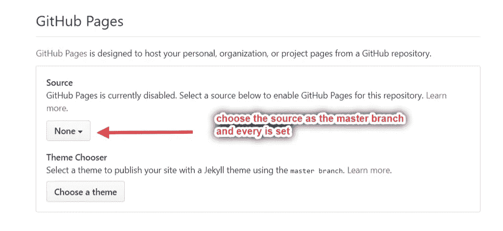
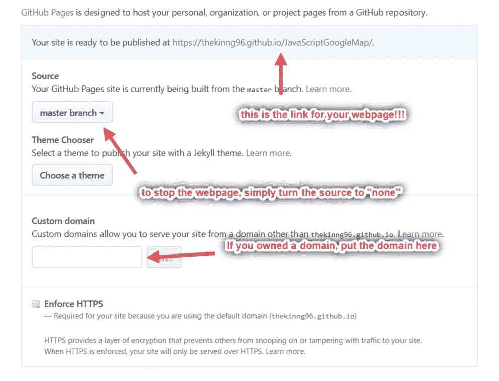
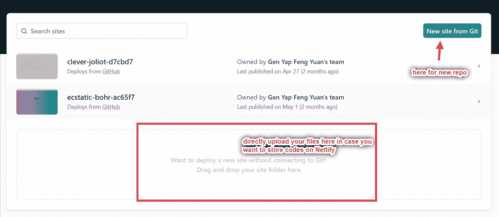
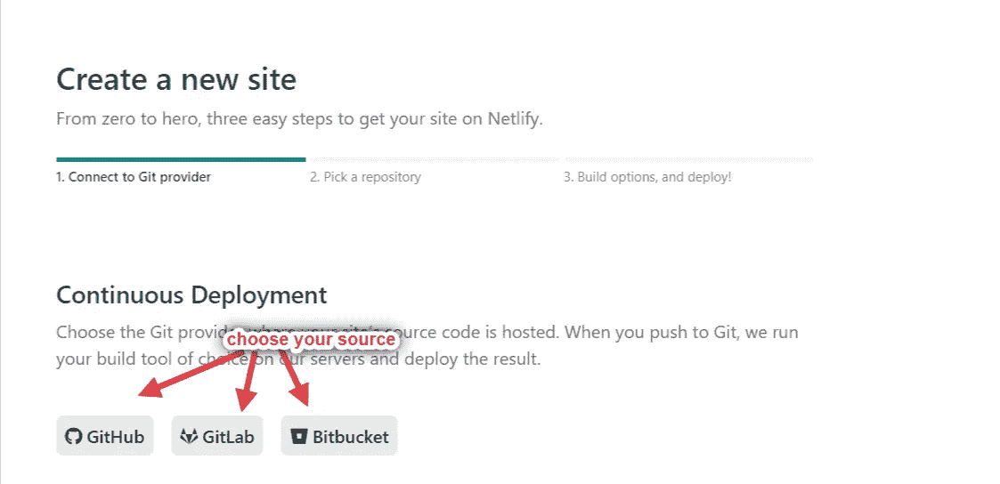
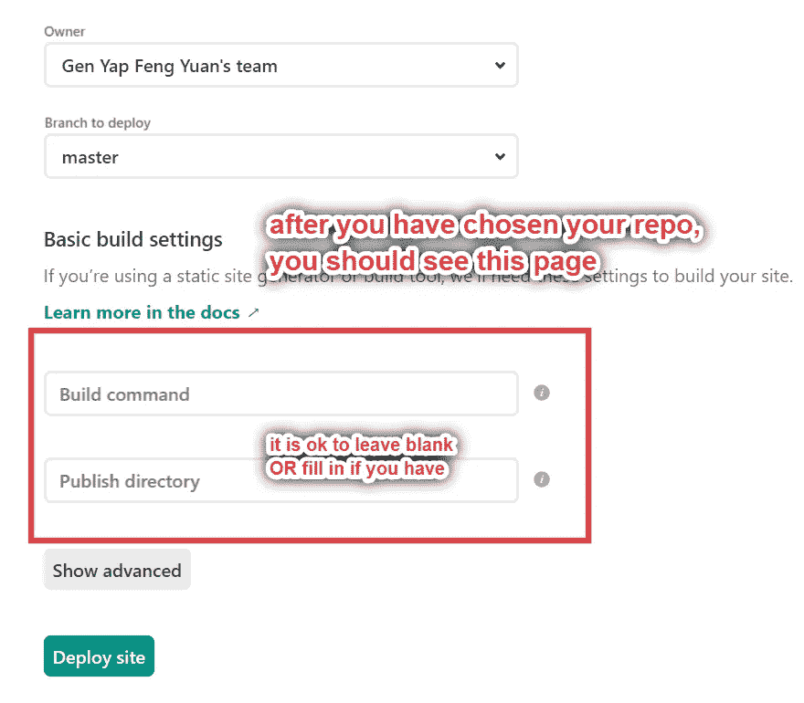
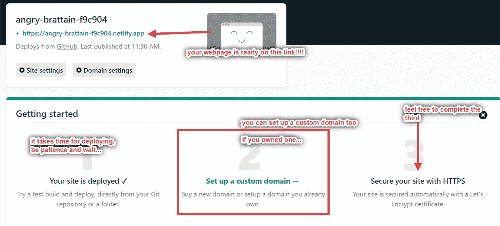
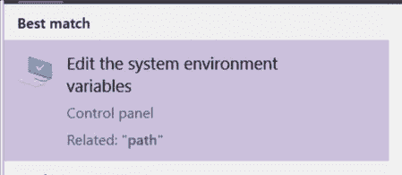
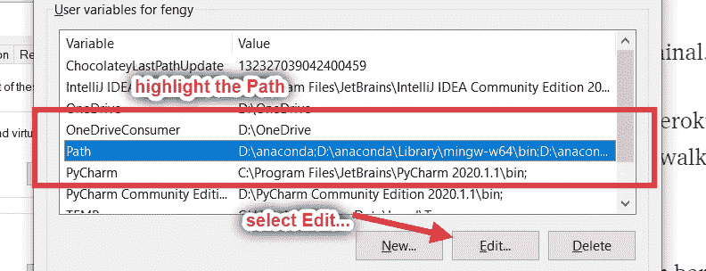
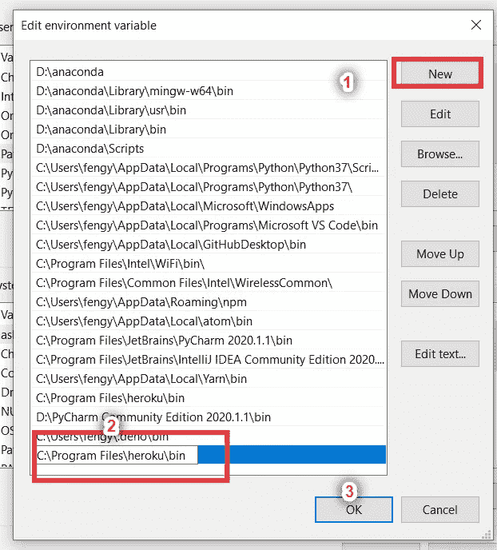

# 如何免费部署网页

> 原文：<https://blog.devgenius.io/how-to-deploy-a-webpage-for-free-af3588cd32f9?source=collection_archive---------15----------------------->

## 初学者指南

## 本文免费讨论了 4 种不同情况下 4 个不同网站(GitHub、Netlify、Pythonanywhere 和 Heroku)的代码部署。

由 Kinng 创建

没有什么比把你的努力工作放到网上并分享给全世界更令人兴奋的了。在我的旅程中，到目前为止，我已经在线部署了近 30+个网页，其中一些只是静态网页，一些是具有更多后端功能的网页。在这篇文章中，我想与那些还不熟悉网页部署的人分享我的经验。希望我的分享能给你一些想法，让你的作品自由的生活。

# 你准备部署什么样的网页？

在接下来的事情发生之前，这是你需要思考和知道的首要事情。是静态网页还是更复杂的，比如涉及节点和数据库？

## 简单静态网页

静态意味着你的网页不包括数据库和高频率的上下文更新。它只允许观众与页面进行简单的互动，如通过链接直接进入另一个网页，简单而设计的动画，以及通过发送电子邮件进行联系。

静态网页通常仅由 HTML、CSS 和 JavaScript 文件构建，因此部署在 [GitHub 页面](https://github.com/)上就足够了。GitHub 为您的 GitHub 帐户下所有可用的静态网页文件提供免费托管服务，并存储在公共 repo 中。部署私人回购需要升级账户。

要部署，请转到您的回购页面并进入设置页面。

向下滚动，直到找到“GitHub 页面”部分。并选择您的源到您的主分支。

之后，你应该会看到下图。这意味着您已经成功部署。然而，有时部署需要时间，这意味着即使 GitHub 告诉你你的网页已经准备好了，但实际上还没有。不要惊慌，等待一分钟，并再次尝试链接！

稍后的`git push`会自动更新网页，所以这个部署过程不需要在你每次更新代码的时候进行。

## 更加动态和复杂的静态网页

这类网页通常由 React 和 Node 构建，有很多依赖项和文件夹。这里有两种情况:有数据库和没有数据库。PS 不可能在 GitHub 上部署。

如果这个项目没有数据库，我建议部署在 [Netlify](https://www.netlify.com/) 上。把你的 Netlify 账号和你的 GitHub 账号连接起来，同步你想要部署的项目，walah~一切都完成了。这听起来很简单，事实也确实如此。但是，Netlify 只能帮助静态网页。

要在[网上部署，首先，你需要在线存储你的代码。在我的例子中，我使用 GitHub 来存储我的代码。PS 你可以直接在 Netlify 上存储你的代码。](https://www.netlify.com/)

在这种情况下，您从另一个平台导入代码，只需选择您的代码源。在你授权后，它会弹出你所有的回购，选择你想部署的。

留意“要部署的分支”，如果您不想使用主分支上的代码，请更改为其他代码。

Netlify 可能需要一些时间来准备，进入第二阶段后，你的网页将会很好。请随时继续设置 https。

对于带有数据库||后端的项目，你需要将它们部署在 [Heroku 上。Heroku 在处理各种网页方面非常出色。部署比上面稍微难一点。](https://dashboard.heroku.com/)

要在 Heroku 上部署，除了拥有一个帐户，您还需要安装 Heroku CLI。它用于您的终端与您的 Heroku 云帐户进行交互。是的，要使用 Heroku，您需要使用终端。

在安装过程中，如果安装程序告诉您路径没有更新，Windows 可能需要包含 Heroku 的路径。别担心。大家一起走过吧~

搜索栏上的搜索路径。

选择高级页面底部的环境变量。

您将被引导至一个新窗口。在顶部大列中执行以下操作。

要添加路径，请选择“新建”并输入`C:\Program Files\heroku\bin`

安装 Heroku 并为 Windowists 添加路径后，只需在终端上运行`heroku` 。看安装是否成功。

部署对许多代码源开放，其中，我正在使用 GitHub。Heroku 文档对此主题提供了清晰而详细的解释。因此，请随意关注~它也有图片解释，所以我不会重复解释。

 [## 使用 Git 部署

### Heroku 使用流行的版本控制系统 Git 管理应用部署。你绝对不需要成为一个饭桶…

devcenter.heroku.com](https://devcenter.heroku.com/articles/git) 

对于那些不熟悉 Git 命令的人:

 [## 怎么 Git？

### 这是我的 GitHub 系列的第二部分。怎么 Git？本文就是为初学者解答这个问题。

medium.com](https://medium.com/dev-genius/how-to-git-5ee5a325a8b5) 

## Python Django & Flask 项目

Python 项目是基于后端的项目，不同于我们在 Django 和 Flask 项目中从后端开始编码的其他项目。他们永远不会是一个静态的网页 LOL。我只找到了一个可以免费部署 python 项目的网站— [Python Anywhere](https://www.pythonanywhere.com/) 。但是，它只允许一个免费帐户部署一个 web 项目。

这里的部署过程比上面所有的都要复杂，我们要像在本地 Bash 上那样与云 Linux 终端进行交互。此外，让 git clone 上传我们的文件。在成功部署之前，需要进行一些设置。我发现这个视频清晰易懂。

# 感谢您的阅读。希望您现在就知道如何以及在哪里部署您的网页:)