# 如何使用 AWS Route 53 在域名上部署网站

> 原文：<https://blog.devgenius.io/how-to-deploy-a-website-on-a-domain-name-113fe6c86329?source=collection_archive---------10----------------------->

网络世界是一个迷人的地方。每一点知识都是一种探索。如果你是一个网站开发者，你也在为它做贡献，通过建立精彩的网站和添加优秀的功能。所有这些了不起的东西不应该仅限于本地主机。我们部署它们，让全世界都能看到它们，与它们互动，为它们做出贡献。我们来说说在一个域名上部署一个网站。


感谢 KOBU Agency 在 unsplash 上提供这张照片

正如你所猜测的，我们需要一个域名。我已经注册了一个，即来自 GoDaddy 的 rohankumarthakur.co.in，所以让我们用它来托管我们的网站，并将其命名为<domain-name>。我们会用 HTML 做一个简单的网站，撒一些 CSS 进去。你可以创造你自己的或者克隆一个由我[https://github.com/Xebec19/Xebec19](https://github.com/Xebec19/Xebec19)建造的。现在我们需要将这些文件存储在某个地方。现在，让我们使用 AWS 的 S3 来存储我们的文件。
注:如需进一步了解，您可以关注本教程[https://docs . AWS . Amazon . com/Amazon S3/latest/user guide/website-hosting-custom-domain-walk through . html # website-hosting-custom-domain-walk through-domain-registry](https://docs.aws.amazon.com/AmazonS3/latest/userguide/website-hosting-custom-domain-walkthrough.html#website-hosting-custom-domain-walkthrough-domain-registry)或关注我们。
我们将创建两个存储桶，一个与我们的域名如 rohankumarthakur.co.in 同名，另一个用于我们的子域如 www.rohankumarthakur.co.in。这个想法是在域名桶上托管网站，并使用另一个桶作为重定向。</domain-name>

# **在 S3 桶中保存文件**

让我们创建第一个与域名同名的 bucket。
**1。我们将登录我们的 AWS 管理控制台
2。去 S3
3。创建一个名为“rohankumarthakur.co.in”的存储桶(在您的情况下，它将是您的域名的名称)
4。将我们的文件保存在其中**
目前，默认情况下，公共访问我们的存储桶是被阻止的。我们需要消除这种限制。我们将
**1。访问我们桶
2 的权限部分。阻止公共访问
3。4 点击
中的‘编辑’。取消选中阻止公共访问。**

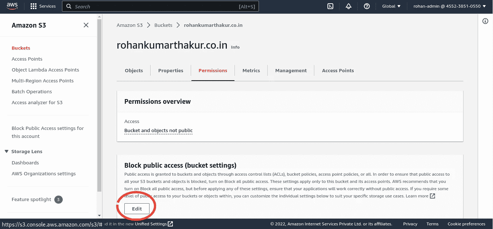

存储桶的权限部分

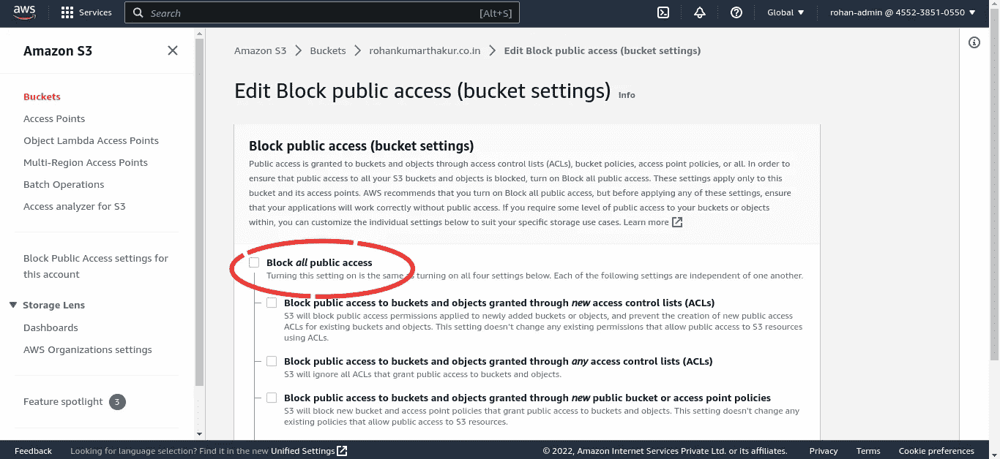

取消选中下一页的“阻止所有公共访问”

现在，我们需要将公共读取权限添加到我们的存储桶中，因为我们需要人们访问我们的网站并查看其内容。我们可以通过添加一个存储桶策略来实现。
添加一个斗策， **1。拜访你的水桶
2。转到许可选项卡
3。转到存储桶策略
4。单击“编辑”并添加以下行以添加策略。**

```
{
    "Version": "2012-10-17",
    "Statement": [
        {
            "Sid": "PublicReadGetObject",
            "Effect": "Allow",
            "Principal": "*",
            "Action": [
                "s3:GetObject"
            ],
            "Resource": [
                "arn:aws:s3:::Bucket-Name/*"
            ]
        }
    ]
}
```

现在我们需要打开网站的静态托管。
**1。我们回到我们的水桶
2。访问属性选项卡
3。向下滚动到静态网站托管部分
4。5 点击【编辑】
。选中以启用“静态网站托管”
6。检查“托管静态网站”中的“托管类型”7。输入你的主 HTML 文件为索引文件(在我们的例子中它将 index.html)
8。单击保存更改。**

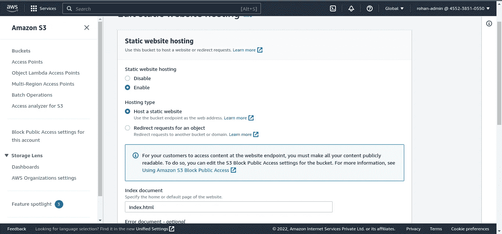

现在，我们的网站托管在 AWS 提供的 URL 上，您可以在属性选项卡的“静态托管”部分找到该 URL，并测试您的网站。在下面的步骤中，我们将创建一个从[www.domain-name.co](http://www.domain-name.co)到 domain-name.co 的重定向。
让我们创建第二个桶，我们将使用它从“[www.domain-name.co](http://www.domain-name.co)”重定向到“域名.公司”。这一次，bucket name 应该是[www.domain-name.co，在我们的例子中应该是](http://www.domain-name.co,)www.rohankumarthakur.co.in。现在来设置重定向，
**1。我们去我们的第二桶
2。转到属性选项卡
3。向下滚动到静态网站托管
4。选中启用“静态网站托管”5。检查托管类型
6 的“重定向对象请求”。输入你的域名作为主机名
7。检查 HTTP 协议
8。点击【保存修改】**

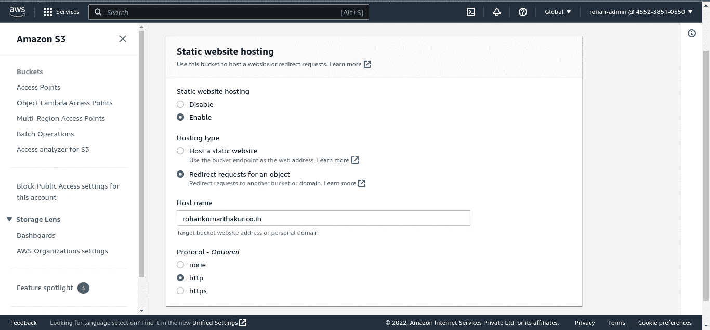

现在我们用完了水桶。在接下来的步骤中，我们将使用 AWS Route 53 创建一个托管区域，在 DNS 中更新我们的名称服务器，并在我们的托管区域中创建两个记录:-一个用于我们的域，另一个用于从[www.domain-name.co](http://www.domain-name.co)重定向到 domain-name.co。

# 在 53 号公路上创建托管区域

创建一个托管区域，
**1。我们将在 AWS
2 中参观 53 号公路。点击“创建托管区域”
3。在“托管区域”中输入您的域名
4。检查类型
5 中的“公共托管区域”。点击【保存修改】**

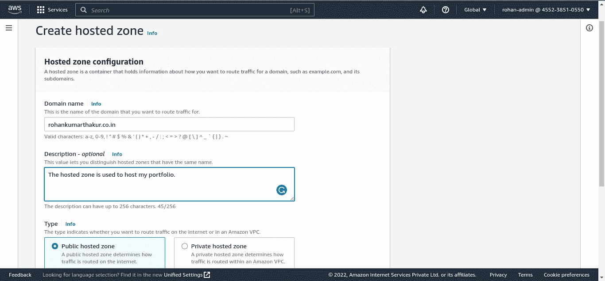

现在，当我们访问托管区域并向下滚动一点时。我们会在那里找到一些域名服务器。我们将复制它们(忽略。即每个条目结束时的句号)。

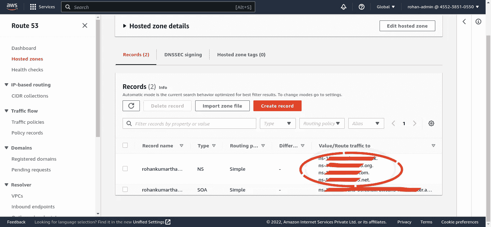

域名服务器是 DNS 中的一个服务器，它将域名转换成 IP 地址。当您访问您的域名提供商并登录我们的帐户时，在域名设置或 DNS 管理部分，您会发现您的域名提供商已经为您提供了一些默认的域名服务器。

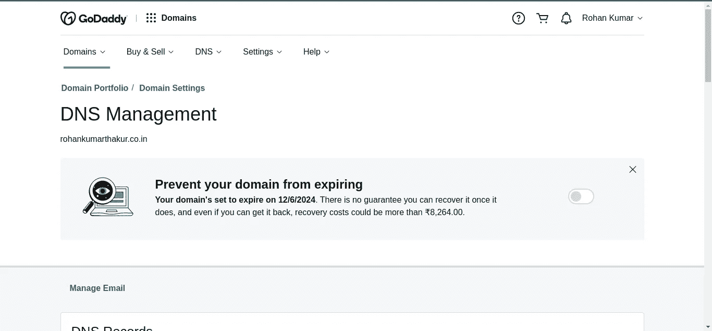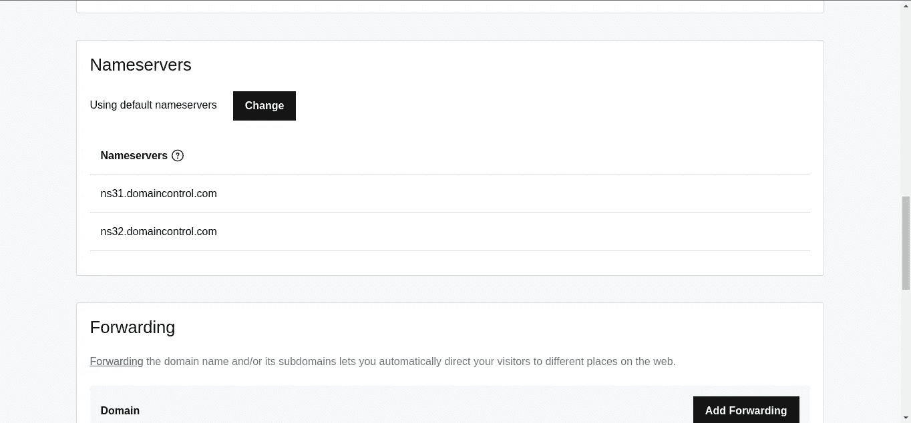

默认名称服务器

我们将用托管区域中提供的名称服务器替换它们。然后，我们在托管区域中创建一个记录。我们选择了“简单”的路由策略。

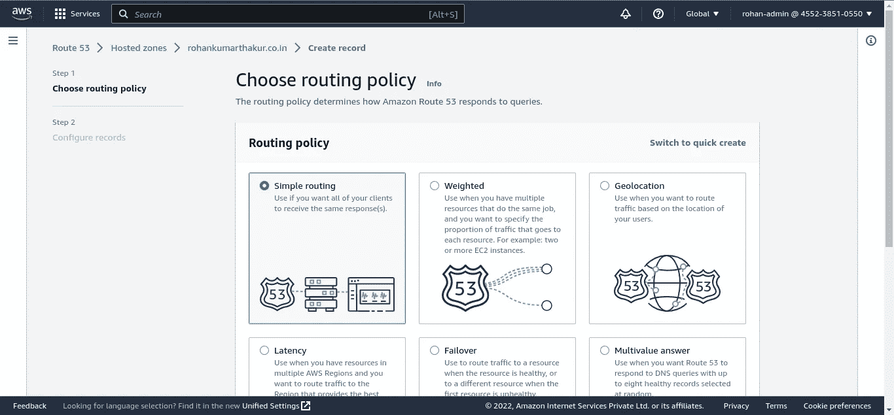

在下一步，即配置记录，我们定义两条记录:-一条用于我们的 domain-name.co，另一条用于[www.domain-name.co。](http://www.domain-name.co.)首先，让我们为 domain-name.co 创造。点击“定义简单记录”。

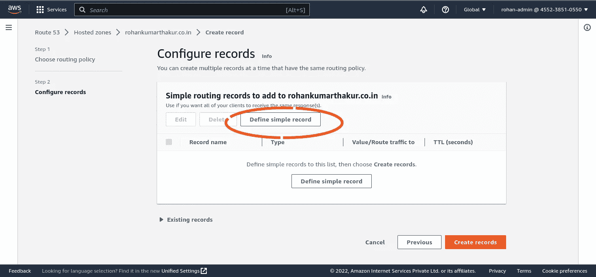

将子域留空，在记录类型中，主要有两种类型的记录类型，即 A 和 CNAME，**A 记录将一个主机名映射到一个或多个 IP 地址，而 CNAME 记录将一个主机名映射到另一个主机名**。在我们的例子中，我们将选择一个记录类型。由于我们已经在 S3 而不是我们自己的服务器上部署了我们的网站，我们将设置**值/路由流量到**到**别名到 S3 网站端点**并输入 S3 桶**的凭证。**我们应该让确保我们的 bucket 的名称与我们的域名相同。

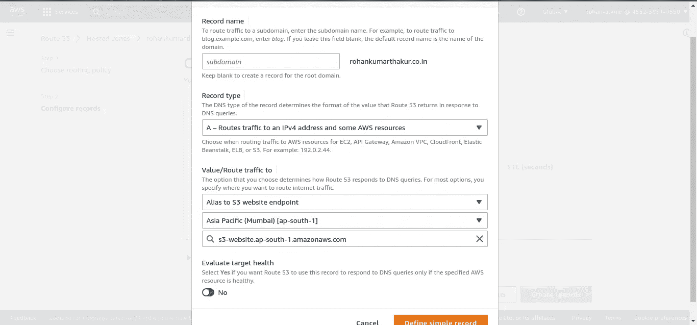

接下来，我们还必须为我们的子域创建一个记录，即[www.domain-name.co。](http://www.domain-name.co.)我们将遵循与为 domain-name.co 创建记录相同的步骤，但是这次我们在子域输入中输入“www ”,并确保我们的 bucket 的名称是[www.domain-name.co。](http://www.domain-name.co.)

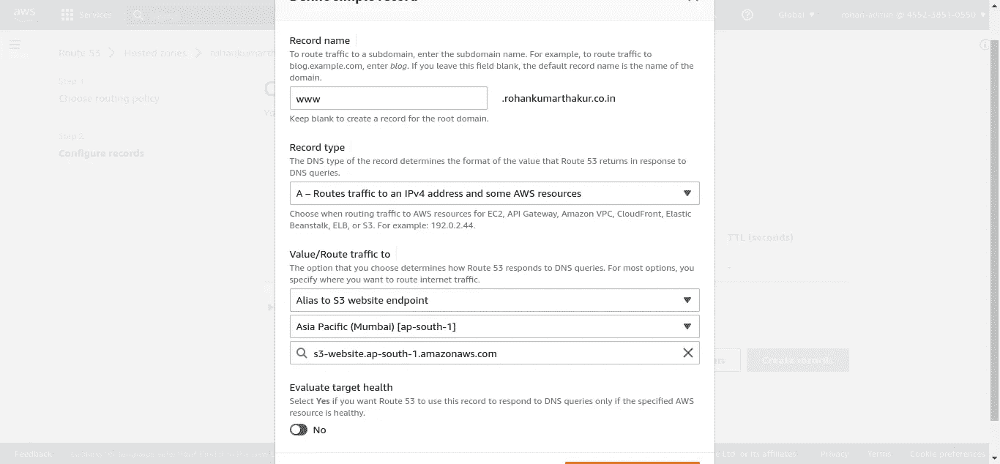

创建两个记录后，我们单击“创建记录”。更新您的托管区域可能需要几分钟时间。现在，如果我们访问 http://domain-name.com 或 http://www.domain-name.com，我们可以在那里看到我们的网站。

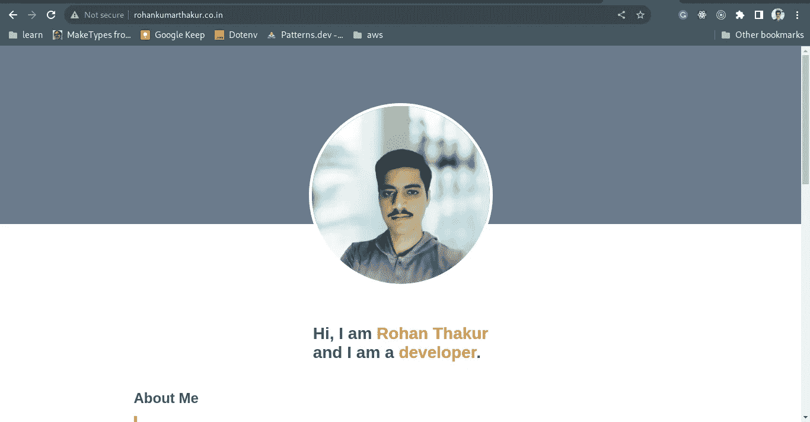

注意:您将在 53 号公路上产生费用。您可能想要部署一个 web 应用程序或向您的网站添加一个 SSL 证书。我们将在下一篇文章中讨论这两个问题。希望这篇文章对你有所帮助。