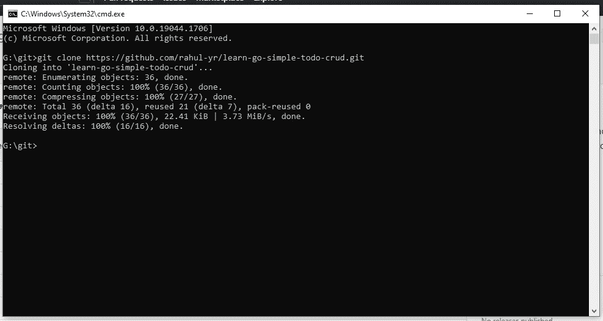
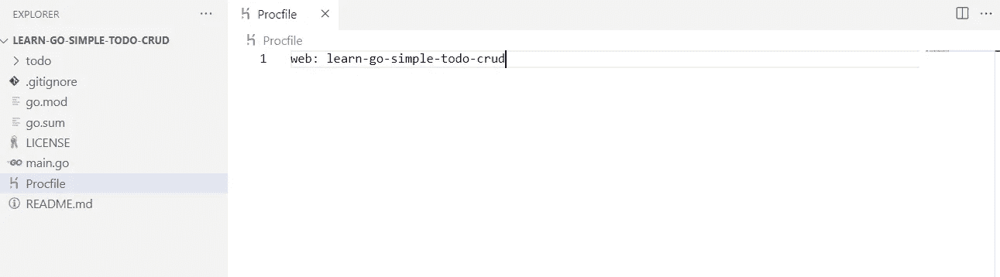
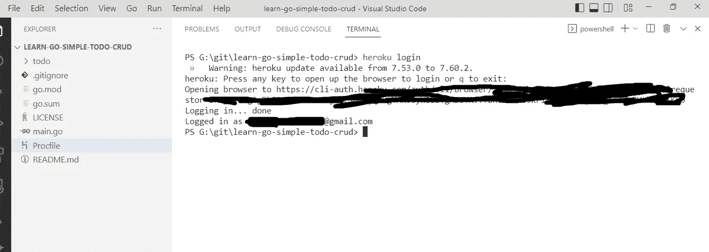
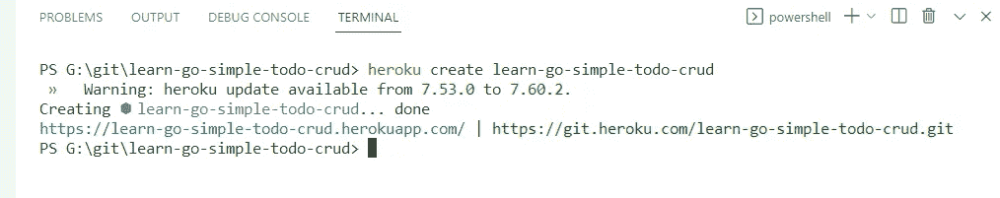
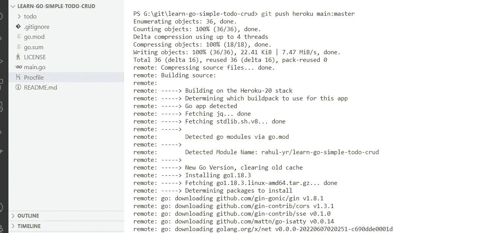
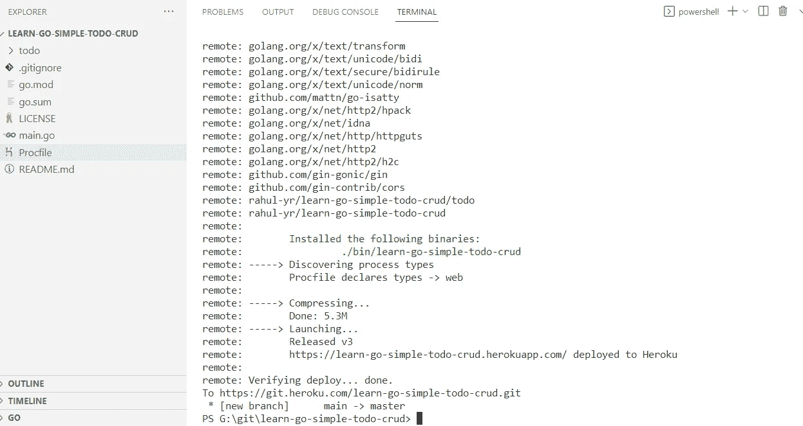

# 如何轻松地将任何后端部署到 Heroku🔥) ?

> 原文：<https://blog.devgenius.io/how-to-deploy-any-backend-to-heroku-easily-3194d48dd810?source=collection_archive---------9----------------------->


部署到 heroku

# 介绍

出于演示的目的，为了简单起见，我们将使用在 Go 中开发的这个[库](https://github.com/rahul-yr/learn-go-simple-todo-crud) **。但是你可以自由选择你喜欢的任何一种 T4 语言。**

Python 的样例 Repo([简单的 URL Shortener App](https://github.com/rahul-yr/learn-fastapi-simple-url-shortner) )，你可以在这里找到相应的实现[教程](https://medium.com/@rahul-yr/simple-url-shortener-app-in-python-for-beginners-fastapi-demo-7978049f3532)

这是一个非常简单的 [Todo crud](https://github.com/rahul-yr/learn-go-simple-todo-crud) 应用程序，你可以在互联网上找到。放心用这个回购吧。您甚至可以更进一步，为这个开源存储库添加额外的特性。

你可以在这里找到这个回购[的 API 规范和 postman 集合](https://postman.com/rahul-public/workspace/go-simple-todo-crud)

为了跟随这个教程，你需要有一个 Heroku 帐号。我将使用 GitHub 作为云存储库。你可以用任何你喜欢的(Bit bucket，Azure DevOps，Google cloud Repo 等。).

> 对那些不了解 Heroku 的人来说，简单回顾一下

# 什么是 Heroku？

> Heroku 是一个基于容器的云平台即服务(PaaS)。开发人员使用 Heroku 来部署、管理和扩展现代应用。我们的平台优雅、灵活且易于使用，为开发人员将应用推向市场提供了最简单的途径。([官方阅读更多](https://www.heroku.com/about))

# 先决条件

*   从[这里](https://code.visualstudio.com/)下载并安装 VS 代码
*   从[这里](https://git-scm.com/)下载并安装 git
*   打开您的终端，键入这些命令及其各自的细节来配置 git。

```
git config --global user.name "example name"
git config --global user.email "example@github.com"
```

*   从[这里](https://devcenter.heroku.com/articles/heroku-cli#install-the-heroku-cli)下载并安装 Heroku CLI

# 部署

*   打开您的终端，使用下面的命令克隆这个 [repo](https://github.com/rahul-yr/learn-go-simple-todo-crud)

```
git clone https://github.com/rahul-yr/learn-go-simple-todo-crud.git
```



克隆回购

*   在 VS 代码中打开克隆的 repo
*   告诉 Heroku 在应用程序启动时应该遵循什么步骤是非常重要的。这就是`Procfile`派上用场的地方。您可以创建并提及`Procfile`中针对您需求的所有步骤([点击此处阅读更多关于 Procfile](https://devcenter.heroku.com/articles/procfile) )。
*   对于这种情况，请在 Procfile 中使用以下代码片段

```
web: some-app-name
```



procfile

*   使用`heroku login`命令将 heroku 会话添加到您的用户帐户。一旦完成，你会得到这样的东西。



heroku-登录-原始

*   终于到了使用下面的命令在 Heroku 中创建应用程序的时候了。

```
heroku create some-app-name
```



heroku-create-app

*   现在使用以下命令将您的应用程序部署到 Heroku

```
git push heroku your-branch-name:master
```



部署-1

*   如果您获得了与下面相同的状态，那么您就成功了🔥部署在 Heroku。



部署-2

*   使用`heroku open`命令查看应用程序的部署版本。

# 摘要

可怕的🔥，您已经成功完成了本教程。我会💝听听你的反馈和意见，看看你能用它做些什么。如果你突然想到什么地方，请随意评论。我随时都有空。

请在 [github](https://github.com/rahul-yr/learn-go-simple-todo-crud) 找到完整的代码