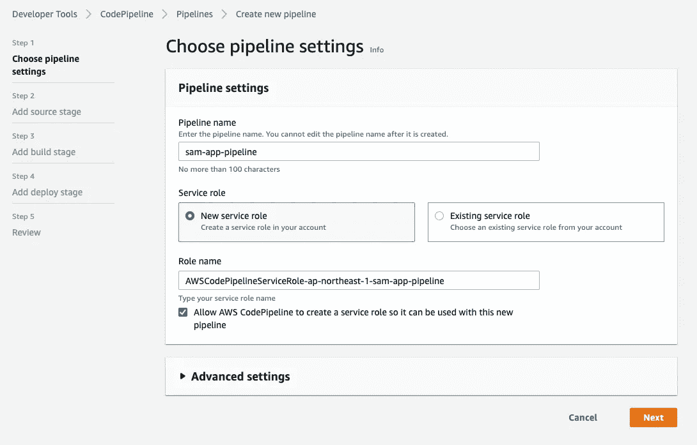
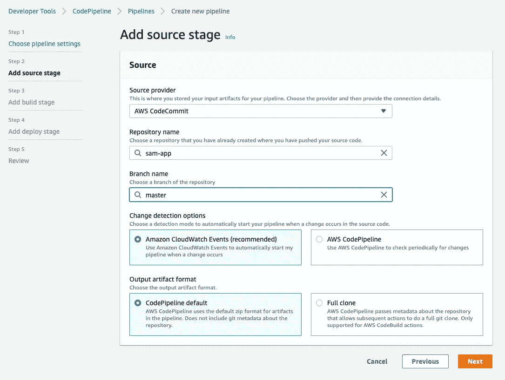

# 使用 AWS Lambda 的 DevOps:如何定义 CI/CD 管道以将功能部署为容器映像

> 原文：<https://blog.devgenius.io/how-to-deploy-aws-lambda-functions-as-a-container-image-using-codepipeline-5697abe51653?source=collection_archive---------4----------------------->

我们可以使用您最喜欢的语言进行本地开发，并通过无服务器应用程序的 IaC 框架 SAM(无服务器应用程序模型)轻松部署到 AWS Lambda。AWS lambda 开始支持打包成容器映像的运行函数，用 lambda 增强您的应用程序开发。例如，您可以部署高达 10GB 的容量，这比以前大得多——250 MB，并且它允许您包含更多的编程语言库。

我写了一篇文章解释如何在支持容器图像之前正确地做这件事，所以这篇文章将是旧文章的更新版本！

[](https://medium.com/@xiangtai-z/how-to-deploy-aws-lambda-functions-using-codepipeline-313207f75f53) [## 如何使用代码管道部署 AWS Lambda 函数

### 我尝试过部署 Python 的 AWS Lambda 函数(包括外部库如 numpy、pandas 等。)使用…

medium.com](https://medium.com/@xiangtai-z/how-to-deploy-aws-lambda-functions-using-codepipeline-313207f75f53) 

# 简单概述


# **先决条件**

我将使用 Python 和 macOS 进行指导，但是这个概念和架构应该可以在你选择的任何语言中工作。

*   MacBook Air M1 2020(MAC OS Monterey 12 . 2 . 1)——我相信即使你有旧的 MacBook(英特尔芯片)，它也应该可以工作。
*   AWS 帐户—可能会收取少量费用，但绝对不需要任何其他高级或高额收费的服务或订阅

如果您在本地已经有一个 SAM 应用程序，最好阅读“创建代码提交库”一节。

# 安装 SAM CLI

只要按照 AWS 的这个指示。如果您已经安装了 SAM CLI，**请确保其版本高于 v1.13.1\.**

 [## 在 macOS 上安装 AWS SAM CLI

### 按照以下步骤安装和配置在…上使用 AWS SAM 命令行界面(CLI)的先决条件

docs.aws.amazon.com](https://docs.aws.amazon.com/serverless-application-model/latest/developerguide/serverless-sam-cli-install-mac.html) 

不要忘记安装 Docker，这是作为一个选项提到的，并安装了“苹果硅 Docker 桌面”。

[](https://docs.docker.com/desktop/mac/apple-silicon/) [## 苹果芯片的 Docker 桌面

### 预计阅读时间:4 分钟苹果芯片上的 Docker 桌面现已正式发布。这个…

docs.docker.com](https://docs.docker.com/desktop/mac/apple-silicon/) 

> 注意:在安装家酿之前，我必须勾选“使用 Rosetta 打开”才能在 M1 Mac 的终端中使用 brew 命令。


# 安装 AWS CLI 并配置凭据

 [## 安装或更新最新版本的 AWS CLI

### 本主题介绍如何在…上安装或更新最新版本的 AWS 命令行界面(AWS CLI)

docs.aws.amazon.com](https://docs.aws.amazon.com/cli/latest/userguide/getting-started-install.html)  [## 设置 AWS 凭据

### AWS SAM 命令行界面(CLI)要求您设置 AWS 凭据，以便它可以调用 AWS 服务…

docs.aws.amazon.com](https://docs.aws.amazon.com/serverless-application-model/latest/developerguide/serverless-getting-started-set-up-credentials.html) 

# 开始前…

在这些装置之后，我有:

*   2016 年 10 月 20 日
*   Git — 2.30.1
*   自制— 3.5.2
*   SAM CLI-1 . 52 . 0
*   AWS CLI — 2.7.11

# 在本地创建项目

在您的本地目录(例如……/work/server less app/)中，运行“sam init”。

```
$ sam initWhich template source would you like to use?
        1 - AWS Quick Start Templates
        2 - Custom Template Location
Choice: 1Choose an AWS Quick Start application template
        1 - Hello World Example
        2 - Multi-step workflow
        3 - Serverless API
        4 - Scheduled task
        5 - Standalone function
        6 - Data processing
        7 - Infrastructure event management
        8 - Machine Learning
Template: 1Use the most popular runtime and package type? (Python and zip) [y/N]: NWhich runtime would you like to use?
        1 - dotnet6
        2 - dotnet5.0
        3 - dotnetcore3.1
        4 - go1.x
        5 - graalvm.java11 (provided.al2)
        6 - graalvm.java17 (provided.al2)
        7 - java11
        8 - java8.al2
        9 - java8
        10 - nodejs16.x
        11 - nodejs14.x
        12 - nodejs12.x
        13 - python3.9
        14 - python3.8
        15 - python3.7
        16 - python3.6
        17 - ruby2.7
        18 - rust (provided.al2)
Runtime: 13What package type would you like to use?
        1 - Zip
        2 - Image
Package type: 2 (Note: You have to choose 2!!)Based on your selections, the only dependency manager available is pip.
We will proceed copying the template using pip.Would you like to enable X-Ray tracing on the function(s) in your application?  [y/N]: NProject name [sam-app]:
```

初始化后，我得到了这些文件夹和文件。

```
$ cd sam-app
$ tree
.
├── README.md
├── __init__.py
├── events
│   └── event.json
├── hello_world
│   ├── Dockerfile
│   ├── __init__.py
│   ├── app.py
│   └── requirements.txt
├── template.yaml
└── tests
    ├── __init__.py
    └── unit
        ├── __init__.py
        └── test_handler.py
```

这些文件在说明书中特别重要。

*   event.json 传递给 Lambda 函数的参数。例如，如果您想通过 S3 事件来触发它，这个参数必须包含一个桶名、一个对象键、它的一个版本或者类似的东西。
*   app.py —代码作为函数运行。可以解析“event.json”中的对象。
*   requirements.txt —您可以添加第三方库(例如 Pandas)。
*   template.yaml — SAM 模板(即 CloudFormation 的无服务器应用版本或 AWS 的无服务器应用的 IaC 模板)
*   Dockerfile —生成容器图像。它是在“template.yaml”中定义的。

# 构建它并调用它

您可以通过此命令构建一个函数；

```
$ sam build
```

最好使用这些选项。

```
--use-container
--skip-pull-image
```

构建成功后，您可以通过该命令调用该函数。

```
$ sam local invoke HelloWorldFunction
```

“HelloWorldFunction”是这个 SAM 应用程序的名称，它在 template.yaml 中定义。

然后我得到了这个输出。

```
{"statusCode": 200, "body": "{\"message\": \"hello world\"}"}
```

# 部署它

现在我已经准备好第一次部署它了。

将此命令与“guided”参数一起使用，该参数将指导您完成部署。这个部署包括创建一个 ECR 存储库来存储每个部署的容器映像。

```
$ sam deploy --guidedConfiguring SAM deploy
======================Looking for config file [samconfig.toml] :  Not foundSetting default arguments for 'sam deploy'
        =========================================
        Stack Name [sam-app]: 
        AWS Region [us-east-1]: 
        #Shows you resources changes to be deployed and require a 'Y' to initiate deploy
        Confirm changes before deploy [y/N]: n
        #SAM needs permission to be able to create roles to connect to the resources in your template
        Allow SAM CLI IAM role creation [Y/n]: y
        #Preserves the state of previously provisioned resources when an operation fails
        Disable rollback [y/N]: y
        HelloWorldFunction may not have authorization defined, Is this okay? [y/N]: y
        Save arguments to configuration file [Y/n]: y
        SAM configuration file [samconfig.toml]: 
        SAM configuration environment [default]:Looking for resources needed for deployment:
        Creating the required resources...
        Successfully created!
         Managed S3 bucket: aws-sam-cli-managed-default-samclisourcebucket-1dnqot9l267mn
         A different default S3 bucket can be set in samconfig.toml
         Image repositories: Not found.
         #Managed repositories will be deleted when their functions are removed from the template and deployed
         Create managed ECR repositories for all functions? [Y/n]: y
```

后来终于有了这个日志。

```
Successfully created/updated stack - sam-app in us-east-1
```

该功能已成功部署在我的 AWS 帐户中。


# 创建代码提交存储库

到目前为止，这仅仅是个开始。

创建您的 CodeCommit 库。


在您的目录中运行这些命令(如果您在运行“sam init”时将它们保留为默认值，则应该是“/sam-app”)。

```
$ git init
$ git remote add origin {your clone URL}
$ git add .
$ git commit -m "first commit"
$ git push --set-upstream origin master
```

现在，它被成功地推送到远程存储库。


# 创建代码构建项目


> 注意:稍后我会提到“buildspec.yaml”。


# 在代码管道中创建 CI/CD 管道



管道在创建后立即自动开始执行，但忽略它(无论如何，它一定会失败)。

# 添加 buildspec.yaml

正如您在构建项目中指定的，我们需要一个“buildspec.yaml”文件。这是构建的定义。

例如，它可能是这样的。它将在 python 3.9 上运行构建、调用和部署命令。将此文件放在应用程序的根目录中。

```
version: 0.2phases:
  install:
    runtime-versions:
      python: 3.9
  build:
    commands:
      - sam build --use-container
  post_build:
    commands:
      - sam local invoke HelloWorldFunction
      - sam deploy --force-upload
```

然后，将其推送到存储库。

# 更新生成项目的 IAM 角色

要运行“buildspec.yaml”文件中的命令，我必须向构建项目的 IAM 角色授予适当的策略。

通过单击构建项目中的链接，可以跳转到 IAM 控制台。


当然，AWS 在最佳实践中说“授予最小特权”，但是为了简单起见，我将在这个指令中授予管理(即 FullAccess)权限。请确保此时它没有遵循最佳实践。

构建项目需要构建项目和 SAM 命令应该访问的服务的权限。

*   希腊字母的第 11 个
*   云的形成
*   electroniccashregister 电子现金出纳机
*   S3
*   InternationalAssociationofMachinists 国际机械师协会

# CI/CD

当您推送到存储库时，管道会自动开始执行。如果您授予 IAM 适当的权限，它应该会成功结束。

> N 注:在这种情况下，组织 IAM 策略是非常困难的，所以请不要犹豫，通过一遍又一遍地推动“发布变更”和编辑 IAM 策略来进行试错。


下面是实际使用的注意事项。

*   限制从本地部署—不允许从您的笔记本电脑进行“sam 部署”)
*   授予最小特权—这真的很难
*   定义自动化测试—对于 CI/CD 是强制性的