# 如何使用 ECS 和 ECR 在 AWS 上部署 Django 应用？

> 原文：<https://blog.devgenius.io/how-to-deploy-django-application-on-aws-using-ecs-and-ecr-aab9ab003a85?source=collection_archive---------0----------------------->


Dmitry Chernyshov 在 [Unsplash](https://unsplash.com/) 上拍摄的照片

本文将使用 ECS(弹性容器服务)和 ECR(弹性容器注册)在 AWS 上部署一个基于 Django 的应用程序。我们首先创建应用程序的 docker 映像，并将其推送到 ECR。之后，我们创建实例，并使用 ECS 在 AWS 上部署应用程序。接下来，我们使用 Django 的内置 web 服务器确保应用程序正确运行。

# 先决条件

1.  姜戈
2.  Docker 的背景
3.  AWS 帐户
4.  创造力永远是加分项😃

# Django 网络框架

D jango 是一个高级 Python web 框架，它鼓励快速开发和干净、实用的设计。它是免费和开源的，有一个繁荣和活跃的社区，很棒的文档，以及许多免费和付费的支持选项。它前端使用 HTML/CSS/Javascript，后端使用 python。

# **什么是码头工人和集装箱？**

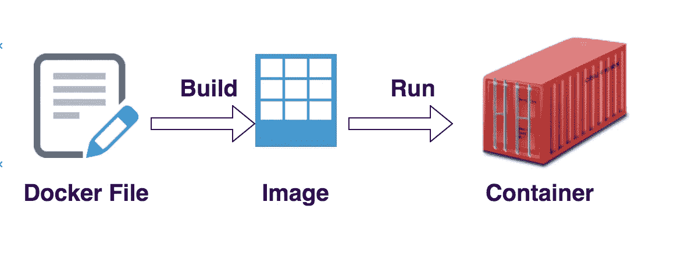

码头工作流程

Docker 是一个开放平台软件。它用于开发、发布和运行应用程序。Docker 将安装和运行它的计算机的操作系统虚拟化。它提供了在松散隔离的环境(称为容器)中打包和运行应用程序的能力。容器是 docker 映像的可运行实例。您可以使用 Docker API 或 CLI 创建、启动、停止、移动或删除容器。您可以将容器连接到一个或多个网络，为其附加存储，甚至可以基于其当前状态创建新的 docker 映像。

> 假设您想运行两个不同 python 版本的 python 应用程序。由于我们不能在同一台机器上安装不同版本的 python，这就阻止了我们在同一台计算机上托管这两个 Python 应用程序。我们可以利用 docker 来解决这个问题。因此，我们在这里实际做的是，我们将创建这些应用程序的两个 docker 映像，并在 docker 主机或主机上独立运行它们。Docker 容器上没有安装和运行任何操作系统。但是它将拥有进程表、网络接口和文件系统挂载点的虚拟副本。这些是从承载和运行容器的主机的操作系统继承的。

# **什么是 AWS 弹性容器注册表？**

Amazon Elastic Container Registry(Amazon ECR)是一个托管的容器映像注册服务。客户可以使用熟悉的 Docker CLI 或他们首选的客户端来推送、拉入和管理映像。Amazon ECR 为您的 Docker 图像提供了一个安全、可伸缩、可靠的注册表。

# **集控室步骤**

接下来的任务是，我们使用 ECR 在 AWS 上创建存储库，我们的应用程序 docker 映像将驻留在这里。为了开始在 ECR 上创建存储库，我们首先在 AWS 控制台上搜索 ECR，并遵循以下步骤。

*   **创建 Docker 文件** —将“Docker 文件”添加到 Django 应用程序中。它包含创建 docker 映像所需的一系列命令。

```
*# importing base image* FROM python:3.9

*# updating docker host or host machine* RUN apt-get update \
    && apt-get install -y --no-install-recommends \
    && rm -rf /var/lib/apt/lists/*

*# changing current working directory to /usr/src/app* WORKDIR /usr/src/app

*# copying requirement.txt file to present working directory* COPY requirements.txt ./

*# installing dependency in container* RUN pip install -r requirements.txt

*# copying all the files to present working directory* COPY . .

*# informing Docker that the container listens on the
# specified network ports at runtime i.e 8000.* EXPOSE 8000
docker build -t django-app:version-1 .*# running server* CMD ["python", "manage.py", "runserver", "0.0.0.0:8000"]
```

*   **构建您的 docker 映像** —使用下面的命令创建 Docker 映像名称为“django-app:version:1”。

```
docker build -t hello-world-django-app:version-1 .
```

使用下面的命令检查是否创建了 docker 映像。

```
docker images | grep hello-world-django-app 
```

*   **在 AWS ECR 上创建存储库** —是时候打开 AWS 控制台并搜索 ECR 了。然后，单击“创建存储库”按钮。

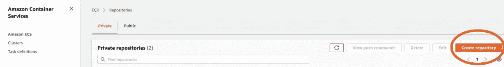

创建 ECR 存储库— 1

您会发现您的存储库的可见性有两个选项，即私有和公共。私有存储库访问由 IAM 和存储库策略权限管理。一旦你点击创建库按钮，然后，你需要给你的库的名称。如果您启用了“推送时扫描”选项，它有助于识别容器映像中的软件漏洞

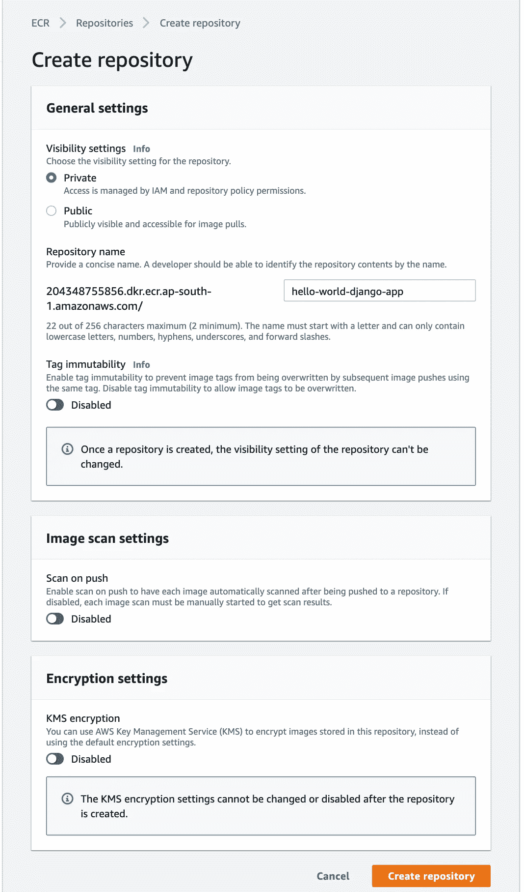

创建 ECR 存储库— 2

*   **将步骤 2 中创建的 Django 应用程序的 docker 映像推送到 AWS ECR —**

**a)** 向亚马逊 ECR 注册中心认证您的 Docker 客户端。必须为使用的每个注册表获取身份验证令牌，这些令牌的有效期为 12 小时。最简单的方法是获取 AWS 的 AWS_ACCESS_KEY_ID 和 AWS_SECRET_ACCESS_KEY。然后运行下面的命令。

```
export AWS_ACCESS_KEY_ID=******export AWS_SECRET_ACCESS_KEY=******
```

导出 AWS_ACCESS_KEY_ID 和 AWS_SECRET_ACCESS_KEY 后，使用以下命令登录 AWS 帐户。

```
aws ecr get-login-password --region region | docker login --username AWS --password-stdin aws_account_id.dkr.ecr.region.amazonaws.com
```

**b)** 使用 **docker images** 命令识别要推送的图像:

```
REPOSITORY                                                                TAG                     IMAGE ID          CREATED            SIZE
django-app version-1    480903dd8        2 days ago          549MB
```

**c)** 用 Amazon ECR 注册中心、存储库和可选的图像标签名称组合来标记您的图像。注册表格式为`*aws_account_id*.dkr.ecr.*region*.amazonaws.com`。存储库名称应该与您为映像创建的存储库相匹配。

以下示例将 ID 为`*480903dd8*`的图像标记为`*aws_account_id*.dkr.ecr.*region*.amazonaws.com/hello-world-django-app`。

```
docker tag 480903dd8 *aws_account_id*.dkr.ecr.*region*.amazonaws.com/hello-world-django-app
```

**d)** 使用 **docker push** 命令推送 docker 图像:

```
docker push aws_account_id.dkr.ecr.region.amazonaws.com/hello-world-django-app
```

# 什么是 AWS 弹性容器服务？

Amazon Elastic Container Service(ECS)是一个高度可伸缩的高性能容器管理服务，它支持 Docker 容器，并允许您在 Amazon EC2 实例的托管集群上轻松运行应用程序。借助 Amazon ECS，我们可以使用自己的集群管理基础设施来安装、操作和扩展我们的应用程序。使用一些简单的 API 调用，我们可以启动和停止支持 Docker 的应用程序，查询集群的日志，并访问许多熟悉的功能，如安全组、弹性负载平衡器、EBS 卷和 IAM 角色。我们可以使用 Amazon ECS 根据我们的资源需求和可用性要求来安排容器在集群中的放置。我们还可以集成我们自己的调度程序或第三方调度程序，以满足业务或应用程序特定的需求。

# ECS 步骤

现在是时候使用 AWS ECS 启动我们的第一个 EC2 实例了。首先，让我们首先在 AWS 控制台上搜索 ECS，并遵循以下步骤。

*   **创建集群—** 集群创建控制台提供了一种创建资源的简单方法，并允许您自定义几个常见的集群配置选项。**不要忘记从导航窗格中选择使用集群的区域。**

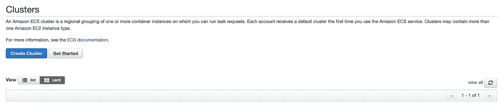

创建集群

*   **启动 EC2 实例—** 在这一步中，我们将配置集群。这些配置包括网络配置、CloudWatch 容器洞察和自动扩展组。这是创建集群时最关键的一步，因为创建集群后的一些配置无法恢复。

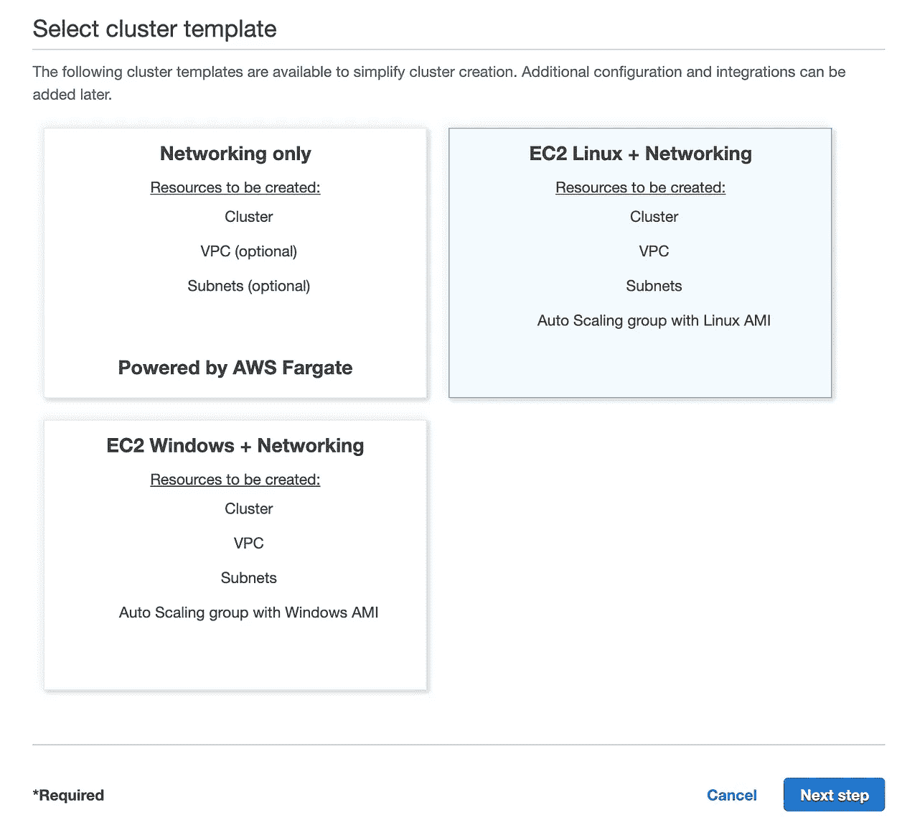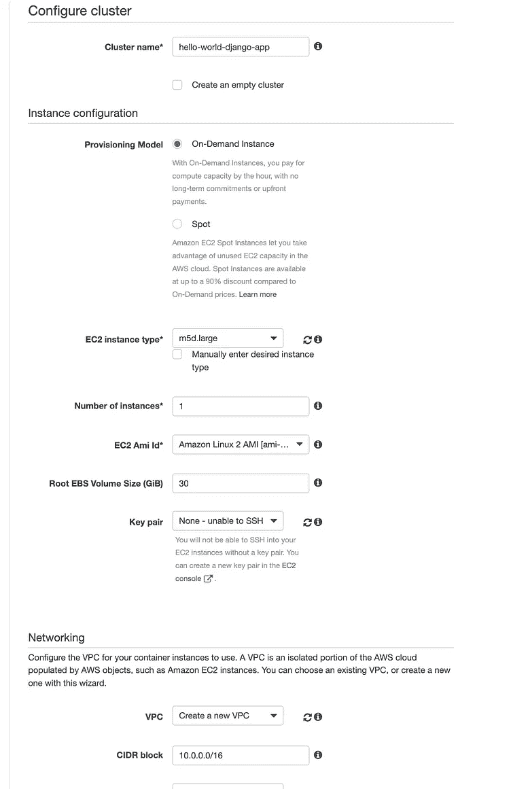

选择您的 EC2 实例并配置它

*   **创建运行任务定义的服务—** 服务定义如何运行您的 ECS 服务。服务定义中指定的一些重要参数是集群、启动类型和任务定义。

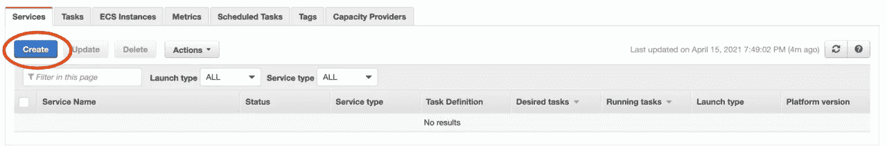

创建和配置服务

*   **创建任务—** 要在 AWS ECR 上运行 docker 容器，我们需要首先创建任务定义。我们可以在一个任务定义中配置多个容器和数据存储。在创建任务定义时，我们指定哪个 ECR 用于哪个容器以及端口映射。

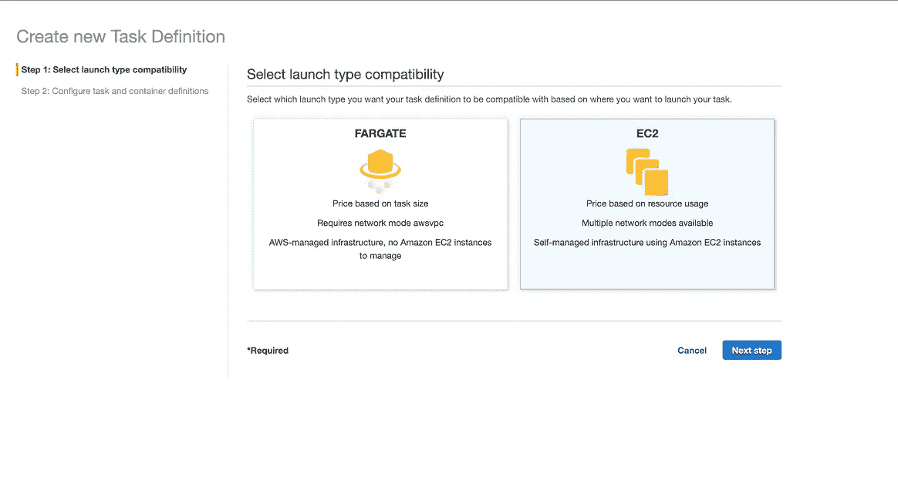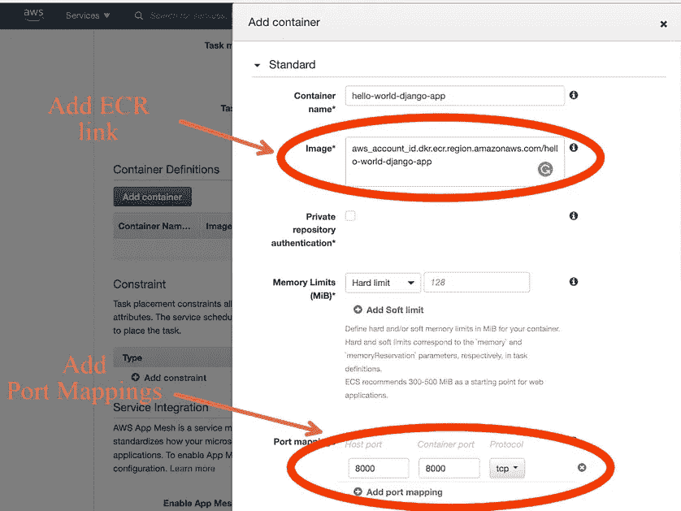

创建任务并添加任务定义

*   **通过触发已创建的任务来运行实例—** 在成功完成上述所有步骤后，我们现在处于通过进入集群来触发已创建的任务的阶段。在运行我们的任务之后，我们可以在 EC2 控制台中检查我们创建的实例是否正在运行。

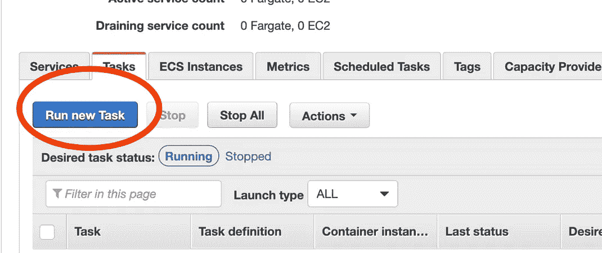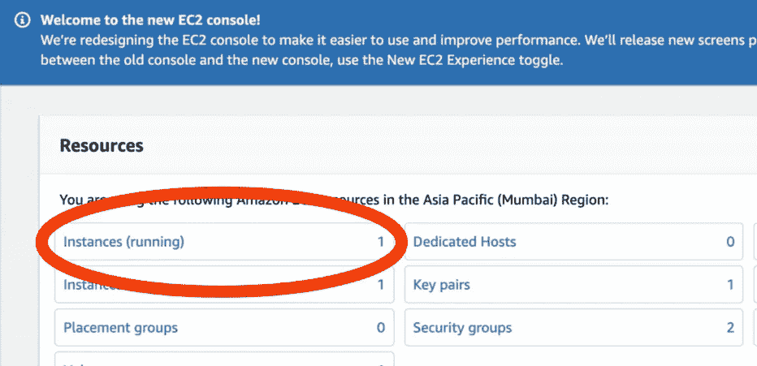

通过触发任务启动新的 EC2 实例

# 恭喜你。🙂

*我们已经使用 ECS 和 ECR 在 AWS 云上成功部署了 Django 应用程序。*

作为胜利的一页，通过在浏览器中导航到实例的公共 DNS，检查 Django 应用程序是否正确运行。

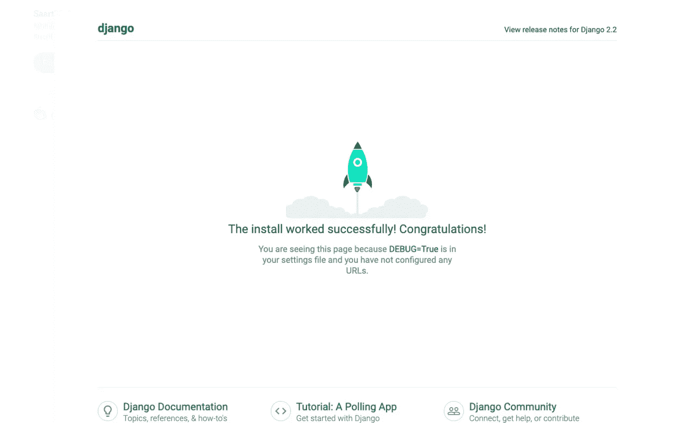

当我们在生产服务器上部署一个成熟的 Django 应用程序时，许多其他因素都会发挥作用。其中一些因素如下:

1.  安全性
2.  监视
3.  负载平衡
4.  恢复计划

为了满足这些因素，我们还可以使用 [AWS beanstalk](https://aws.amazon.com/elasticbeanstalk/) 服务来更有效地部署 Django 应用。

> 如果您错过了任何步骤，请遵循 [GitHub](https://github.com/ishubham169/hello_world_django_app) 上的代码。

# 摘要

为了这篇文章的完整性，让我们快速回顾一下到目前为止我们所学的内容。

*   首先，我们在 AWS ECR 上推出了应用程序的 docker 映像。
*   创建一个将用于运行任务定义的服务。
*   创建一个任务，用于运行 docker 容器。
*   AWS-EC2 实例是使用 ECS 生成的。

> 如果你喜欢这篇文章，别忘了给它一个掌声！


请随时在 [**Linkedin**](https://www.linkedin.com/in/shubham-kaushik-temp/) 上 ping 我，敬请期待下一期！