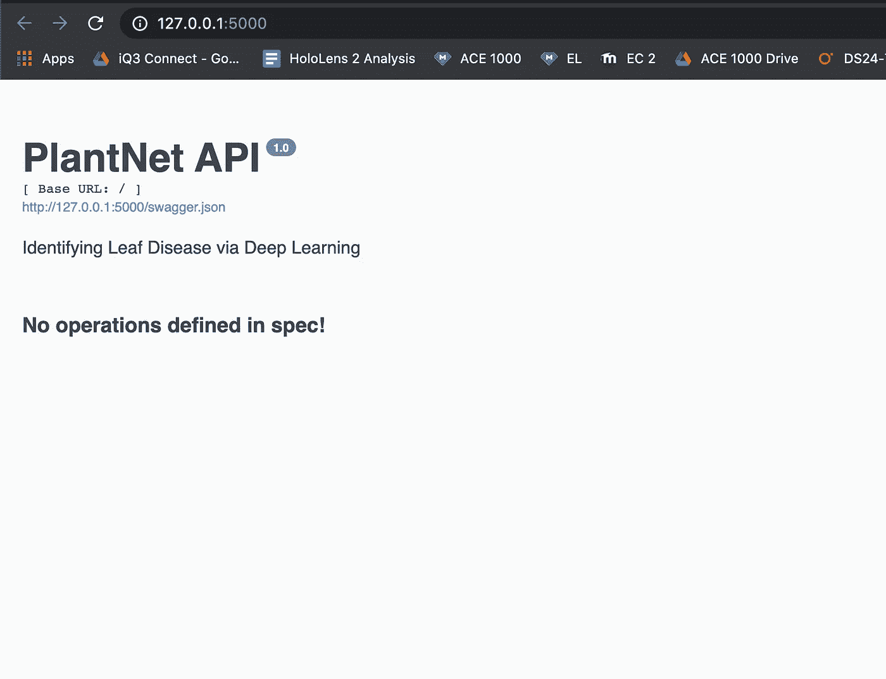
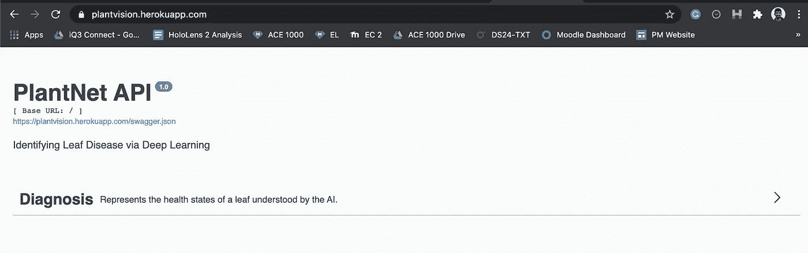
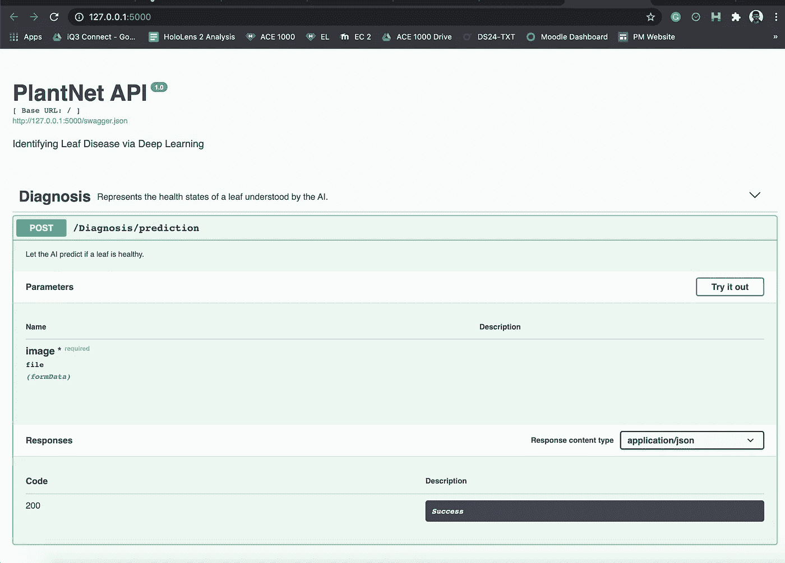

# 如何将 Keras 模型部署到生产中(初学者欢迎！)

> 原文：<https://blog.devgenius.io/how-to-deploy-keras-models-to-production-beginners-welcome-1fbfab19d3f6?source=collection_archive---------1----------------------->


泰勒·维克在 Unsplash 上的照片

# 部署神经网络的经验教训

首先，我想说我有一份非常令人兴奋的工作——但这篇博客不会讲述令人兴奋的部分。

我想和你谈谈你在部署在 [Keras](https://www.tensorflow.org/api_docs/python/tf/keras/) 中实现的模型时可能面临的问题，Keras 是流行的深度学习开源框架。这是许多工程师(像我一样)一直在努力解决的问题，如果你是一个人，你可能会花上几个小时试图解决这个问题。不过我的目标是确保你不需要这么做，而且你会从这个博客中获得 **3 个学习成果:**

1.  使用 [Flask-RESTPlus](https://flask-restplus.readthedocs.io/en/stable/\) 框架，以 warp speed 为你的深度学习模型实现 RESTful API
2.  *使用用于 Python 的 AWS SDK 向 API 提供云存储的数据*
3.  *解析来自 API 的 JSON 响应，以便可以在应用程序中使用它！*

*好消息是，如果我做好了我的工作，到最后你会发现它实际上非常平易近人。*

## *第一课:将机器学习和 HTTP 路由分开*

*当你读到这里的时候，**我假设**一些关于你深度学习项目的事情:*

1.  ***您已经有了一个训练好的模型，**并保存了它。*注意:本博客中的例子将使用 Hadoop (.h5)和 JSON(。json)文件，所以如果您使用不同的格式，请记住这一点。**
2.  ***您正在将模型部署到 web 服务器上。**不幸的是，我不能保证这些概念会延续到移动或物联网设备(见 [TFLite](https://www.tensorflow.org/lite/) )或浏览器(见 [Tensorflow.js](https://www.tensorflow.org/js) )。*

*如果这两种说法都适用于你，那么我可以用 4 秒钟来总结这一课:*

****让别人去担心模型****

*乍一看，这似乎令人困惑，但是这一课实际上只是关于基础知识——有一个专用的 API 端点来运行推理，我保证部署过程会变得简单得多。*

***示例:用 Flask-RESTPlus 构建 RESTful API***

*如您所知，在 Keras 中加载保存的模型以在 web 服务器上使用的最简单方法是在本地计算机上提供相对文件路径 [[1]](https://keras.io/guides/serialization_and_saving/) 。*

*例如，让我们来看看 Plant Vision，这是我用 Flask-RESTPlus 构建的 RESTful API。存储库的代码是链接的[(这里为](https://github.com/UPstartDeveloper/plantnet-api))，它已经有了一个保存的模型(用于图像分类)，所以你可以随意使用它。*

*就上下文而言，该 API 允许用户上传植物叶子的图像，并且模型(回旋神经网络)将它们识别为健康或不健康。*

1.  *我们首先导入我们需要的软件包，以便在 Flask 中对 web 服务器进行编程，使用 Flask-RESTPlus 构建 RESTful API，并使用带有 Tensorflow 后端的 Keras 处理我们的图像数据:*

```
*# Prevent ImportErrors w/ flask
import werkzeug
werkzeug.cached_property = werkzeug.utils.cached_property
from werkzeug.datastructures import FileStorage
# ML/Data processing
import tensorflow.keras as keras
# RESTful API packages
from flask_restplus import Api, Resource
from flask import Flask
# Local utility Functions
from util import leaf*
```

*2.我们当然需要为烧瓶初始化一个应用程序变量:*

```
*app = Flask(__name__)*
```

*3.下一步是构建 API，这就是 Flask-RESTPlus 的有用之处。在下一个片段中，我们将实例化一个 API 对象，并给它一个`namespace`——您将会看到我下面的意思:*

```
*api = Api(app, version="1.0", title="PlantNet API",
description="Identifying Leaf Disease via Deep Learning")ns = api.namespace("Diagnosis", description="Represents the health states of a leaf understood by the AI."
)*
```

*您现在可以使用以下命令运行开发中的 Flask 服务器(这是上面链接的 repo 所特有的):*

```
*export FLASK_ENV=development; export FLASK_APP=application; flask run*
```

*看看我们已经有东西给用户看了！*

**

*烧瓶自动生成的用户界面-RESTPlus API*

*回头看看前面的代码片段——注意到我们提供的关键字参数和上面截图中出现的文本之间的相似之处了吗？*

*通常在烧瓶中，我们需要制作单独的 HTML 模板来向用户显示用户界面。*

*但是因为你是一个聪明人，你现在知道了通过使用 Flask-RESTPlus，我们可以*仅仅基于我们提供给`Api`和`api.namespace`构造函数的*关键字参数*自动生成 UI* ！*

*   *您提供的`version``Api`变成了那个小数字`1`；*
*   *您提供的`title`也成为模板的表头；*
*   *并且为`description`提供的参数为该页面添加了字幕*

*但是等一下——什么叫**“规范中没有定义操作”？**为什么命名空间中的任何内容都没有出现在模板上？*

*这让我们进入下一步:**Flask-rest plus 中名称空间**的目的是**将您的 API 路由分组在一起。***

*因此，直到我们实际上为我们的模型添加了一条对图像进行分类的途径，在 UI 上真的不需要任何其他东西(因为我们还没有真正构建 API)。*

*3.让我们现在解决这个问题——让我们**创建一条路线，使用该模型来推断用户上传的叶子图像的健康状况。**使用下面的代码片段将深度学习模型作为全局对象加载，并实现这条路线 **:***

```
*# Use Flask-RESTPlus argparser to process user-uploaded images
arg_parser = api.parser()
arg_parser.add_argument('image', location='files', 
                        type=FileStorage, required=True)# Model reconstruction - using retrained weights from Inception V3
with open("./plantnet/inceptionModelArchitecture.json") as f:
    model = keras.models.model_from_json(f.read())
    model.load_weights("./plantnet/inception_model_weights.h5")# Add the route to run inference
@ns.route("/prediction")
class CNNPrediction(Resource):
    """Takes in the image, to pass to the CNN"""
    @api.doc(parser=arg_parser, 
             description="Let the AI predict if a leaf is healthy.")
    def post(self):
        # A: get the image
        image = leaf.get_image(arg_parser)
        # B: preprocess the image
        final_image = leaf.preprocess_image(image)
        # C: make the prediction
        prediction = leaf.predict_leaf_health(model, final_image)
        # return the classification
        return prediction*
```

*如果你想更详细地了解这个模型实际上是如何预处理图像并对它们进行预测的，可以绕道去库中的[实用函数。](https://github.com/UPstartDeveloper/plantnet-api/blob/main/util/leaf.py)*

*现在，当您重新加载正在查看自动生成的 UI 的选项卡时，您应该看到 API 名称空间出现了:*

**

*一旦我们添加了路由，对它们进行分组的名称空间也会显示出来。*

*事实上，您甚至可以下拉名称空间以显示调试器，这样您就可以测试我们创建的路由(例如，使用 repo 中的示例图像)，并检查以确保它像您预期的那样工作:*

**

*让我们再次强调，这个路径的唯一目的是为一片叶子的一个图像提供一个标签——不多也不少。示例输入图像可能如下所示:*

**

*输出是一个 JSON 字符串，如下所示:*

```
*{"label":"Grape_Black rot","confidence":0.4162355065345764}*
```

***关键要点**
在这个例子中，我们已经看到，通过将所有数据处理封装到一个 API 端点中(并使用 Flask-RESTPlus 这样的框架快速完成)，可以降低将深度学习模型部署到 web 的复杂性。*

***接下来的步骤** 现在，让我们超越调试 UI——真正的神奇之处在于使用我们在**其他 web 应用**的后端创建的 API 端点。所以现在让我们来看看，看看在自己的项目中使用深度学习是多么容易！*

> *"在每一个大程序里面都有一个小程序挣扎着要出来."
> ― **东尼·霍尔*、*** 1980 年 ACM 图灵奖获得者*

## *第二课:不要让云存储阻止你*

*老实说，你已经做了大量的工作，我的朋友。在使用我们的 API 时，还有一些事情会使我们出错——比如，**如何在 HTTP 请求中以编程方式发送图像？***

*同样，这个例子有一些假设:*

1.  *如果你的应用程序**将图片存储在云端**(具体来说，存储在一个有*编程访问*的 AWS S3 桶中)[ [3](https://youtu.be/kt3ZtW9MXhw) 。*
2.  *你的应用后台是用 **Python 写的。***

*如果这些假设确实适用，那么下一个例子就是为你准备的！*

***示例:使用** `**boto3**`
访问 S3 对象假设我们有一个供植物学家使用的网络应用程序，他们想上传他们研究的植物的叶子图像。我们希望我们的应用程序使用上述[植物视觉 API](https://plantvision.herokuapp.com/) ，让他们知道叶子是否健康。*

*我们可以使用`boto3`，Python 的 AWS SDK，将我们的 S3 桶(通常称为 S3“对象”)中存储的图像输入到我们的程序中。*

1.  *首先，让我们在另一个应用程序的存储库中创建一个`.env`，并添加访问 S3 桶所需的 AWS 凭据:*

```
*AWS_ACCESS_KEY_ID=<your_access_key>
AWS_SECRET_ACCESS_KEY=<your_secret_key>
AWS_STORAGE_BUCKET_NAME=<name_of_your_bucket>*
```

*2.接下来，让我们确保可以在应用程序中使用这些环境变量。在 Python 中有几种方法可以做到这一点，对于这个例子，我们将使用`python-dotenv`包，通过 pip 安装:*

```
*(env) python3 -m pip install python-dotenv*
```

*然后，我们可以将环境变量加载到 Python 模块中，如下所示:*

```
*# Python module
from dotenv import load_dotenv
# Loads in environment variables from a .env file
load_dotenv()
# Examples of Storing AWS information in Python variables
# AWS S3 Variables
AWS_ACCESS_KEY_ID = os.getenv("AWS_ACCESS_KEY_ID", "")
AWS_SECRET_ACCESS_KEY = os.getenv("AWS_SECRET_ACCESS_KEY", "")
AWS_STORAGE_BUCKET_NAME = os.getenv("AWS_STORAGE_BUCKET_NAME", "")*
```

*3.现在，我们都准备好实际访问 S3 物体了！*

*我们从初始化 AWS 客户端开始—这将允许我们与我们的 S3 桶接口:*

```
*# init AWS client
import boto3
s3 = boto3.resource('s3')
bucket = s3.Bucket(settings.AWS_STORAGE_BUCKET_NAME)*
```

*4.为了**得到 S3 物体，我们现在需要它的*键*** 。这一步非常具有战术性，例如，假设存储桶中存储了一个图像，其结构如下:*

```
**** My S3 Bucket File Directory ***
garden-images/
|
|
|---plantA/
    |
    |
    my-plant-img.jpg*
```

*那么`my-plant-img.jpg`的关键就是`garden-images/plantA/my-plant-img.jpg`。*

*然而，你的应用程序的数据库可能只存储 S3 图像的 HTTPS 地址，所以有大量额外的信息会让`boto3`抛出错误！*

*为了解决这个问题，我们可以将你的图像的 URL 地址(可能是用 HTTPS)转换成 S3 的一个对象密钥，方法是将 URL 切片到**只取桶的根目录，到查询字符串的开头:***

```
*# get the key to the image on S3, leaving out the rest
ROOT_BUCKET_DIR = "garden-images"
start_path = img_url.find(ROOT_BUCKET_DIR)
end_path = img_url.find("?")
key = img_url[start_path:end_path]*
```

*请注意，在这个工作中，您的`img_url`应该以 URL 地址开始！您还需要研究您自己的 S3 桶的文件结构，找到您需要的`ROOT_BUCKET_DIR`。*

*4.我们现在可以通过以下方式获取存储在 S3 的图像数据:*

```
*# get the image data
object = bucket.Object(key)
response = object.get()['Body']*
```

*5.这样，您就可以通过使用 requests 模块，在 HTTP 请求中将这个图像发送给 API 了:*

```
*# convert the image to low-level binary data
img_data = response.read()
img_bytes = bytearray(img_data)
# data needed to make the request
files = {'image': img_bytes}
url = "https://plantvision.herokuapp.com/Diagnosis/prediction"\
# get the predictions from the Plant Vision API
api_response = requests.post(url, files=files)*
```

***注释:***

1.  *您编写的`files`字典必须针对您使用的特定 API 进行结构化。我使用`‘image’`作为字典中的关键字的唯一原因是因为这是我们在 Flask-RESTPlus 中传递给`arg_parser`的参数(参见上一课中的示例)。*
2.  *作为一名 Python 程序员，我们通常看不到`bytearray`数据结构——你可能会问，这是什么？它本质上是我们可以用来通过 TCP/IP 网络将图像信息传输到我们的 API 的东西，因为它需要是低级字节[ [2](https://python-reference.readthedocs.io/en/latest/docs/functions/bytearray.html) ]。*

*6.最后但同样重要的是，我们需要确保我们确实使用了数据！现在我们的 API 返回一个字典，它在我们的`response.text`中。*

*我们可能不需要`response`变量中的所有数据。让我们使用`json`包来解析来自 API 的响应，将我们关心的值存储在它们自己的变量中以备将来使用:*

```
*import json
# parse the response         
label = json.loads(response.text)['label']
confidence = json.loads(response.text)['confidence']*
```

***要点** 在本节中，我们看到了如何用 Python 向 RESTful API 发出涉及图像数据的请求。我们通过使用`boto3`和一点字符串解析克服了在 AWS 中访问图像的问题，并通过使用字典中的`bytearray`发出 HTTP 请求，最终传递给`requests.post`。*

*我意识到这一部分有更多的步骤，所以这里是我在代码片段中使用的另一个应用程序 GitHub 上的[代码的链接。](https://github.com/Carbon0-Games/carbon0-web-app/blob/master/carbon0/garden/models/ml.py)*

> *“云是面向所有人的。云是一种民主。”–**Marc Benioff，**sales force 首席执行官*

# *结束语*

*目前，我们已经从深度学习模型中获得了对我们应用程序的响应。然而，这是否足以真正为用户提供价值呢？*

*在[carbon Games](https://playcarbon0.com)上，我和我的团队相信，我们可以改进人类的思维、感受和行动，设计他们的生活来应对气候变化。如果深度学习可以帮助我们完成这项任务，那很好——然而这并不是故事的结尾。*

*如果你已经做到了这一步，我希望你也会尝试将深度学习作为一种积极变革的力量。打造你的用户可以信任的东西，帮助我们更多的人度过这个前所未有的时代——因为这是一份真正值得兴奋的工作。*

# *参考资料和进一步阅读*

*如果您想了解更多关于这里提到的一些主题的信息，请查阅以下资源:*

*[1]吴嘉星，弗朗索瓦·乔莱，[《连载与拯救》](https://keras.io/guides/serialization_and_saving/) (2020)，Keras.io*

*[2] Jakub Przywóski，[“bytearray”](https://python-reference.readthedocs.io/en/latest/docs/functions/bytearray.html)，(2015)，Python 参考(正确的方式)。*

*[3]科里·斯查费，[《Python Django 教程:全功能 Web App 第 13 部分——使用 AWS S3 进行文件上传》](https://youtu.be/kt3ZtW9MXhw) (2019)，YouTube。*

*最后，如果你想建立更强大的生产管道，我推荐 [Tensorflow 服务文档](https://www.tensorflow.org/tfx/tutorials)。或者，[亚马逊数据科学家的这篇博文](https://aws.amazon.com/blogs/machine-learning/deploy-trained-keras-or-tensorflow-models-using-amazon-sagemaker/)解释了如果你只想在云中运行模型推理，如何使用 AWS Sagemaker。*