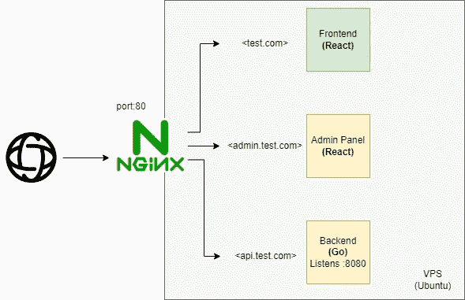

# 如何使用 NGINX 在 VPS 上部署 REACT & GO 项目

> 原文：<https://blog.devgenius.io/how-to-deploy-react-go-project-on-vps-using-nginx-73df7930f85f?source=collection_archive---------1----------------------->

大家好，在这篇文章中，我将讨论如何使用用 Go Gin 框架编写的后端部署一个 react 项目。

**先决条件**

应该有域和子域。我将在这篇文章中使用 test.com，api.test.com，admin.test.com。

应该将您的域名绑定到您的公共 IP。您可以搜索如何添加记录。

应该有 VPS(装有 Linux Ubuntu 操作系统的虚拟专用服务器)

让我们先看看基本的架构。



# **步骤**

**1)通过 SSH 连接到 VPS**

要通过 ssh 连接您的 vps，您应该打开端口 22。默认情况下，它通常是打开的(如果不是，请转到您的提供商处，从面板中打开该端口)。

**2)安装必要的软件包**

安装 nginx，防火墙，golang，npm 和 git。

```
apt install nginxapt install ufwapt install golang-goapt install nodejs  //(or apt install npm)apt install git
```

**3)启用防火墙**

```
ufw enableufw allow ssh //*(dont forget. If you forget, you may not connect again to your vps 😊)*ufw allow “Nginx Full”ufw status
```

使用 git clone 将你的项目克隆到某个地方。(在我们的例子中，它们是客户端、管理面板和后端)

**5)移除/var/www 中的静态 html 文件夹，并创建您的文件夹。**

```
rm -rf /var/www/htmlmkdir /var/www/test/client //*(It ‘ll keep the build files for react client)*mkdir /var/www/test/admin-panel //*(It ‘ll keep the build files for react admin-panel)*
```

*注意:我们没有为后端创建文件夹，因为我们不需要为它发布任何静态文件。*

**6)创建构建文件并复制到/var/www**

转到您的项目目录并运行此命令。我假设您已经运行了 npm install 来获取项目的依赖包。

```
**---For Client---**
npm run buildcp -r build/* /var/www/test/client**--For Admin Panel---**
npm run buildcp -r build/* /var/www/test/admin-panel
```

**7)配置 nginx**

首先删除默认的 nginx 配置文件。要做到这一点；

```
rm /etc/nginx/sites-available/defaultrm /etc/nginx/sites-enabled/default
```

创建您自己的文件；

```
nano /etc/nginx/sites-available/test
```

配置 nginx 文件；

```
server {listen 80;server_name test.com www.test.comlocation / {root /var/www/test/client;index  index.html index.htm;proxy_http_version 1.1;proxy_set_header Upgrade $http_upgrade;proxy_set_header Connection 'upgrade';proxy_set_header Host $host;proxy_cache_bypass $http_upgrade;try_files $uri $uri/ /index.html;}
}server {listen 80;server_name admin.test.comlocation / {root /var/www/test/admin-panel;index  index.html index.htm;proxy_http_version 1.1;proxy_set_header Upgrade $http_upgrade;proxy_set_header Connection 'upgrade';proxy_set_header Host $host;proxy_cache_bypass $http_upgrade;try_files $uri $uri/ /index.html;}
}server {listen 80;server_name api.test.comlocation / {proxy_pass http://<your-public-ip>:<backend-port>;proxy_http_version 1.1;proxy_set_header Upgrade $http_upgrade;proxy_set_header Connection 'upgrade';proxy_set_header Host $host;proxy_cache_bypass $http_upgrade;}}
```

链接站点可用和启用的文件；

```
ln -s /etc/nginx/sites-available/test /etc/nginx/sites-enabled/test
```

重启 nginx

```
sudo systemctl restart nginx
```

我们已经配置了 nginx。客户端和管理面板应该在此刻工作。但是我们的后端呢？我们应该让它继续运行。当然你可以通过运行 main.go 手动完成，但是有一种方法可以在机器启动时默认完成。

我们已经为我们的后端设置了端口 8080。因此你的后端应该监听这个端口，但是 ofc 你可以随意改变它。

要自动运行你的后端， **pm2** 是个不错的选择。

首先，让我们使用 npm 全局安装 pm2 包**。**

```
npm install  -g pm2
```

**现在，转到您的后端项目目录并运行它；**

```
pm2 start --name api “go run main.go”
```

**设置 pm2 启动；**

```
pm2 startup ubuntu
```

**如你所知，我们的域名没有使用 SSL。如果你想主动 ssl 认证；*(不要忘记将来自客户端的后端 URL 替换为 https://)***

```
apt install certbot python3-certbot-nginx
certbot --nginx -d test.com -d api.test.com -d admin.test.com
```

**证书的有效期只有 90 天。如果你想自动刷新它们，设置一个定时器；**

```
systemctl status certbot.timer
```

**安妮，就这样！我希望它有用。谢谢你的时间。如果您有任何问题，请随时联系我:)下一篇文章再见。**