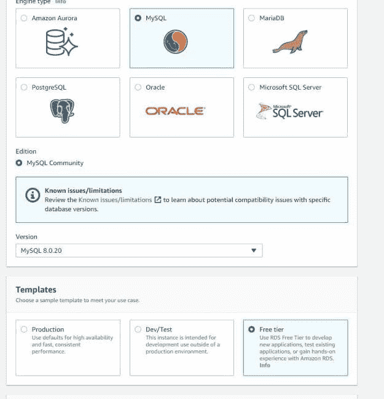
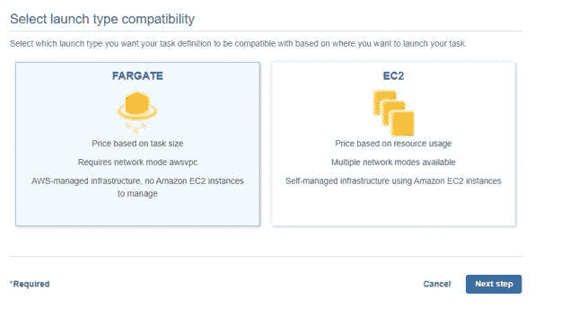
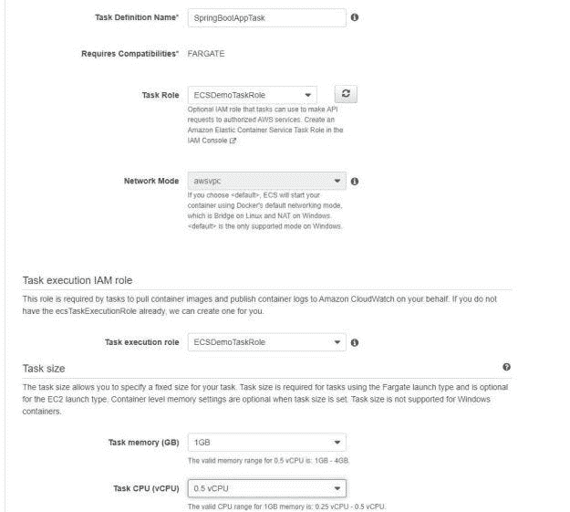
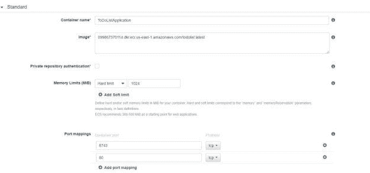
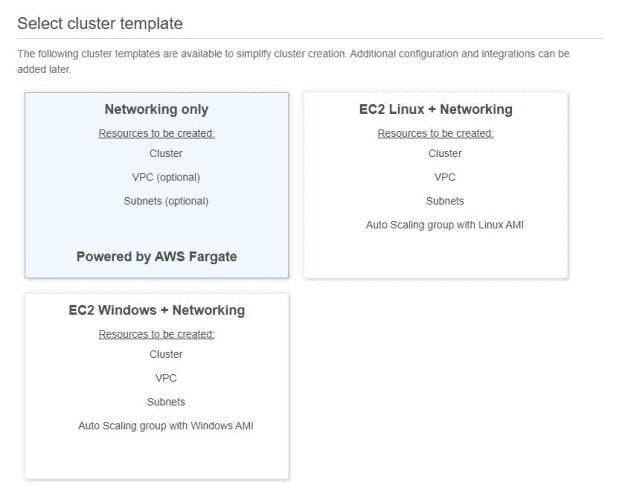
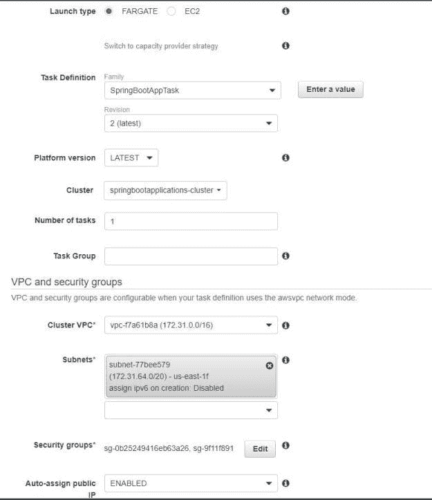
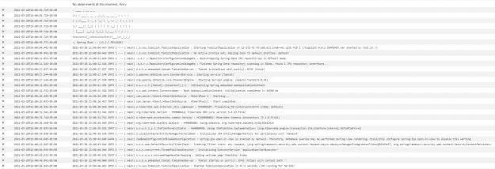
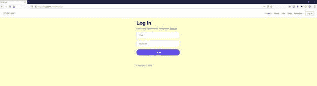

# 如何在 AWS ECS 上部署 Spring Boot 应用程序

> 原文：<https://blog.devgenius.io/how-to-deploy-spring-boot-application-on-aws-ecs-375e8da81a36?source=collection_archive---------3----------------------->

在这篇文章中，我将展示如何在 AWS ECS(弹性容器服务)上部署一个 spring boot 应用程序。ECS 是 amazon web 服务之一，主要用于运行应用程序。另一种方法是直接使用 EC2 实例。

# 什么是 ECS？

ECS 是一个容器编排服务。ECS 允许您运行您的容器。您还可以使用 [AWS Farget](https://aws.amazon.com/ecs) 轻松构建 ECS 集群。Farget 消除了供应和管理服务器的需要。使用 ECS 的优势在于，您不必决定使用哪个服务器 EC2 实例，服务会为您决定。它还通过应用程序隔离提高了安全性。

作为演示的一部分，我将一步一步地展示如何使用 AWS Fargate 在 ECS 集群上部署 spring boot 应用程序。

# Spring Boot 应用

我不会向你展示如何构建一个 Spring Boot 应用程序，但是你可以访问我关于它的其他[帖子](https://betterjavacode.com/programming/spring-boot-application-keycloak)。在这个应用程序中，我们将有一个显示待办事项列表的控制器。我们还将使用 MySQL 数据库进行基于表单的身份验证。安全配置中的`config`方法如下所示:

```
@Override 
protected void configure(HttpSecurity httpSecurity) throws Exception { 
     httpSecurity .authorizeRequests() 
              .antMatchers("/js/**","/css/**","/img/**").permitAll() 
              .antMatchers("/signup","/forgotpassword") .permitAll() 
              .anyRequest().authenticated() .and() .formLogin() 
              .loginPage("/login") .permitAll() .and() .logout() 
              .logoutUrl("/logout") 
              .logoutSuccessHandler(logoutSuccessHandler) 
              .deleteCookies("JSESSIONID").permitAll().and().csrf(); }
```

所以，正如你在上面看到的，我们将允许任何人访问`signup`和`forgotpassword`页面。同样，任何人都可以访问登录页面。我们将使用位于登录页面的自定义登录表单。

如果用户成功登录，用户将看到一个显示待办事项列表的静态待办事项列表页面。

作为演示的一部分，我们还将在 AWS RDS 中创建一个 MySQL 数据库。我们在 AWS Fargate ECS 集群中运行的应用程序将访问这个 MySQL 数据库来存储用户和用户验证。

# 为 Spring Boot 应用程序构建 docker 容器

我们将创建一个 docker 文件。

```
FROM openjdk:8-jdk-alpine COPY ./build/libs/todolist-0.0.1-SNAPSHOT.war todolist-0.0.1-SNAPSHOT.war 
ENTRYPOINT ["java", "-jar","todolist-0.0.1-SNAPSHOT.war"]
```

基本上，我们提取 Java 8 映像，并将 war 文件从我们的项目复制到 docker 实例中。我们还定义了入口点。

创建 docker 映像的命令

`docker build -t todolist .`

如果您想通过 docker 在本地运行您的应用程序，您可以使用下面的命令:

`docker run -p 8743:8743 todolist`

因此，要在 ECS 上部署我们的应用程序，我们需要将这个 docker 映像推送到弹性容器存储库(ECR)。

通常构建 docker 映像并将其推送到 ECR 都是 CI/CD 的一部分。在这篇文章中，我将不涉及 CI/CD。

要将此 docker 图像推送到 ECR，

1.  你需要在你的机器上安装`aws-cli` [工具](https://docs.aws.amazon.com/cli/latest/userguide/install-cliv2-windows.html)。
2.  在 ECR 中创建存储库

现在，在命令行上，执行以下命令将 docker 客户端认证到 ECR 存储库

`aws ecr get-login-password --region us-east-1 | docker login --username AWS --password-stdin XXXXXXX.dkr.ecr.us-east-1.amazonaws.com`

一旦我们通过身份验证，我们就可以标记 docker 图像并将其推送到 ECR 存储库。

1.  标记 docker 图像— `docker tag IMAGEID XXXXXX.dkr.ecr.us-east-1.amazonaws.com/todolist`
2.  推送 docker 图像— `docker push XXXXX.dkr.ecr.us-east-1.amazonaws.com/todolist`

现在我们的 docker 图像在 ECR 中。

# 在 ECS 中部署 docker 映像

在 ECS 中部署 docker 映像之前，我们必须执行三个步骤。

1.  在 AWS RDS 中创建 MySQL 的数据库实例。创建该实例的配置如下所示:



2.创建数据库后，您将拥有可用的数据库实例服务器和端口，可以使用它们通过数据库管理 UI 或命令行连接到数据库服务器。创建数据库`simplifyingspringsecurity`和数据库表`users`。

3.现在让我们转到 ECS 服务，并为 AWS Fargate 创建一个任务定义。它看起来会像下面这样:



此外，记得事先创建一个 IAM 角色，它应该有一个权限策略“[amazonectaskexecutionrolepolicy](https://console.aws.amazon.com/iam/home?region=us-east-1#/policies/arn%3Aaws%3Aiam%3A%3Aaws%3Apolicy%2Fservice-role%2FAmazonECSTaskExecutionRolePolicy)”。在同一个任务定义中，我们必须添加我们的容器和这个容器的属性。它们将如下所示:



我们已经将主机的两个端口 8743 和 80 映射到容器。在同一个容器中，如果要覆盖数据源的属性，还需要添加环境属性。这些属性包括`spring.datasource.url`、`spring.datasource.username`、`spring.datasource.password`、`spring.datasource.driver-class-name`和`spring.jpa.properties.hibernate.dialect`。这应该包括我们的任务配置。

4.最后，我们将创建一个 ECS 集群，用于运行我们的任务。



如您所见，我们选择了基于 AWS Fargate 的集群。在下一步中，您为集群提供一个名称，然后单击“Create ”,这应该会创建一个集群。

5.配置并运行群集后，我们可以转到“Tasks”选项卡，然后单击“Run new task”。在这里，我们将提供更多的配置，允许我们以某种方式运行我们的任务，以便一旦任务开始运行，我们就可以访问应用程序。



我们在这里定义了安全组，但是它还提供了在运行时创建新安全组的选项。在这个安全组中，您应该选择允许访问的协议类型和端口。在这种情况下，我们希望我们的端口 8743 用于互联网和 TCP。现在，单击“运行任务”,这应该会启动任务。任务开始后，我们将能够看到来自云监控的日志，如下所示:



在此基础上，如果您查看日志，现在我们的应用程序正在端口 8743 上成功运行。现在我们可以使用 Fargate 任务提供的公共 IP 访问应用程序。



开始吧，我们已经启动并运行了我们的应用程序。

# 学习

ECS 可能会因用户在部署应用程序时可以进行的配置数量而变得复杂。**为了保持这种简单，只需这样想 AWS Cloud - > VPC - >子网- > ECS - > Fargate - >任务。**

# 结论

在这篇文章中，我展示了如何在 AWS ECS 上部署 Spring Boot 应用程序。虽然看起来很简单，但问题在于您可以在 AWS ECS 中进行的配置组合。一旦你理解了云是如何处理私有网络的，事情就变得简单了。

*原载于 2021 年 3 月 21 日*[*【https://betterjavacode.com】*](https://betterjavacode.com/aws/how-to-deploy-spring-boot-application-on-aws-ecs)*。*