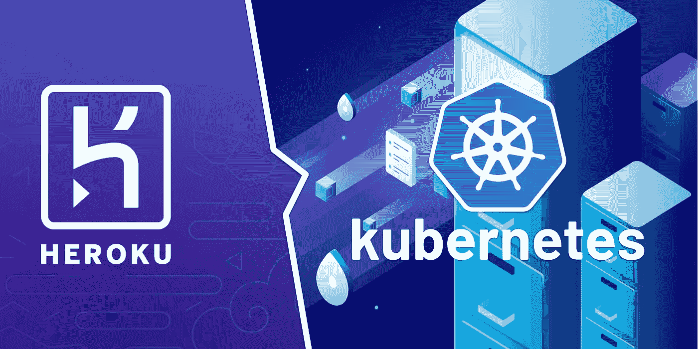
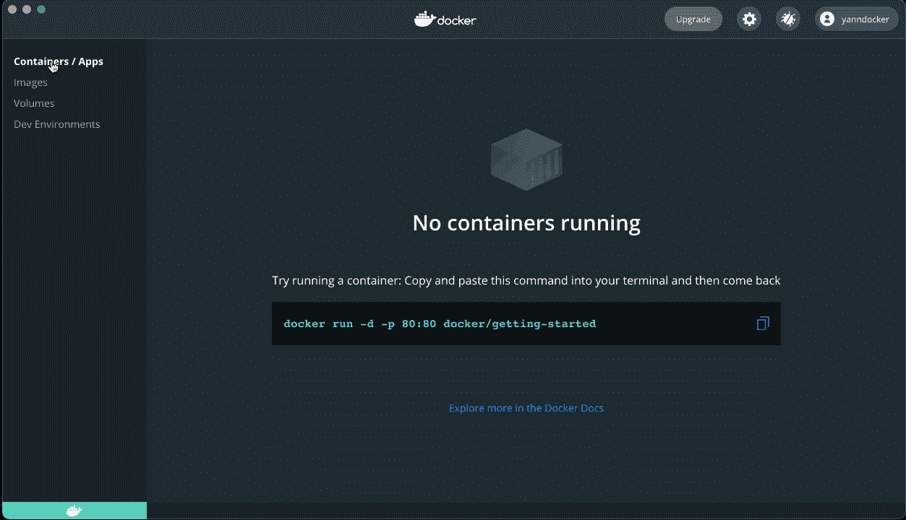
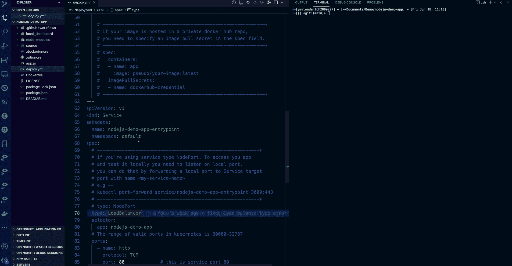
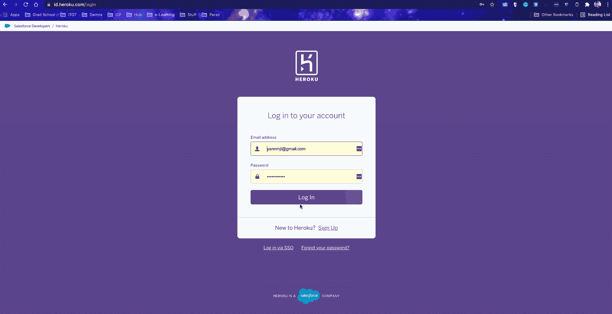
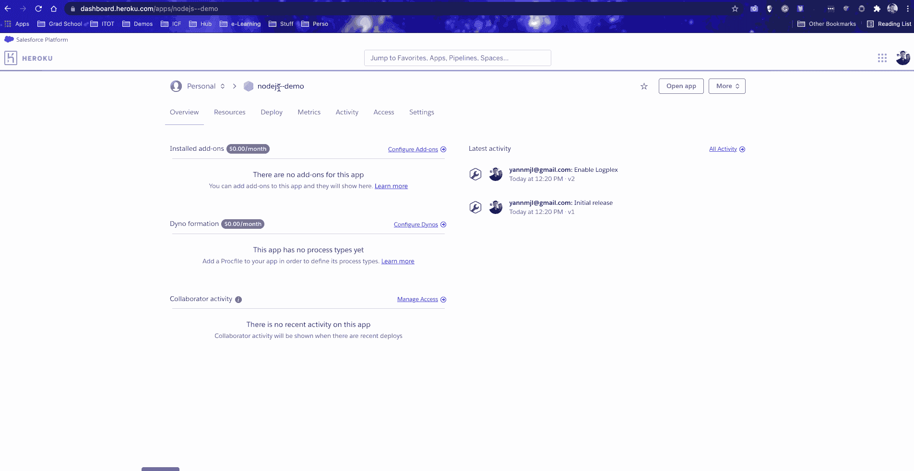

# 如何使用 Docker 部署到 Kubernetes & Heroku

> 原文：<https://blog.devgenius.io/how-to-deploy-to-kubernetes-heroku-using-docker-c2556a9584df?source=collection_archive---------1----------------------->

使用 GitHub 操作部署到 Kubernetes 和 Heroku



图片来源:[medium.com](https://medium.com/monstar-lab-bangladesh-engineering/our-journey-from-heroku-to-kubernetes-part-1-116f4bdc44a4)

> **先决条件**

*   按照[定位和设置](https://docs.docker.com/get-started/)中的描述下载并安装 Docker 桌面。
*   熟悉 Heroku PaaS、Orchestration、Kubernetes、Docker、NodeJS、GitHub、GitHub 操作

> **什么是编排？**

在系统管理中， ***编制*** 是计算机系统和软件的自动配置、协调和管理。**云计算中的编排**是配置基础设施供应的过程，包括安全性、权限和特定于域的设置，以便最终的编排元素可以使用。编排步骤通常随着环境的变化而发展，然后被设置为自动化。

有许多工具可以实现服务器配置和管理的自动化，包括 Ansible、Puppet、Salt、Terraform 和 AWS CloudFormation。

> **什么是 Kubernetes？**

Kubernetes 是一个开源的容器编排系统，用于自动化计算机应用程序的部署、扩展和管理。它最初是由谷歌设计的，现在由云原生计算基金会维护。

Kubernetes 提供了许多工具来扩展、联网、保护和维护您的容器化应用程序，这些工具超越了容器本身的能力。

为了验证我们的容器化应用程序在 Kubernetes 上运行良好，我们将使用 Docker Desktop 的内置 Kubernetes 环境，然后将它交付到生产中的完整 Kubernetes 集群上运行。

> **重要提示:**对于本演示，请确保您使用的是 kubernetes 中的 deckoer-desktop 上下文
> 
> 一个**上下文**是一组访问参数。每个**上下文**包含一个 **Kubernetes** 集群、一个用户和一个名称空间。当前**上下文**是当前 **kubectl** 的默认集群:所有 **kubectl** 命令都针对该集群运行。



在 docker 桌面上启用 Kubernetes

Docker Desktop 创建的 Kubernetes 环境是*全功能*，这意味着它拥有您的应用程序将在真实集群上享受的所有 Kubernetes 功能，可从您的开发机器方便地访问。

> Docker desktop 仅适用于 windows 和 Mac——对于 Linux，您可以使用 minukibe。

Minikube 是一个你可以**用来**在你的本地机器上运行 Kubernetes (k8s)的工具。它创建一个包含在虚拟机(VM)中的单节点集群。这个集群允许您演示 Kubernetes 操作，而不需要耗费时间和资源安装成熟的 K8s。—更多信息请点击这里:【minikube.sigs.k8s.io/docs/start/ 

# 将 NodeJS docker 映像部署到 Kubernetes

对于这个演示，让我们使用我们在本教程中构建的 NodeJS 应用程序:

> * [***如何使用 Docker&GitHub Actions***](https://blog.bitsrc.io/how-to-build-and-run-a-nodejs-app-with-docker-github-actions-59eb264dfef5)构建并运行 NodeJS 应用
> 
> ****在继续本演示之前完成它***

在上一个教程中，我们演示了 NodeJS 应用程序的各个组件，并展示了它如何作为独立的容器运行。现在让我们将这些容器设置为由 Kubernetes 这样的 orchestrator 来管理。

让我们在项目的根文件夹中创建一个 Kubernetes 部署 YAML 文件。一个 ***部署*** 为[容器](https://kubernetes.io/docs/concepts/workloads/pods/)和[复制集](https://kubernetes.io/docs/concepts/workloads/controllers/replicaset/)提供声明性更新。你在一个部署中描述*期望状态*，部署[控制器](https://kubernetes.io/docs/concepts/architecture/controller/)以受控的速率将实际状态改变为期望状态—source:[kubernetes . io—Deployment](https://kubernetes.io/docs/concepts/workloads/controllers/deployment/)

以下是我为这个演示创建的 Kubernetes 部署 YAML 文件的副本( ***阅读注释以了解关于 Kubernetes 部署的每个部分的详细信息)*** :

***阅读注释，了解 Kubernetes 部署*** 的各个部分的详细信息

现在让我们通过运行以下命令将 nodeJS 应用程序部署到 Kubernetes:

```
kubectl apply -f deploy.yml      # deploy 
watch -n 1 kubectl get pods      # watch the pods being created
kubectl get all                  # see all the resources created
```



部署到 Kubernetes

要拆除您刚刚通过部署创建的所有资源，只需运行以下命令:

```
kubectl delete -f deploy.yml      # delete all the resouces created
kubectl get all                   # see all the resources remaining
```

差不多就是这样了！！您已经准备好在本地 Kubernetes 上部署和运行您的应用程序。

# 将 NodeJS docker 映像部署到 Heroku

Heroku 现在允许用户部署 docker 容器。要使用这个特性，只需在项目中添加一个 docker 文件，并在 docker 文件的末尾添加一个`CMD`命令。这是 Heroku 用来启动容器内部的 web 服务器的命令。所以，让我们从以下几点开始:

*   登录您的 Heroku 帐户并创建您的应用程序
*   将以下秘密添加到您的 GitHub 项目 repo 设置中:HEROKU _ API _ KEY—HEROKU _ APP _ NAME—HEROKU _ EMAIL



> **添加 Github 操作作业，该作业会将您的 NodeJS 应用程序部署到 Heroku**

这是一个非常简单的 GitHub 操作，允许您部署到 Heroku。详情可以在这里找到:[部署到 Heroku](https://github.com/marketplace/actions/deploy-to-heroku) 。使用与 Docker 一起部署选项；现在我的 GitHub actions Jobs 看起来是这样的:

现在，我们来看看代码，看看我们的 CI/CD 是如何工作的:



当使用 Kubernetes 将应用程序部署到云平台时。取决于你的云平台，是 AWS，谷歌云平台，Azure 等。还需要更多的配置和参数设置。

但是这仅仅是在 Kubernetes 部署中添加一些配置和项目参数——差不多就是这样！！

> 余灿在我的 [github repo](https://github.com/YannMjl/nodejs-demo-app) 上审查所有代码。我的演示应用可以在这里访问:[https://nodejs-demo.herokuapp.com/](https://nodejs--demo.herokuapp.com/)
> 
> 如果你喜欢这个，你可能也会喜欢这个 tuto 的下一个阶段:[使用 Docker、Kubernetes、Terraform 和 GitHub 动作部署到 Google 云平台](/how-to-provision-configure-deploy-to-google-cloud-platform-97dbbe36fcde)

> 干杯！！！