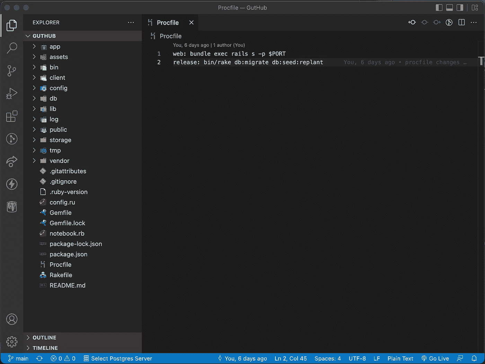

# 如何部署您的第一个全栈 Web 应用程序(React、Rails 和 Heroku)

> 原文：<https://blog.devgenius.io/how-to-deploy-your-first-full-stack-web-application-react-rails-heroku-17a799e78bb4?source=collection_archive---------3----------------------->

由[劳塔罗·安德烈亚尼](https://unsplash.com/@lautaroandreani?utm_source=medium&utm_medium=referral)在 [Unsplash](https://unsplash.com?utm_source=medium&utm_medium=referral) 上拍摄

在成为全栈开发人员的过程中，您不可避免地会做一个(如果不是很多)项目，来帮助巩固您到目前为止所学内容的概念和想法。虽然每一个连续的项目可能感觉你和它的前任处于完全不同的水平，但是项目是一个开发者的工艺之旅的历史书。因此，朋友、家人，最重要的是招聘人员和专业人士喜欢看到你的作品在万维网上发布。

## 重要说明

本文将详细介绍如何在 Heroku 上部署 React & Ruby on Rails 项目。这个过程是基于这样一个事实，即该应用程序在 **localhost** 版本上功能齐全。命令本身将是子标题，如果您在上述项目的目录中，它将允许您跳过阅读，只需在您的命令控制台中一步一步地运行每个命令。

## 1.npm 运行构建前缀客户端

> `npm run build`创建一个`build`目录，其中包含应用的生产版本。在`build/static`目录中是你的 JavaScript 和 CSS 文件。`build/static`中的每个文件名将包含文件内容的唯一散列。文件名中的这个散列启用了[长期缓存技术](https://create-react-app.dev/docs/production-build#static-file-caching)。

— [通过创建 React 应用程序文档创建生产版本](https://create-react-app.dev/docs/production-build)

这是第一步，因为它不仅创建了代码的生产版本，还将任何其他类型的媒体(如 png 或 gif)转换为浏览器要求的哈希格式。

## 2.mv 客户端/构建/*公共

除非您在 Javascript 或 Reactjs 文件中使用媒体，否则这不是必要的步骤。将您的构建移动到 public 文件夹允许您存储这些媒体的路径，以便浏览器在加载页面时引用。创建 React 应用程序在此处有更详细的介绍:

 [## 使用公共文件夹|创建 React 应用程序

### 注意:此功能适用于[电子邮件保护]和更高版本。公共文件夹包含 HTML 文件，因此您可以…

创建-反应-应用程序.开发](https://create-react-app.dev/docs/using-the-public-folder/) 

## 3.删除客户端/节点模块/缓存/babel-loader/中的所有内容

babel loader 是一个 transpiler，允许你预处理文件。这允许您捆绑 JavaScript 之外的任何静态资源。如果已经创建了缓存，那么这意味着您很可能没有使用最新版本的代码，在部署时将会创建一个新的缓存。

文档可在此处找到:

 [## babel-loader |网络包

### webpack 是一个模块捆绑器。它的主要目的是捆绑 JavaScript 文件以便在浏览器中使用，但它也…

webpack.js.org](https://webpack.js.org/loaders/babel-loader/) 

## 4.创建没有文件扩展名的 Procfile

> Heroku 应用程序包括一个 **Procfile** ，它指定了应用程序在启动时执行的命令。您可以使用 Procfile 来声明各种**流程类型**，包括:
> 
> -你的应用程序的网络服务器
> 
> -多种类型的工作进程
> 
> -单一进程，例如[时钟](https://devcenter.heroku.com/articles/scheduled-jobs-custom-clock-processes)
> 
> -在部署新版本之前运行的任务

本例中的 Procfile 将用于在 Heroku 上启动我们的 Rails 服务器。它应该是这样的:

Procfile 示例

## 5.将段落粘贴到 Procfile 中

> web: bundle exec rails s -p $PORT
> 版本:bin/rake db:migrate db:seed

这将首先迁移您的表并植入预先制作的数据。然后，它将运行你的 Rails 服务器，供你的网站面向大众使用。我的版本有`*db:seed:replant*`,因为我不得不在更新时重新部署，但不想丢失外部用户的数据。

从这里开始的过程几乎不需要解释，所以我们将快速完成

## 6.heroku 登录

这将把您重定向到 Heroku CLI 进行身份验证。

## 7.heroku create(项目名称)

项目的名称也将是网站发布后的名称。要求全部小写，只有字母和数字。

## 8.git 添加。

## 9.git commit -m“首次构建”

## 10.git 推送

这很重要，因为 Heroku 引用 Github 库来制作网站

## 11.git push heroku main

搞定了。

# 结论

一如既往，我希望这个指南对所有部署他们的第一个 React/Rails 应用程序的人有所帮助。我绝不是我的手艺的大师，如果任何人对可以做得更好的事情或者可以使用进一步解释的事情有反馈，我愿意编辑这篇文章。一定要留下评论或者 DM 我。谢谢！