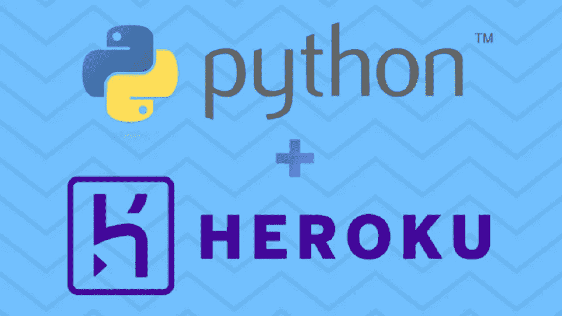
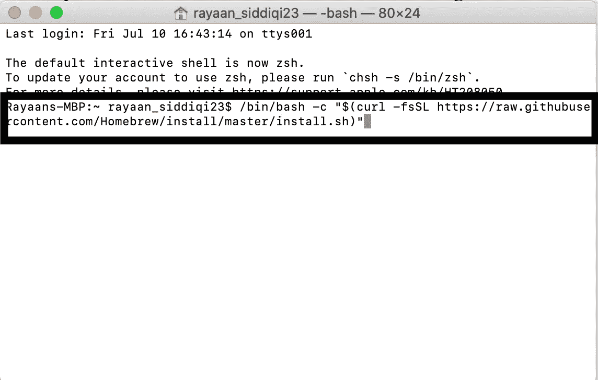
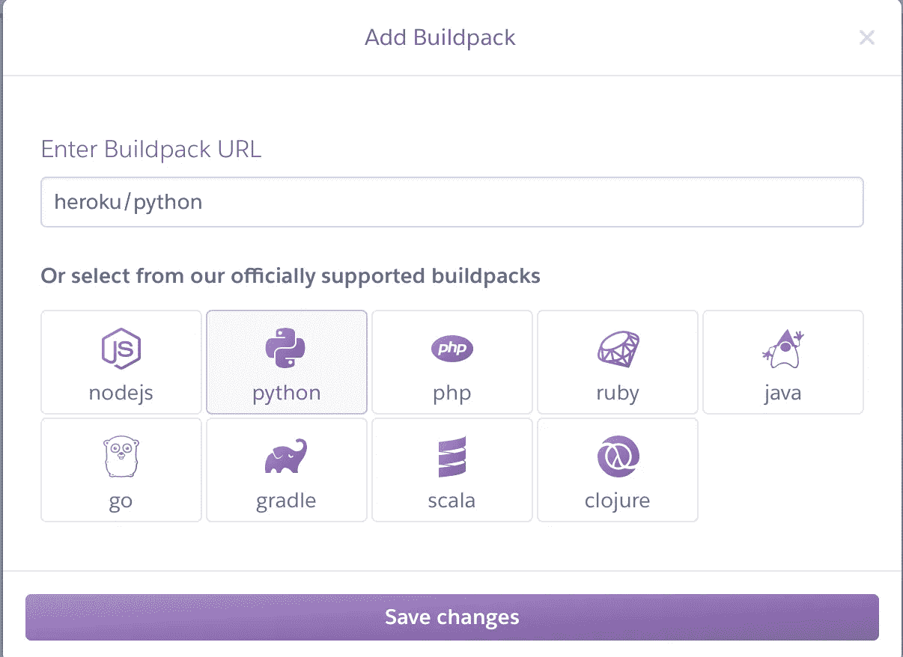
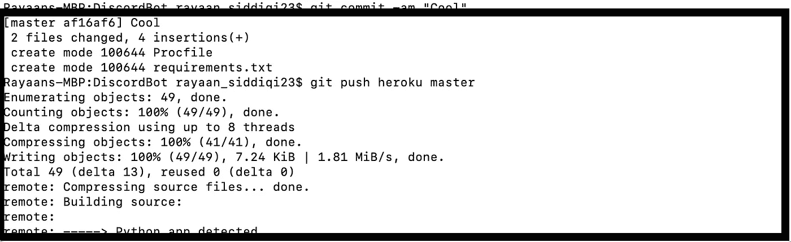

# 如何在 4 分钟内将您的 Python 脚本部署到 Heroku

> 原文：<https://blog.devgenius.io/how-to-deploy-your-python-script-to-heroku-in-4-minutes-cddf11d852af?source=collection_archive---------4----------------------->

# 概观

所以你最近编写了一个不和谐的机器人或有一个脚本，你希望能够决定何时运行？你得来对地方。今天，我将解释如何快速有效地将您的 python 脚本部署到 Heroku，以及通过 Mac 命令行这样做的优势。

# 为什么要把你的 App 部署到 Heroku？

将 python 脚本部署到 Heroku 这样的在线云平台的一个主要原因是，这是一种更高效、更实用的运行脚本的方式，而不是在本地机器上执行脚本。如果您继续长时间(这里指几天)从本地机器的 ide 中或通过命令行运行该脚本，不仅通常会违反您的互联网服务提供商的规则，而且也没有多大意义。也就是说，假设你要关闭你的电脑或终端标签，这意味着你的脚本也被终止。然而，通过使用像 Heroku 这样的在线部署服务，您可以运行该脚本，通常是免费的，甚至可以在何时执行或不执行之间切换。

# 入门指南

1.  我将假设您已经有了某种想要部署的 python 脚本，从这里开始，我们的下一步是确保我们有 Heroku 的命令行工具。然而，在我们这样做之前，大多数 Mac 必须安装家酿软件包安装程序，以便能够下载 Heroku 命令行界面。

为了将 Homebrew 安装到您的命令行，请将下面的命令复制并粘贴到终端。

> /bin/bash-c " $(curl-fsSL[https://raw . githubusercontent . com/home brew/install/master/install . sh](https://raw.githubusercontent.com/Homebrew/install/master/install.sh)

2.在我们安装了 Homebrew 包之后，我们可以下载 Heroku 命令行界面

`brew tap heroku/brew && brew install heroku`

3.接下来我们需要在 Heroku 上创建一个应用程序，为这个应用程序创建一个有意义的名字，我们稍后会用到

4.现在我们需要添加一个 python 构建路径，前往**设置>添加构建路径>选择 Python 选项**

添加 Python 构建路径

# 上传脚本

现在所有的设置都完成了，我们必须把我们的脚本上传到 Heroku。

1.  首先，我们需要创建两个文件，这两个文件是正确部署您的脚本所必需的，它们是`Procfile & requirements.txt file`

**1a。Procfile 设置**

导航到您的项目目录并键入以下命令:`echo>Procfile`

创建 Procfile 的命令

接下来，使用任何文本编辑器，如 NotePad++或 TextEdit，打开描述文件，并用以下内容替换任何已有的文本:

**worker:python yourscriptname . py**

上面这一行指定了您希望能够通过 Heroku 执行的 python 脚本。

注意:不应该有像“.”这样的后缀。txt”放在 proc 文件名的末尾

**1b。Requirements.txt 文件设置**

通过 Finder 或 Files 打开项目目录，创建一个名为**需求**的文本文件

使用文本编辑器打开文件，并添加任何所需的依赖项，如 **numpy** ，以便运行您的项目，因为当您部署到 Heroku 时,“pip”安装命令将会运行，以确保所有依赖项都存在，以便运行脚本。

2.既然我们现在已经设置了所有必要的文件，我们需要创建一个 Github 存储库来保存这些文件，以便上传到 Heroku

为此，我们需要遵循以下命令:

1.`heroku login`

2.`heroku git:remote -a NAME_OF_YOUR_HEROKU_APP`

3.`git add .`

4.`git commit -am "First commit"`

5.`git push heroku master`

终端中的输出应该如下所示

# 在 Heroku 上运行应用程序

我们快完成了！现在，为了打开/执行我们的脚本，我们必须打开我们的应用程序，转到资源，并点击我们的 worker 上的 edit。

注意:脚本开始运行可能需要两分钟！

# **结论**

我们走吧。我们已经使用命令行和 Heroku 接口成功地将 python 脚本部署到 Heroku。

感谢阅读我的媒体文章！我希望您学会了如何快速地将您的 python 脚本部署到 Heroku！请继续关注更多关于我的经历和其他编程相关主题的精彩文章。别忘了在 Medium 上关注我，保持更新！