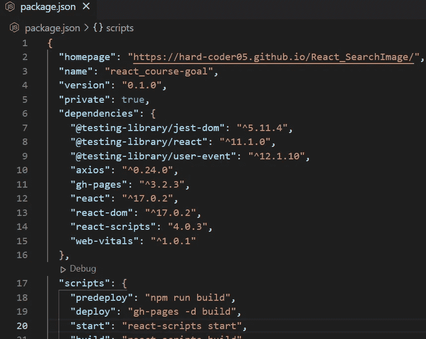
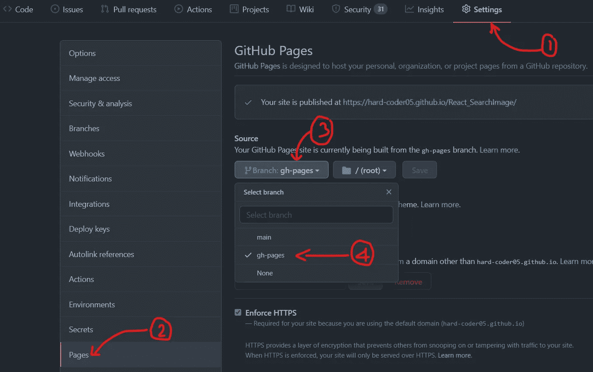

# 如何在 GitHub 页面上部署 React 应用？

> 原文：<https://blog.devgenius.io/how-to-deploy-your-react-apps-on-github-pages-cbaf14d0f59f?source=collection_archive---------11----------------------->

大家好！我会直接切入主要内容。不废话。

我假设您已经创建了自己的项目，并且已经将项目推送到 GitHub。

1.  转到终端，输入以下命令:

> `npm install --save gh-pages`

2.将属性添加到`package.json`文件，如下所示:

我们需要在顶层添加的第一个属性`homepage`:

> `*"homepage": "https://<your-github-username>.github.io/<repository-name>/"*`

其次在现有的`scripts`属性中我们需要添加`predeploy`和`deploy`:

> `"scripts": {
> "predeploy": "npm run build",
> "deploy": "gh-pages -d build"
> }`

文档的屏幕截图

3.将其部署到 GitHub 页面。

只需在终端中运行以下命令:`npm run deploy`

4.转到项目的 Github 存储库。启用 ***Github 页面*** - >选择**-*GH-页面*-**分支。你可以走了。

按照这个截图的指示去做

5.您可以在`*https://<your-github-username>.github.io/<repository-name>/*` *查看您的网站。你可以走了。*

**每次更新代码时，请确保在终端中运行** `npm run deploy` **。你的网页也会更新。**

> **Yayyy！我们做到了。感谢您阅读这篇文章。如果你喜欢，那就表现出你的爱。**

github 上的 React 网页