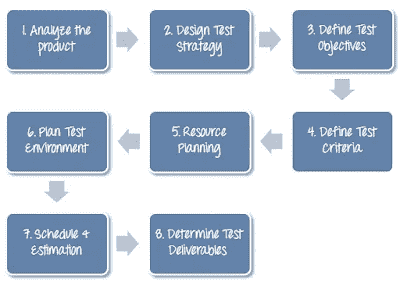

# 如何制定测试计划？

> 原文：<https://blog.devgenius.io/how-to-develop-a-test-plan-bb72ce163759?source=collection_archive---------27----------------------->

戴维·特拉维斯在 [Unsplash](https://unsplash.com?utm_source=medium&utm_medium=referral) 上拍摄的照片

测试计划记录了用于验证和确保产品或系统满足其设计规格和其他要求的策略。测试计划通常由测试工程师准备，或者有测试工程师的重要参与。

**IEEE 829 测试计划标准**

IEEE 是定义全球公认的标准和模板文档的国际机构。IEEE 为系统和软件文档定义了 IEEE 829 标准。它规定了软件和系统测试每个阶段所需的一组文档的格式。

**IEEE 规定了文档编制过程的八个阶段，为每个阶段编制一份单独的文档。**

根据 IEEE 829 测试计划标准，以下几节将介绍如何创建测试计划:

**1。分析**产品

**- >** 创建测试计划的第一步是分析产品、其特性和功能，以获得更深入的理解。此外，探究业务需求以及客户希望从最终产品中获得什么。理解用户和用例，发展从用户的角度测试产品的能力。

2.设计测试策略

**- >** 一旦你分析了产品，你就可以为不同的测试级别制定测试策略了。您的测试策略可以由几种测试技术组成。牢记用例和业务需求，您决定将使用哪种测试技术。

**- >** 例如，如果你正在构建一个拥有成千上万在线用户的网站，你会在你的测试计划中包括‘负载测试’。同样，如果你在一个包括在线货币交易的电子商务网站上工作，你会强调安全性和渗透测试。

3.定义测试目标

**- >** 一个好的测试计划清晰地定义了测试范围及其界限。您可以使用需求规格文档来确定范围中包含的内容和排除的内容。列出“要测试的特性”和“不要测试的特性”。这将使你的测试计划更加具体和有用。您可能还需要将可交付成果的列表指定为测试过程的输出。

术语“范围”适用于功能和测试技术。您可能需要明确定义任何测试技术，比如安全性测试，是否超出了您的产品的范围。类似地，如果您正在对应用程序执行负载测试，您需要指定要测试的用户的最大和最小负载的限制。

**4。定义测试标准**

**- >** 测试标准是测试程序或测试判断所依据的标准或规则。有以下两种类型的测试标准

~ **暂停标准~**

*   指定测试的临界暂停标准。如果在测试期间满足暂停标准，活动测试循环将**暂停**，直到标准**解决**。
*   例如:如果您的团队成员报告有 **40%** 的测试用例失败，您应该**暂停**测试，直到开发团队修复所有失败的用例

**~退出标准~**

*   它规定了表示测试阶段成功完成的标准。退出标准是测试的目标结果，在进入下一个开发阶段之前是必要的。示例:**所有关键测试用例的 95%必须通过。**

****5。资源规划****

****- >** 一份好的测试计划清晰地列出了测试团队和团队经理的角色和职责。“角色和职责”部分以及“时间表”告诉每个人做什么以及什么时候做。**

**6。计划测试环境**

****- >** 测试环境是测试团队执行测试用例的软硬件设置。测试环境包括**真实业务**和**用户**环境，以及物理环境，如服务器、前端运行环境。**

****7。进度&估算****

****- >** 有了测试策略和范围的知识，你就能够开发测试的时间表。将工作划分为测试活动，并估计所需的工作量。您还可以估计每项任务所需的资源。现在，您可以在您的测试计划中包含一个测试进度表，这有助于您控制测试过程的进度。**

****8。确定测试可交付成果****

****- >** 您的测试计划是不完整的，没有预期的风险、缓解技术和风险响应。软件测试中有几种类型的风险，如进度、预算、专业技能、知识。你需要列出你的产品的风险，以及风险应对和减轻风险的技术。**

****- >** 一个复杂的系统可能有一个高层的测试计划来解决总体需求，以及支持测试计划来解决子系统和组件的设计细节。**

****

**测试计划文档的格式可以随着它们所应用的产品和组织的不同而不同。测试计划中应该描述三个主要的元素:测试覆盖、测试方法和测试职责。这些也用在正式的测试策略中，这在每一个测试计划中都很常见，不管范围的不同对开发它的组织或个人是否重要。**

**如果您正在寻找我们的服务，请点击下面的网站:**

**[StackedQA 网站](https://www.stackedqa.com/)**

**查看我们的社交媒体:**

**[脸书](https://www.facebook.com/StackedQA)，[推特](https://twitter.com/stackedqa)， [Instagram](https://instagram.com/stackedqa) ，&Linkedin**