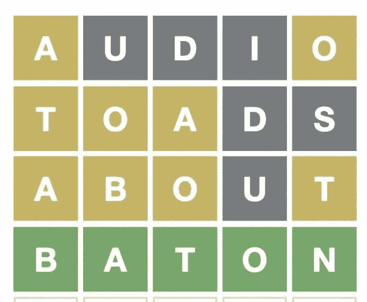

# 如何在 25 分钟内用 TDD 开发一个 Wordle 游戏

> 原文：<https://blog.devgenius.io/how-to-develop-a-wordle-game-using-tdd-in-25-minutes-2157c93dda9f?source=collection_archive---------4----------------------->

## 使用 TDD 开发一个完整的 Wordle 游戏非常容易

这些天每个人都在玩文字游戏…

我喜欢 TDD。

 [## TDD 会议 2021 —所有会谈

### 第一次国际测试驱动开发发生在 7 月 10 日。

blog.devgenius.io](/tdd-conference-2021-all-talks-e1eeef89497e) 

所以，让我们开始行动吧…

> TL；DR:只需几个步骤，我们就能构建一个健壮的 Wordle。

# 定义一个词

Wordle 中的最小信息量是一个单词。

我们可以争辩说*字母*更小，但是我们认为所有需要的字母协议都已经定义好了(我们可能错了)。

单词不是字符串。这是一个常见的错误和双射违规。

 [## 唯一的软件设计原则

### 如果我们在一个单一的规则上建立我们的整个范式，我们可以保持它的简单并做出优秀的模型。

codeburst.io](https://codeburst.io/the-one-and-only-software-design-principle-5328420712af) 

一个*单词*和一个*字符串*有不同的职责，尽管它们可能会相交。

> 将(偶然的)实现细节与(本质的)行为混为一谈是一个非常常见的错误。

所以我们需要定义*什么是单词*。

Wordle 中的一个单词是一个*有效的* 5 字母单词。

让我们从我们的快乐之路开始:

*我们断言对‘valid’中字母的提示返回一个包含字母的数组。*

## 通知；注意

*   词类尚未定义。
*   我们不关心信件分类。这将是一个不成熟的优化和镀金场景。
*   我们从一个简单的例子开始。没有重复。
*   我们还没有弄乱单词验证(单词可能是 XXXXX)。
*   我们可以从一个简单的测试开始，只需创建验证字。这将违反总是需要断言的测试结构。
*   期望值应该始终是第一位的。

我们得到一个错误:

> 错误:找不到类“Wordle\Word”

这在 TDD 中是好的，我们正在探索我们的领域。

我们需要用构造函数和 letters()函数创建一个单词。

## 通知；注意

*   我们不需要与构造函数参数有任何关系
*   我们硬编码字母函数，因为这是迄今为止最简单的可能解决方案。
*   假装直到我们成功。
*   类是最终的，以避免子类化。

我们运行了所有的测试(只有一个)，我们都没问题。

> 正常(1 次测试，1 次断言)

让我们编写另一个测试:

## 通知；注意

*   PHPUnit 异常引发不是很好。我们只是声明一个将被引发的异常。

测试失败…

> 未能断言引发了“Wordle\Exception”类型的异常。

为了让 test02 通过(还有 test01)，我们需要改变我们的实现

## 通知；注意

*   我们只是检查几封信。不会太多，因为我们还没有覆盖测试。
*   TDD 要求全覆盖。在没有测试的情况下添加另一个检查是违反技术的。
*   我们只是提出一个一般的异常。创建特殊异常是一种[代码味道](/code-smell-26-exceptions-polluting-9246aca40234)污染名称空间。(除非我们抓住它，但这不是现在发生的事情)。

 [## 气味代码 26 —污染例外

### 有许多不同的例外是非常好的。您的代码是声明性的和健壮的。还是没有？

blog.devgenius.io](/code-smell-26-exceptions-polluting-9246aca40234) 

让我们检查太多

测试不出所料。我们来纠正一下。

> 未能断言引发了类型为“exception”的异常。

所有测试都通过了。

> OK (3 个测试，3 个断言)

我们现在可以进行(可选的)重构，并将函数更改为针对一个范围而不是两个边界进行断言。我们决定保留这种方式，因为它更具声明性。

我们还可以按照僵尸方法添加一个测试来检查零单词。

 [## 我是如何在僵尸启示录中幸存的

### 选择优秀的测试用例非常困难。除非你召唤亡灵。

blog.devgenius.io](/how-i-survived-the-zombie-apocalypse-19905db22043) 

让我们开始吧。

测试通过并不令人惊讶，因为我们已经有了一个覆盖这个场景的测试。
由于该测试没有增加任何价值，我们应该将其删除。

现在让我们检查一下什么是有效的字母:

…由于没有产生断言，测试中断。

> 未能断言引发了类型为“exception”的异常。

我们需要更正代码…

并且所有测试都通过了，因为我们显然是硬编码的。

> OK (5 个测试，5 个断言)

让我们添加更多的无效字母并更正代码。

## 通知；注意

-我们还没有写一个更通用的函数，因为我们不能同时修正测试和重构(技术不允许我们这么做)。

所有测试都没问题。
我们可以重构。
我们替换最后两句话

## 通知；注意

*   断言只检查大写字母。因为我们到现在都在处理这些例子。
*   我们尽可能推迟设计决策。
*   我们定义了一个基于英文字母的正则表达式。我们很确定它不接受西班牙语、德语等。

作为检查点，从现在起我们只有五个字母单词。

让我们断言 on letters()函数。
我们把它硬编码了。
TDD 开启多条路径。我们需要跟踪所有的邮件，直到我们打开新的邮件。

我们需要比较单词

测试失败。
让我们使用发送给他们的参数。

## 通知；注意

-我们存储字母，这足以进行对象比较(这可能取决于语言)。
- letters()函数仍然是硬编码的

测试没问题

> OK (8 个测试，8 个断言)

我们添加了一个不同的单词用于字母比较

测试失败。

> 断言两个数组相等失败。

检查相等/不相等而不是 assertTrue()是非常重要的，因为许多 ide 基于对象打开比较。这是使用 ide 而不使用文本编辑器的另一个原因。

让我们更改 l *etters()* 函数

我们的单词和英语单词一模一样。还是没有？

这个测试失败了。
我们没有陷印无效的英文 5 个字母单词。

我们需要做出决定。根据我们的双射，有一个外部字典主张有效的词。

我们可以在造词时用字典来验证。但是我们希望字典存储有效的单词。不是字符串。

这是一个先有蛋还是先有鸡的问题。

我们决定处理字典中的无效单词，而不是单词。

我们在字典上创建新的测试。

测试失败，因为我们没有定义字典。
我们这样做:

## 通知；注意

-我们还没有对单词做任何事情。
——我们硬编码字数。
-我们又伪造了一次。

如果字典中有一个单词，我们为 count 1 添加另一种情况。

测试不出所料

> 未能断言 0 与预期的 1 匹配。

我们纠正它。

## 通知；注意

-字典是不可变的
-没有 Setters 或 getters

我们从包含开始，得到一个错误。

> 错误:调用未定义的方法 word le \ Dictionary::includes word()

所以我们假装。

我们加一个正例。
我们需要修正函数，而不是硬编码。

我们让字典工作。

让我们来创造这个游戏。

测试失败。
我们需要创建类和函数。

我们实施的话试过了。
最简单的解决方案

让我们试一些单词。
我们得到

> 错误:调用未定义的方法 Wordle\Game::addtry()

我们定义它。

## 通知；注意

-我们在本地存储试验，并添加试验，还更改 words tryed()real 实现。

我们可以实现 hasLost()，如果它错过了 5 次尝试。
照常用最简单的实现。

一如既往。我不再假装，而是决定去做。

> 断言 false 为 true 失败。

所以我们把它修改如下。

我们有大部分的机械。
我们来添加字典，玩无效

我们需要通过字典来修改测试

修好了。

现在，我们为胜利而战

我们需要纠正 hasWon()。

## 通知；注意

-我们不使用标志来检查某人是否有话要说。我们可以直接去查。
-我们用这个新元素对之前的游戏定义进行*addParameter*重构。

我们加了温纳德。
我们需要断言这个词在字典里。

> OK (8 个测试，10 个断言)

我们有所有的机制。

让我们把字母的位置加起来。
我们可以在单词课上做。

测试通过

> 好的(10 个测试，10 个断言)

让我们比赛

失败了。

我们需要更好地定义它

我们一直在进行所有的测试

> OK (23 个测试，25 个断言)

我们可以添加一个安全性测试，使其更具宣示性

现在我们需要最后的步骤。在不正确的位置匹配。
而且总是最简单的解决方案…

更辛辣的测试案例。
让我们开始实施吧

我们从事件中删除精确匹配。

> 好的(26 个测试，32 个断言)

就是这样。
我们已经实现了一个非常小的模型，其中包含了所有有意义的规则。

# 未来的步骤

一个好的模型应该能够忍受需求的变化。

在下面的文章中，我们也将使用 TDD 进行这些增强:

*   管理不同的语言和字符。
*   从文本文件中导入单词。
*   添加一个可视化引擎并托管它。
*   实现一个[荒谬的](https://qntm.org/files/wordle/)。
*   开发一个机器学习算法来减少单词移动。

# 贮藏室ˌ仓库

您可以拥有所有代码(并在 GitHub 上发出拉取请求。

 [## GitHub - mcsee/TDD-Wordle:这个报告解释了如何使用 TDD 制作一个 Wordle 游戏

### 此时您不能执行该操作。您已使用另一个标签页或窗口登录。您已在另一个选项卡中注销，或者…

github.com](https://github.com/mcsee/TDD-Wordle) 

# 结论

TDD 是一种迭代方法。如果你发现一些缺失的功能，你可以在 twitter 上给我写信，我们会添加它(当然，是在一个失败的测试案例之后)。

 [## JavaScript 不可用。

### 编辑描述

twitter.com](https://twitter.com/mcsee1) 

希望你喜欢这篇文章，喜欢玩 Wordle！