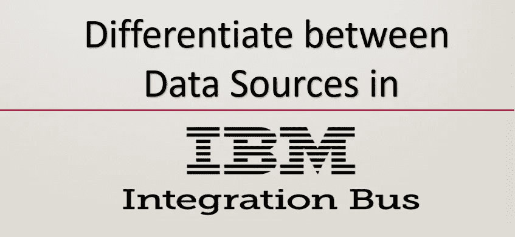
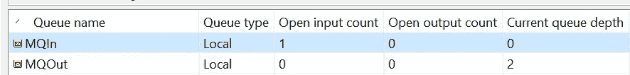

# 如何在 IIB App Connect Enterprise 11 中区分 SOAP 和 MQ 输入

> 原文：<https://blog.devgenius.io/how-to-differentiate-between-soap-and-mq-inputs-in-iib-app-connect-enterprise-11-66edfbf46d6b?source=collection_archive---------10----------------------->

成为一名软件工程师最大的好处是，在你的职业生涯中，你有机会使用不同的语言、平台和工具。在 IBM 工作，你会经常得到这样的机会。因此，在过去的几个月里，我一直在从事 IBM 集成总线(也称为 IIB)的工作。IBM Integration Bus 允许业务信息在跨多个硬件和软件平台的应用程序之间流动。

在 IIB 学习工作时，我发现很难获得在线支持，所以我不得不通过有时从同事那里获得帮助来学习，并调试我的实现以弄清楚发生了什么。本教程演示了如何区分 IIB 中不同类型的数据输入，如 MQ、SOAP、REST 或 HTTP。为此，我将只区分

## 步骤 1:创建消息流。

在本教程的消息流中，我们将使用一个 SOAP 输入节点、一个与用 ESQL 编写的计算机节点连接的 MQ 输入、一个路由器、一个 ReplyToQ 和一个 SOAP 回复节点。完整的演示如下所示。

## 第二步:确保连接

一旦流准备就绪，我们需要将各自的节点连接到它们的数据源和目的地。

**步骤 2.1:连接 SOAP 输入节点:**

单击 SOAP 输入节点并检查下面的属性。SOAP 输入节点有两个强制属性。在基础部分，选择单选按钮“在网关模式下操作”,因为我们在本教程中不涉及 wsdl。

需要设置的另一个强制属性是 soap 输入节点将要监听的路径。在 SOAP 输入节点的属性中，单击 HTTP 传输并指定路径。对于这个例子，我们将使用默认路径，但是您可以使用任何您想要的路径。

SOAP 应答节点将把响应返回给请求的同一个源。

**步骤 2.2:连接 MQ 节点。**

下一步，我们将在 MQ Explorer 中将 MQ 节点与消息队列连接起来。首先在 MQ Explorer 中创建两个名为 MQIn 和 MQOut 的队列。

单击 MQ 输入节点，并在属性中从下拉列表中选择连接作为本地队列管理器。(此功能在 IIB App Connect Enterprise 11 中提供)。

现在单击 Basic 选项卡，输入要连接的队列名称。

对 MQ 输出节点进行同样的操作。

**步骤 2.3:设置路线属性**

单击路由节点，并在基本选项卡中“添加”过滤器模式，如下所示。

## 步骤 3:计算节点 ESQL 代码

最后，在这一步中，我们已经准备好了流程和所有的连接。为了检查数据源，在 InputRoot 的属性中有一个名为 ReplyProtocol 的值。

调试完代码后，我们找到了这些值，并设置了如下所示的环境变量，以便路由节点进行过滤。

从 SOAP UI 测试 SOAP 项目时，我们得到了与输入相同的响应，因为语句

> SET OutputRoot = InputRoot

对 MQ 输入进行同样的测试，我们在 MQOut 队列中得到我们所期望的消息。

## 结论:

在本教程中，我们学习了如何区分 IIB 中不同的数据输入类型，如 SOAP 和 MQ。ReplyProtocol 的这个简单的消息属性值可用于所有类型的输入，如 HTTP、REST、SOAP 和 MQ。我们还学习了如何在 MQ Explorer 中将 MQ 输入和输出节点与队列连接起来。我们还学习了如何使用路由节点过滤器属性来回复相应的输出节点，例如 SOAP 输入的 SOAP 回复和 MQ 输入的 MQ 输出。(在这种情况下，您也可以使用 MQ 回复节点)。

希望这篇教程能帮助你学习一些关于 IIB 集成开发的重要知识。

请点击以下链接查看我在 github 上的项目:

 [## 艾哈迈德汗 1991/mqsoapidentifiersql

### 该项目在单个消息流中接受来自 SOAP 输入节点和 MQ 输入节点的输入，并回复给…

github.com](https://github.com/ahmedkhan1991/mqSoapIdentifierESQL) 

快乐学习