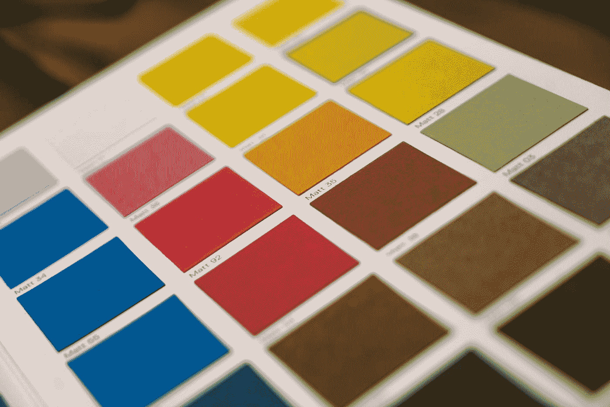

# 如何禁用页面的浏览器打印选项(页眉、页脚、页边距)？

> 原文：<https://blog.devgenius.io/how-to-disable-browser-print-options-headers-footers-margins-from-the-page-748942162c8b?source=collection_archive---------0----------------------->



照片由[米卡·鲍梅斯特](https://unsplash.com/@mbaumi?utm_source=medium&utm_medium=referral)在 [Unsplash](https://unsplash.com?utm_source=medium&utm_medium=referral) 上拍摄

有时，我们希望在打印网页时禁用页眉、页脚和页边距。

在这篇文章中，我们将研究在打印时禁用页眉、页脚和页边距的方法。

# 使用 CSS 禁用页眉、页脚和页边距

我们可以用 CSS 禁用页眉、页脚和页边距。

例如，我们可以写:

```
<!doctype html>
<html><head>
    <title>Print Test</title>
    <style type="text/css" media="print">
      @page {
        size: auto;
        margin: 0mm;
      } html {
        background-color: #FFFFFF;
        margin: 0px;
      } body {
        border: solid 1px blue;
        margin: 10mm 15mm 10mm 15mm;
      } </style>
  </head> <body>
    <div>Top line</div>
    <div>Line 2</div>
  </body></html>
```

当用`@page` CSS 指令打印时，我们为页面设置一些样式。

我们将`size`设置为`auto`，将`margin`设置为`0mm`，以移除边距。

然后我们将`html`样式设置为白色背景，没有空白。

并且在主体中，我们设置了`border`和`margin`样式。

我们将`media`属性设置为`print`，以确保样式仅在页面打印时应用。

# 结论

当页面的各个部分以特定的 CSS 样式打印时，我们可以禁用它们。