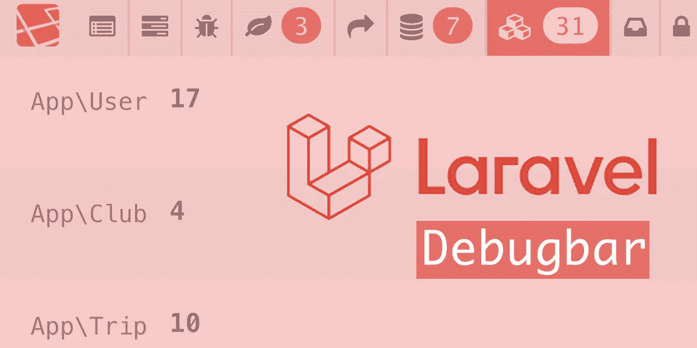
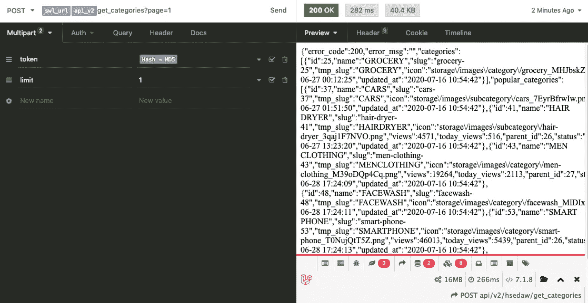
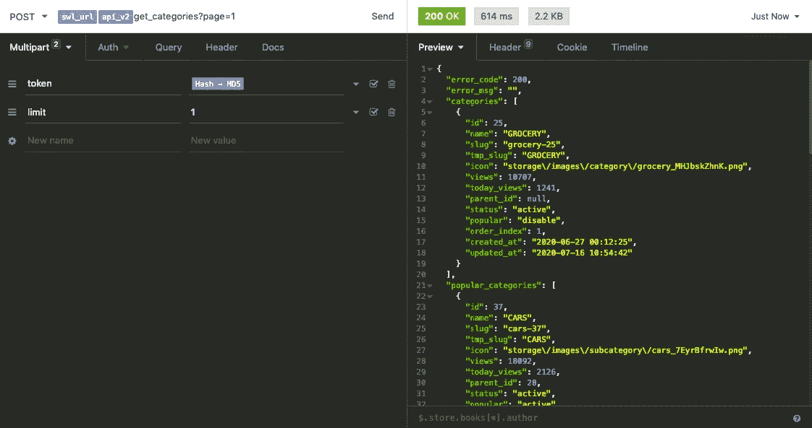

# 如何在 Laravel 中禁用 API 路由的调试栏

> 原文：<https://blog.devgenius.io/how-to-disable-debug-bar-for-api-route-in-laravel-a78090b98d26?source=collection_archive---------5----------------------->

当我开发任何应用程序时，我习惯于使用调试模式和调试栏来优化资源和响应。但是，这个调试栏对于 API 开发来说并不太好。你可以看到下面的 API 的结果，而我正在工作。理解 JSON 对象和数组太难了。

# DebugBar 包

我正在使用[*barryvdh/laravel-debug bar*](https://github.com/barryvdh/laravel-debugbar)*包进行调试。它有时可能会降低应用程序的速度，但是它可以用来调试应用程序。*

## *安装:*

*需要带有 composer 的此软件包*

> *作曲家要求 barryvdh/laravel-debugbar — dev*

*当 ***APP_DEBUG*** 为 ***true*** 时，Debugbar 将被启用*

# *禁用 API 路由的调试栏*

1.  *将 *ServiceProvider* 添加到***config/app . PHP***中的 providers 数组*

> *Barry vdh \ debug bar \ service provider::class，*

*2.在***config/app . PHP***中添加这个到你的门面*

> *debug bar ' = > Barryvdh \ debug bar \ Facade::class，*

*3.在您的根项目目录中运行以下命令，将包配置复制到本地配置:*

> *php artisan 供应商:publish-provider = " Barryvdh \ debug bar \ service provider "*

*4.发布此命令后，您可以看到 config 文件夹***config/debug bar . PHP***中的***【debugbar.php】****除了数组之外的变化。在数组中添加“api*”字符串。**

> **除了' => [ 'telescope* '，' api*' ]，**

****

**现在，你可以在图像中看到我正在得到美化 JSON 响应。当你开发一个应用程序的时候，这真的很有帮助。**