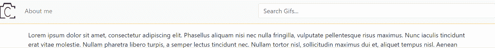

# 如何禁用 Angular 中的事件—弗兰·彼尔托

> 原文：<https://blog.devgenius.io/how-to-disable-events-in-angular-fran-prieto-46ba8a86b89d?source=collection_archive---------9----------------------->


有时我们有一个事件绑定到一个元素，出于某种原因，我们必须避免这个事件被触发，所以我们必须禁用那个事件。为了完成这样的任务，在普通的 Javascript 中我们有一个类似于`preventDefault()`的方法。我们将看到如何在 Angular 中禁用事件。

您可以在此找到更多信息:

【https://www.w3schools.com/jsref/event_preventdefault.asp 

用 Angular 实现这一点的方法非常相似，我们可以通过`$event`对象来实现。这个对象包含关于一个事件的信息，它有类似`$event.target`的属性来引用触发事件的元素。你可以在 angular [这里](https://angular.io/guide/event-binding-concepts)找到更多关于事件绑定的信息

将事件作为参数传递给方法的方式如下:

```
<button (click)="showModal($event)">Push button</button>
```

因此，如果我们想要防止这个点击事件没有被触发，我们所要做的就是使用`preventDefault()`方法，这样:

```
<button (click)="showModal( $event.preventDefault() )">Push button</button>
```

## 应用我们所学的例子

通过这个例子我们会看得更清楚。

假设我们有一个搜索栏。当我们点击这个条，我们将显示该用户的搜索历史。这个列表中的每个元素都会添加一些样式，告诉用户他们可以单击这个元素来使用这个文本执行新的搜索。大概是这样的:


但是，如果搜索是空的呢？我们将显示一个文本，邀请用户输入有效的搜索。我们将使用相同的 HTML 元素来显示搜索历史，但当然，这一次，该元素不应该是可点击的，因为它不是我们搜索历史的一部分。大概是这样的:



正如我们所看到的，“请输入有效的搜索”有不同的风格，我们已经防止点击事件被触发。如果用户点击它，什么也不会发生。

我们是如何用 Angular 做到的？这段代码是:

```
<ul class=”d-flex flex-fill navbar-nav mb-lg-0"> <li class=”w-100"> <input class=”form-control me-2" type=”search”  placeholder=”Search Gifs…” aria-label=”Search” (keyup.enter)=”search($event)” (click)=”displaySearchHistory()” #searchInputElement> <ul id=”search-history” [@openClose]=”isOpen ? ‘history-open’ : ‘history-closed’” > <span *ngIf=”isClickable;else enterValidSearch”> <li class=”clickable-list” *ngFor=”let item of this._gifsService.historicObserv$ | async” (click)=”search($event)”> {{item}} </li> </span> <ng-template #enterValidSearch> <li (click)=”$event.preventDefault()”>Please enter valid search</li> </ng-template> </ul> </li></ul>
```

***注意:*** *有些代码超出了本文的范围，并且与如何在 angular 中禁用事件无关，因为我使用了类似 Angular 动画的东西来在显示列表时应用更平滑的过渡。如果你想详细了解棱角分明的动画，请查看官方示例* [*这里有*](https://angular.io/guide/animations) *。您还可以看到，我们使用了 Observables 和异步管道来显示数据。我推荐你去看* [*这篇文章*](https://medium.com/@franprietodeveloper/angular-and-observables-how-to-avoid-the-subscription-with-the-help-of-async-pipe-95d5d4221998) *来了解更多一点。*

*同样，我们在* `displaySearchHistory()` *和* `search()`方法上使用的代码，或者验证一个搜索是否为空的代码，在此不再详述。很多时候[角形](https://angular.io/guide/forms-overview)被用来做*这些类型的验证，但是我使用普通的 Javascript。这个* `trim()`方法对完成它非常有用🙂

这里我们必须关注的重要事情是`(click)`事件和`$event`物体。

我们在这里所做的是验证一个名为`isClickable`的布尔属性是否允许点击事件被触发。

在`isClickable`为真的情况下，将显示带有搜索历史的`<li>` HTMLelement。注意，我们将应用一个名为`"clickable-list"`的类，当我们将鼠标悬停在结果上时显示一些样式。以防你好奇，我的 css 规则是:

```
.clickable-list{ /* to make each LI element fill all the width of the UL element. As we can see on browser´s console it has a padding-left of 2rem, we adjust the margin left as the same negative value. The padding left here is to move the text a bit */ margin-left: -2rem; padding-left: 2rem;}.clickable-list:hover{ background-color:#FFC107; color: white;}
```

正如我们之前所说的，我们将能够控制我们的`(click)`事件，并将它传递给带有对象作为参数的`search()`方法。这就是为什么我们写了`(click)="search($event)"`

有了这个对象，我们将能够对我们的代码执行一些我们需要的操作。

但是在`isClickable`属性为假的情况下，我们将显示一个不同的`<li>`元素。这一次，正如我们所说的，当用户单击这个元素时，不会触发任何操作。防止这种情况的方法是使用[角度 ng 模板](https://angular.io/api/core/ng-template)元素。通过一个名为`enterValidSearch`的[模板变量](https://angular.io/guide/template-reference-variables)，我们将在`*ngIf`语句中引用这个模板，并在`isClickable`为假的情况下显示它(这将在我们的。ts 代码，如前所述，这超出了本文的范围)。

```
<ng-template #enterValidSearch>

    <li (click)="$event.preventDefault()">Please enter valid search</li> </ng-template>
```

我们还可以看到，我们可以用`$event.preventDefault()`来防止`(click)`事件触发

就是这样！希望这篇文章对学习如何在 Angular 中禁用事件有所帮助。如果您看到任何错误或我可以改进的地方，请联系我。

**精选图片由* [*Gerd 奥特曼*](https://pixabay.com/es/users/geralt-9301/?utm_source=link-attribution&utm_medium=referral&utm_campaign=image&utm_content=1607196) *在* [*Pixabay*](https://pixabay.com/es/?utm_source=link-attribution&utm_medium=referral&utm_campaign=image&utm_content=1607196) 中找到

*原载于 2022 年 5 月 23 日 https://portfolio.avanzartewebs.com*[](https://portfolio.avanzartewebs.com/javascript/angular/2022/05/23/how-to-disable-events-in-angular/)**。**