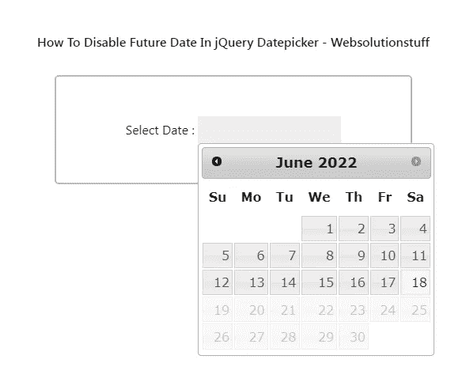

# 如何禁用 jQuery 日期选择器中的未来日期

> 原文：<https://blog.devgenius.io/how-to-disable-future-date-in-jquery-datepicker-7f707b3dc5c0?source=collection_archive---------8----------------------->

在本教程中，我们将了解如何在 jquery datepicker 中禁用未来日期。在日期选择器中，任何未来日期之后的今天日期都将被 jquery UI 日期选择器禁用。jquery UI Datepicker 很容易根据需求进行定制。

那么，让我们看看 jquery datepicker 禁用未来日期，在 datepicker 中禁用未来日期，在 jquery UI datepicker 中禁用未来日期，如何使用 javascript 禁用日历中的未来日期，bootstrap datepicker 禁用未来日期，datepicker 在 javascript 中禁用未来日期，如何在输入类型 date 中禁用未来日期，如何在 datepicker 中设置最大日期，如何在 datepicker 中将最大日期设置为当前日期，jquery ui datepicker maxdate today。

**举例:**

```
<!DOCTYPE html>
<html>
<head>
    <title>How To Disable Future Date In jQuery Datepicker - Websolutionstuff</title>
    <link href="http://code.jquery.com/ui/1.9.2/themes/smoothness/jquery-ui.css" rel="stylesheet" />
    <script src="http://code.jquery.com/jquery-1.8.3.min.js"></script>
    <script src="http://code.jquery.com/ui/1.9.2/jquery-ui.js"></script>
    <style type="text/css">
        .container{
            border-radius: 5px;
            padding:50px 20px;
            margin:30px auto;
            width:40%;
            border:2px solid #bbb;
            text-align: center;
        }
        input{
            padding:5px;
            background-color:#eeeeee;
        }
        h2{
            text-align: center;
            margin-top: 100px;
            font-weight: 600;
        }        
    </style>
</head>
<body>
    <h2>How To Disable Future Date In jQuery Datepicker - Websolutionstuff</h2>
    <div class="container">
        <label>Select Date :</label>
        <input type="text" id="datepicker">
    </div>
</body>
<script type="text/javascript">
    $(function() {
        $( "#datepicker" ).datepicker({  maxDate: new Date() });
    });
</script>
</html>
```

**阅读另:** [**如何在 jQuery Datepicker**](https://websolutionstuff.com/post/how-to-disable-specific-dates-in-jquery-datepicker) 中禁用特定日期

**输出:**



**你可能也会喜欢:**

*   **另请参阅:** [**如何使用 Jquery 输入掩码验证电话号码**](https://websolutionstuff.com/post/how-to-validate-phone-number-using-jquery-input-mask)
*   **阅读另:** [**如何在 Jquery**](https://websolutionstuff.com/post/how-to-get-selected-checkbox-list-value-in-jquery) 中获取选中的复选框列表值
*   **阅读另:** [**如何使用 Javascript**](https://websolutionstuff.com/post/how-to-validate-upload-file-type-using-javascript) 验证上传文件类型
*   **阅读也:** [**自动跳转到下一个输入字段 JQuery**](https://websolutionstuff.com/post/autotab-to-next-input-field-jquery)