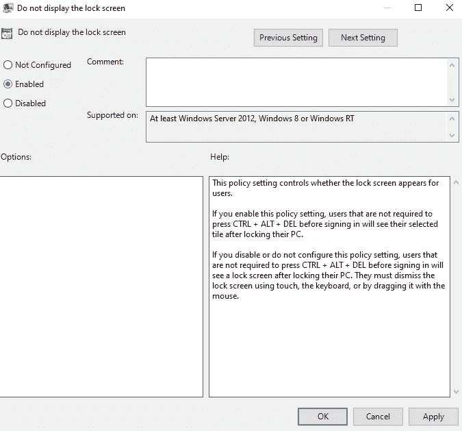

# 如何在 Windows 10 上禁用锁屏

> 原文：<https://blog.devgenius.io/how-to-disable-the-lock-screen-on-windows-10-8f9dfcfb176b?source=collection_archive---------9----------------------->

Windows 10 充满了新功能，事实上，自从第一次发布以来，这个列表随着每次更新而增加。然而，锁定屏幕有时可能会有问题，如果有时很难登录到您的设备，那么它再漂亮也没有用。这就是为什么在这篇文章中，我会告诉你如何在 Windows 10 上禁用锁屏。

# 为什么要去掉？

对于一些用户来说，完全取消锁屏是最好的选择，因为他们可能是房子里唯一的用户，所以没有必要这样做。在某些情况下，他们甚至想删除它，因为它会进一步降低他们的加载速度。不管是什么情况，以下是几个简单的步骤。

**第一步**。按“Windows”键和“R”键，然后键入 regedit。然后按 enter 或 OK。

**第二步**。在目录中搜索这个文件夹，HKEY _ 本地 _ 机器- >软件- >微软- > Windows。

**第三步**。右击 Windows 目录，选择 New- >键创建一个新目录。

**第四步。**将新密钥重命名为 Personalization。在新文件夹上，右键单击并选择新的 DWORD (32 位)值。

**第五步。**现在您需要将新文件重命名为 NoLockScreen，将值数据更改为 1，并选择 OK。

为了让效果生效，你需要重启你的系统，如果你做对了，你应该不会看到锁屏。然而，这种方式对于不精通技术的人来说可能有点复杂，这就是为什么下面你会找到另一种方式来做到这一点。

## 使用组策略编辑器禁用 Windows 锁定屏幕

这种方式更容易完成任务，甚至对于不熟练使用计算机的人也是如此。

**第一步**。按“Windows”键和“R”键，键入 gpedit.msc。然后按 enter 或 OK。

**第二步**。导航到特定文件计算机配置- >管理模板- >个性化- >“不显示锁定屏幕”。

**第三步**。在选定的文件上单击编辑。然后选择“启用”选项，并按“确定”。

# 结束语

无论你有什么理由不想要这篇文章中的锁屏，你会看到两种方法可以禁用它。无论如何，我希望这有助于你们中的一些人实现这一点，我可以保证在写这两个方法的时候工作。如果你有任何问题，请在下面留言。