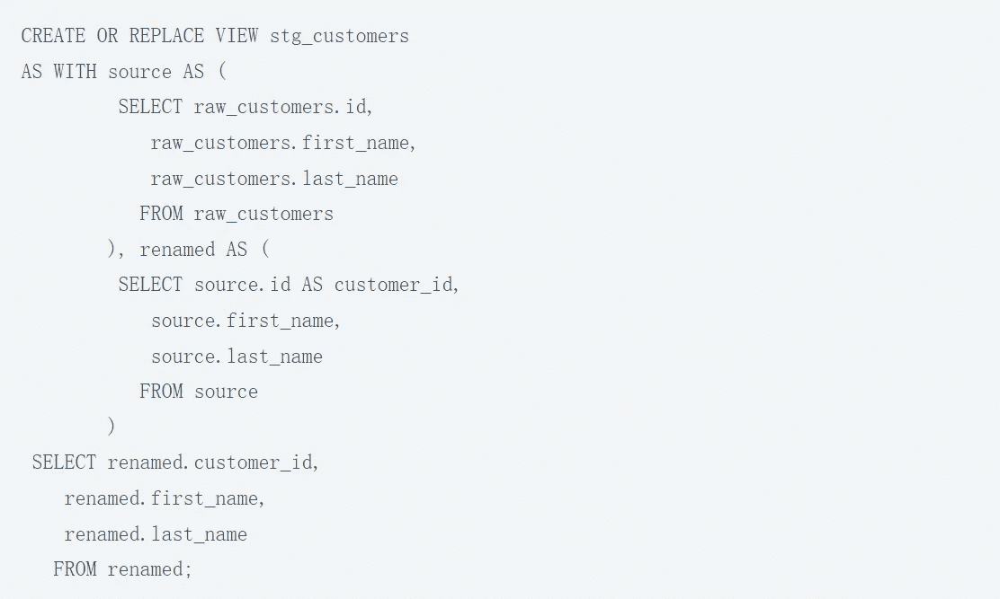

# 如何在 5 分钟内发现 SQL 语言中的数据血统？

> 原文：<https://blog.devgenius.io/how-to-discover-data-lineage-in-sql-language-in-5-minutes-406ba357b3d9?source=collection_archive---------4----------------------->

数据仓库和数据湖中最常用的数据处理工具是 SQL 语言。无论是数据加载，数据转换，还是数据清洗，都会用到 SQL 查询语言，更不用说数据查询分析了。在数据仓库和数据湖中，数据沿袭在提高企业数据质量方面起着非常重要的作用。可以参考 [**本文**](https://www.gudusoft.com/whats-data-lineage-why-important/) 关于数据血统在企业数据治理中的重要作用。在这篇文章中，我们关注**如何在 5 分钟**内发现 SQL 语言中的数据血统。

也就是说，我们将重点关注如何在 SQL 语句中发现**数据血统**，以及哪些 SQL 语句隐藏了数据血统。如果你想知道你公司的数据仓库和数据湖中存在什么样的数据血统，本文教你在 5 分钟内，通过分析你企业中已经存在的 SQL 语句，快速获取数据血统信息。这样就可以进行数据追溯分析，分析某个表的字段被修改会影响到哪些系统。

本文的分析方法适用于各种数据库的 SQL 语句，如主流关系数据库 DB2、MySQL、Oracle、PostgreSQL、SQL Server，以及数据仓库系统如 Greenplum、HP Hana、Teradata、Vertica 等。同时，这些分析方法也适用于基于云的数据湖，如 Azure Synapse Analytics、AWS Redshift、Google BigQuery、Snowflake。

在深入我们的文章之前，让我们弄清楚什么是数据血统。

## **1。什么是数据血统？**

首先我们需要知道什么是数据血统，维基百科定义它 [**这里**](https://en.wikipedia.org/wiki/Data_lineage) 。如果你想学习数据血统的基础知识，在这里 查看 [**。这里我们只讨论数据库中各种表或视图之间的数据沿袭，也就是说，各种表和视图之间的数据是如何关联和流动的。**](https://www.gudusoft.com/whats-sql-lineage-101/)

我们以一个网上商店的数据仓库为例来解释数据血统是如何产生的。该数据库包含 8 个表格，显示了原始数据的导入、清理和转换过程。

1.1 外部数据导入表

数据从外部系统进入系统，并存放在以下三个表中:

1.2 中间表

从上面的落地表到这里的中间表，可以进行数据清理等工作:

1.3 数据仓库模型表

中间表中的数据按照业务要求的格式进行逻辑转换，存储在下面的模型表中，供业务人员查询分析:

## **2。数据血统是如何产生的？**

使用不同的 SQL 语句，可以在数据仓库中不同的表之间进行数据加载、清洗、转换等工作。随着数据在不同表和视图之间的移动和转换，数据谱系就这样产生了。

2.1 插入声明

Insert 语句用于将数据插入表中。但是普通的 insert 语句无法生成**数据血统**:

因为数据源都是常量，不是来自另一个表。下面的 insert SQL 语句将生成数据沿袭/关联:

下图显示了生成的表级数据沿袭，表明 stg_customers 表的数据来自 raw_customers 表。熟悉 SQL 语言的人一眼就能看出来。

下图显示了生成的字段级数据沿袭，表明 stg_customers 表中 customer_id 字段的数据来自 raw_customers 表中的 id 字段。

2.2 创建视图语句

create view 语句表示创建一个视图，该视图的数据来自创建视图时指定的基础表。显然，在基础表和这个视图之间有一个数据沿袭。

生成的字段级数据沿袭如下。我们可以从 create view SQL 语句中找到 raw_customers 表和 stg_customers 视图之间的数据关联。

类似地，数据仓库中常用的 CTAS 语句(Create Table As Select)也将在源数据表和目标表之间建立数据沿袭关系。

2.3 合并语句

merge 语句根据源数据表中的数据在目标表中插入、更新或删除数据。因此，在源数据表和目标表之间建立了数据沿袭关系。

上面的 merge 语句的意思是:如果在 stg_orders 表中找到了与 raw_orders 表中 id 相同的数据记录，则用 raw_orders 表中的数据更新 stg_orders 表中相应的数据。如果没有找到，则从 stg_orders 表的 raw_orders 表中插入一个新的数据记录。

**产生的数据谱系如下:**

2.4 其他 SQL 语句

以上介绍了 SQL 语言中一些最常用的生成数据血统的 SQL 语句。它们允许数据在不同的表或视图之间流动，从而生成数据沿袭。这些 SQL 一般是 DML(数据操作语言)，DDL(数据定义语言)。其他 SQL 语句包括 update、create external table、stored procedures 等。

## **3。为什么需要一个自动发现数据血统的工具？**

通过上面的学习，你已经可以通过读取 SQL 语句找到数据血统，并依靠发现的数据血统对数据仓库系统做影响分析。但是，在实际的业务系统中，通过人工读取 SQL 语句来寻找数据血统并不现实，你会遇到以下典型问题。

3.1 SQL 语句的复杂性

实际业务系统中应用的 SQL 语句会非常复杂冗长，包括多级子查询嵌套、使用 CASE 表达式的数据筛选、使用存储过程的复杂逻辑操作，一般使用游标和动态语句。仅以 2.2 中使用的 create view 语句为例。为了转换实际业务系统中的字段名称，可以使用下面的 SQL 语句。你能容易地整理出数据的谱系吗？

试着用一个 [**数据血统分析工具**](https://sqlflow.gudusoft.com) 来分析上面 SQL 语句的数据血统，不到一秒钟就能得到结果。

3.2 需要处理大量的 SQL 语句

在真实的仓库环境中，通常有数百个表和视图，包含数千个字段，以及数千行或更多行 SQL 代码来加载、清理、转换和分析数据。

而且这些 SQL 代码是随着业务应用的发展而不断更新变化的。这时候就需要一个能够自动扫描分析 SQL 语句的工具，来处理企业环境中这些复杂庞大的 SQL 代码，准确发现数据谱系。

3.3 需要快速发现数据谱系

现代企业以提高竞争力为目的，普遍使用商业智能、机器学习等系统，充分挖掘和利用企业数据的价值。为了快速响应业务部门的分析需求，数据仓库或数据湖中的数据和结构必须能够快速调整和重建，添加新的数据源并删除未使用的旧数据。

在数据仓库数据的快速调整和迭代过程中，需要可靠的元数据管理工具和数据血统分析工具为数据质量和数据安全保驾护航，并对数据仓库中的大量 SQL 代码进行分析。快速获取数据血统无疑具有很大的价值。

3.4 SQL 代码中的数据血统仍然可以在 5 分钟内弄清楚

尽管存在上述挑战，但如果我们有一个工具，可以自动扫描和分析 SQL 代码，并快速准确地输出数据血统，那么我们仍然可以在 5 分钟内获得企业数据仓库中 SQL 代码所包含的数据血统。

[**Gudu SQLFlow**](https://www.gudusoft.com/) 是一款数据血统分析工具，可以分析多达 20 种主流数据库 SQL 语言，支持复杂 SQL 嵌套、存储过程、动态 SQL 语句。 [**Gudu SQLFlow Cloud**](https://sqlflow.gudusoft.com/#/) 版本支持开箱即用，无需安装软件。Gudu **SQLFlow 私有部署版** (on-premise version)可以部署在您的企业内部，直接连接数据库，自动从数据库中分析获取数据沿袭关系，无需担心数据安全问题。