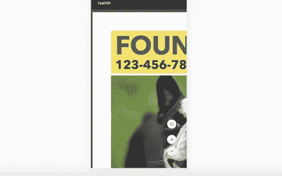
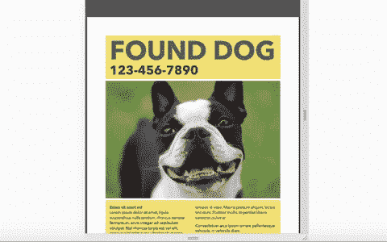

# 如何使用 iframe 显示 PDF 并使其具有响应性

> 原文：<https://blog.devgenius.io/how-to-display-a-pdf-using-an-iframe-and-make-it-responsive-d3c3fcd3a460?source=collection_archive---------0----------------------->

## 最简单的单行解决方案


由[奥斯汀·迪斯特尔](https://unsplash.com/@austindistel?utm_source=medium&utm_medium=referral)在 [Unsplash](https://unsplash.com?utm_source=medium&utm_medium=referral) 上拍摄的照片

前几天，我试图找出在 React 应用程序中显示 PDF 的最佳方式。显示 PDF 本身并不难完成。有几个外部库，比如`react-pdf`或`reactjs-pdf-reader`，但是我希望找到一种不使用第三方库的方法来实现这一点。

我发现显示 PDF 的最好方法是使用 iframe。iframe 代表 inline frame，它允许您在当前文档中嵌入另一个 HTML 文档。你可以在这里阅读更多相关信息[。](https://developer.mozilla.org/en-US/docs/Web/HTML/Element/iframe)

问题是当我显示 PDF 时，它对移动视图没有响应。当屏幕尺寸缩小时，iframe 中 PDF 的尺寸不会改变，导致它像下面这样侧向滚动。



我在堆栈溢出中尝试了一些解决方案，但是没有一个对我有效。

直到最后，我找到了解决办法。太简单了，我真的不敢相信。

在本文中，我将向您展示如何使用 iframe 显示 PDF 并使其具有响应性。如果您只是在这里学习一行程序以使其响应迅速，请向下滚动到本文的*使其响应迅速*部分。

# 用 iframe 显示 PDF

我们将使用一个使用`create-react-app`的基本 React 应用程序，在其中，我们将呈现一个 iframe。

我在`src`文件夹中添加了一个测试 PDF 文件，我们将首先把它导入到`App.js file`中。

```
import testPdf from './Test.pdf';
```

然后，在 App 组件中，我将添加一个 iframe，并给它一个带有`testPdf`的`src`属性，如下所示。

```
function App() {
  return (
    <div className="App">
      <iframe src={testPdf} />
    </div>
  );
}
```

我们的应用程序现在看起来像这样。


不带属性的 iframe

iframe 的默认高度是 150 像素，默认宽度是 300 像素。我们可以通过给 iframe 一个 height 和 width 属性来调整它。对于我们的例子，让我们给它一个 100%的高度和宽度，这样更容易看到我们在做什么。

此外，如果您打开控制台，您还会看到一条警告，提示 iframe 必须有唯一的标题。我们也可以像这样添加一个标题作为属性。

```
<iframe src={testPdf} title="testPdf" height="100%" width="100%" />
```

它现在看起来像这样。这个看起来好多了。


高度="100% "宽度="100% "

唯一的问题是，如果我们检查移动视图，这种情况会发生。iframe 的大小是有响应的，但是里面的 PDF 不是。


# 让它有反应

我会很快的。您需要做的就是在源属性的末尾添加`#view=fitH`。就是这样！`fitH`代表水平适合，这将使我们的 iframe 中的 PDF 适合屏幕的宽度。我们可以让`src`属性成为一个模板文字，如下所示。

```
<iframe src={`${testPdf}#view=fitH`} title="testPdf" height="100%" width="100%" />
```



iframe 中的响应 PDF

# 结论

感谢阅读！如果你想了解这是如何运作的，请看这里的。

如果你像我一样正在努力寻找一个好的解决方案，我希望这篇文章对你有所帮助。有时候，我们寻找的答案是如此简单，却又如此难以琢磨。