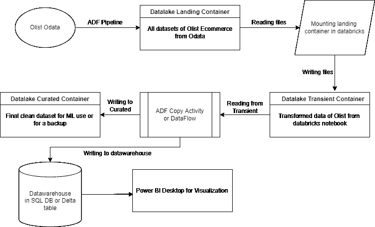

# 如何使用微软 Azure 云平台进行数据工程的端到端项目

> 原文：<https://blog.devgenius.io/how-to-do-an-end-to-end-project-using-microsoft-azure-cloud-platform-for-data-engineering-369b12974be?source=collection_archive---------4----------------------->

在数据工程中，工程师从不同的来源提取数据，并将其放入不同的存储区域。他们相应地为可视化或机器学习项目争论数据，但为了在项目中最终使用数据做所有必要的步骤，数据工程师使用不同的云平台，如 AWS、Azure、GCP 等。

因此，在这个博客系列中，我将在即将到来的博客中分享做数据工程和可视化的端到端项目所需的所有细节。

## 我们博客系列的项目范围

每当我们在行业中开始任何项目时，我们都从项目范围文档开始，因为在该文档中，我们指定了关于我们项目的所有信息，如项目时间表、成本、架构、目标等。

在项目范围文档的许多内容中，最重要的是项目的**架构，因为该架构将允许所有利益相关者了解项目中涉及的步骤和云服务，以向最终用户交付重要的东西。**

## 首先，让我从我们在数据工程博客系列中使用的架构开始

下图对初学者来说似乎很难理解，但是有经验的人可以很快理解。

所以对于初学者，我会解释这个架构的一切。

**Olist 电子商务数据集的架构**

让我们从图片的左上角开始，你可以看到 **Olist Odata，**这基本上是我们项目的来源，然后我们使用 Azure 中的 ADF (Azure 数据工厂)将数据从 Odata 摄取到 **Datalake 登陆容器**。

然后，我们将在 databricks 笔记本中挂载我们的 datalake landing 容器来读取 pyspark 中的数据，然后我们将转换后的数据写入 **Datalake Transient 容器。**

一旦我们在 datalake 瞬态容器中获得数据，我们就可以再次使用 ADF，我们将对数据集执行一些额外的转换，然后我们将它写入 2 个区域，一个是我们的 **Datalake 管理的容器，**，另一个是 **SQL DB。**

你可能会想，为什么我们要将数据写入两个区域，而不是像 SQL DB 那样的一个区域，因为我们可以直接将 power bi desktop 连接到它，但问题是我们将清理文件的备份保存在管理容器中，因为将来如果我们的 SQL DB 发生了什么事情，我们可以使用备份文件，人们也可以将数据存储在管理容器中，用于机器学习项目，以备将来之需。

因此，一旦我们将数据放入 SQL DB，或者我可以说是我们的**数据仓库**，然后我们可以将 Tableau、Power BI 等可视化工具连接到 SQL DB，在我们的情况下，我们将使用 Power BI 桌面进行可视化。

这都是关于项目范围的。

## 现在让我们了解 Olist 数据集和 Odata 源

Olist 是一家电子商务公司，就像亚马逊应用程序一样，唯一的区别是该公司位于巴西，数据集中的所有交易细节都以巴西元为单位。

所以在这个数据集中，我们有 9 个 CSV 文件，你可以从 Kaggle 网站下载:【https://www.kaggle.com/datasets/olistbr/brazilian-ecommerce 

但是你不需要从 Kaggle 网站下载，因为我已经创建了一个 JSON 文件，其中 Odata 所需的链接以数据集的名称出现，你只需要从这里下载 JSON 文件:[https://git lab . com/rjram . 2012/olist-project/-/raw/main/olist _ Odata . JSON？inline=false](https://gitlab.com/rjram.2012/olist-project/-/raw/main/olist_odata.json?inline=false) 并将其保存在您的本地系统中，因为使用这个 JSON 文件，我们可以将数据接收到 datalake landing 容器中。

> 区域基本上是存储区域，我们保存修改过的文件以备将来操作
> 
> 区域/层:-着陆、短暂、策划。

## 结论

在这篇博客之后，我会写很多博客，在这些博客中你可以找到关于创建 Azure 服务、使用这些服务、数据争论、可视化等等的所有细节。

一旦我开始写这些博客，你可以在下面找到它们的链接:

第一步:[如何在 Azure 中创建资源组](https://medium.com/@rjram.2012/how-to-create-a-resource-group-in-azure-b79d5d9eb882)。

如果你有任何建议或想法，请点击我的 LinkedIn 个人资料让我知道。