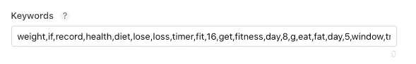
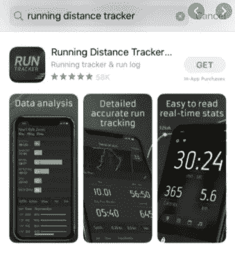
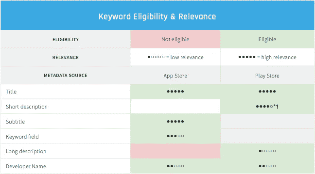

# 如何做好应用商店优化

> 原文：<https://blog.devgenius.io/how-to-do-app-store-optimization-e00300c80af3?source=collection_archive---------11----------------------->

你开发并发布了你的第一个应用程序，现在呢？你该怎么办？马上去给它做个广告，大概可以:)。但在发布之前，你应该考虑应用商店优化概念，以获得更好的广告效果和关键词排名。我不会在这篇文章中深入讨论麻生；我只是提到一些概念，在以后的文章中我会深入解释。

在 app store connect 中，苹果要求我们输入关键词。我们可以有 100 个字符长的关键字列表。

关键词列表示例

这些关键词必须与你的应用相关，如果这不是你的应用在不同类型的应用中的排名，人们在应用商店中看到你的应用，但不下载。对于苹果的算法来说，转化率是非常重要的。如果人们看到你的应用程序，不下载算法，降低你的关键词排名。如何填充关键字区域？你应该像例子中一样填充没有空格的关键字区域。该算法用逗号分隔每个关键字。我们有一个有限的关键字字符限制，所以我们不应该把空格后的关键字。另一件事是你不应该使用关键字及其复数。算法会自动寻找它的复数，所以只使用关键字的单数。

标题和副标题区域是最重要的。当人们在 app store 中搜索应用程序时，他们会看到应用程序标题、副标题、图标、前 3 个截图和应用程序预览(如果有)。

app store 中的搜索示例

标题和副标题有 30 个关键词。你必须全部使用它们，因为这些是你的应用程序最重要的关键词。

图片来自阿苏的书

你的标题和副标题必须和你的应用相关，就像关键词区域一样。如果你是独立开发者，我认为你不应该为你的应用程序使用品牌名称。标题和副标题区域是最重要的关键词区域，你不应该浪费这些没有意义的品牌名称；你应该把你最好的关键词放在这里。

另一个文本区域是 app store 中的描述。这个区域没有被算法索引，所以你是自由的。但是你的应用页面是用谷歌索引的。人们可能会用谷歌搜索，在我看来，你应该根据搜索引擎优化规则来写你的描述。

总之，我们在本文中讨论了文本 ASO 在后面的文章中，我们将深入讨论其他 ASO 类型。

嗨，如果你想的话，我可以制作应用程序；你可以从[点击](https://apps.apple.com/developer/halis-bilal-kara/id1537304083)查看我的应用