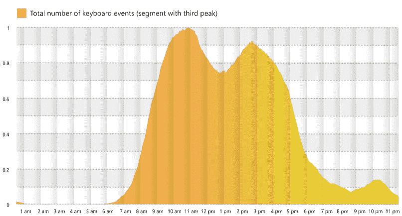

# 如何用更少的时间做更多的开发？白天开会，晚上写代码

> 原文：<https://blog.devgenius.io/how-to-do-more-development-in-less-time-have-meetings-in-the-day-and-write-code-at-night-df20b3fc6b72?source=collection_archive---------7----------------------->

## 白天是开会的时间，晚上是编码的时间

[害怕奔跑惊吓玩具](https://pixabay.com/photos/fear-running-fright-toys-2421505/)

> 远程工作在理论上听起来很棒，但实际上工作时间更长

软件开发世界正遭受着会议流行病的折磨，当会议和团队的消息停止时，开发的唯一时间就在下班后

在[的三重高峰日](https://www.microsoft.com/en-us/worklab/triple-peak-day)，开发人员在晚上团队/空闲时间的喋喋不休最终消失时完成工作。相反，开发人员试图通过延长工作时间来完成他们的工作量。

[大辞职](https://javascript.plainenglish.io/why-are-so-many-software-developers-quitting-their-jobs-e5a6c2a8f5ed)是因为疫情带来的压力还是因为开发人员不断增加的工作时间带来的压力？随着工作扩展到社交时间，工作之外的生活质量下降。

转向远程工作后，通勤时间减少了，但会议数量却增加了。在家工作的圣杯并没有像广告宣传的那样变成梦想的场景。

> 有许多开发人员还记得过去的美好时光，那时他们习惯于午休而不是团队会议。

开太多的会议听起来是个小问题，但是这减少了开发时间，但是开发人员期望在更短的时间内交付相同数量的软件。

这个问题的常见解决方案是开发人员试图解决问题，工作到晚上，直到会议结束，你才能完成一些工作。

这导致了倦怠的增加— [83%的开发人员饱受倦怠之苦，81%的人说在 Covid](https://itnext.io/83-of-developers-suffer-from-burnout-and-81-said-its-gotten-worse-during-covid-aa83c89bc544) 期间情况变得更糟

# **事半功倍**

作为一个框架，我喜欢 scrum 的一点是，它让开发人员和客户明白了开发的规则。如果你想给 sprint 增加更多的工作，那么你必须拿出一些同等价值的东西(PSST 故事点真的是天)。

这使得开发人员不会因为拒绝向 sprint 添加额外工作的请求而受到责备，但会说他们因为 scrum 的规则而不能这样做。

在 Scrum 出现之前，客户和经理认为开发人员总能挤出更多的工作。这种压榨意味着开发人员可以加班来做更多的工作。

许多非技术人员过去常常抱怨开发人员的能力是每天 6 个小时来满足我们在开发人员开始编码之前需要召开的各种会议。他们抱怨，但承认沟通是重要的，90 分钟的无发展是合理的。

远程工作最近似乎已经远离了这一点，现在项目以瀑布和敏捷的混合方式运行。他们想要固定的时间线，但是对于敏捷交付，这些规则已经被抛到了九霄云外。

# **遇见疯狂**

> 当你什么都不想做的时候，会议是必不可少的。[约翰·肯尼思·加尔布雷思](https://www.brainyquote.com/authors/john-kenneth-galbraith-quotes)

[会议超负荷是开发人员工作倦怠增加的原因吗？](https://medium.com/codex/is-meeting-overload-the-cause-of-increased-burnout-in-developers-28dc4017432f)会议的流行使得开发人员的开发时间减少。开发人员在他们自己的时间里工作以赶上最后期限，这导致了更高程度的倦怠——83%的开发人员遭受倦怠之苦。

团队会议已经取代了以前的观念，即开发人员坐在办公桌前，客户感觉他们物有所值。

他们希望在团队会议上看到/听到他们，而不是亲自见到他们。

屏蔽开发人员参加团队会议越来越难，慢慢地，他们更多的时间被团队会议所消耗。开发商的时间就像雨林一样被慢慢消耗和萎缩。

# 你什么时候工作？

你整天都在工作，但是什么时候效率最高？微软的一项研究发现，在疫情之前有两个高峰，但现在有三个高峰。[文章——三峰日的崛起(microsoft.com)](https://www.microsoft.com/en-us/worklab/triple-peak-day)。下图显示了知识工作者的高峰时间。看到键盘事件没有停止令人难过，看到第三次高峰令人担忧。

[三重高峰日](https://www.microsoft.com/en-us/worklab/triple-peak-day)

远程工作已经破坏了午休的概念。会议通常安排在午餐时间，我不得不在午餐时间抓紧时间吃午餐。

我投资了蓝牙耳机，这样我就可以在白天离开电脑去拿饮料和零食了。

# 开发者颠覆

会议对开发人员来说更具破坏性，因为这会分散他们的注意力。开发人员需要集中时间([制造者的时间表，管理者的时间表](http://www.paulgraham.com/makersschedule.html))来理解需求，创造解决方案和解决问题。

[软件开发是一个创造性的过程](/software-development-is-a-creative-process-an-original-masterpiece-not-a-paint-by-numbers-1700e05e6d7b)，它需要不间断的时间来创建、测试、修复和让代码工作。一旦代码工作，它需要被简化。

# 为什么这样不好？

不仅仅是会议不好，因为它们需要时间。干扰，如电子邮件、团队信息、会议和其他干扰。开发人员需要集中不间断的时间来创建软件/编写代码。

中断需要时间，因为开发人员需要弄清楚他们在哪里，他们在做什么，他们在解决什么问题。转换成本会消耗开发时间。

会议、团队的消息、中断成本和其他干扰使得开发人员编写代码/创建软件的时间更少。开发时间缩短了，但是项目计划没有改变。

许多开发人员使用的短期解决方案是工作更长时间，在团队/slack 聊天停止和会议结束时完成工作。

# 结论

[留住开发人员将是下一阶段大规模开发人员离职的首要任务](/keeping-developers-will-be-the-priority-in-great-developer-resignation-next-stage-9dfcdb6e75a4)，减少开发人员的倦怠将成为首要任务。

随着开发人员和客户了解如何有效地远程工作，这可能是一个过渡期。试图解决你的问题是一个短期的解决方案，这使得许多开发人员通过辞职来逃避这个问题。

开发人员发现一项工作与另一项工作相似，长时间的远程工作会让他们从事新的工作。需要改变的不是开发人员的工作，而是从事软件项目的文化。

这将如何发展？开发人员会回到办公室，用远程工作来代替亲自见同事、午休和不加班吗？