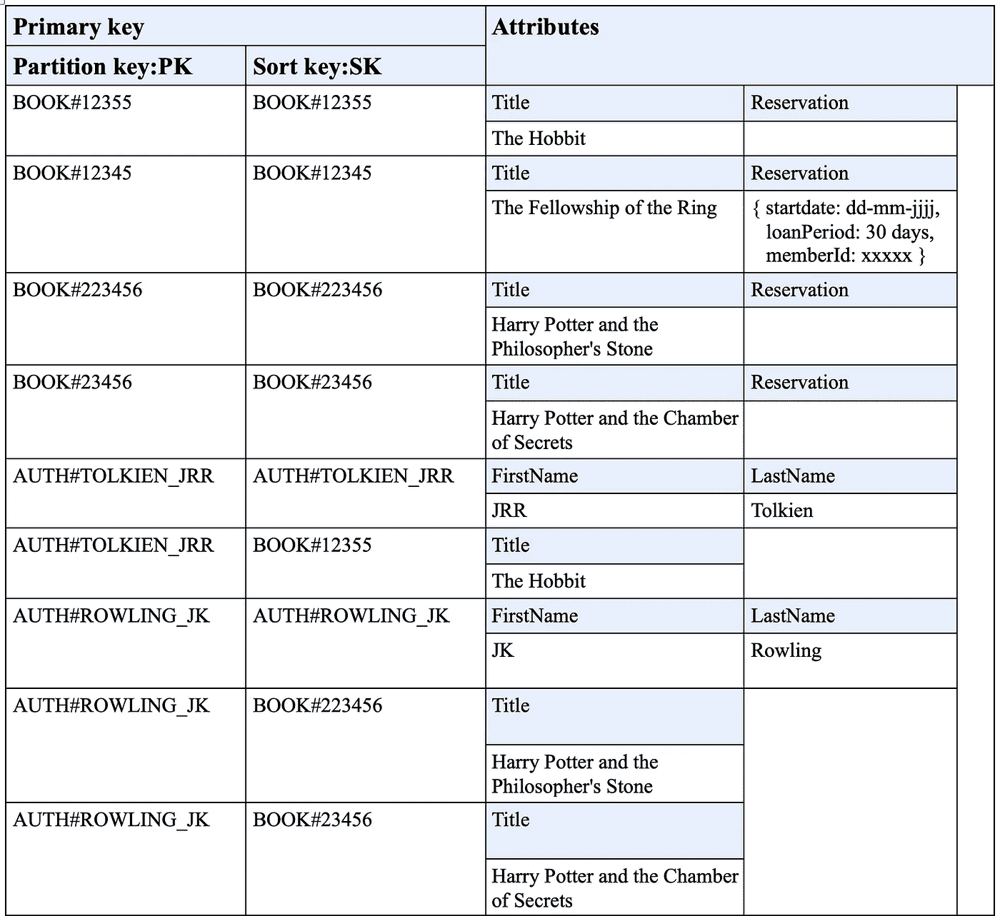

# 如何用 DynamoDB 做单表设计？

> 原文：<https://blog.devgenius.io/how-to-do-single-table-design-with-dynamodb-db9101a43277?source=collection_archive---------2----------------------->

正如我们在[上一篇文章](https://serverlesscorner.com/serverless-and-dynamodb-a-perfect-fit-c3afe99f14cc)中讨论 DynamoDB 的关键概念一样，现在是时候深入研究如何使用 DynamoDB 应用单表设计策略了。单表设计性价比最高💰和有效的方式🚀使用 DynamoDB。在这篇文章中，我们将看看如何使用单表设计来建模一个在线图书馆应用程序。

阿姆斯特丹的桌子

## 介绍

> 这是关于使用无服务器和 DynamoDB 的文章的第 2 部分(T2)。本文详细介绍了什么是单表设计以及如何应用它。
> 
> ★ [本系列的第 1 部分是关于 DynamoDB 如何适应无服务器领域以及 DynamoDB 的关键概念。](https://serverlesscorner.com/serverless-and-dynamodb-a-perfect-fit-c3afe99f14cc)
> 
> ★本系列的第 2 部分着眼于使用 DynamoDB 的单表设计。
> 
> ★本系列的第 3 部分给出了如何将 Serverless 与 DynamoDB 结合使用的示例。

# 什么是单表设计？

那么，单表设计需要什么呢？让我们先退后一步，看看 DynamoDB 试图解决的问题。DynamoDB 是为 Amazon.com 等网站的大规模运行而构建的 NoSQL 键值数据库。它不支持将构造作为外键的关系模型。构建数据取决于您。

另一方面，还有传统的关系数据库，其中有一种方法来规范化数据并为每个实体创建一个表。通过 *SQL 连接*在读取时支持组合这些记录。然而，加入是有代价的。加入的越多，表现越慢。

> 连接是性能的大敌，因此 DynamoDB 不支持连接。

那么，如何用 DynamoDB 在不同的实体之间创建关系呢？也许您可以在应用程序中使用单独的表来连接实体？使用 DynamoDB 为不同的实体使用不同的表，并通过多个请求手动连接实体，这种策略带来了太多的网络 I/O，使它变得很慢。所以这是个死胡同。

# 单表设计魔术

用 DynamoDB 关联不同的实体并获得高性能的技巧是使用单表设计将它们放在同一个篮子里。为了演示这是如何工作的，我们将使用一个例子。假设您的任务是构建一个在线图书馆应用程序，允许根据作者或类别搜索书籍。数据模型如下所示:

图书馆图书数据模型

一个类别包含书籍，一个作者包含书籍，一本书可以有预订。

# 访问模式

在构建 DynamoDB 表的结构时，重要的是了解应用程序的访问模式。对于应用程序，以下访问模式是有区别的:

*   按名称获取一个作者的所有书籍
*   按名称获取一个类别的所有书籍
*   有可能预订一本书
*   通过 ISBN 得到一本书
*   按书名得到一本书
*   预订一本书

# 主键

记得在[上一篇文章](https://serverlesscorner.com/serverless-and-dynamodb-a-perfect-fit-c3afe99f14cc)中提到主键是必需的，并且 DynamoDB 知道的唯一结构。让我们使用*复合主键将实体映射到主键。*复合主键由一个*分区键(PK)* 和一个*排序键(SK)* 组成。对于单个表中的所有实体，能够区分实体类型非常重要。因此，我们将在*分区键*和*排序键*中使用实体名称作为前缀。

具有主键结构的实体表

对于 PK 和 SK 名称，我使用一种常见的做法，将实体名称作为前缀，后跟实体的标识属性。

# 单表联接

看实体行 AuthorBooks 作者所有的书都是以作者为 PK，书为 SK 来组合的。分类书籍也是如此。这是使用*项集合*的 SQL-Joins 的单表版本。您可以通过检索 PK 等于作者姓名的所有数据来获取作者和他/她的所有书籍。

让我们用表格中的一些数据来看看这个。分区键定义为 PK，排序键定义为 SK。这些是通用的，因为它们可以包含任何实体类型。

该表显示了前面显示的实体映射结构的一些示例数据。您可以看到有或没有预订的图书、作者以及带有作者的项目集合中的图书。

让我们看看这个结构可以满足哪些访问模式。

## 得到一个叫✔️的作者的所有书

按作者获取记录作为 PK 给作者和他/她的书。PK 为 *AUTH#Tolkien_JRR* 的查询将返回以下项目:

*   *AUTH# <托尔金 _JRR > — AUTH# <托尔金 _JRR >*
*   *AUTH# <托尔金 _ JRR>—BOOK #<12355>*

有了这个结构，你就知道第一项是作者，后面的记录是书籍。如果您的实体名称按字母顺序不同，您可以使用前缀来构建前缀，以使所需的名称位于顶部。

## 获得书号✔️的书

用 ISBN 检索一本书相当简单，因为有了 ISBN，您可以使用主键来获取项目。

## 有可能预订一本书✔️

预订是一本书的复杂属性。从一个实体看，这是一个定义实体间一对一关系的选项。

## 预订一本书✔️

预订一本书可以通过 ISBN 获取该书并添加一个预订作为复杂属性来完成。

因此，涵盖了相当多的访问模式。但是我们仍然必须定义一个结构来获取某个类别的书籍，并按标题搜索书籍。我们先来看分类。

我们可以使用一个全局二级索引来创建一个条目集合，将某个类别的所有书籍关联起来。有关示例，请参见下表。分区键命名为 GS1PK，排序键命名为 GS1SK。

全局二级索引示例

## 按名称✔️获取某一类别的所有书籍

我们现在可以使用全局二级索引的项目集合来获取“幻想”类别的所有书籍。

然而用 DynamoDB 并不是所有的都是可能的。不建议使用 DynamoDB 搜索字符串。常见的做法是使用亚马逊 CloudSearch 之类的辅助服务。

所以，我希望我在使用 DynamoDB 时受到了使用单表设计的启发。在下面的文章中，我将展示一些与 DynamoDB 交互的实际代码。敬请期待！

> 关于使用 DynamoDB 进行单表设计的更多信息，强烈推荐以下书籍**。**

# *海科·范德沙夫*

*   ****如果你喜欢这个，请*** [***跟随 Serverlesscorner.com 上媒***](https://serverlesscorner.com/about) ***。****
*   ****爱情*** ❤️ ***阅读*** ***我的故事和其他关于媒？*** [***成为会员***](https://serverlesscorner.com/membership) ***如果你还不是会员的话。****
*   ****想阅读更多无服务器？报名我的*** [***月报***](https://serverlessconsulting.org/newsletter) ***📬关于无服务器技术和使用案例的启发性和深刻的故事。****